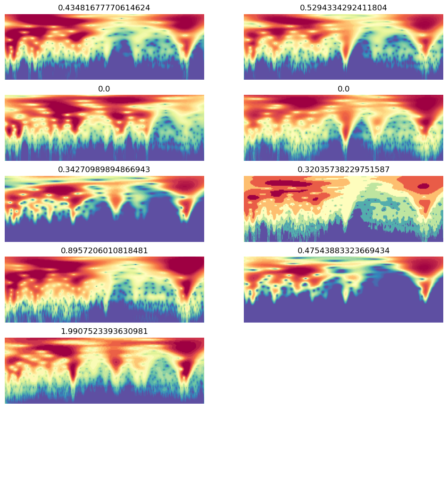

# Fastai BW data augmentation


<!-- WARNING: THIS FILE WAS AUTOGENERATED! DO NOT EDIT! -->

## Runpod setup

``` python
# setting up pod and pip install uhina
# accessing a pod terminal

# 1. To get access to the pod ip adress: runpodctl get pod -a
# 2. ssh into the pod: ssh root@<ip-address> -p 58871 -i ~/.ssh/id_ed25519


# runpodctl send uhina 
# pip install -e '.[dev]'

# git clone https://github.com/franckalbinet/uhina.git
# pip install uhina
# runpodctl send im-bw 
# runpodctl send ossl-tfm.csv
```

## Loading data

``` python
import pandas as pd
from pathlib import Path
import fastcore.all as fc

from fastai.data.all import *
from fastai.vision.all import *
from multiprocessing import cpu_count
from uhina.augment import Quantize

import warnings
warnings.filterwarnings('ignore')
```

``` python
ossl_source = '../../_data/ossl-tfm/im-targets-lut.csv'
df = pd.read_csv(ossl_source); df.head()
```

<div>
<style scoped>
    .dataframe tbody tr th:only-of-type {
        vertical-align: middle;
    }
&#10;    .dataframe tbody tr th {
        vertical-align: top;
    }
&#10;    .dataframe thead th {
        text-align: right;
    }
</style>

<table class="dataframe" data-quarto-postprocess="true" data-border="1">
<thead>
<tr class="header" style="text-align: right;">
<th data-quarto-table-cell-role="th"></th>
<th data-quarto-table-cell-role="th">fname</th>
<th data-quarto-table-cell-role="th">kex</th>
</tr>
</thead>
<tbody>
<tr class="odd">
<td data-quarto-table-cell-role="th">0</td>
<td>3998362dd2659e2252cd7f38b43c9b1f.png</td>
<td>0.182895</td>
</tr>
<tr class="even">
<td data-quarto-table-cell-role="th">1</td>
<td>2bab4dbbac073b8648475ad50d40eb95.png</td>
<td>0.082741</td>
</tr>
<tr class="odd">
<td data-quarto-table-cell-role="th">2</td>
<td>29213d2193232be8867d85dec463ec00.png</td>
<td>0.089915</td>
</tr>
<tr class="even">
<td data-quarto-table-cell-role="th">3</td>
<td>8b1ee9146c026faee20a40df86736864.png</td>
<td>0.135030</td>
</tr>
<tr class="odd">
<td data-quarto-table-cell-role="th">4</td>
<td>6e8e9d1105e7da7055555cb5d310df5f.png</td>
<td>0.270421</td>
</tr>
</tbody>
</table>

</div>

``` python
df['kex'].min(), df['kex'].max()
```

    (0.0, 3.6521352871126975)

``` python
# start = np.random.uniform(1, 50); print(start)
# end = np.random.uniform(90.1, 99.5); print(end)
# steps = np.random.randint(5, 100); print(steps)
# percentiles = torch.linspace(start=start, end=end, steps=steps)
# percentiles
```

``` python
from sklearn.model_selection import train_test_split
df_train, df_valid = train_test_split(df, test_size=0.1, random_state=41)
idx_train, idx_valid = df_train.index, df_valid.index
len(idx_train), len(idx_valid)
```

    (51906, 5768)

``` python
def splitter(items): return [idx_train, idx_valid]
```

``` python
OrderedRation
```

``` python
class OrderedQuantize(Quantize):
    order = 0  # Apply first

class OrderedRatioResize(RatioResize):
    order = 1  # Apply second

ossl = DataBlock(
    blocks=(ImageBlock, RegressionBlock),
    get_x=ColReader(0, pref='../../_data/ossl-tfm/im/'),
    get_y=ColReader(1),
    splitter=splitter,
    item_tfms=[OrderedQuantize(n_valid=len(idx_valid))],
    batch_tfms=[
        OrderedRatioResize(224),
        Normalize.from_stats(*imagenet_stats)
    ]
)
```

``` python
ossl = DataBlock(blocks=(ImageBlock, RegressionBlock),
                get_x=ColReader(0, pref='../../_data/ossl-tfm/im/'),
                get_y=ColReader(1),
                # batch_tfms=Normalize.from_stats(*imagenet_stats),
                item_tfms=[Quantize(n_valid=len(idx_valid))],
                batch_tfms=[RatioResize(224), ],
                # splitter=RandomSplitter(valid_pct=0.1, seed=41)
                splitter=splitter
#    batch_tfms=aug_transforms()
)
```

``` python
# ossl.summary(df)
```

``` python
dls = ossl.dataloaders(df)
```

``` python
dls.show_batch(nrows=6, ncols=2, figsize=(12, 13))
```



``` python
# Unfrozen, 30 epochs, 1.5e-3 => r2: 0.85
# Frozen,
```

``` python
learn = vision_learner(dls, resnet18, pretrained=False, metrics=R2Score()).to_fp16()
```

``` python
# learn = load_learner ('./models/bw-data-augment-0.pkl', cpu=True)
```

``` python
learn.lr_find()
```

<style>
    /* Turns off some styling */
    progress {
        /* gets rid of default border in Firefox and Opera. */
        border: none;
        /* Needs to be in here for Safari polyfill so background images work as expected. */
        background-size: auto;
    }
    progress:not([value]), progress:not([value])::-webkit-progress-bar {
        background: repeating-linear-gradient(45deg, #7e7e7e, #7e7e7e 10px, #5c5c5c 10px, #5c5c5c 20px);
    }
    .progress-bar-interrupted, .progress-bar-interrupted::-webkit-progress-bar {
        background: #F44336;
    }
</style>

    <div>
      <progress value='0' class='' max='1' style='width:300px; height:20px; vertical-align: middle;'></progress>
      0.00% [0/1 00:00&lt;?]
    </div>
    &#10;
&#10;    <div>
      <progress value='14' class='' max='811' style='width:300px; height:20px; vertical-align: middle;'></progress>
      1.73% [14/811 00:45&lt;42:44 4.8972]
    </div>
    &#10;
    KeyboardInterrupt: 
    ---------------------------------------------------------------------------
    KeyboardInterrupt                         Traceback (most recent call last)
    Cell In[88], line 1
    ----> 1 learn.lr_find()

    File ~/mambaforge/envs/uhina/lib/python3.12/site-packages/fastai/callback/schedule.py:295, in lr_find(self, start_lr, end_lr, num_it, stop_div, show_plot, suggest_funcs)
        293 n_epoch = num_it//len(self.dls.train) + 1
        294 cb=LRFinder(start_lr=start_lr, end_lr=end_lr, num_it=num_it, stop_div=stop_div)
    --> 295 with self.no_logging(): self.fit(n_epoch, cbs=cb)
        296 if suggest_funcs is not None:
        297     lrs, losses = tensor(self.recorder.lrs[num_it//10:-5]), tensor(self.recorder.losses[num_it//10:-5])

    File ~/mambaforge/envs/uhina/lib/python3.12/site-packages/fastai/learner.py:266, in Learner.fit(self, n_epoch, lr, wd, cbs, reset_opt, start_epoch)
        264 self.opt.set_hypers(lr=self.lr if lr is None else lr)
        265 self.n_epoch = n_epoch
    --> 266 self._with_events(self._do_fit, 'fit', CancelFitException, self._end_cleanup)

    File ~/mambaforge/envs/uhina/lib/python3.12/site-packages/fastai/learner.py:201, in Learner._with_events(self, f, event_type, ex, final)
        200 def _with_events(self, f, event_type, ex, final=noop):
    --> 201     try: self(f'before_{event_type}');  f()
        202     except ex: self(f'after_cancel_{event_type}')
        203     self(f'after_{event_type}');  final()

    File ~/mambaforge/envs/uhina/lib/python3.12/site-packages/fastai/learner.py:255, in Learner._do_fit(self)
        253 for epoch in range(self.n_epoch):
        254     self.epoch=epoch
    --> 255     self._with_events(self._do_epoch, 'epoch', CancelEpochException)

    File ~/mambaforge/envs/uhina/lib/python3.12/site-packages/fastai/learner.py:201, in Learner._with_events(self, f, event_type, ex, final)
        200 def _with_events(self, f, event_type, ex, final=noop):
    --> 201     try: self(f'before_{event_type}');  f()
        202     except ex: self(f'after_cancel_{event_type}')
        203     self(f'after_{event_type}');  final()

    File ~/mambaforge/envs/uhina/lib/python3.12/site-packages/fastai/learner.py:249, in Learner._do_epoch(self)
        248 def _do_epoch(self):
    --> 249     self._do_epoch_train()
        250     self._do_epoch_validate()

    File ~/mambaforge/envs/uhina/lib/python3.12/site-packages/fastai/learner.py:241, in Learner._do_epoch_train(self)
        239 def _do_epoch_train(self):
        240     self.dl = self.dls.train
    --> 241     self._with_events(self.all_batches, 'train', CancelTrainException)

    File ~/mambaforge/envs/uhina/lib/python3.12/site-packages/fastai/learner.py:201, in Learner._with_events(self, f, event_type, ex, final)
        200 def _with_events(self, f, event_type, ex, final=noop):
    --> 201     try: self(f'before_{event_type}');  f()
        202     except ex: self(f'after_cancel_{event_type}')
        203     self(f'after_{event_type}');  final()

    File ~/mambaforge/envs/uhina/lib/python3.12/site-packages/fastai/learner.py:207, in Learner.all_batches(self)
        205 def all_batches(self):
        206     self.n_iter = len(self.dl)
    --> 207     for o in enumerate(self.dl): self.one_batch(*o)

    File ~/mambaforge/envs/uhina/lib/python3.12/site-packages/fastai/learner.py:237, in Learner.one_batch(self, i, b)
        235 b = self._set_device(b)
        236 self._split(b)
    --> 237 self._with_events(self._do_one_batch, 'batch', CancelBatchException)

    File ~/mambaforge/envs/uhina/lib/python3.12/site-packages/fastai/learner.py:203, in Learner._with_events(self, f, event_type, ex, final)
        201 try: self(f'before_{event_type}');  f()
        202 except ex: self(f'after_cancel_{event_type}')
    --> 203 self(f'after_{event_type}');  final()

    File ~/mambaforge/envs/uhina/lib/python3.12/site-packages/fastai/learner.py:174, in Learner.__call__(self, event_name)
    --> 174 def __call__(self, event_name): L(event_name).map(self._call_one)

    File ~/mambaforge/envs/uhina/lib/python3.12/site-packages/fastcore/foundation.py:159, in L.map(self, f, *args, **kwargs)
    --> 159 def map(self, f, *args, **kwargs): return self._new(map_ex(self, f, *args, gen=False, **kwargs))

    File ~/mambaforge/envs/uhina/lib/python3.12/site-packages/fastcore/basics.py:899, in map_ex(iterable, f, gen, *args, **kwargs)
        897 res = map(g, iterable)
        898 if gen: return res
    --> 899 return list(res)

    File ~/mambaforge/envs/uhina/lib/python3.12/site-packages/fastcore/basics.py:884, in bind.__call__(self, *args, **kwargs)
        882     if isinstance(v,_Arg): kwargs[k] = args.pop(v.i)
        883 fargs = [args[x.i] if isinstance(x, _Arg) else x for x in self.pargs] + args[self.maxi+1:]
    --> 884 return self.func(*fargs, **kwargs)

    File ~/mambaforge/envs/uhina/lib/python3.12/site-packages/fastai/learner.py:178, in Learner._call_one(self, event_name)
        176 def _call_one(self, event_name):
        177     if not hasattr(event, event_name): raise Exception(f'missing {event_name}')
    --> 178     for cb in self.cbs.sorted('order'): cb(event_name)

    File ~/mambaforge/envs/uhina/lib/python3.12/site-packages/fastai/callback/core.py:62, in Callback.__call__(self, event_name)
         60 res = None
         61 if self.run and _run: 
    ---> 62     try: res = getcallable(self, event_name)()
         63     except (CancelBatchException, CancelBackwardException, CancelEpochException, CancelFitException, CancelStepException, CancelTrainException, CancelValidException): raise
         64     except Exception as e: raise modify_exception(e, f'Exception occured in `{self.__class__.__name__}` when calling event `{event_name}`:\n\t{e.args[0]}', replace=True)

    File ~/mambaforge/envs/uhina/lib/python3.12/site-packages/fastai/learner.py:562, in Recorder.after_batch(self)
        560 if len(self.yb) == 0: return
        561 mets = self._train_mets if self.training else self._valid_mets
    --> 562 for met in mets: met.accumulate(self.learn)
        563 if not self.training: return
        564 self.lrs.append(self.opt.hypers[-1]['lr'])

    File ~/mambaforge/envs/uhina/lib/python3.12/site-packages/fastai/learner.py:511, in AvgSmoothLoss.accumulate(self, learn)
        509 def accumulate(self, learn):
        510     self.count += 1
    --> 511     self.val = torch.lerp(to_detach(learn.loss.mean()), self.val, self.beta)

    File ~/mambaforge/envs/uhina/lib/python3.12/site-packages/fastai/torch_core.py:246, in to_detach(b, cpu, gather)
        244     if gather: x = maybe_gather(x)
        245     return x.cpu() if cpu else x
    --> 246 return apply(_inner, b, cpu=cpu, gather=gather)

    File ~/mambaforge/envs/uhina/lib/python3.12/site-packages/fastai/torch_core.py:226, in apply(func, x, *args, **kwargs)
        224 if is_listy(x): return type(x)([apply(func, o, *args, **kwargs) for o in x])
        225 if isinstance(x,(dict,MutableMapping)): return {k: apply(func, v, *args, **kwargs) for k,v in x.items()}
    --> 226 res = func(x, *args, **kwargs)
        227 return res if x is None else retain_type(res, x)

    File ~/mambaforge/envs/uhina/lib/python3.12/site-packages/fastai/torch_core.py:245, in to_detach.<locals>._inner(x, cpu, gather)
        243 x = x.detach()
        244 if gather: x = maybe_gather(x)
    --> 245 return x.cpu() if cpu else x

    File ~/mambaforge/envs/uhina/lib/python3.12/site-packages/fastai/torch_core.py:384, in TensorBase.__torch_function__(cls, func, types, args, kwargs)
        382 if cls.debug and func.__name__ not in ('__str__','__repr__'): print(func, types, args, kwargs)
        383 if _torch_handled(args, cls._opt, func): types = (torch.Tensor,)
    --> 384 res = super().__torch_function__(func, types, args, ifnone(kwargs, {}))
        385 dict_objs = _find_args(args) if args else _find_args(list(kwargs.values()))
        386 if issubclass(type(res),TensorBase) and dict_objs: res.set_meta(dict_objs[0],as_copy=True)

    File ~/mambaforge/envs/uhina/lib/python3.12/site-packages/torch/_tensor.py:1437, in Tensor.__torch_function__(cls, func, types, args, kwargs)
       1434     return NotImplemented
       1436 with _C.DisableTorchFunctionSubclass():
    -> 1437     ret = func(*args, **kwargs)
       1438     if func in get_default_nowrap_functions():
       1439         return ret

    KeyboardInterrupt: 

``` python
# learn.fit_one_cycle(5, 3e-3)
```

## Evaluation

``` python
val_preds, val_targets = learn.get_preds(dl=dls.valid)
```

<style>
    /* Turns off some styling */
    progress {
        /* gets rid of default border in Firefox and Opera. */
        border: none;
        /* Needs to be in here for Safari polyfill so background images work as expected. */
        background-size: auto;
    }
    progress:not([value]), progress:not([value])::-webkit-progress-bar {
        background: repeating-linear-gradient(45deg, #7e7e7e, #7e7e7e 10px, #5c5c5c 10px, #5c5c5c 20px);
    }
    .progress-bar-interrupted, .progress-bar-interrupted::-webkit-progress-bar {
        background: #F44336;
    }
</style>

``` python
val_preds_tta, val_targets_tta = learn.tta(dl=dls.valid)
```

<style>
    /* Turns off some styling */
    progress {
        /* gets rid of default border in Firefox and Opera. */
        border: none;
        /* Needs to be in here for Safari polyfill so background images work as expected. */
        background-size: auto;
    }
    progress:not([value]), progress:not([value])::-webkit-progress-bar {
        background: repeating-linear-gradient(45deg, #7e7e7e, #7e7e7e 10px, #5c5c5c 10px, #5c5c5c 20px);
    }
    .progress-bar-interrupted, .progress-bar-interrupted::-webkit-progress-bar {
        background: #F44336;
    }
</style>

    <div>
      <progress value='0' class='' max='20' style='width:300px; height:20px; vertical-align: middle;'></progress>
      &#10;    </div>
    

<style>
    /* Turns off some styling */
    progress {
        /* gets rid of default border in Firefox and Opera. */
        border: none;
        /* Needs to be in here for Safari polyfill so background images work as expected. */
        background-size: auto;
    }
    progress:not([value]), progress:not([value])::-webkit-progress-bar {
        background: repeating-linear-gradient(45deg, #7e7e7e, #7e7e7e 10px, #5c5c5c 10px, #5c5c5c 20px);
    }
    .progress-bar-interrupted, .progress-bar-interrupted::-webkit-progress-bar {
        background: #F44336;
    }
</style>

``` python
# EXAMPLE of TTA on single item
# from fastai.vision.all import *

# # Define your TTA transforms
# tta_tfms = [
#     RandomResizedCrop(224, min_scale=0.5),
#     Flip(),
#     Rotate(degrees=(-15, 15)),
#     Brightness(max_lighting=0.2),
#     Contrast(max_lighting=0.2)
# ]

# # Create a pipeline of TTA transformations
# tta_pipeline = Pipeline(tta_tfms)

# # Load your model
# learn = load_learner('path/to/your/model.pkl')

# # Define the input data (e.g., an image)
# input_data = PILImage.create('path/to/your/image.jpg')

# # Apply TTA transforms to the input data and make predictions
# predictions = []
# for _ in range(5):  # Apply 5 different augmentations
#     augmented_data = tta_pipeline(input_data)
#     prediction = learn.predict(augmented_data)
#     predictions.append(prediction)

# # Average the predictions
# average_prediction = sum(predictions) / len(predictions)

# print(average_prediction)
```

``` python
# Assuming you have a new CSV file for your test data
# test_source = '../../_data/ossl-tfm/ossl-tfm-test.csv'
# test_df = pd.read_csv(test_source)

# # Create a new DataLoader for the test data
# test_dl = learn.dls.test_dl(test_df)

# # Get predictions on the test set
# test_preds, test_targets = learn.get_preds(dl=test_dl)

# # Now you can use test_preds and test_targets for further analysis
```

``` python
# Convert predictions and targets to numpy arrays
def assess_model(val_preds, val_targets):
    val_preds = val_preds.numpy().flatten()
    val_targets = val_targets.numpy()

    # Create a DataFrame with the results
    results_df = pd.DataFrame({
        'Predicted': val_preds,
        'Actual': val_targets
    })

    # Display the first few rows of the results
    print(results_df.head())

    # Calculate and print the R2 score
    from sklearn.metrics import r2_score
    r2 = r2_score(val_targets, val_preds)
    print(f"R2 Score on validation set: {r2:.4f}")
```

``` python
assess_model(val_preds, val_targets)
```

       Predicted    Actual
    0   0.312483  0.000000
    1   0.126990  0.184960
    2   0.365726  0.194201
    3   0.239089  0.262364
    4   0.402980  0.355799
    R2 Score on validation set: 0.8325

``` python
assess_model(val_preds_tta, val_targets_tta)
```

       Predicted    Actual
    0   0.246857  0.000000
    1   0.148590  0.184960
    2   0.371643  0.194201
    3   0.226535  0.262364
    4   0.407333  0.355799
    R2 Score on validation set: 0.8378

``` python
val_preds_np = val_preds
val_targets_np = val_targets

# Apply the transformation: exp(y) - 1
val_preds_transformed = np.exp(val_preds_np) - 1
val_targets_transformed = np.exp(val_targets_np) - 1

# Create a DataFrame with the results
results_df = pd.DataFrame({
    'Predicted': val_preds_transformed,
    'Actual': val_targets_transformed
})

# Display the first few rows of the results
print(results_df.head())

# Calculate and print the R2 score
from sklearn.metrics import r2_score
r2 = r2_score(val_targets_transformed, val_preds_transformed)
print(f"R2 Score on validation set (after transformation): {r2:.4f}")

# Calculate and print the MAPE, handling zero values
def mean_absolute_percentage_error(y_true, y_pred):
    non_zero = (y_true != 0)
    return np.mean(np.abs((y_true[non_zero] - y_pred[non_zero]) / y_true[non_zero])) * 100

mape = mean_absolute_percentage_error(val_targets_transformed, val_preds_transformed)
print(f"Mean Absolute Percentage Error (MAPE) on validation set: {mape:.2f}%")

# Calculate and print the MAE as an alternative metric
from sklearn.metrics import mean_absolute_error
mae = mean_absolute_error(val_targets_transformed, val_preds_transformed)
print(f"Mean Absolute Error (MAE) on validation set: {mae:.4f}")
```

       Predicted   Actual
    0   0.366814  0.00000
    1   0.135405  0.20317
    2   0.441560  0.21434
    3   0.270092  0.30000
    4   0.496277  0.42732
    R2 Score on validation set (after transformation): 0.6936
    Mean Absolute Percentage Error (MAPE) on validation set: 50.72%
    Mean Absolute Error (MAE) on validation set: 0.1956

``` python
plt.figure(figsize=(6, 6))

# Use logarithmic bins for the colormap
h = plt.hexbin(val_targets, val_preds, gridsize=65, 
               bins='log', cmap='Spectral_r', mincnt=1,
               alpha=0.9)

# Get the actual min and max counts from the hexbin data
counts = h.get_array()
min_count = counts[counts > 0].min()  # Minimum non-zero count
max_count = counts.max()

# Create a logarithmic colorbar
cb = plt.colorbar(h, label='Count in bin', shrink=0.73)
tick_locations = np.logspace(np.log10(min_count), np.log10(max_count), 5)
cb.set_ticks(tick_locations)
cb.set_ticklabels([f'{int(x)}' for x in tick_locations])

# Add the diagonal line
min_val = min(val_targets.min(), val_preds.min())
max_val = max(val_targets.max(), val_preds.max())
plt.plot([min_val, max_val], [min_val, max_val], 'k--', lw=1)

# Set labels and title
plt.xlabel('Actual Values')
plt.ylabel('Predicted Values')
plt.title('Predicted vs Actual Values (Hexbin with Log Scale)')

# Add grid lines
plt.grid(True, linestyle='--', alpha=0.65)

# Set the same limits for both axes
plt.xlim(min_val, max_val)
plt.ylim(min_val, max_val)

# Make the plot square
plt.gca().set_aspect('equal', adjustable='box')

plt.tight_layout()
plt.show()

# Print the range of counts in the hexbins
print(f"Min non-zero count in hexbins: {min_count}")
print(f"Max count in hexbins: {max_count}")
```


    Min non-zero count in hexbins: 1.0
    Max count in hexbins: 157.0

``` python
path_model = Path('./models')
learn.export(path_model / '0.pkl')
```

## Inference

``` python
ossl_source = Path('../../_data/ossl-tfm/img')
learn.predict(ossl_source / '0a0a0c647671fd3030cc13ba5432eb88.png')
```

<style>
    /* Turns off some styling */
    progress {
        /* gets rid of default border in Firefox and Opera. */
        border: none;
        /* Needs to be in here for Safari polyfill so background images work as expected. */
        background-size: auto;
    }
    progress:not([value]), progress:not([value])::-webkit-progress-bar {
        background: repeating-linear-gradient(45deg, #7e7e7e, #7e7e7e 10px, #5c5c5c 10px, #5c5c5c 20px);
    }
    .progress-bar-interrupted, .progress-bar-interrupted::-webkit-progress-bar {
        background: #F44336;
    }
</style>

    ((0.5229991674423218,), tensor([0.5230]), tensor([0.5230]))

``` python
df[df['fname'] == '0a0a0c647671fd3030cc13ba5432eb88.png']
```

<div>
<style scoped>
    .dataframe tbody tr th:only-of-type {
        vertical-align: middle;
    }
&#10;    .dataframe tbody tr th {
        vertical-align: top;
    }
&#10;    .dataframe thead th {
        text-align: right;
    }
</style>

<table class="dataframe" data-quarto-postprocess="true" data-border="1">
<thead>
<tr class="header" style="text-align: right;">
<th data-quarto-table-cell-role="th"></th>
<th data-quarto-table-cell-role="th">fname</th>
<th data-quarto-table-cell-role="th">kex</th>
</tr>
</thead>
<tbody>
<tr class="odd">
<td data-quarto-table-cell-role="th">28867</td>
<td>0a0a0c647671fd3030cc13ba5432eb88.png</td>
<td>0.525379</td>
</tr>
</tbody>
</table>

</div>

``` python
np.exp(3) - 1
```

    19.085536923187668

## Experiments:

Color scale: `viridis` | Discretization:
`percentiles = [i for i in range(60, 100)]`

<table>
<colgroup>
<col style="width: 10%" />
<col style="width: 11%" />
<col style="width: 15%" />
<col style="width: 7%" />
<col style="width: 9%" />
<col style="width: 15%" />
<col style="width: 11%" />
<col style="width: 15%" />
</colgroup>
<thead>
<tr class="header">
<th>Model</th>
<th>Image Size</th>
<th>Learning Rate</th>
<th>Epochs</th>
<th>R2 Score</th>
<th>Time per Epoch</th>
<th>Finetuning</th>
<th>with axis ticks</th>
</tr>
</thead>
<tbody>
<tr class="odd">
<td>ResNet-18</td>
<td>100</td>
<td>1e-3</td>
<td>10</td>
<td>0.648</td>
<td>05:12</td>
<td>No</td>
<td>Yes</td>
</tr>
<tr class="even">
<td>ResNet-18</td>
<td>224</td>
<td>2e-3</td>
<td>10</td>
<td>0.69</td>
<td>07:30</td>
<td>No</td>
<td>Yes</td>
</tr>
<tr class="odd">
<td>ResNet-18</td>
<td>750 (original size)</td>
<td>1e-3</td>
<td>10</td>
<td>0.71</td>
<td>36:00</td>
<td>No</td>
<td>Yes</td>
</tr>
<tr class="even">
<td>ResNet-18</td>
<td>224</td>
<td>2e-3</td>
<td>20</td>
<td>0.704</td>
<td>07:30</td>
<td>No</td>
<td>Yes</td>
</tr>
<tr class="odd">
<td>ResNet-18</td>
<td>224</td>
<td>2e-3</td>
<td>10</td>
<td>0.71</td>
<td>07:00</td>
<td>No</td>
<td>No</td>
</tr>
</tbody>
</table>

Discretization: `percentiles = [i for i in range(20, 100)]`

<table style="width:100%;">
<colgroup>
<col style="width: 9%" />
<col style="width: 10%" />
<col style="width: 13%" />
<col style="width: 6%" />
<col style="width: 8%" />
<col style="width: 13%" />
<col style="width: 10%" />
<col style="width: 14%" />
<col style="width: 12%" />
</colgroup>
<thead>
<tr class="header">
<th>Model</th>
<th>Image Size</th>
<th>Learning Rate</th>
<th>Epochs</th>
<th>R2 Score</th>
<th>Time per Epoch</th>
<th>Finetuning</th>
<th>with axis ticks</th>
<th>colour scale</th>
</tr>
</thead>
<tbody>
<tr class="odd">
<td>ResNet-18</td>
<td>224</td>
<td>2e-3</td>
<td>10</td>
<td>0.7</td>
<td>05:12</td>
<td>No</td>
<td>No</td>
<td><code>viridis</code></td>
</tr>
<tr class="even">
<td>ResNet-18</td>
<td>224</td>
<td>3e-3</td>
<td>10</td>
<td>0.71</td>
<td>05:12</td>
<td>No</td>
<td>No</td>
<td><code>jet</code></td>
</tr>
</tbody>
</table>

From now on `with axis ticks` is always `No`.

Discretization: esimated on `10000` cwt power percentiles
`[20, 30, 40, 50, 60, 70, 80, 90, 95, 97, 99]`

<table style="width:100%;">
<colgroup>
<col style="width: 9%" />
<col style="width: 10%" />
<col style="width: 13%" />
<col style="width: 6%" />
<col style="width: 8%" />
<col style="width: 13%" />
<col style="width: 10%" />
<col style="width: 14%" />
<col style="width: 12%" />
</colgroup>
<thead>
<tr class="header">
<th>Model</th>
<th>Image Size</th>
<th>Learning Rate</th>
<th>Epochs</th>
<th>R2 Score</th>
<th>Time per Epoch</th>
<th>Finetuning</th>
<th>remark</th>
<th>colour scale</th>
</tr>
</thead>
<tbody>
<tr class="odd">
<td>ResNet-18</td>
<td>224</td>
<td>2e-3</td>
<td>10</td>
<td>0.71</td>
<td>05:12</td>
<td>No</td>
<td>None</td>
<td><code>jet</code></td>
</tr>
<tr class="even">
<td>ResNet-18</td>
<td>224</td>
<td>2e-3</td>
<td>10</td>
<td>0.685</td>
<td>05:12</td>
<td>No</td>
<td>y range added</td>
<td><code>jet</code></td>
</tr>
</tbody>
</table>

From now on random splitter with `10%` validation and random seed `41`.

Discretization: esimated on `10000` cwt power percentiles
`[20, 30, 40, 50, 60, 70, 80, 90, 95, 97, 99]`

<table style="width:100%;">
<colgroup>
<col style="width: 9%" />
<col style="width: 10%" />
<col style="width: 13%" />
<col style="width: 6%" />
<col style="width: 8%" />
<col style="width: 13%" />
<col style="width: 10%" />
<col style="width: 14%" />
<col style="width: 12%" />
</colgroup>
<thead>
<tr class="header">
<th>Model</th>
<th>Image Size</th>
<th>Learning Rate</th>
<th>Epochs</th>
<th>R2 Score</th>
<th>Time per Epoch</th>
<th>Finetuning</th>
<th>remark</th>
<th>colour scale</th>
</tr>
</thead>
<tbody>
<tr class="odd">
<td>ResNet-18</td>
<td>224</td>
<td>2e-3</td>
<td>10</td>
<td>0.7</td>
<td>05:12</td>
<td>No</td>
<td>Pre-train &amp; normalize: True</td>
<td><code>jet</code></td>
</tr>
<tr class="even">
<td>ResNet-18</td>
<td>224</td>
<td>2e-3</td>
<td>10</td>
<td>0.796</td>
<td>08:12</td>
<td>No</td>
<td>No Pre-train</td>
<td><code>jet</code></td>
</tr>
<tr class="odd">
<td>ResNet-18</td>
<td>224</td>
<td>3e-3</td>
<td>10</td>
<td>0.7</td>
<td>05:12</td>
<td>No</td>
<td>Pre-train &amp; normalize: False</td>
<td><code>jet</code></td>
</tr>
<tr class="even">
<td>ResNet-18 (id=0)</td>
<td>224</td>
<td>2e-3</td>
<td>20</td>
<td><strong>0.829</strong></td>
<td>08:12</td>
<td>No</td>
<td>No Pre-train (try 18 epochs)</td>
<td><code>jet</code></td>
</tr>
</tbody>
</table>
