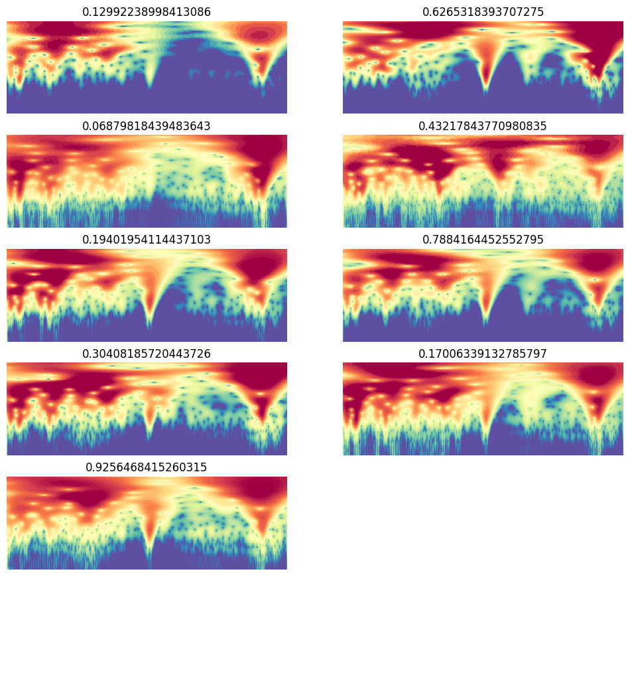
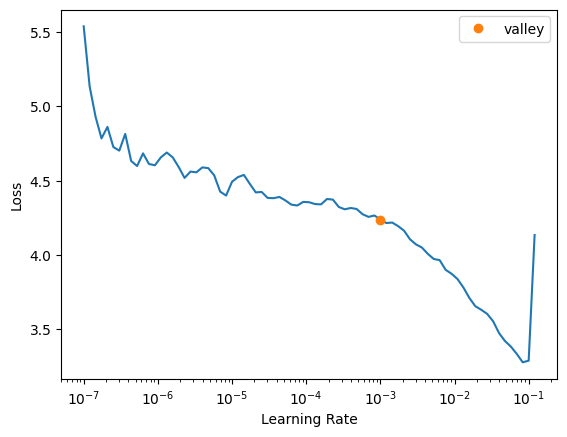
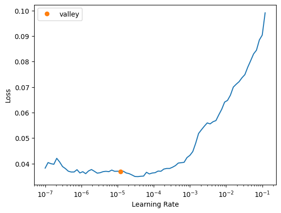
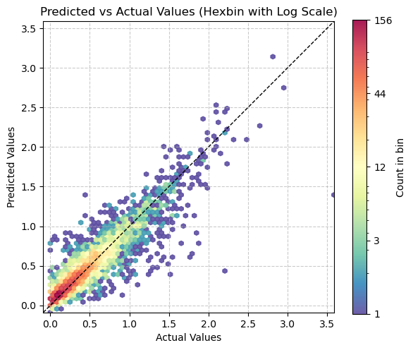

# Fastai BW data augmentation


<!-- WARNING: THIS FILE WAS AUTOGENERATED! DO NOT EDIT! -->

## Runpod setup

``` python
# setting up pod and pip install uhina
# accessing a pod terminal

# 1. To get access to the pod ip adress: runpodctl get pod -a
# 2. ssh into the pod: ssh root@<ip-address> -p 58871 -i ~/.ssh/id_ed25519


# runpodctl send uhina 

# git clone https://github.com/franckalbinet/uhina.git
# pip install uhina
# runpodctl send im-bw 
# runpodctl send ossl-tfm.csv
```

## Loading data

``` python
import pandas as pd
from pathlib import Path
import fastcore.all as fc

from fastai.data.all import *
from fastai.vision.all import *
from multiprocessing import cpu_count
from uhina.augment import Quantize

import warnings
warnings.filterwarnings('ignore')
```

``` python
ossl_source = '../../_data/ossl-tfm/im-targets-lut.csv'
df = pd.read_csv(ossl_source); df.head()
```

<div>
<style scoped>
    .dataframe tbody tr th:only-of-type {
        vertical-align: middle;
    }
&#10;    .dataframe tbody tr th {
        vertical-align: top;
    }
&#10;    .dataframe thead th {
        text-align: right;
    }
</style>

<table class="dataframe" data-quarto-postprocess="true" data-border="1">
<thead>
<tr class="header" style="text-align: right;">
<th data-quarto-table-cell-role="th"></th>
<th data-quarto-table-cell-role="th">fname</th>
<th data-quarto-table-cell-role="th">kex</th>
</tr>
</thead>
<tbody>
<tr class="odd">
<td data-quarto-table-cell-role="th">0</td>
<td>3998362dd2659e2252cd7f38b43c9b1f.png</td>
<td>0.182895</td>
</tr>
<tr class="even">
<td data-quarto-table-cell-role="th">1</td>
<td>2bab4dbbac073b8648475ad50d40eb95.png</td>
<td>0.082741</td>
</tr>
<tr class="odd">
<td data-quarto-table-cell-role="th">2</td>
<td>29213d2193232be8867d85dec463ec00.png</td>
<td>0.089915</td>
</tr>
<tr class="even">
<td data-quarto-table-cell-role="th">3</td>
<td>8b1ee9146c026faee20a40df86736864.png</td>
<td>0.135030</td>
</tr>
<tr class="odd">
<td data-quarto-table-cell-role="th">4</td>
<td>6e8e9d1105e7da7055555cb5d310df5f.png</td>
<td>0.270421</td>
</tr>
</tbody>
</table>

</div>

``` python
df['kex'].min(), df['kex'].max()
```

    (0.0, 3.6521352871126975)

``` python
from sklearn.model_selection import train_test_split
df_train, df_valid = train_test_split(df, test_size=0.1, random_state=41)
idx_train, idx_valid = df_train.index, df_valid.index
len(idx_train), len(idx_valid)
```

    (51906, 5768)

``` python
class OrderedQuantize(Quantize):
    order = 0  # Apply first

class OrderedRatioResize(RatioResize):
    order = 1  # Apply second

def splitter(items): return [idx_train, idx_valid]
    
ossl = DataBlock(
    blocks=(ImageBlock, RegressionBlock),
    get_x=ColReader(0, pref='../../_data/ossl-tfm/im/'),
    get_y=ColReader(1),
    splitter=splitter,
    item_tfms=[OrderedQuantize(n_valid=len(idx_valid))],
    batch_tfms=[
        OrderedRatioResize(224),
        Normalize.from_stats(*imagenet_stats)
    ]
)
```

``` python
#def splitter(items): return [idx_train, idx_valid]

#ossl = DataBlock(blocks=(ImageBlock, RegressionBlock),
#                get_x=ColReader(0, pref='../../_data/ossl-tfm/im/'),
#                get_y=ColReader(1),
#                # batch_tfms=Normalize.from_stats(*imagenet_stats),
#                batch_tfms=[RatioResize(224)],
#                item_tfms=[Quantize(n_valid=len(idx_valid))],
#                # splitter=RandomSplitter(valid_pct=0.1, seed=41)
#                splitter=splitter
#    batch_tfms=aug_transforms()
#)
```

``` python
# ossl.summary(df)
```

``` python
dls = ossl.dataloaders(df)
```

``` python
dls.show_batch(nrows=6, ncols=2, figsize=(12, 13))
```



``` python
learn = vision_learner(dls, resnet18, pretrained=True, metrics=R2Score()).to_fp16()
```

``` python
learn.freeze()
```

``` python
learn.lr_find()
```

<style>
    /* Turns off some styling */
    progress {
        /* gets rid of default border in Firefox and Opera. */
        border: none;
        /* Needs to be in here for Safari polyfill so background images work as expected. */
        background-size: auto;
    }
    progress:not([value]), progress:not([value])::-webkit-progress-bar {
        background: repeating-linear-gradient(45deg, #7e7e7e, #7e7e7e 10px, #5c5c5c 10px, #5c5c5c 20px);
    }
    .progress-bar-interrupted, .progress-bar-interrupted::-webkit-progress-bar {
        background: #F44336;
    }
</style>

    SuggestedLRs(valley=0.0010000000474974513)



``` python
#learn.summary()
```

<style>
    /* Turns off some styling */
    progress {
        /* gets rid of default border in Firefox and Opera. */
        border: none;
        /* Needs to be in here for Safari polyfill so background images work as expected. */
        background-size: auto;
    }
    progress:not([value]), progress:not([value])::-webkit-progress-bar {
        background: repeating-linear-gradient(45deg, #7e7e7e, #7e7e7e 10px, #5c5c5c 10px, #5c5c5c 20px);
    }
    .progress-bar-interrupted, .progress-bar-interrupted::-webkit-progress-bar {
        background: #F44336;
    }
</style>

    Sequential (Input shape: 64 x 3 x 221 x 669)
    ============================================================================
    Layer (type)         Output Shape         Param #    Trainable 
    ============================================================================
                         64 x 64 x 111 x 335 
    Conv2d                                    9408       True      
    BatchNorm2d                               128        True      
    ReLU                                                           
    ____________________________________________________________________________
                         64 x 64 x 56 x 168  
    MaxPool2d                                                      
    Conv2d                                    36864      True      
    BatchNorm2d                               128        True      
    ReLU                                                           
    Conv2d                                    36864      True      
    BatchNorm2d                               128        True      
    Conv2d                                    36864      True      
    BatchNorm2d                               128        True      
    ReLU                                                           
    Conv2d                                    36864      True      
    BatchNorm2d                               128        True      
    ____________________________________________________________________________
                         64 x 128 x 28 x 84  
    Conv2d                                    73728      True      
    BatchNorm2d                               256        True      
    ReLU                                                           
    Conv2d                                    147456     True      
    BatchNorm2d                               256        True      
    Conv2d                                    8192       True      
    BatchNorm2d                               256        True      
    Conv2d                                    147456     True      
    BatchNorm2d                               256        True      
    ReLU                                                           
    Conv2d                                    147456     True      
    BatchNorm2d                               256        True      
    ____________________________________________________________________________
                         64 x 256 x 14 x 42  
    Conv2d                                    294912     True      
    BatchNorm2d                               512        True      
    ReLU                                                           
    Conv2d                                    589824     True      
    BatchNorm2d                               512        True      
    Conv2d                                    32768      True      
    BatchNorm2d                               512        True      
    Conv2d                                    589824     True      
    BatchNorm2d                               512        True      
    ReLU                                                           
    Conv2d                                    589824     True      
    BatchNorm2d                               512        True      
    ____________________________________________________________________________
                         64 x 512 x 7 x 21   
    Conv2d                                    1179648    True      
    BatchNorm2d                               1024       True      
    ReLU                                                           
    Conv2d                                    2359296    True      
    BatchNorm2d                               1024       True      
    Conv2d                                    131072     True      
    BatchNorm2d                               1024       True      
    Conv2d                                    2359296    True      
    BatchNorm2d                               1024       True      
    ReLU                                                           
    Conv2d                                    2359296    True      
    BatchNorm2d                               1024       True      
    ____________________________________________________________________________
                         64 x 512 x 1 x 1    
    AdaptiveAvgPool2d                                              
    AdaptiveMaxPool2d                                              
    ____________________________________________________________________________
                         64 x 1024           
    Flatten                                                        
    BatchNorm1d                               2048       True      
    Dropout                                                        
    ____________________________________________________________________________
                         64 x 512            
    Linear                                    524288     True      
    ReLU                                                           
    BatchNorm1d                               1024       True      
    Dropout                                                        
    ____________________________________________________________________________
                         64 x 1              
    Linear                                    512        True      
    ____________________________________________________________________________

    Total params: 11,704,384
    Total trainable params: 11,704,384
    Total non-trainable params: 0

    Optimizer used: <function Adam>
    Loss function: FlattenedLoss of MSELoss()

    Model unfrozen

    Callbacks:
      - TrainEvalCallback
      - CastToTensor
      - MixedPrecision
      - Recorder
      - ProgressCallback

``` python
learn.fit_one_cycle(30, 1.5e-3)
```

<style>
    /* Turns off some styling */
    progress {
        /* gets rid of default border in Firefox and Opera. */
        border: none;
        /* Needs to be in here for Safari polyfill so background images work as expected. */
        background-size: auto;
    }
    progress:not([value]), progress:not([value])::-webkit-progress-bar {
        background: repeating-linear-gradient(45deg, #7e7e7e, #7e7e7e 10px, #5c5c5c 10px, #5c5c5c 20px);
    }
    .progress-bar-interrupted, .progress-bar-interrupted::-webkit-progress-bar {
        background: #F44336;
    }
</style>

<table class="dataframe" data-quarto-postprocess="true" data-border="1">
<thead>
<tr class="header" style="text-align: left;">
<th data-quarto-table-cell-role="th">epoch</th>
<th data-quarto-table-cell-role="th">train_loss</th>
<th data-quarto-table-cell-role="th">valid_loss</th>
<th data-quarto-table-cell-role="th">r2_score</th>
<th data-quarto-table-cell-role="th">time</th>
</tr>
</thead>
<tbody>
<tr class="odd">
<td>0</td>
<td>1.644630</td>
<td>0.300183</td>
<td>-1.107600</td>
<td>03:27</td>
</tr>
<tr class="even">
<td>1</td>
<td>0.330966</td>
<td>0.122813</td>
<td>0.137722</td>
<td>03:24</td>
</tr>
<tr class="odd">
<td>2</td>
<td>0.111735</td>
<td>0.096092</td>
<td>0.325332</td>
<td>03:24</td>
</tr>
<tr class="even">
<td>3</td>
<td>0.090042</td>
<td>0.080140</td>
<td>0.437336</td>
<td>03:23</td>
</tr>
<tr class="odd">
<td>4</td>
<td>0.086476</td>
<td>0.076293</td>
<td>0.464347</td>
<td>03:24</td>
</tr>
<tr class="even">
<td>5</td>
<td>0.079303</td>
<td>0.067029</td>
<td>0.529383</td>
<td>03:26</td>
</tr>
<tr class="odd">
<td>6</td>
<td>0.079823</td>
<td>0.077337</td>
<td>0.457015</td>
<td>03:21</td>
</tr>
<tr class="even">
<td>7</td>
<td>0.071064</td>
<td>0.063280</td>
<td>0.555711</td>
<td>03:26</td>
</tr>
<tr class="odd">
<td>8</td>
<td>0.063395</td>
<td>0.049661</td>
<td>0.651327</td>
<td>03:25</td>
</tr>
<tr class="even">
<td>9</td>
<td>0.064540</td>
<td>0.050022</td>
<td>0.648795</td>
<td>03:20</td>
</tr>
<tr class="odd">
<td>10</td>
<td>0.056607</td>
<td>0.048462</td>
<td>0.659747</td>
<td>03:22</td>
</tr>
<tr class="even">
<td>11</td>
<td>0.053760</td>
<td>0.053292</td>
<td>0.625835</td>
<td>03:23</td>
</tr>
<tr class="odd">
<td>12</td>
<td>0.056411</td>
<td>0.048289</td>
<td>0.660963</td>
<td>03:20</td>
</tr>
<tr class="even">
<td>13</td>
<td>0.049446</td>
<td>0.046147</td>
<td>0.676001</td>
<td>03:26</td>
</tr>
<tr class="odd">
<td>14</td>
<td>0.047927</td>
<td>0.041901</td>
<td>0.705815</td>
<td>03:26</td>
</tr>
<tr class="even">
<td>15</td>
<td>0.046742</td>
<td>0.044546</td>
<td>0.687241</td>
<td>03:28</td>
</tr>
<tr class="odd">
<td>16</td>
<td>0.049120</td>
<td>0.041590</td>
<td>0.707998</td>
<td>03:18</td>
</tr>
<tr class="even">
<td>17</td>
<td>0.043476</td>
<td>0.039859</td>
<td>0.720151</td>
<td>03:27</td>
</tr>
<tr class="odd">
<td>18</td>
<td>0.046412</td>
<td>0.038752</td>
<td>0.727923</td>
<td>03:22</td>
</tr>
<tr class="even">
<td>19</td>
<td>0.044368</td>
<td>0.040569</td>
<td>0.715167</td>
<td>03:18</td>
</tr>
<tr class="odd">
<td>20</td>
<td>0.040819</td>
<td>0.037822</td>
<td>0.734452</td>
<td>03:24</td>
</tr>
<tr class="even">
<td>21</td>
<td>0.043126</td>
<td>0.036971</td>
<td>0.740424</td>
<td>03:22</td>
</tr>
<tr class="odd">
<td>22</td>
<td>0.042248</td>
<td>0.036392</td>
<td>0.744487</td>
<td>03:16</td>
</tr>
<tr class="even">
<td>23</td>
<td>0.041793</td>
<td>0.036009</td>
<td>0.747177</td>
<td>03:22</td>
</tr>
<tr class="odd">
<td>24</td>
<td>0.039837</td>
<td>0.035846</td>
<td>0.748324</td>
<td>03:22</td>
</tr>
<tr class="even">
<td>25</td>
<td>0.039785</td>
<td>0.035595</td>
<td>0.750088</td>
<td>03:27</td>
</tr>
<tr class="odd">
<td>26</td>
<td>0.040293</td>
<td>0.035616</td>
<td>0.749942</td>
<td>03:29</td>
</tr>
<tr class="even">
<td>27</td>
<td>0.037746</td>
<td>0.035546</td>
<td>0.750431</td>
<td>03:25</td>
</tr>
<tr class="odd">
<td>28</td>
<td>0.038235</td>
<td>0.036200</td>
<td>0.745835</td>
<td>03:21</td>
</tr>
<tr class="even">
<td>29</td>
<td>0.038197</td>
<td>0.035067</td>
<td>0.753795</td>
<td>03:25</td>
</tr>
</tbody>
</table>

``` python
learn.unfreeze()
```

``` python
learn.lr_find()
```

<style>
    /* Turns off some styling */
    progress {
        /* gets rid of default border in Firefox and Opera. */
        border: none;
        /* Needs to be in here for Safari polyfill so background images work as expected. */
        background-size: auto;
    }
    progress:not([value]), progress:not([value])::-webkit-progress-bar {
        background: repeating-linear-gradient(45deg, #7e7e7e, #7e7e7e 10px, #5c5c5c 10px, #5c5c5c 20px);
    }
    .progress-bar-interrupted, .progress-bar-interrupted::-webkit-progress-bar {
        background: #F44336;
    }
</style>

    SuggestedLRs(valley=1.2022644114040304e-05)



``` python
learn.fit_one_cycle(10, slice(1e-5, 1e-4))
```

<style>
    /* Turns off some styling */
    progress {
        /* gets rid of default border in Firefox and Opera. */
        border: none;
        /* Needs to be in here for Safari polyfill so background images work as expected. */
        background-size: auto;
    }
    progress:not([value]), progress:not([value])::-webkit-progress-bar {
        background: repeating-linear-gradient(45deg, #7e7e7e, #7e7e7e 10px, #5c5c5c 10px, #5c5c5c 20px);
    }
    .progress-bar-interrupted, .progress-bar-interrupted::-webkit-progress-bar {
        background: #F44336;
    }
</style>

<table class="dataframe" data-quarto-postprocess="true" data-border="1">
<thead>
<tr class="header" style="text-align: left;">
<th data-quarto-table-cell-role="th">epoch</th>
<th data-quarto-table-cell-role="th">train_loss</th>
<th data-quarto-table-cell-role="th">valid_loss</th>
<th data-quarto-table-cell-role="th">r2_score</th>
<th data-quarto-table-cell-role="th">time</th>
</tr>
</thead>
<tbody>
<tr class="odd">
<td>0</td>
<td>0.041027</td>
<td>0.036716</td>
<td>0.742214</td>
<td>03:24</td>
</tr>
<tr class="even">
<td>1</td>
<td>0.043233</td>
<td>0.038476</td>
<td>0.729859</td>
<td>03:25</td>
</tr>
<tr class="odd">
<td>2</td>
<td>0.040227</td>
<td>0.036917</td>
<td>0.740801</td>
<td>03:27</td>
</tr>
<tr class="even">
<td>3</td>
<td>0.037694</td>
<td>0.032176</td>
<td>0.774093</td>
<td>03:34</td>
</tr>
<tr class="odd">
<td>4</td>
<td>0.033340</td>
<td>0.032090</td>
<td>0.774694</td>
<td>03:20</td>
</tr>
<tr class="even">
<td>5</td>
<td>0.029570</td>
<td>0.030667</td>
<td>0.784687</td>
<td>03:22</td>
</tr>
<tr class="odd">
<td>6</td>
<td>0.027940</td>
<td>0.028028</td>
<td>0.803215</td>
<td>03:24</td>
</tr>
<tr class="even">
<td>7</td>
<td>0.028264</td>
<td>0.027417</td>
<td>0.807507</td>
<td>03:23</td>
</tr>
<tr class="odd">
<td>8</td>
<td>0.025013</td>
<td>0.026760</td>
<td>0.812116</td>
<td>03:17</td>
</tr>
<tr class="even">
<td>9</td>
<td>0.024846</td>
<td>0.026566</td>
<td>0.813480</td>
<td>03:22</td>
</tr>
</tbody>
</table>

## Evaluation

``` python
val_preds, val_targets = learn.get_preds(dl=dls.valid)
```

<style>
    /* Turns off some styling */
    progress {
        /* gets rid of default border in Firefox and Opera. */
        border: none;
        /* Needs to be in here for Safari polyfill so background images work as expected. */
        background-size: auto;
    }
    progress:not([value]), progress:not([value])::-webkit-progress-bar {
        background: repeating-linear-gradient(45deg, #7e7e7e, #7e7e7e 10px, #5c5c5c 10px, #5c5c5c 20px);
    }
    .progress-bar-interrupted, .progress-bar-interrupted::-webkit-progress-bar {
        background: #F44336;
    }
</style>

``` python
r2_score(val_preds, val_targets)
```

    0.7777369823359973

``` python
val_preds_tta, val_targets_tta = learn.tta(dl=dls.valid, n=10)
```

<style>
    /* Turns off some styling */
    progress {
        /* gets rid of default border in Firefox and Opera. */
        border: none;
        /* Needs to be in here for Safari polyfill so background images work as expected. */
        background-size: auto;
    }
    progress:not([value]), progress:not([value])::-webkit-progress-bar {
        background: repeating-linear-gradient(45deg, #7e7e7e, #7e7e7e 10px, #5c5c5c 10px, #5c5c5c 20px);
    }
    .progress-bar-interrupted, .progress-bar-interrupted::-webkit-progress-bar {
        background: #F44336;
    }
</style>

    <div>
      <progress value='0' class='' max='10' style='width:300px; height:20px; vertical-align: middle;'></progress>
      &#10;    </div>
    

<style>
    /* Turns off some styling */
    progress {
        /* gets rid of default border in Firefox and Opera. */
        border: none;
        /* Needs to be in here for Safari polyfill so background images work as expected. */
        background-size: auto;
    }
    progress:not([value]), progress:not([value])::-webkit-progress-bar {
        background: repeating-linear-gradient(45deg, #7e7e7e, #7e7e7e 10px, #5c5c5c 10px, #5c5c5c 20px);
    }
    .progress-bar-interrupted, .progress-bar-interrupted::-webkit-progress-bar {
        background: #F44336;
    }
</style>

``` python
from sklearn.metrics import r2_score
r2_score(val_preds_tta, val_targets_tta)
```

    0.7900635997635996

``` python
# EXAMPLE of TTA on single item
# from fastai.vision.all import *

# # Define your TTA transforms
# tta_tfms = [
#     RandomResizedCrop(224, min_scale=0.5),
#     Flip(),
#     Rotate(degrees=(-15, 15)),
#     Brightness(max_lighting=0.2),
#     Contrast(max_lighting=0.2)
# ]

# # Create a pipeline of TTA transformations
# tta_pipeline = Pipeline(tta_tfms)

# # Load your model
# learn = load_learner('path/to/your/model.pkl')

# # Define the input data (e.g., an image)
# input_data = PILImage.create('path/to/your/image.jpg')

# # Apply TTA transforms to the input data and make predictions
# predictions = []
# for _ in range(5):  # Apply 5 different augmentations
#     augmented_data = tta_pipeline(input_data)
#     prediction = learn.predict(augmented_data)
#     predictions.append(prediction)

# # Average the predictions
# average_prediction = sum(predictions) / len(predictions)

# print(average_prediction)
```

``` python
# Assuming you have a new CSV file for your test data
# test_source = '../../_data/ossl-tfm/ossl-tfm-test.csv'
# test_df = pd.read_csv(test_source)

# # Create a new DataLoader for the test data
# test_dl = learn.dls.test_dl(test_df)

# # Get predictions on the test set
# test_preds, test_targets = learn.get_preds(dl=test_dl)

# # Now you can use test_preds and test_targets for further analysis
```

``` python
# Convert predictions and targets to numpy arrays
def assess_model(val_preds, val_targets):
    val_preds = val_preds.numpy().flatten()
    val_targets = val_targets.numpy()

    # Create a DataFrame with the results
    results_df = pd.DataFrame({
        'Predicted': val_preds,
        'Actual': val_targets
    })

    # Display the first few rows of the results
    print(results_df.head())

    # Calculate and print the R2 score
    from sklearn.metrics import r2_score
    r2 = r2_score(val_targets, val_preds)
    print(f"R2 Score on validation set: {r2:.4f}")
```

``` python
assess_model(val_preds, val_targets)
```

       Predicted    Actual
    0   0.312483  0.000000
    1   0.126990  0.184960
    2   0.365726  0.194201
    3   0.239089  0.262364
    4   0.402980  0.355799
    R2 Score on validation set: 0.8325

``` python
assess_model(val_preds_tta, val_targets_tta)
```

       Predicted    Actual
    0   0.246857  0.000000
    1   0.148590  0.184960
    2   0.371643  0.194201
    3   0.226535  0.262364
    4   0.407333  0.355799
    R2 Score on validation set: 0.8378

``` python
val_preds_np = val_preds
val_targets_np = val_targets

# Apply the transformation: exp(y) - 1
val_preds_transformed = np.exp(val_preds_np) - 1
val_targets_transformed = np.exp(val_targets_np) - 1

# Create a DataFrame with the results
results_df = pd.DataFrame({
    'Predicted': val_preds_transformed,
    'Actual': val_targets_transformed
})

# Display the first few rows of the results
print(results_df.head())

# Calculate and print the R2 score
from sklearn.metrics import r2_score
r2 = r2_score(val_targets_transformed, val_preds_transformed)
print(f"R2 Score on validation set (after transformation): {r2:.4f}")

# Calculate and print the MAPE, handling zero values
def mean_absolute_percentage_error(y_true, y_pred):
    non_zero = (y_true != 0)
    return np.mean(np.abs((y_true[non_zero] - y_pred[non_zero]) / y_true[non_zero])) * 100

mape = mean_absolute_percentage_error(val_targets_transformed, val_preds_transformed)
print(f"Mean Absolute Percentage Error (MAPE) on validation set: {mape:.2f}%")

# Calculate and print the MAE as an alternative metric
from sklearn.metrics import mean_absolute_error
mae = mean_absolute_error(val_targets_transformed, val_preds_transformed)
print(f"Mean Absolute Error (MAE) on validation set: {mae:.4f}")
```

       Predicted   Actual
    0   0.366814  0.00000
    1   0.135405  0.20317
    2   0.441560  0.21434
    3   0.270092  0.30000
    4   0.496277  0.42732
    R2 Score on validation set (after transformation): 0.6936
    Mean Absolute Percentage Error (MAPE) on validation set: 50.72%
    Mean Absolute Error (MAE) on validation set: 0.1956

``` python
plt.figure(figsize=(6, 6))

# Use logarithmic bins for the colormap
h = plt.hexbin(val_targets, val_preds, gridsize=65, 
               bins='log', cmap='Spectral_r', mincnt=1,
               alpha=0.9)

# Get the actual min and max counts from the hexbin data
counts = h.get_array()
min_count = counts[counts > 0].min()  # Minimum non-zero count
max_count = counts.max()

# Create a logarithmic colorbar
cb = plt.colorbar(h, label='Count in bin', shrink=0.73)
tick_locations = np.logspace(np.log10(min_count), np.log10(max_count), 5)
cb.set_ticks(tick_locations)
cb.set_ticklabels([f'{int(x)}' for x in tick_locations])

# Add the diagonal line
min_val = min(val_targets.min(), val_preds.min())
max_val = max(val_targets.max(), val_preds.max())
plt.plot([min_val, max_val], [min_val, max_val], 'k--', lw=1)

# Set labels and title
plt.xlabel('Actual Values')
plt.ylabel('Predicted Values')
plt.title('Predicted vs Actual Values (Hexbin with Log Scale)')

# Add grid lines
plt.grid(True, linestyle='--', alpha=0.65)

# Set the same limits for both axes
plt.xlim(min_val, max_val)
plt.ylim(min_val, max_val)

# Make the plot square
plt.gca().set_aspect('equal', adjustable='box')

plt.tight_layout()
plt.show()

# Print the range of counts in the hexbins
print(f"Min non-zero count in hexbins: {min_count}")
print(f"Max count in hexbins: {max_count}")
```



    Min non-zero count in hexbins: 1.0
    Max count in hexbins: 157.0

``` python
path_model = Path('./models')
learn.export(path_model / 'frozen-epoch-30-lr-1.5e-3-then-unfrozen-epoch-10-lr-1-e-4-12102024.pkl')
```

## Inference

``` python
ossl_source = Path('../../_data/ossl-tfm/img')
learn.predict(ossl_source / '0a0a0c647671fd3030cc13ba5432eb88.png')
```

<style>
    /* Turns off some styling */
    progress {
        /* gets rid of default border in Firefox and Opera. */
        border: none;
        /* Needs to be in here for Safari polyfill so background images work as expected. */
        background-size: auto;
    }
    progress:not([value]), progress:not([value])::-webkit-progress-bar {
        background: repeating-linear-gradient(45deg, #7e7e7e, #7e7e7e 10px, #5c5c5c 10px, #5c5c5c 20px);
    }
    .progress-bar-interrupted, .progress-bar-interrupted::-webkit-progress-bar {
        background: #F44336;
    }
</style>

    ((0.5229991674423218,), tensor([0.5230]), tensor([0.5230]))

``` python
df[df['fname'] == '0a0a0c647671fd3030cc13ba5432eb88.png']
```

<div>
<style scoped>
    .dataframe tbody tr th:only-of-type {
        vertical-align: middle;
    }
&#10;    .dataframe tbody tr th {
        vertical-align: top;
    }
&#10;    .dataframe thead th {
        text-align: right;
    }
</style>

<table class="dataframe" data-quarto-postprocess="true" data-border="1">
<thead>
<tr class="header" style="text-align: right;">
<th data-quarto-table-cell-role="th"></th>
<th data-quarto-table-cell-role="th">fname</th>
<th data-quarto-table-cell-role="th">kex</th>
</tr>
</thead>
<tbody>
<tr class="odd">
<td data-quarto-table-cell-role="th">28867</td>
<td>0a0a0c647671fd3030cc13ba5432eb88.png</td>
<td>0.525379</td>
</tr>
</tbody>
</table>

</div>

``` python
np.exp(3) - 1
```

    19.085536923187668

## Experiments:

Color scale: `viridis` | Discretization:
`percentiles = [i for i in range(60, 100)]`

<table>
<colgroup>
<col style="width: 10%" />
<col style="width: 11%" />
<col style="width: 15%" />
<col style="width: 7%" />
<col style="width: 9%" />
<col style="width: 15%" />
<col style="width: 11%" />
<col style="width: 15%" />
</colgroup>
<thead>
<tr class="header">
<th>Model</th>
<th>Image Size</th>
<th>Learning Rate</th>
<th>Epochs</th>
<th>R2 Score</th>
<th>Time per Epoch</th>
<th>Finetuning</th>
<th>with axis ticks</th>
</tr>
</thead>
<tbody>
<tr class="odd">
<td>ResNet-18</td>
<td>100</td>
<td>1e-3</td>
<td>10</td>
<td>0.648</td>
<td>05:12</td>
<td>No</td>
<td>Yes</td>
</tr>
<tr class="even">
<td>ResNet-18</td>
<td>224</td>
<td>2e-3</td>
<td>10</td>
<td>0.69</td>
<td>07:30</td>
<td>No</td>
<td>Yes</td>
</tr>
<tr class="odd">
<td>ResNet-18</td>
<td>750 (original size)</td>
<td>1e-3</td>
<td>10</td>
<td>0.71</td>
<td>36:00</td>
<td>No</td>
<td>Yes</td>
</tr>
<tr class="even">
<td>ResNet-18</td>
<td>224</td>
<td>2e-3</td>
<td>20</td>
<td>0.704</td>
<td>07:30</td>
<td>No</td>
<td>Yes</td>
</tr>
<tr class="odd">
<td>ResNet-18</td>
<td>224</td>
<td>2e-3</td>
<td>10</td>
<td>0.71</td>
<td>07:00</td>
<td>No</td>
<td>No</td>
</tr>
</tbody>
</table>

Discretization: `percentiles = [i for i in range(20, 100)]`

<table style="width:100%;">
<colgroup>
<col style="width: 9%" />
<col style="width: 10%" />
<col style="width: 13%" />
<col style="width: 6%" />
<col style="width: 8%" />
<col style="width: 13%" />
<col style="width: 10%" />
<col style="width: 14%" />
<col style="width: 12%" />
</colgroup>
<thead>
<tr class="header">
<th>Model</th>
<th>Image Size</th>
<th>Learning Rate</th>
<th>Epochs</th>
<th>R2 Score</th>
<th>Time per Epoch</th>
<th>Finetuning</th>
<th>with axis ticks</th>
<th>colour scale</th>
</tr>
</thead>
<tbody>
<tr class="odd">
<td>ResNet-18</td>
<td>224</td>
<td>2e-3</td>
<td>10</td>
<td>0.7</td>
<td>05:12</td>
<td>No</td>
<td>No</td>
<td><code>viridis</code></td>
</tr>
<tr class="even">
<td>ResNet-18</td>
<td>224</td>
<td>3e-3</td>
<td>10</td>
<td>0.71</td>
<td>05:12</td>
<td>No</td>
<td>No</td>
<td><code>jet</code></td>
</tr>
</tbody>
</table>

From now on `with axis ticks` is always `No`.

Discretization: esimated on `10000` cwt power percentiles
`[20, 30, 40, 50, 60, 70, 80, 90, 95, 97, 99]`

<table style="width:100%;">
<colgroup>
<col style="width: 9%" />
<col style="width: 10%" />
<col style="width: 13%" />
<col style="width: 6%" />
<col style="width: 8%" />
<col style="width: 13%" />
<col style="width: 10%" />
<col style="width: 14%" />
<col style="width: 12%" />
</colgroup>
<thead>
<tr class="header">
<th>Model</th>
<th>Image Size</th>
<th>Learning Rate</th>
<th>Epochs</th>
<th>R2 Score</th>
<th>Time per Epoch</th>
<th>Finetuning</th>
<th>remark</th>
<th>colour scale</th>
</tr>
</thead>
<tbody>
<tr class="odd">
<td>ResNet-18</td>
<td>224</td>
<td>2e-3</td>
<td>10</td>
<td>0.71</td>
<td>05:12</td>
<td>No</td>
<td>None</td>
<td><code>jet</code></td>
</tr>
<tr class="even">
<td>ResNet-18</td>
<td>224</td>
<td>2e-3</td>
<td>10</td>
<td>0.685</td>
<td>05:12</td>
<td>No</td>
<td>y range added</td>
<td><code>jet</code></td>
</tr>
</tbody>
</table>

From now on random splitter with `10%` validation and random seed `41`.

Discretization: esimated on `10000` cwt power percentiles
`[20, 30, 40, 50, 60, 70, 80, 90, 95, 97, 99]`

<table style="width:100%;">
<colgroup>
<col style="width: 9%" />
<col style="width: 10%" />
<col style="width: 13%" />
<col style="width: 6%" />
<col style="width: 8%" />
<col style="width: 13%" />
<col style="width: 10%" />
<col style="width: 14%" />
<col style="width: 12%" />
</colgroup>
<thead>
<tr class="header">
<th>Model</th>
<th>Image Size</th>
<th>Learning Rate</th>
<th>Epochs</th>
<th>R2 Score</th>
<th>Time per Epoch</th>
<th>Finetuning</th>
<th>remark</th>
<th>colour scale</th>
</tr>
</thead>
<tbody>
<tr class="odd">
<td>ResNet-18</td>
<td>224</td>
<td>2e-3</td>
<td>10</td>
<td>0.7</td>
<td>05:12</td>
<td>No</td>
<td>Pre-train &amp; normalize: True</td>
<td><code>jet</code></td>
</tr>
<tr class="even">
<td>ResNet-18</td>
<td>224</td>
<td>2e-3</td>
<td>10</td>
<td>0.796</td>
<td>08:12</td>
<td>No</td>
<td>No Pre-train</td>
<td><code>jet</code></td>
</tr>
<tr class="odd">
<td>ResNet-18</td>
<td>224</td>
<td>3e-3</td>
<td>10</td>
<td>0.7</td>
<td>05:12</td>
<td>No</td>
<td>Pre-train &amp; normalize: False</td>
<td><code>jet</code></td>
</tr>
<tr class="even">
<td>ResNet-18 (id=0)</td>
<td>224</td>
<td>2e-3</td>
<td>20</td>
<td><strong>0.829</strong></td>
<td>08:12</td>
<td>No</td>
<td>No Pre-train (try 18 epochs)</td>
<td><code>jet</code></td>
</tr>
</tbody>
</table>
