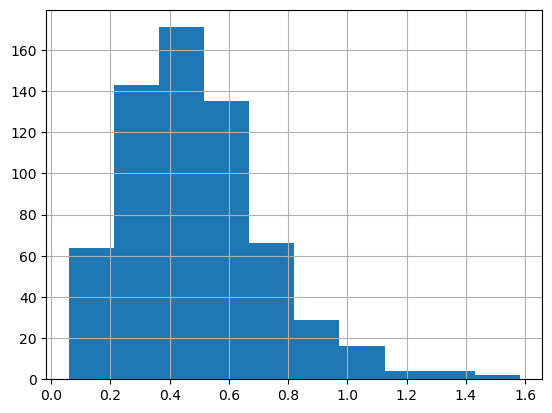
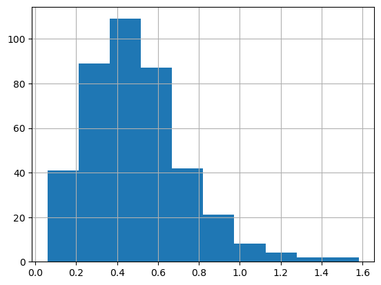
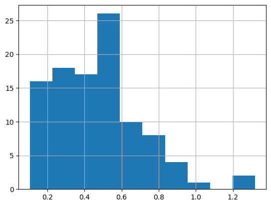
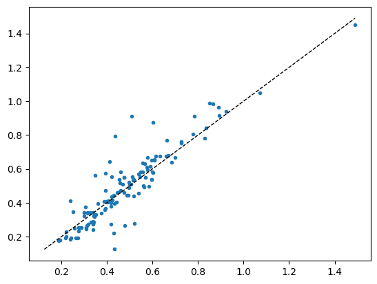

# Ringtrial classic


<!-- WARNING: THIS FILE WAS AUTOGENERATED! DO NOT EDIT! -->

``` python
import pandas as pd
from pathlib import Path

from sklearn.metrics import r2_score
from uhina.loading import LoaderFactory, plot_spectra
from uhina.preprocessing import TakeDerivative, SNV
from sklearn.pipeline import Pipeline
from sklearn.decomposition import PCA, KernelPCA
from sklearn.preprocessing import StandardScaler

import warnings
warnings.filterwarnings('ignore')

pd.set_option('display.max_rows', 100)

import plotly
import plotly.express as px
import numpy as np
from astartes import train_val_test_split
```

## Loading data

``` python
src = Path.home() / 'pro/data/woodwell-ringtrial/drive-download-20231013T123706Z-001'
loader = LoaderFactory.get_loader(src, 'ringtrial')
data = loader.load_data(analytes='potassium_cmolkg')
print(f'X shape: {data.X.shape}')

plot_spectra(data, n_spectra=100, snv=True, alpha=0.2, figsize=(12, 3))
```

    X shape: (1400, 1676)

    (<Figure size 1200x300 with 1 Axes>,
     <Axes: xlabel='Wavenumber ($cm^{-1}$)', ylabel='Absorbance'>)


``` python
[d for d in dir(data) if '__' not in d]
```

    ['X',
     'X_names',
     'dataset_labels',
     'dataset_names',
     'sample_indices',
     'y',
     'y_names']

``` python
print(f'y_names: {data.y_names}')
```

    y_names: ['potassium_cmolkg']

``` python
mask = ~np.isnan(data.y).ravel()
```

``` python
data.X = data.X[mask, :]
data.y = data.y[mask]
data.sample_indices = data.sample_indices[mask]
```

``` python
np.unique(np.array([idx.split('-rt')[0] for idx in data.sample_indices]))
## EDA
```

    array(['agrocares', 'argonne', 'csu-il', 'eth-alpha-1', 'eth-alpha-2',
           'eth-vertex', 'iaea-aug2022', 'kssl', 'landcare', 'lesotho', 'msu',
           'osu', 'rothamsted', 'scion', 'ughent', 'uiuc', 'usp',
           'uwisc-fine', 'woodwell-alpha', 'woodwell-vertex'], dtype='<U15')

``` python
data.sample_indices
```

    array(['agrocares-rt-01', 'agrocares-rt-02', 'agrocares-rt-03', ...,
           'woodwell-vertex-rt-68', 'woodwell-vertex-rt-69',
           'woodwell-vertex-rt-70'], dtype=object)

``` python
ds = 'kssl'
mask_ds = np.char.find(data.sample_indices.astype(str), ds) != -1
```

``` python
data.X = data.X[mask_ds, :]
data.y = data.y[mask_ds]
data.sample_indices = data.sample_indices[mask_ds]
```

## EDA

Visualize in PCA space: - PCA - Robust PCA - Kernel PCA

``` python
pipe = Pipeline([
    ('SNV', SNV()),
    ('Derivative', TakeDerivative()),
    ('Scaler', StandardScaler()),  
    ('PCA', PCA(n_components=3))
    ])

pca = PCA(n_components=3)
data.X_pca = pipe.fit_transform(data.X)

pipe = Pipeline([
    # ('SNV', SNV()),
    ('Derivative', TakeDerivative())
    # ('Scaler', StandardScaler())
    ])

data.X_transformed = pipe.fit_transform(data.X)
```

``` python
plot_spectra(data, var='X_transformed', n_spectra=100, snv=True, alpha=0.2, figsize=(12, 3));
```


``` python
data.y = np.log1p(data.y)
```

``` python
def data_to_df(data, x_names=['PC1', 'PC2', 'PC3']):
    df_x = pd.DataFrame(data.X_pca, columns=x_names)

    # Create a DataFrame from data.y with column names from data.y_names
    df_y = pd.DataFrame(data.y, columns=data.y_names)

    # Concatenate the two DataFrames
    return pd.concat([df_x, df_y], axis=1)
```

``` python
data_to_df(data).head()
```

<div>
<style scoped>
    .dataframe tbody tr th:only-of-type {
        vertical-align: middle;
    }
&#10;    .dataframe tbody tr th {
        vertical-align: top;
    }
&#10;    .dataframe thead th {
        text-align: right;
    }
</style>

<table class="dataframe" data-quarto-postprocess="true" data-border="1">
<thead>
<tr class="header" style="text-align: right;">
<th data-quarto-table-cell-role="th"></th>
<th data-quarto-table-cell-role="th">PC1</th>
<th data-quarto-table-cell-role="th">PC2</th>
<th data-quarto-table-cell-role="th">PC3</th>
<th data-quarto-table-cell-role="th">potassium_cmolkg</th>
</tr>
</thead>
<tbody>
<tr class="odd">
<td data-quarto-table-cell-role="th">0</td>
<td>39.053896</td>
<td>5.976212</td>
<td>-38.723251</td>
<td>0.238276</td>
</tr>
<tr class="even">
<td data-quarto-table-cell-role="th">1</td>
<td>-6.612691</td>
<td>33.863092</td>
<td>0.546687</td>
<td>0.209848</td>
</tr>
<tr class="odd">
<td data-quarto-table-cell-role="th">2</td>
<td>11.784152</td>
<td>-7.816915</td>
<td>31.112676</td>
<td>0.255487</td>
</tr>
<tr class="even">
<td data-quarto-table-cell-role="th">3</td>
<td>2.177276</td>
<td>9.013502</td>
<td>-11.529199</td>
<td>0.404965</td>
</tr>
<tr class="odd">
<td data-quarto-table-cell-role="th">4</td>
<td>2.192674</td>
<td>9.798410</td>
<td>-12.638061</td>
<td>0.469860</td>
</tr>
</tbody>
</table>

</div>

``` python
def scatter3d(df, idxs=None, target_name='soil_ex_K2O', dot_size=15, color_by_split=False):
    """Generates a nicely formatted 3D scatter plot of the data
    optionally showing train/validation/test splits.

    Args:
        df (pd.DataFrame): DataFrame containing the data
        idxs (tuple of np.array, optional): train, validation, and
            test indexes. Defaults to None.
        dot_size (int, optional): Base size for dots. Defaults to 15.
        color_by_split (bool, optional): If True, color by split instead of soil_ex_K2O. Defaults to False.
    """
    df = df.copy()
    df['size'] = dot_size
    min_val, max_val = df[target_name].min(), df[target_name].max()
    plot_args = dict(
        data_frame=df,
        x="PC1",
        y="PC2",
        z="PC3",
        opacity=1,
        height=800,
        width=800,
        size='size',
        size_max=dot_size
    )

    if idxs:
        total_samples = len(df)
        size_array = [dot_size] * total_samples
        name_array = ['Unsplit'] * total_samples
        
        # Calculate relative sizes based on the number of splits
        split_sizes = [len(split) for split in idxs]
        max_split_size = max(split_sizes)
        relative_sizes = [dot_size * (1 + 2 * (size / max_split_size)) for size in split_sizes]
        
        split_names = ["Training", "Validation", "Testing"][:len(idxs)]
        
        for split, split_size, split_name in zip(idxs, relative_sizes, split_names):
            for idx in split:
                size_array[idx] = split_size
                name_array[idx] = split_name
        
        # pass these through to plotly call
        plot_args["symbol"] = "Split"
        plot_args["size"] = "MarkerSize"
        df["MarkerSize"] = np.array(size_array)
        df["Split"] = np.array(name_array)

        if color_by_split:
            plot_args["color"] = "Split"
            plot_args["color_discrete_map"] = {"Training": "#1b9e77", "Validation": "#d95f02", "Testing": "#7570b3", "Unsplit": "gray"}
        else:
            plot_args["color"] = target_name
            plot_args["range_color"] = [min_val, max_val]
    else:
        plot_args["color"] = target_name
        plot_args["range_color"] = [min_val, max_val]

    # actual call to plotly
    fig = px.scatter_3d(**plot_args)

    # add a legend for different split types
    if idxs:
        fig.update_layout(
            legend=dict(orientation="h", yanchor="bottom", y=1.02, xanchor="right", x=1)
        )
        fig.update_traces(marker=dict(line=dict(width=0)))

        # make the markers consistent between plots
        symbols = {"Training": "circle", "Validation": "diamond", "Testing": "square", "Unsplit": "circle"}
        for i, d in enumerate(fig.data):
            if d.name in symbols:
                fig.data[i].marker.symbol = symbols[d.name]

    # customize the colors
    fig.update_layout(
        dict(
            plot_bgcolor="rgba(0, 0, 0, 0)",
            paper_bgcolor="rgba(0, 0, 0, 0)",
        )
    )
    axis_args = dict(
        backgroundcolor="rgba(0, 0, 0,0)",
        gridcolor="grey",
        showbackground=True,
        zerolinecolor="grey",
    )
    fig.update_layout(scene=dict(xaxis=axis_args, yaxis=axis_args, zaxis=axis_args))

    # render the plot
    fig.show()
```

``` python
scatter3d(data_to_df(data), target_name='potassium_cmolkg', dot_size=20)
```

    Unable to display output for mime type(s): application/vnd.plotly.v1+json

## Train/Valid/Test splits

Inspired from:
https://jacksonburns.github.io/use-rse-23-astartes/split_comparisons.html

### Interpolative

#### Random split

``` python
(
    random_X_train,
    random_X_val,
    random_X_test,
    random_y_train,
    random_y_val,
    random_y_test,
    random_idxs_train,
    random_idxs_val,
    random_idxs_test,
) = train_val_test_split(
    data.X_transformed,
    data.y,
    sampler="random",
    train_size=0.5,
    val_size=0.25,
    test_size=0.25,
    return_indices=True,
    random_state=40
)
```

``` python
scatter3d(
    data_to_df(data), 
    idxs=(random_idxs_train, random_idxs_val, random_idxs_test),
    target_name='potassium_cmolkg',
    color_by_split=True,
    dot_size=20)
```

    Unable to display output for mime type(s): application/vnd.plotly.v1+json

#### Kennard-Stone

``` python
(
    ks_X_train,
    ks_X_val,
    ks_X_test,
    ks_y_train,
    ks_y_val,
    ks_y_test,
    ks_idxs_train,
    ks_idxs_val,
    ks_idxs_test,
) = train_val_test_split(
    data.X_transformed,
    data.y,
    sampler="kennard_stone",
    train_size=0.5,
    val_size=0.25,
    test_size=0.25,
    return_indices=True,
)
```

``` python
scatter3d(
    data_to_df(data), 
    target_name='potassium_cmolkg',
    idxs=(ks_idxs_train, ks_idxs_val, ks_idxs_test),
    color_by_split=True,
    dot_size=20)
```

    Unable to display output for mime type(s): application/vnd.plotly.v1+json

#### SPXY

``` python
data.y.shape
```

    (69, 1)

``` python
data.X_transformed.shape
```

    (69, 1676)

``` python
(
    spxy_X_train,
    spxy_X_val,
    spxy_X_test,
    spxy_y_train,
    spxy_y_val,
    spxy_y_test,
    spxy_idxs_train,
    spxy_idxs_val,
    spxy_idxs_test,
) = train_val_test_split(
    data.X_transformed,
    data.y.ravel(),
    sampler="spxy",
    train_size=0.5,
    val_size=0.25,
    test_size=0.25,
    return_indices=True,
)
```

``` python
scatter3d(
    data_to_df(data), 
     target_name='potassium_cmolkg',
    idxs=(spxy_idxs_train, spxy_idxs_val, spxy_idxs_test),
    color_by_split=True,
    dot_size=13)
```

    Unable to display output for mime type(s): application/vnd.plotly.v1+json

### Extrapolative

#### KMeans

``` python
(
    kmeans_X_train,
    kmeans_X_val,
    kmeans_X_test,
    kmeans_y_train,
    kmeans_y_val,
    kmeans_y_test,
    kmeans_clusters_train,
    kmeans_clusters_val,
    kmeans_clusters_test,
    kmeans_idxs_train,
    kmeans_idxs_val,
    kmeans_idxs_test,
) = train_val_test_split(
    data.X_transformed,
    data.y[:, 5],
    sampler="kmeans",
    train_size=0.5,
    val_size=0.25,
    test_size=0.25,
    return_indices=True,
    hopts=dict(n_clusters=6),
)
```

``` python
scatter3d(
    data_to_df(data), 
    idxs=(kmeans_idxs_train, kmeans_idxs_val, kmeans_idxs_test),
    color_by_split=True,
    dot_size=13)
```

    Unable to display output for mime type(s): application/vnd.plotly.v1+json

#### Sphere exclusion

``` python
(
    spex_X_train,
    spex_X_val,
    spex_X_test,
    spex_y_train,
    spex_y_val,
    spex_y_test,
    spex_clusters_train,
    spex_clusters_val,
    spex_clusters_test,
    spex_idxs_train,
    spex_idxs_val,
    spex_idxs_test,
) = train_val_test_split(
    data.X_transformed,
    data.y[:, 5],
    sampler="sphere_exclusion",
    train_size=0.5,
    val_size=0.25,
    test_size=0.25,
    return_indices=True,
    hopts=dict(
        # normalized between zero and one
        distance_cutoff=0.1,
    ),
)
```

``` python
scatter3d(
    data_to_df(data), 
    idxs=(spex_idxs_train, spex_idxs_val, spex_idxs_test),
    color_by_split=True,
    dot_size=13)
```

    Unable to display output for mime type(s): application/vnd.plotly.v1+json

#### DBSCAN

``` python
# (
#     dbscan_X_train,
#     dbscan_X_val,
#     dbscan_X_test,
#     dbscan_y_train,
#     dbscan_y_val,
#     dbscan_y_test,
#     dbscan_clusters_train,
#     dbscan_clusters_val,
#     dbscan_clusters_test,
#     dbscan_idxs_train,
#     dbscan_idxs_val,
#     dbscan_idxs_test,
# ) = train_val_test_split(
#     data.X_transformed,
#     data.y[:, 5],
#     sampler="dbscan",
#     train_size=0.5,
#     val_size=0.25,
#     test_size=0.25,
#     return_indices=True,
#     hopts=dict(
#         eps=100,
#     ),
# )
```

## Training

``` python
def get_split_data(split_type):
    split_names = ['X_train', 'X_val', 'X_test', 'y_train', 'y_val', 'y_test', 'idxs_train', 'idxs_val', 'idxs_test']
    return {name: globals().get(f"{split_type}_{name}") for name in split_names}

split_types = ['random', 'ks', 'spxy', 'kmeans', 'spex']

def get_data_for_split(split_type):
    if split_type not in split_types:
        raise ValueError(f"Invalid split type. Choose from: {', '.join(split_types)}")
    
    split_data = get_split_data(split_type)
    
    return (
        split_data['X_train'], split_data['X_val'], split_data['X_test'],
        split_data['y_train'], split_data['y_val'], split_data['y_test'],
        split_data['idxs_train'], split_data['idxs_val'], split_data['idxs_test']
    )
```

``` python
split_type = 'ks'  # or any other split type

(
    X_train, 
    X_val, 
    X_test, 
    y_train, 
    y_val, 
    y_test, 
    idxs_train, 
    idxs_val, 
    idxs_test
) = get_data_for_split(split_type)
```

``` python
from sklearn.cross_decomposition import PLSRegression
from tqdm.auto import tqdm

scores = []
n_max = 30
for n in tqdm(range(1,n_max)):
    pls = PLSRegression(n_components=n)
    pls.fit(X_train, y_train)
    y_val_predicted = pls.predict(X_val)
    scores.append(r2_score(y_val, y_val_predicted))

from matplotlib import pyplot as plt
plt.plot(range(1, n_max), scores)
n_best = np.argmax(np.array(scores)) + 1
print(f'Best score: {scores[n_best]} at n={n_best}')
# plt.ylim(0, 1)
```

    100%|██████████| 29/29 [00:00<00:00, 99.32it/s] 

    Best score: 0.45715906114471405 at n=2


``` python
# ON TEST SET
pls = PLSRegression(n_components=n_best)
pls.fit(X_train, y_train)
y_test_predicted = pls.predict(X_test)
r2_score(y_test, y_test_predicted)
```

    0.6783592767273139

``` python
src = '../../_data/fk-jumpei-tfm/im-targets-lut.csv'
df = pd.read_csv(src)
print(f'{df.shape[0]} samples')
df.head()
```

    635 samples

<div>
<style scoped>
    .dataframe tbody tr th:only-of-type {
        vertical-align: middle;
    }
&#10;    .dataframe tbody tr th {
        vertical-align: top;
    }
&#10;    .dataframe thead th {
        text-align: right;
    }
</style>

<table class="dataframe" data-quarto-postprocess="true" data-border="1">
<thead>
<tr class="header" style="text-align: right;">
<th data-quarto-table-cell-role="th"></th>
<th data-quarto-table-cell-role="th">fname</th>
<th data-quarto-table-cell-role="th">soil_total_Cs134</th>
<th data-quarto-table-cell-role="th">soil_total_Cs137</th>
<th data-quarto-table-cell-role="th">soil_ex_Cs137</th>
<th data-quarto-table-cell-role="th">exCs137_totalCs137</th>
<th data-quarto-table-cell-role="th">soil_water_soluble_K2O</th>
<th data-quarto-table-cell-role="th">soil_ex_K2O</th>
<th data-quarto-table-cell-role="th">TF_plant_totalCs137</th>
<th data-quarto-table-cell-role="th">TF_plant_exCs137</th>
<th data-quarto-table-cell-role="th">soil_pH</th>
<th data-quarto-table-cell-role="th">...</th>
<th data-quarto-table-cell-role="th">soil_CN_ratio</th>
<th data-quarto-table-cell-role="th">soil_CEC</th>
<th data-quarto-table-cell-role="th">soil_MgO</th>
<th data-quarto-table-cell-role="th">soil_CaO</th>
<th data-quarto-table-cell-role="th">soil_P_absorption_coefficient</th>
<th data-quarto-table-cell-role="th">avaiable_Pi</th>
<th data-quarto-table-cell-role="th">course_sand</th>
<th data-quarto-table-cell-role="th">fine_sand</th>
<th data-quarto-table-cell-role="th">silt</th>
<th data-quarto-table-cell-role="th">clay</th>
</tr>
</thead>
<tbody>
<tr class="odd">
<td data-quarto-table-cell-role="th">0</td>
<td>20-2013-paddy_rice.png</td>
<td>NaN</td>
<td>610.0</td>
<td>70.6</td>
<td>0.116</td>
<td>NaN</td>
<td>17.6</td>
<td>NaN</td>
<td>NaN</td>
<td>6.0</td>
<td>...</td>
<td>12.0</td>
<td>29.5</td>
<td>64.1</td>
<td>339.0</td>
<td>1700.0</td>
<td>NaN</td>
<td>17.1</td>
<td>34.1</td>
<td>25.6</td>
<td>23.2</td>
</tr>
<tr class="even">
<td data-quarto-table-cell-role="th">1</td>
<td>28-2014-paddy_rice.png</td>
<td>NaN</td>
<td>273.5</td>
<td>27.8</td>
<td>0.102</td>
<td>NaN</td>
<td>62.1</td>
<td>NaN</td>
<td>NaN</td>
<td>5.0</td>
<td>...</td>
<td>12.0</td>
<td>19.6</td>
<td>30.3</td>
<td>217.0</td>
<td>660.0</td>
<td>12.2</td>
<td>NaN</td>
<td>NaN</td>
<td>NaN</td>
<td>NaN</td>
</tr>
<tr class="odd">
<td data-quarto-table-cell-role="th">2</td>
<td>33-2014-paddy_rice.png</td>
<td>NaN</td>
<td>28.1</td>
<td>3.6</td>
<td>0.127</td>
<td>NaN</td>
<td>22.3</td>
<td>NaN</td>
<td>NaN</td>
<td>6.0</td>
<td>...</td>
<td>12.0</td>
<td>13.8</td>
<td>38.1</td>
<td>96.1</td>
<td>640.0</td>
<td>6.8</td>
<td>NaN</td>
<td>NaN</td>
<td>NaN</td>
<td>NaN</td>
</tr>
<tr class="even">
<td data-quarto-table-cell-role="th">3</td>
<td>35-2014-paddy_rice.png</td>
<td>NaN</td>
<td>897.8</td>
<td>71.4</td>
<td>0.080</td>
<td>NaN</td>
<td>33.6</td>
<td>NaN</td>
<td>NaN</td>
<td>5.0</td>
<td>...</td>
<td>12.0</td>
<td>15.4</td>
<td>16.2</td>
<td>119.0</td>
<td>640.0</td>
<td>34.2</td>
<td>NaN</td>
<td>NaN</td>
<td>NaN</td>
<td>NaN</td>
</tr>
<tr class="odd">
<td data-quarto-table-cell-role="th">4</td>
<td>36-2014-paddy_rice.png</td>
<td>NaN</td>
<td>964.3</td>
<td>90.6</td>
<td>0.094</td>
<td>NaN</td>
<td>57.0</td>
<td>NaN</td>
<td>NaN</td>
<td>5.0</td>
<td>...</td>
<td>12.0</td>
<td>17.7</td>
<td>19.9</td>
<td>151.0</td>
<td>610.0</td>
<td>40.0</td>
<td>NaN</td>
<td>NaN</td>
<td>NaN</td>
<td>NaN</td>
</tr>
</tbody>
</table>

<p>5 rows × 22 columns</p>
</div>

``` python
def mg_100g_to_cmol_kg(x, log_tfm=False, atom_weight=39.1):
    x_mg_kg = x * 10 
    x_mg_kg_K = 0.83 * x_mg_kg
    x_cmol_kg_K = x_mg_kg_K / (atom_weight*10)
    return np.log1p(x_cmol_kg_K) if log_tfm else x_cmol_kg_K
```

``` python
mg_100g_to_cmol_kg(df['soil_ex_K2O'], log_tfm=True).hist()
```



``` python
print('Before:', df.shape)
df.dropna(inplace=True, subset=['soil_ex_K2O'])
print('After:', df.shape)
```

    Before: (635, 22)
    After: (634, 22)

``` python
df['soil_ex_K2O'] = df['soil_ex_K2O'].apply(lambda x: mg_100g_to_cmol_kg(x, log_tfm=True))
 df.soil_ex_K2O.hist()
```


``` python
for i, col in enumerate(df.columns):
    print(f'{i}: {col}')
```

    0: fname
    1: soil_total_Cs134
    2: soil_total_Cs137
    3: soil_ex_Cs137
    4: exCs137_totalCs137
    5: soil_water_soluble_K2O
    6: soil_ex_K2O
    7: TF_plant_totalCs137
    8: TF_plant_exCs137
    9: soil_pH
    10: soil_C
    11: soil_N
    12: soil_CN_ratio
    13: soil_CEC
    14: soil_MgO
    15: soil_CaO
    16: soil_P_absorption_coefficient
    17: avaiable_Pi
    18: course_sand
    19: fine_sand
    20: silt
    21: clay

## Fine-tuning

``` python
class OrderedQuantize(Quantize):
    order = 0  # Apply first

class OrderedRatioResize(RatioResize):
    order = 1  # Apply second
```

``` python
def stratified_split(df, target, valid_size=0.2, test_size=0.2, num_bins=2, seed=41):
    from sklearn.model_selection import train_test_split
    df = df.copy()
    df.reset_index(inplace=True, drop=True)
    train_df, test_df = train_test_split(df, test_size=test_size, 
                                        stratify=pd.qcut(df[target], q=num_bins, labels=False), 
                                        random_state=seed)

    train_df, valid_df = train_test_split(train_df, test_size=valid_size, 
                                        stratify=pd.qcut(train_df[target], q=num_bins, labels=False), 
                                        random_state=seed)
    
    return train_df, train_df.index, valid_df, valid_df.index, test_df, test_df.index
```

``` python
# from sklearn.model_selection import StratifiedShuffleSplit

# def stratified_split(df, target_col, n_bins=2, n_splits=2, test_size=0.2, random_state=42):
#     # Create bins for the target values
#     df_copy = df.copy()
#     df_copy['target_bin'] = pd.cut(df_copy[target_col], bins=n_bins, labels=False)
    
#     # Create a StratifiedShuffleSplit object
#     sss = StratifiedShuffleSplit(n_splits=n_splits, test_size=test_size, random_state=random_state)
    
#     # Get the indices for the splits
#     splits = list(sss.split(df_copy, df_copy['target_bin']))
    
#     # Remove the temporary 'target_bin' column
#     df_copy.drop('target_bin', axis=1, inplace=True)
    
#     return splits
```

``` python
df.head()
```

<div>
<style scoped>
    .dataframe tbody tr th:only-of-type {
        vertical-align: middle;
    }
&#10;    .dataframe tbody tr th {
        vertical-align: top;
    }
&#10;    .dataframe thead th {
        text-align: right;
    }
</style>

<table class="dataframe" data-quarto-postprocess="true" data-border="1">
<thead>
<tr class="header" style="text-align: right;">
<th data-quarto-table-cell-role="th"></th>
<th data-quarto-table-cell-role="th">fname</th>
<th data-quarto-table-cell-role="th">soil_total_Cs134</th>
<th data-quarto-table-cell-role="th">soil_total_Cs137</th>
<th data-quarto-table-cell-role="th">soil_ex_Cs137</th>
<th data-quarto-table-cell-role="th">exCs137_totalCs137</th>
<th data-quarto-table-cell-role="th">soil_water_soluble_K2O</th>
<th data-quarto-table-cell-role="th">soil_ex_K2O</th>
<th data-quarto-table-cell-role="th">TF_plant_totalCs137</th>
<th data-quarto-table-cell-role="th">TF_plant_exCs137</th>
<th data-quarto-table-cell-role="th">soil_pH</th>
<th data-quarto-table-cell-role="th">...</th>
<th data-quarto-table-cell-role="th">soil_CN_ratio</th>
<th data-quarto-table-cell-role="th">soil_CEC</th>
<th data-quarto-table-cell-role="th">soil_MgO</th>
<th data-quarto-table-cell-role="th">soil_CaO</th>
<th data-quarto-table-cell-role="th">soil_P_absorption_coefficient</th>
<th data-quarto-table-cell-role="th">avaiable_Pi</th>
<th data-quarto-table-cell-role="th">course_sand</th>
<th data-quarto-table-cell-role="th">fine_sand</th>
<th data-quarto-table-cell-role="th">silt</th>
<th data-quarto-table-cell-role="th">clay</th>
</tr>
</thead>
<tbody>
<tr class="odd">
<td data-quarto-table-cell-role="th">0</td>
<td>20-2013-paddy_rice.png</td>
<td>NaN</td>
<td>610.0</td>
<td>70.6</td>
<td>0.116</td>
<td>NaN</td>
<td>0.317439</td>
<td>NaN</td>
<td>NaN</td>
<td>6.0</td>
<td>...</td>
<td>12.0</td>
<td>29.5</td>
<td>64.1</td>
<td>339.0</td>
<td>1700.0</td>
<td>NaN</td>
<td>17.1</td>
<td>34.1</td>
<td>25.6</td>
<td>23.2</td>
</tr>
<tr class="even">
<td data-quarto-table-cell-role="th">1</td>
<td>28-2014-paddy_rice.png</td>
<td>NaN</td>
<td>273.5</td>
<td>27.8</td>
<td>0.102</td>
<td>NaN</td>
<td>0.840806</td>
<td>NaN</td>
<td>NaN</td>
<td>5.0</td>
<td>...</td>
<td>12.0</td>
<td>19.6</td>
<td>30.3</td>
<td>217.0</td>
<td>660.0</td>
<td>12.2</td>
<td>NaN</td>
<td>NaN</td>
<td>NaN</td>
<td>NaN</td>
</tr>
<tr class="odd">
<td data-quarto-table-cell-role="th">2</td>
<td>33-2014-paddy_rice.png</td>
<td>NaN</td>
<td>28.1</td>
<td>3.6</td>
<td>0.127</td>
<td>NaN</td>
<td>0.387556</td>
<td>NaN</td>
<td>NaN</td>
<td>6.0</td>
<td>...</td>
<td>12.0</td>
<td>13.8</td>
<td>38.1</td>
<td>96.1</td>
<td>640.0</td>
<td>6.8</td>
<td>NaN</td>
<td>NaN</td>
<td>NaN</td>
<td>NaN</td>
</tr>
<tr class="even">
<td data-quarto-table-cell-role="th">3</td>
<td>35-2014-paddy_rice.png</td>
<td>NaN</td>
<td>897.8</td>
<td>71.4</td>
<td>0.080</td>
<td>NaN</td>
<td>0.538391</td>
<td>NaN</td>
<td>NaN</td>
<td>5.0</td>
<td>...</td>
<td>12.0</td>
<td>15.4</td>
<td>16.2</td>
<td>119.0</td>
<td>640.0</td>
<td>34.2</td>
<td>NaN</td>
<td>NaN</td>
<td>NaN</td>
<td>NaN</td>
</tr>
<tr class="odd">
<td data-quarto-table-cell-role="th">4</td>
<td>36-2014-paddy_rice.png</td>
<td>NaN</td>
<td>964.3</td>
<td>90.6</td>
<td>0.094</td>
<td>NaN</td>
<td>0.792981</td>
<td>NaN</td>
<td>NaN</td>
<td>5.0</td>
<td>...</td>
<td>12.0</td>
<td>17.7</td>
<td>19.9</td>
<td>151.0</td>
<td>610.0</td>
<td>40.0</td>
<td>NaN</td>
<td>NaN</td>
<td>NaN</td>
<td>NaN</td>
</tr>
</tbody>
</table>

<p>5 rows × 22 columns</p>
</div>

``` python
idx = 6
df.columns[idx]
```

    'soil_ex_K2O'

``` python
data = stratified_split(df,  df.columns[idx], valid_size=0.2, test_size=0.2, num_bins=2)
train_df, train_idx, valid_df, valid_idx, test_df, test_idx = data
```

``` python
# # Usage example:
# splits = stratified_split(df, df.columns[idx], n_bins=4, n_splits=2, random_state=41)

# # For train-validation split
# train_idx, valid_idx = splits[0]

# # For train-test split (if needed)
# train_valid_idx, test_idx = splits[1]

# # Create DataFrames
# train_df = df.iloc[train_idx]
# valid_df = df.iloc[valid_idx]
# test_df = df.iloc[test_idx]
```

``` python
len(train_df), len(valid_df), len(test_df)
```

    (405, 102, 127)

``` python
test_df[['fname', df.columns[idx]]]
```

<div>
<style scoped>
    .dataframe tbody tr th:only-of-type {
        vertical-align: middle;
    }
&#10;    .dataframe tbody tr th {
        vertical-align: top;
    }
&#10;    .dataframe thead th {
        text-align: right;
    }
</style>

<table class="dataframe" data-quarto-postprocess="true" data-border="1">
<thead>
<tr class="header" style="text-align: right;">
<th data-quarto-table-cell-role="th"></th>
<th data-quarto-table-cell-role="th">fname</th>
<th data-quarto-table-cell-role="th">soil_ex_K2O</th>
</tr>
</thead>
<tbody>
<tr class="odd">
<td data-quarto-table-cell-role="th">195</td>
<td>758-2014-soybean.png</td>
<td>0.973526</td>
</tr>
<tr class="even">
<td data-quarto-table-cell-role="th">77</td>
<td>166-2016-paddy_rice.png</td>
<td>0.571297</td>
</tr>
<tr class="odd">
<td data-quarto-table-cell-role="th">224</td>
<td>888-2014-paddy_rice.png</td>
<td>0.329727</td>
</tr>
<tr class="even">
<td data-quarto-table-cell-role="th">580</td>
<td>2391-2020-paddy_rice.png</td>
<td>0.519631</td>
</tr>
<tr class="odd">
<td data-quarto-table-cell-role="th">10</td>
<td>51-2015-paddy_rice.png</td>
<td>0.204683</td>
</tr>
<tr class="even">
<td data-quarto-table-cell-role="th">...</td>
<td>...</td>
<td>...</td>
</tr>
<tr class="odd">
<td data-quarto-table-cell-role="th">520</td>
<td>2131-2018-paddy_rice.png</td>
<td>0.473116</td>
</tr>
<tr class="even">
<td data-quarto-table-cell-role="th">321</td>
<td>1352-2014-paddy_rice.png</td>
<td>0.739718</td>
</tr>
<tr class="odd">
<td data-quarto-table-cell-role="th">226</td>
<td>908-2014-paddy_rice.png</td>
<td>0.202951</td>
</tr>
<tr class="even">
<td data-quarto-table-cell-role="th">137</td>
<td>250-2017-paddy_rice.png</td>
<td>0.095101</td>
</tr>
<tr class="odd">
<td data-quarto-table-cell-role="th">378</td>
<td>1988-2018-paddy_rice.png</td>
<td>0.089294</td>
</tr>
</tbody>
</table>

<p>127 rows × 2 columns</p>
</div>

``` python
train_df['soil_ex_K2O'].hist()
```



``` python
valid_df['soil_ex_K2O'].hist()
```



``` python
test_df['soil_ex_K2O'].hist()
```


``` python
def stratified_splitter(items):
    return [train_idx, valid_idx]
```

``` python
len(train_idx), len(valid_idx), len(test_idx)
```

    (405, 102, 127)

``` python
dblock = DataBlock(
    blocks=(ImageBlock, RegressionBlock),
    get_x=ColReader(0, pref='../../_data/fk-jumpei-tfm/im/'),
    get_y=ColReader(6),
    splitter=stratified_splitter,
    item_tfms=[OrderedQuantize(n_valid=len(valid_idx))],
    batch_tfms=[
        OrderedRatioResize(224),
        Normalize.from_stats(*imagenet_stats)
    ]
)
```

``` python
# dblock = DataBlock(blocks=(ImageBlock, RegressionBlock),
#                    get_x=ColReader(0, pref='../../_data/fk-jumpei-tfm/im/'),
#                    get_y=ColReader(idx),
#                    splitter=stratified_splitter,
#                    batch_tfms=[RatioResize(224)],
#                    item_tfms=[Quantize(n_valid=len(valid_idx))])

# # dblock.summary(df)
```

``` python
dls = dblock.dataloaders(df, bs=16)
```

``` python
dls.train.n, dls.valid.n
```

    (405, 102)

``` python
dls.show_batch(nrows=6, ncols=2, figsize=(12, 13))
```


``` python
# learn = load_learner('./models/650-4000-epoch-25-lr-3e-3.pkl', cpu=True)
learn = load_learner('./models/unfrozen-epoch-30-lr-1.5e-3-12102024.pkl', cpu=True)
# learn = load_learner('./models/frozen-epoch-30-lr-1.5e-3-12102024.pkl', cpu=True)
```

``` python
learn.dls = dls
```

``` python
# learn.summary()
```

``` python
learn.freeze()
```

``` python
# learn.model[-1][-1]
```

``` python
# model = learn.model
# last_layer = model[-1][-1]
# new_layer = nn.Linear(in_features=last_layer.in_features, 
#                       out_features=last_layer.out_features, 
#                       bias=True)
# new_layer.weight.data = last_layer.weight.data
# if hasattr(last_layer, 'bias') and last_layer.bias is not None:
#     new_layer.bias.data = last_layer.bias.data
# learn.model[-1][-1] = new_layer
```

``` python
# learn.model[-1][-1]
```

``` python
learn.lr_find()
```

<style>
    /* Turns off some styling */
    progress {
        /* gets rid of default border in Firefox and Opera. */
        border: none;
        /* Needs to be in here for Safari polyfill so background images work as expected. */
        background-size: auto;
    }
    progress:not([value]), progress:not([value])::-webkit-progress-bar {
        background: repeating-linear-gradient(45deg, #7e7e7e, #7e7e7e 10px, #5c5c5c 10px, #5c5c5c 20px);
    }
    .progress-bar-interrupted, .progress-bar-interrupted::-webkit-progress-bar {
        background: #F44336;
    }
</style>

    SuggestedLRs(valley=0.0003981071640737355)


``` python
learn.fit_one_cycle(20, 4e-4)
```

<style>
    /* Turns off some styling */
    progress {
        /* gets rid of default border in Firefox and Opera. */
        border: none;
        /* Needs to be in here for Safari polyfill so background images work as expected. */
        background-size: auto;
    }
    progress:not([value]), progress:not([value])::-webkit-progress-bar {
        background: repeating-linear-gradient(45deg, #7e7e7e, #7e7e7e 10px, #5c5c5c 10px, #5c5c5c 20px);
    }
    .progress-bar-interrupted, .progress-bar-interrupted::-webkit-progress-bar {
        background: #F44336;
    }
</style>

    <div>
      <progress value='6' class='' max='20' style='width:300px; height:20px; vertical-align: middle;'></progress>
      30.00% [6/20 02:14&lt;05:14]
    </div>
    &#10;
<table class="dataframe" data-quarto-postprocess="true" data-border="1">
<thead>
<tr class="header" style="text-align: left;">
<th data-quarto-table-cell-role="th">epoch</th>
<th data-quarto-table-cell-role="th">train_loss</th>
<th data-quarto-table-cell-role="th">valid_loss</th>
<th data-quarto-table-cell-role="th">r2_score</th>
<th data-quarto-table-cell-role="th">time</th>
</tr>
</thead>
<tbody>
<tr class="odd">
<td>0</td>
<td>0.085307</td>
<td>0.063526</td>
<td>-0.155087</td>
<td>00:21</td>
</tr>
<tr class="even">
<td>1</td>
<td>0.073202</td>
<td>0.090788</td>
<td>-0.650800</td>
<td>00:21</td>
</tr>
<tr class="odd">
<td>2</td>
<td>0.064845</td>
<td>0.056194</td>
<td>-0.021780</td>
<td>00:22</td>
</tr>
<tr class="even">
<td>3</td>
<td>0.058440</td>
<td>0.168733</td>
<td>-2.068068</td>
<td>00:22</td>
</tr>
<tr class="odd">
<td>4</td>
<td>0.057954</td>
<td>0.169698</td>
<td>-2.085604</td>
<td>00:22</td>
</tr>
<tr class="even">
<td>5</td>
<td>0.058297</td>
<td>0.072166</td>
<td>-0.312190</td>
<td>00:24</td>
</tr>
</tbody>
</table>

<p>
&#10;    <div>
      <progress value='0' class='' max='7' style='width:300px; height:20px; vertical-align: middle;'></progress>
      0.00% [0/7 00:00&lt;?]
    </div>
    &#10;
    KeyboardInterrupt: 
    ---------------------------------------------------------------------------
    KeyboardInterrupt                         Traceback (most recent call last)
    Cell In[287], line 1
    ----> 1 learn.fit_one_cycle(20, 4e-4)

    File ~/mambaforge/envs/uhina/lib/python3.12/site-packages/fastai/callback/schedule.py:121, in fit_one_cycle(self, n_epoch, lr_max, div, div_final, pct_start, wd, moms, cbs, reset_opt, start_epoch)
        118 lr_max = np.array([h['lr'] for h in self.opt.hypers])
        119 scheds = {'lr': combined_cos(pct_start, lr_max/div, lr_max, lr_max/div_final),
        120           'mom': combined_cos(pct_start, *(self.moms if moms is None else moms))}
    --> 121 self.fit(n_epoch, cbs=ParamScheduler(scheds)+L(cbs), reset_opt=reset_opt, wd=wd, start_epoch=start_epoch)

    File ~/mambaforge/envs/uhina/lib/python3.12/site-packages/fastai/learner.py:266, in Learner.fit(self, n_epoch, lr, wd, cbs, reset_opt, start_epoch)
        264 self.opt.set_hypers(lr=self.lr if lr is None else lr)
        265 self.n_epoch = n_epoch
    --> 266 self._with_events(self._do_fit, 'fit', CancelFitException, self._end_cleanup)

    File ~/mambaforge/envs/uhina/lib/python3.12/site-packages/fastai/learner.py:201, in Learner._with_events(self, f, event_type, ex, final)
        200 def _with_events(self, f, event_type, ex, final=noop):
    --> 201     try: self(f'before_{event_type}');  f()
        202     except ex: self(f'after_cancel_{event_type}')
        203     self(f'after_{event_type}');  final()

    File ~/mambaforge/envs/uhina/lib/python3.12/site-packages/fastai/learner.py:255, in Learner._do_fit(self)
        253 for epoch in range(self.n_epoch):
        254     self.epoch=epoch
    --> 255     self._with_events(self._do_epoch, 'epoch', CancelEpochException)

    File ~/mambaforge/envs/uhina/lib/python3.12/site-packages/fastai/learner.py:201, in Learner._with_events(self, f, event_type, ex, final)
        200 def _with_events(self, f, event_type, ex, final=noop):
    --> 201     try: self(f'before_{event_type}');  f()
        202     except ex: self(f'after_cancel_{event_type}')
        203     self(f'after_{event_type}');  final()

    File ~/mambaforge/envs/uhina/lib/python3.12/site-packages/fastai/learner.py:250, in Learner._do_epoch(self)
        248 def _do_epoch(self):
        249     self._do_epoch_train()
    --> 250     self._do_epoch_validate()

    File ~/mambaforge/envs/uhina/lib/python3.12/site-packages/fastai/learner.py:246, in Learner._do_epoch_validate(self, ds_idx, dl)
        244 if dl is None: dl = self.dls[ds_idx]
        245 self.dl = dl
    --> 246 with torch.no_grad(): self._with_events(self.all_batches, 'validate', CancelValidException)

    File ~/mambaforge/envs/uhina/lib/python3.12/site-packages/fastai/learner.py:201, in Learner._with_events(self, f, event_type, ex, final)
        200 def _with_events(self, f, event_type, ex, final=noop):
    --> 201     try: self(f'before_{event_type}');  f()
        202     except ex: self(f'after_cancel_{event_type}')
        203     self(f'after_{event_type}');  final()

    File ~/mambaforge/envs/uhina/lib/python3.12/site-packages/fastai/learner.py:207, in Learner.all_batches(self)
        205 def all_batches(self):
        206     self.n_iter = len(self.dl)
    --> 207     for o in enumerate(self.dl): self.one_batch(*o)

    File ~/mambaforge/envs/uhina/lib/python3.12/site-packages/fastai/data/load.py:129, in DataLoader.__iter__(self)
        127 self.before_iter()
        128 self.__idxs=self.get_idxs() # called in context of main process (not workers/subprocesses)
    --> 129 for b in _loaders[self.fake_l.num_workers==0](self.fake_l):
        130     # pin_memory causes tuples to be converted to lists, so convert them back to tuples
        131     if self.pin_memory and type(b) == list: b = tuple(b)
        132     if self.device is not None: b = to_device(b, self.device)

    File ~/mambaforge/envs/uhina/lib/python3.12/site-packages/torch/utils/data/dataloader.py:630, in _BaseDataLoaderIter.__next__(self)
        627 if self._sampler_iter is None:
        628     # TODO(https://github.com/pytorch/pytorch/issues/76750)
        629     self._reset()  # type: ignore[call-arg]
    --> 630 data = self._next_data()
        631 self._num_yielded += 1
        632 if self._dataset_kind == _DatasetKind.Iterable and \
        633         self._IterableDataset_len_called is not None and \
        634         self._num_yielded > self._IterableDataset_len_called:

    File ~/mambaforge/envs/uhina/lib/python3.12/site-packages/torch/utils/data/dataloader.py:673, in _SingleProcessDataLoaderIter._next_data(self)
        671 def _next_data(self):
        672     index = self._next_index()  # may raise StopIteration
    --> 673     data = self._dataset_fetcher.fetch(index)  # may raise StopIteration
        674     if self._pin_memory:
        675         data = _utils.pin_memory.pin_memory(data, self._pin_memory_device)

    File ~/mambaforge/envs/uhina/lib/python3.12/site-packages/torch/utils/data/_utils/fetch.py:42, in _IterableDatasetFetcher.fetch(self, possibly_batched_index)
         40         raise StopIteration
         41 else:
    ---> 42     data = next(self.dataset_iter)
         43 return self.collate_fn(data)

    File ~/mambaforge/envs/uhina/lib/python3.12/site-packages/fastai/data/load.py:140, in DataLoader.create_batches(self, samps)
        138 if self.dataset is not None: self.it = iter(self.dataset)
        139 res = filter(lambda o:o is not None, map(self.do_item, samps))
    --> 140 yield from map(self.do_batch, self.chunkify(res))

    File ~/mambaforge/envs/uhina/lib/python3.12/site-packages/fastcore/basics.py:245, in chunked(it, chunk_sz, drop_last, n_chunks)
        243 if not isinstance(it, Iterator): it = iter(it)
        244 while True:
    --> 245     res = list(itertools.islice(it, chunk_sz))
        246     if res and (len(res)==chunk_sz or not drop_last): yield res
        247     if len(res)<chunk_sz: return

    File ~/mambaforge/envs/uhina/lib/python3.12/site-packages/fastai/data/load.py:170, in DataLoader.do_item(self, s)
        169 def do_item(self, s):
    --> 170     try: return self.after_item(self.create_item(s))
        171     except SkipItemException: return None

    File ~/mambaforge/envs/uhina/lib/python3.12/site-packages/fastcore/transform.py:210, in Pipeline.__call__(self, o)
    --> 210 def __call__(self, o): return compose_tfms(o, tfms=self.fs, split_idx=self.split_idx)

    File ~/mambaforge/envs/uhina/lib/python3.12/site-packages/fastcore/transform.py:160, in compose_tfms(x, tfms, is_enc, reverse, **kwargs)
        158 for f in tfms:
        159     if not is_enc: f = f.decode
    --> 160     x = f(x, **kwargs)
        161 return x

    File ~/mambaforge/envs/uhina/lib/python3.12/site-packages/fastai/vision/augment.py:51, in RandTransform.__call__(self, b, split_idx, **kwargs)
         45 def __call__(self, 
         46     b, 
         47     split_idx:int=None, # Index of the train/valid dataset
         48     **kwargs
         49 ):
         50     self.before_call(b, split_idx=split_idx)
    ---> 51     return super().__call__(b, split_idx=split_idx, **kwargs) if self.do else b

    File ~/mambaforge/envs/uhina/lib/python3.12/site-packages/fastcore/transform.py:83, in Transform.__call__(self, x, **kwargs)
    ---> 83 def __call__(self, x, **kwargs): return self._call('encodes', x, **kwargs)

    File ~/mambaforge/envs/uhina/lib/python3.12/site-packages/fastcore/transform.py:93, in Transform._call(self, fn, x, split_idx, **kwargs)
         91 def _call(self, fn, x, split_idx=None, **kwargs):
         92     if split_idx!=self.split_idx and self.split_idx is not None: return x
    ---> 93     return self._do_call(getattr(self, fn), x, **kwargs)

    File ~/mambaforge/envs/uhina/lib/python3.12/site-packages/fastcore/transform.py:100, in Transform._do_call(self, f, x, **kwargs)
         98     ret = f.returns(x) if hasattr(f,'returns') else None
         99     return retain_type(f(x, **kwargs), x, ret)
    --> 100 res = tuple(self._do_call(f, x_, **kwargs) for x_ in x)
        101 return retain_type(res, x)

    File ~/mambaforge/envs/uhina/lib/python3.12/site-packages/fastcore/transform.py:100, in <genexpr>(.0)
         98     ret = f.returns(x) if hasattr(f,'returns') else None
         99     return retain_type(f(x, **kwargs), x, ret)
    --> 100 res = tuple(self._do_call(f, x_, **kwargs) for x_ in x)
        101 return retain_type(res, x)

    File ~/mambaforge/envs/uhina/lib/python3.12/site-packages/fastcore/transform.py:99, in Transform._do_call(self, f, x, **kwargs)
         97     if f is None: return x
         98     ret = f.returns(x) if hasattr(f,'returns') else None
    ---> 99     return retain_type(f(x, **kwargs), x, ret)
        100 res = tuple(self._do_call(f, x_, **kwargs) for x_ in x)
        101 return retain_type(res, x)

    File ~/mambaforge/envs/uhina/lib/python3.12/site-packages/fastcore/dispatch.py:122, in TypeDispatch.__call__(self, *args, **kwargs)
        120 elif self.inst is not None: f = MethodType(f, self.inst)
        121 elif self.owner is not None: f = MethodType(f, self.owner)
    --> 122 return f(*args, **kwargs)

    File ~/pro/dev/uhina/uhina/augment.py:50, in Quantize.encodes(self, x)
         48 im_tensor = image2tensor(x)[0, :, :]
         49 percentiles = self.get_percentiles()
    ---> 50 levels = torch.quantile(im_tensor.float(), percentiles / 100)
         51 im_quant = torch.bucketize(im_tensor.float(), levels)
         53 cmap = plt.get_cmap('Spectral_r')

    KeyboardInterrupt: 

``` python
val_preds, val_targets = learn.get_preds(dl=dls.valid)
r2_score(val_targets, val_preds)
```

<style>
    /* Turns off some styling */
    progress {
        /* gets rid of default border in Firefox and Opera. */
        border: none;
        /* Needs to be in here for Safari polyfill so background images work as expected. */
        background-size: auto;
    }
    progress:not([value]), progress:not([value])::-webkit-progress-bar {
        background: repeating-linear-gradient(45deg, #7e7e7e, #7e7e7e 10px, #5c5c5c 10px, #5c5c5c 20px);
    }
    .progress-bar-interrupted, .progress-bar-interrupted::-webkit-progress-bar {
        background: #F44336;
    }
</style>

    0.23469541349548861

``` python
learn.unfreeze()
```

``` python
learn.lr_find()
```

<style>
    /* Turns off some styling */
    progress {
        /* gets rid of default border in Firefox and Opera. */
        border: none;
        /* Needs to be in here for Safari polyfill so background images work as expected. */
        background-size: auto;
    }
    progress:not([value]), progress:not([value])::-webkit-progress-bar {
        background: repeating-linear-gradient(45deg, #7e7e7e, #7e7e7e 10px, #5c5c5c 10px, #5c5c5c 20px);
    }
    .progress-bar-interrupted, .progress-bar-interrupted::-webkit-progress-bar {
        background: #F44336;
    }
</style>

    SuggestedLRs(valley=5.248074739938602e-05)


``` python
# learn.fit_one_cycle(20, slice(1e-5, 1.5e-3))
learn.fit_one_cycle(20, 1.5e-3)
```

<style>
    /* Turns off some styling */
    progress {
        /* gets rid of default border in Firefox and Opera. */
        border: none;
        /* Needs to be in here for Safari polyfill so background images work as expected. */
        background-size: auto;
    }
    progress:not([value]), progress:not([value])::-webkit-progress-bar {
        background: repeating-linear-gradient(45deg, #7e7e7e, #7e7e7e 10px, #5c5c5c 10px, #5c5c5c 20px);
    }
    .progress-bar-interrupted, .progress-bar-interrupted::-webkit-progress-bar {
        background: #F44336;
    }
</style>

    <div>
      <progress value='3' class='' max='20' style='width:300px; height:20px; vertical-align: middle;'></progress>
      15.00% [3/20 01:05&lt;06:11]
    </div>
    &#10;
<table class="dataframe" data-quarto-postprocess="true" data-border="1">
<thead>
<tr class="header" style="text-align: left;">
<th data-quarto-table-cell-role="th">epoch</th>
<th data-quarto-table-cell-role="th">train_loss</th>
<th data-quarto-table-cell-role="th">valid_loss</th>
<th data-quarto-table-cell-role="th">r2_score</th>
<th data-quarto-table-cell-role="th">time</th>
</tr>
</thead>
<tbody>
<tr class="odd">
<td>0</td>
<td>0.043800</td>
<td>0.053276</td>
<td>0.031285</td>
<td>00:22</td>
</tr>
<tr class="even">
<td>1</td>
<td>0.046924</td>
<td>0.054486</td>
<td>0.009281</td>
<td>00:21</td>
</tr>
<tr class="odd">
<td>2</td>
<td>0.051729</td>
<td>0.184493</td>
<td>-2.354623</td>
<td>00:21</td>
</tr>
</tbody>
</table>

<p>
&#10;    <div>
      <progress value='4' class='' max='25' style='width:300px; height:20px; vertical-align: middle;'></progress>
      16.00% [4/25 00:03&lt;00:16 0.0514]
    </div>
    &#10;
    KeyboardInterrupt: 
    ---------------------------------------------------------------------------
    KeyboardInterrupt                         Traceback (most recent call last)
    Cell In[183], line 2
          1 # learn.fit_one_cycle(20, slice(1e-5, 1.5e-3))
    ----> 2 learn.fit_one_cycle(20, 1.5e-3)

    File ~/mambaforge/envs/uhina/lib/python3.12/site-packages/fastai/callback/schedule.py:121, in fit_one_cycle(self, n_epoch, lr_max, div, div_final, pct_start, wd, moms, cbs, reset_opt, start_epoch)
        118 lr_max = np.array([h['lr'] for h in self.opt.hypers])
        119 scheds = {'lr': combined_cos(pct_start, lr_max/div, lr_max, lr_max/div_final),
        120           'mom': combined_cos(pct_start, *(self.moms if moms is None else moms))}
    --> 121 self.fit(n_epoch, cbs=ParamScheduler(scheds)+L(cbs), reset_opt=reset_opt, wd=wd, start_epoch=start_epoch)

    File ~/mambaforge/envs/uhina/lib/python3.12/site-packages/fastai/learner.py:266, in Learner.fit(self, n_epoch, lr, wd, cbs, reset_opt, start_epoch)
        264 self.opt.set_hypers(lr=self.lr if lr is None else lr)
        265 self.n_epoch = n_epoch
    --> 266 self._with_events(self._do_fit, 'fit', CancelFitException, self._end_cleanup)

    File ~/mambaforge/envs/uhina/lib/python3.12/site-packages/fastai/learner.py:201, in Learner._with_events(self, f, event_type, ex, final)
        200 def _with_events(self, f, event_type, ex, final=noop):
    --> 201     try: self(f'before_{event_type}');  f()
        202     except ex: self(f'after_cancel_{event_type}')
        203     self(f'after_{event_type}');  final()

    File ~/mambaforge/envs/uhina/lib/python3.12/site-packages/fastai/learner.py:255, in Learner._do_fit(self)
        253 for epoch in range(self.n_epoch):
        254     self.epoch=epoch
    --> 255     self._with_events(self._do_epoch, 'epoch', CancelEpochException)

    File ~/mambaforge/envs/uhina/lib/python3.12/site-packages/fastai/learner.py:201, in Learner._with_events(self, f, event_type, ex, final)
        200 def _with_events(self, f, event_type, ex, final=noop):
    --> 201     try: self(f'before_{event_type}');  f()
        202     except ex: self(f'after_cancel_{event_type}')
        203     self(f'after_{event_type}');  final()

    File ~/mambaforge/envs/uhina/lib/python3.12/site-packages/fastai/learner.py:249, in Learner._do_epoch(self)
        248 def _do_epoch(self):
    --> 249     self._do_epoch_train()
        250     self._do_epoch_validate()

    File ~/mambaforge/envs/uhina/lib/python3.12/site-packages/fastai/learner.py:241, in Learner._do_epoch_train(self)
        239 def _do_epoch_train(self):
        240     self.dl = self.dls.train
    --> 241     self._with_events(self.all_batches, 'train', CancelTrainException)

    File ~/mambaforge/envs/uhina/lib/python3.12/site-packages/fastai/learner.py:201, in Learner._with_events(self, f, event_type, ex, final)
        200 def _with_events(self, f, event_type, ex, final=noop):
    --> 201     try: self(f'before_{event_type}');  f()
        202     except ex: self(f'after_cancel_{event_type}')
        203     self(f'after_{event_type}');  final()

    File ~/mambaforge/envs/uhina/lib/python3.12/site-packages/fastai/learner.py:207, in Learner.all_batches(self)
        205 def all_batches(self):
        206     self.n_iter = len(self.dl)
    --> 207     for o in enumerate(self.dl): self.one_batch(*o)

    File ~/mambaforge/envs/uhina/lib/python3.12/site-packages/fastai/learner.py:237, in Learner.one_batch(self, i, b)
        235 b = self._set_device(b)
        236 self._split(b)
    --> 237 self._with_events(self._do_one_batch, 'batch', CancelBatchException)

    File ~/mambaforge/envs/uhina/lib/python3.12/site-packages/fastai/learner.py:203, in Learner._with_events(self, f, event_type, ex, final)
        201 try: self(f'before_{event_type}');  f()
        202 except ex: self(f'after_cancel_{event_type}')
    --> 203 self(f'after_{event_type}');  final()

    File ~/mambaforge/envs/uhina/lib/python3.12/site-packages/fastai/learner.py:174, in Learner.__call__(self, event_name)
    --> 174 def __call__(self, event_name): L(event_name).map(self._call_one)

    File ~/mambaforge/envs/uhina/lib/python3.12/site-packages/fastcore/foundation.py:159, in L.map(self, f, *args, **kwargs)
    --> 159 def map(self, f, *args, **kwargs): return self._new(map_ex(self, f, *args, gen=False, **kwargs))

    File ~/mambaforge/envs/uhina/lib/python3.12/site-packages/fastcore/basics.py:899, in map_ex(iterable, f, gen, *args, **kwargs)
        897 res = map(g, iterable)
        898 if gen: return res
    --> 899 return list(res)

    File ~/mambaforge/envs/uhina/lib/python3.12/site-packages/fastcore/basics.py:884, in bind.__call__(self, *args, **kwargs)
        882     if isinstance(v,_Arg): kwargs[k] = args.pop(v.i)
        883 fargs = [args[x.i] if isinstance(x, _Arg) else x for x in self.pargs] + args[self.maxi+1:]
    --> 884 return self.func(*fargs, **kwargs)

    File ~/mambaforge/envs/uhina/lib/python3.12/site-packages/fastai/learner.py:178, in Learner._call_one(self, event_name)
        176 def _call_one(self, event_name):
        177     if not hasattr(event, event_name): raise Exception(f'missing {event_name}')
    --> 178     for cb in self.cbs.sorted('order'): cb(event_name)

    File ~/mambaforge/envs/uhina/lib/python3.12/site-packages/fastai/callback/core.py:62, in Callback.__call__(self, event_name)
         60 res = None
         61 if self.run and _run: 
    ---> 62     try: res = getcallable(self, event_name)()
         63     except (CancelBatchException, CancelBackwardException, CancelEpochException, CancelFitException, CancelStepException, CancelTrainException, CancelValidException): raise
         64     except Exception as e: raise modify_exception(e, f'Exception occured in `{self.__class__.__name__}` when calling event `{event_name}`:\n\t{e.args[0]}', replace=True)

    File ~/mambaforge/envs/uhina/lib/python3.12/site-packages/fastai/learner.py:562, in Recorder.after_batch(self)
        560 if len(self.yb) == 0: return
        561 mets = self._train_mets if self.training else self._valid_mets
    --> 562 for met in mets: met.accumulate(self.learn)
        563 if not self.training: return
        564 self.lrs.append(self.opt.hypers[-1]['lr'])

    File ~/mambaforge/envs/uhina/lib/python3.12/site-packages/fastai/learner.py:511, in AvgSmoothLoss.accumulate(self, learn)
        509 def accumulate(self, learn):
        510     self.count += 1
    --> 511     self.val = torch.lerp(to_detach(learn.loss.mean()), self.val, self.beta)

    File ~/mambaforge/envs/uhina/lib/python3.12/site-packages/fastai/torch_core.py:246, in to_detach(b, cpu, gather)
        244     if gather: x = maybe_gather(x)
        245     return x.cpu() if cpu else x
    --> 246 return apply(_inner, b, cpu=cpu, gather=gather)

    File ~/mambaforge/envs/uhina/lib/python3.12/site-packages/fastai/torch_core.py:226, in apply(func, x, *args, **kwargs)
        224 if is_listy(x): return type(x)([apply(func, o, *args, **kwargs) for o in x])
        225 if isinstance(x,(dict,MutableMapping)): return {k: apply(func, v, *args, **kwargs) for k,v in x.items()}
    --> 226 res = func(x, *args, **kwargs)
        227 return res if x is None else retain_type(res, x)

    File ~/mambaforge/envs/uhina/lib/python3.12/site-packages/fastai/torch_core.py:245, in to_detach.<locals>._inner(x, cpu, gather)
        243 x = x.detach()
        244 if gather: x = maybe_gather(x)
    --> 245 return x.cpu() if cpu else x

    File ~/mambaforge/envs/uhina/lib/python3.12/site-packages/fastai/torch_core.py:384, in TensorBase.__torch_function__(cls, func, types, args, kwargs)
        382 if cls.debug and func.__name__ not in ('__str__','__repr__'): print(func, types, args, kwargs)
        383 if _torch_handled(args, cls._opt, func): types = (torch.Tensor,)
    --> 384 res = super().__torch_function__(func, types, args, ifnone(kwargs, {}))
        385 dict_objs = _find_args(args) if args else _find_args(list(kwargs.values()))
        386 if issubclass(type(res),TensorBase) and dict_objs: res.set_meta(dict_objs[0],as_copy=True)

    File ~/mambaforge/envs/uhina/lib/python3.12/site-packages/torch/_tensor.py:1437, in Tensor.__torch_function__(cls, func, types, args, kwargs)
       1434     return NotImplemented
       1436 with _C.DisableTorchFunctionSubclass():
    -> 1437     ret = func(*args, **kwargs)
       1438     if func in get_default_nowrap_functions():
       1439         return ret

    KeyboardInterrupt: 

``` python
val_preds, val_targets = learn.get_preds(dl=dls.valid)
r2_score(val_targets, val_preds)
```

<style>
    /* Turns off some styling */
    progress {
        /* gets rid of default border in Firefox and Opera. */
        border: none;
        /* Needs to be in here for Safari polyfill so background images work as expected. */
        background-size: auto;
    }
    progress:not([value]), progress:not([value])::-webkit-progress-bar {
        background: repeating-linear-gradient(45deg, #7e7e7e, #7e7e7e 10px, #5c5c5c 10px, #5c5c5c 20px);
    }
    .progress-bar-interrupted, .progress-bar-interrupted::-webkit-progress-bar {
        background: #F44336;
    }
</style>

    0.36861295616974843

### Evaluate fine-tuned model

``` python
len(test_df)
```

    127

``` python
dblock = DataBlock(blocks=(ImageBlock, RegressionBlock),
                   get_x=ColReader(0, pref='../../_data/fk-jumpei-tfm/im/'),
                   get_y=ColReader(idx),
                   splitter=RandomSplitter(valid_pct=0, seed=41),
                   batch_tfms=[RatioResize(224)],
                   item_tfms=[Quantize(n_valid=len(test_df))])

dls = dblock.dataloaders(test_df, bs=len(test_df))
```

``` python
val_preds, val_targets = learn.get_preds(dl=dls.train)
```

<style>
    /* Turns off some styling */
    progress {
        /* gets rid of default border in Firefox and Opera. */
        border: none;
        /* Needs to be in here for Safari polyfill so background images work as expected. */
        background-size: auto;
    }
    progress:not([value]), progress:not([value])::-webkit-progress-bar {
        background: repeating-linear-gradient(45deg, #7e7e7e, #7e7e7e 10px, #5c5c5c 10px, #5c5c5c 20px);
    }
    .progress-bar-interrupted, .progress-bar-interrupted::-webkit-progress-bar {
        background: #F44336;
    }
</style>

``` python
r2_score(val_targets, val_preds)
```

    -0.012676790057743803

``` python
val_preds, val_targets = learn.tta(dl=dls.train, n=30)
```

<style>
    /* Turns off some styling */
    progress {
        /* gets rid of default border in Firefox and Opera. */
        border: none;
        /* Needs to be in here for Safari polyfill so background images work as expected. */
        background-size: auto;
    }
    progress:not([value]), progress:not([value])::-webkit-progress-bar {
        background: repeating-linear-gradient(45deg, #7e7e7e, #7e7e7e 10px, #5c5c5c 10px, #5c5c5c 20px);
    }
    .progress-bar-interrupted, .progress-bar-interrupted::-webkit-progress-bar {
        background: #F44336;
    }
</style>

    <div>
      <progress value='0' class='' max='10' style='width:300px; height:20px; vertical-align: middle;'></progress>
      &#10;    </div>
    

<style>
    /* Turns off some styling */
    progress {
        /* gets rid of default border in Firefox and Opera. */
        border: none;
        /* Needs to be in here for Safari polyfill so background images work as expected. */
        background-size: auto;
    }
    progress:not([value]), progress:not([value])::-webkit-progress-bar {
        background: repeating-linear-gradient(45deg, #7e7e7e, #7e7e7e 10px, #5c5c5c 10px, #5c5c5c 20px);
    }
    .progress-bar-interrupted, .progress-bar-interrupted::-webkit-progress-bar {
        background: #F44336;
    }
</style>

    KeyboardInterrupt: 
    ---------------------------------------------------------------------------
    KeyboardInterrupt                         Traceback (most recent call last)
    Cell In[120], line 1
    ----> 1 val_preds, val_targets = learn.tta(dl=dls.train, n=30)

    File ~/mambaforge/envs/uhina/lib/python3.12/site-packages/fastai/learner.py:678, in tta(self, ds_idx, dl, n, item_tfms, batch_tfms, beta, use_max)
        676     for i in self.progress.mbar if hasattr(self,'progress') else range(n):
        677         self.epoch = i #To keep track of progress on mbar since the progress callback will use self.epoch
    --> 678         aug_preds.append(self.get_preds(dl=dl, inner=True)[0][None])
        679 aug_preds = torch.cat(aug_preds)
        680 aug_preds = aug_preds.max(0)[0] if use_max else aug_preds.mean(0)

    File ~/mambaforge/envs/uhina/lib/python3.12/site-packages/fastai/learner.py:310, in Learner.get_preds(self, ds_idx, dl, with_input, with_decoded, with_loss, act, inner, reorder, cbs, **kwargs)
        308 if with_loss: ctx_mgrs.append(self.loss_not_reduced())
        309 with ContextManagers(ctx_mgrs):
    --> 310     self._do_epoch_validate(dl=dl)
        311     if act is None: act = getcallable(self.loss_func, 'activation')
        312     res = cb.all_tensors()

    File ~/mambaforge/envs/uhina/lib/python3.12/site-packages/fastai/learner.py:246, in Learner._do_epoch_validate(self, ds_idx, dl)
        244 if dl is None: dl = self.dls[ds_idx]
        245 self.dl = dl
    --> 246 with torch.no_grad(): self._with_events(self.all_batches, 'validate', CancelValidException)

    File ~/mambaforge/envs/uhina/lib/python3.12/site-packages/fastai/learner.py:201, in Learner._with_events(self, f, event_type, ex, final)
        200 def _with_events(self, f, event_type, ex, final=noop):
    --> 201     try: self(f'before_{event_type}');  f()
        202     except ex: self(f'after_cancel_{event_type}')
        203     self(f'after_{event_type}');  final()

    File ~/mambaforge/envs/uhina/lib/python3.12/site-packages/fastai/learner.py:207, in Learner.all_batches(self)
        205 def all_batches(self):
        206     self.n_iter = len(self.dl)
    --> 207     for o in enumerate(self.dl): self.one_batch(*o)

    File ~/mambaforge/envs/uhina/lib/python3.12/site-packages/fastai/data/load.py:129, in DataLoader.__iter__(self)
        127 self.before_iter()
        128 self.__idxs=self.get_idxs() # called in context of main process (not workers/subprocesses)
    --> 129 for b in _loaders[self.fake_l.num_workers==0](self.fake_l):
        130     # pin_memory causes tuples to be converted to lists, so convert them back to tuples
        131     if self.pin_memory and type(b) == list: b = tuple(b)
        132     if self.device is not None: b = to_device(b, self.device)

    File ~/mambaforge/envs/uhina/lib/python3.12/site-packages/torch/utils/data/dataloader.py:630, in _BaseDataLoaderIter.__next__(self)
        627 if self._sampler_iter is None:
        628     # TODO(https://github.com/pytorch/pytorch/issues/76750)
        629     self._reset()  # type: ignore[call-arg]
    --> 630 data = self._next_data()
        631 self._num_yielded += 1
        632 if self._dataset_kind == _DatasetKind.Iterable and \
        633         self._IterableDataset_len_called is not None and \
        634         self._num_yielded > self._IterableDataset_len_called:

    File ~/mambaforge/envs/uhina/lib/python3.12/site-packages/torch/utils/data/dataloader.py:673, in _SingleProcessDataLoaderIter._next_data(self)
        671 def _next_data(self):
        672     index = self._next_index()  # may raise StopIteration
    --> 673     data = self._dataset_fetcher.fetch(index)  # may raise StopIteration
        674     if self._pin_memory:
        675         data = _utils.pin_memory.pin_memory(data, self._pin_memory_device)

    File ~/mambaforge/envs/uhina/lib/python3.12/site-packages/torch/utils/data/_utils/fetch.py:42, in _IterableDatasetFetcher.fetch(self, possibly_batched_index)
         40         raise StopIteration
         41 else:
    ---> 42     data = next(self.dataset_iter)
         43 return self.collate_fn(data)

    File ~/mambaforge/envs/uhina/lib/python3.12/site-packages/fastai/data/load.py:140, in DataLoader.create_batches(self, samps)
        138 if self.dataset is not None: self.it = iter(self.dataset)
        139 res = filter(lambda o:o is not None, map(self.do_item, samps))
    --> 140 yield from map(self.do_batch, self.chunkify(res))

    File ~/mambaforge/envs/uhina/lib/python3.12/site-packages/fastcore/basics.py:245, in chunked(it, chunk_sz, drop_last, n_chunks)
        243 if not isinstance(it, Iterator): it = iter(it)
        244 while True:
    --> 245     res = list(itertools.islice(it, chunk_sz))
        246     if res and (len(res)==chunk_sz or not drop_last): yield res
        247     if len(res)<chunk_sz: return

    File ~/mambaforge/envs/uhina/lib/python3.12/site-packages/fastai/data/load.py:170, in DataLoader.do_item(self, s)
        169 def do_item(self, s):
    --> 170     try: return self.after_item(self.create_item(s))
        171     except SkipItemException: return None

    File ~/mambaforge/envs/uhina/lib/python3.12/site-packages/fastcore/transform.py:210, in Pipeline.__call__(self, o)
    --> 210 def __call__(self, o): return compose_tfms(o, tfms=self.fs, split_idx=self.split_idx)

    File ~/mambaforge/envs/uhina/lib/python3.12/site-packages/fastcore/transform.py:160, in compose_tfms(x, tfms, is_enc, reverse, **kwargs)
        158 for f in tfms:
        159     if not is_enc: f = f.decode
    --> 160     x = f(x, **kwargs)
        161 return x

    File ~/mambaforge/envs/uhina/lib/python3.12/site-packages/fastai/vision/augment.py:51, in RandTransform.__call__(self, b, split_idx, **kwargs)
         45 def __call__(self, 
         46     b, 
         47     split_idx:int=None, # Index of the train/valid dataset
         48     **kwargs
         49 ):
         50     self.before_call(b, split_idx=split_idx)
    ---> 51     return super().__call__(b, split_idx=split_idx, **kwargs) if self.do else b

    File ~/mambaforge/envs/uhina/lib/python3.12/site-packages/fastcore/transform.py:83, in Transform.__call__(self, x, **kwargs)
    ---> 83 def __call__(self, x, **kwargs): return self._call('encodes', x, **kwargs)

    File ~/mambaforge/envs/uhina/lib/python3.12/site-packages/fastcore/transform.py:93, in Transform._call(self, fn, x, split_idx, **kwargs)
         91 def _call(self, fn, x, split_idx=None, **kwargs):
         92     if split_idx!=self.split_idx and self.split_idx is not None: return x
    ---> 93     return self._do_call(getattr(self, fn), x, **kwargs)

    File ~/mambaforge/envs/uhina/lib/python3.12/site-packages/fastcore/transform.py:100, in Transform._do_call(self, f, x, **kwargs)
         98     ret = f.returns(x) if hasattr(f,'returns') else None
         99     return retain_type(f(x, **kwargs), x, ret)
    --> 100 res = tuple(self._do_call(f, x_, **kwargs) for x_ in x)
        101 return retain_type(res, x)

    File ~/mambaforge/envs/uhina/lib/python3.12/site-packages/fastcore/transform.py:100, in <genexpr>(.0)
         98     ret = f.returns(x) if hasattr(f,'returns') else None
         99     return retain_type(f(x, **kwargs), x, ret)
    --> 100 res = tuple(self._do_call(f, x_, **kwargs) for x_ in x)
        101 return retain_type(res, x)

    File ~/mambaforge/envs/uhina/lib/python3.12/site-packages/fastcore/transform.py:99, in Transform._do_call(self, f, x, **kwargs)
         97     if f is None: return x
         98     ret = f.returns(x) if hasattr(f,'returns') else None
    ---> 99     return retain_type(f(x, **kwargs), x, ret)
        100 res = tuple(self._do_call(f, x_, **kwargs) for x_ in x)
        101 return retain_type(res, x)

    File ~/mambaforge/envs/uhina/lib/python3.12/site-packages/fastcore/dispatch.py:122, in TypeDispatch.__call__(self, *args, **kwargs)
        120 elif self.inst is not None: f = MethodType(f, self.inst)
        121 elif self.owner is not None: f = MethodType(f, self.owner)
    --> 122 return f(*args, **kwargs)

    File ~/pro/dev/uhina/uhina/augment.py:51, in Quantize.encodes(self, x)
         49 percentiles = self.get_percentiles()
         50 levels = torch.quantile(im_tensor.float(), percentiles / 100)
    ---> 51 im_quant = torch.bucketize(im_tensor.float(), levels)
         53 cmap = plt.get_cmap('Spectral_r')
         54 im_color = tensor(cmap(im_quant.float() / im_quant.max())[:,:,:3])

    KeyboardInterrupt: 

``` python
np.c_[val_preds, val_targets][:10]
```

    array([[0.6631091 , 0.7696582 ],
           [0.45307112, 0.5359099 ],
           [0.28646332, 0.25363058],
           [0.891094  , 0.96547544],
           [0.47445062, 0.54948056],
           [1.4899724 , 1.4513922 ],
           [0.3082603 , 0.25363058],
           [0.41703525, 0.27481836],
           [0.42921203, 0.4435868 ],
           [0.77836686, 0.80633885]], dtype=float32)

``` python
x, y = val_preds, val_targets
plt.plot(x, y, '.')
# Add the diagonal line
min_val = min(y.min(), x.min())
max_val = max(y.max(), x.max())
plt.plot([min_val, max_val], [min_val, max_val], 'k--', lw=1)
```



``` python
r2_score(val_targets, val_preds)
```

    0.8264008364793762

### On single images

``` python
def predict_with_transforms(learn, img_path, n_predictions=5):
    # Load the image
    img = PILImage.create(img_path)
    
    # Create instances of the transforms
    ratio_resize = RatioResize(224)
    quantize = Quantize()
    
    predictions = []
    for _ in range(n_predictions):
        # Apply transforms
        img_resized = ratio_resize(img)
        img_quantized = quantize(img_resized)
        
        # Predict
        pred, _, _ = learn.predict(img_quantized)
        predictions.append(pred[0])
    
    from statistics import mode
    # Calculate mean and standard deviation
    mean_pred = np.mean(predictions)
    std_pred = np.std(predictions)
    median_pred = np.median(predictions)
    mode_pred = mode(predictions)
    return mean_pred, std_pred, median_pred, mode_pred, predictions
```

``` python
test_df[['fname', df.columns[idx]]]
```

<div>
<style scoped>
    .dataframe tbody tr th:only-of-type {
        vertical-align: middle;
    }
&#10;    .dataframe tbody tr th {
        vertical-align: top;
    }
&#10;    .dataframe thead th {
        text-align: right;
    }
</style>

<table class="dataframe" data-quarto-postprocess="true" data-border="1">
<thead>
<tr class="header" style="text-align: right;">
<th data-quarto-table-cell-role="th"></th>
<th data-quarto-table-cell-role="th">fname</th>
<th data-quarto-table-cell-role="th">soil_ex_K2O</th>
</tr>
</thead>
<tbody>
<tr class="odd">
<td data-quarto-table-cell-role="th">217</td>
<td>859-2014-paddy_rice.png</td>
<td>0.539629</td>
</tr>
<tr class="even">
<td data-quarto-table-cell-role="th">163</td>
<td>278-2018-paddy_rice.png</td>
<td>0.341865</td>
</tr>
<tr class="odd">
<td data-quarto-table-cell-role="th">243</td>
<td>968-2014-paddy_rice.png</td>
<td>0.578465</td>
</tr>
<tr class="even">
<td data-quarto-table-cell-role="th">467</td>
<td>2076-2018-paddy_rice.png</td>
<td>0.338844</td>
</tr>
<tr class="odd">
<td data-quarto-table-cell-role="th">513</td>
<td>2123-2018-paddy_rice.png</td>
<td>1.048431</td>
</tr>
<tr class="even">
<td data-quarto-table-cell-role="th">...</td>
<td>...</td>
<td>...</td>
</tr>
<tr class="odd">
<td data-quarto-table-cell-role="th">605</td>
<td>2419-2020-paddy_rice.png</td>
<td>0.274818</td>
</tr>
<tr class="even">
<td data-quarto-table-cell-role="th">352</td>
<td>1473-2014-paddy_rice.png</td>
<td>0.407526</td>
</tr>
<tr class="odd">
<td data-quarto-table-cell-role="th">0</td>
<td>20-2013-paddy_rice.png</td>
<td>0.317439</td>
</tr>
<tr class="even">
<td data-quarto-table-cell-role="th">355</td>
<td>1477-2014-paddy_rice.png</td>
<td>0.337330</td>
</tr>
<tr class="odd">
<td data-quarto-table-cell-role="th">424</td>
<td>2033-2018-buckwheat.png</td>
<td>0.806339</td>
</tr>
</tbody>
</table>

<p>127 rows × 2 columns</p>
</div>

``` python
learn.predict('/Users/franckalbinet/pro/dev/uhina/_data/fk-jumpei-tfm/im/859-2014-paddy_rice.png')
```

<style>
    /* Turns off some styling */
    progress {
        /* gets rid of default border in Firefox and Opera. */
        border: none;
        /* Needs to be in here for Safari polyfill so background images work as expected. */
        background-size: auto;
    }
    progress:not([value]), progress:not([value])::-webkit-progress-bar {
        background: repeating-linear-gradient(45deg, #7e7e7e, #7e7e7e 10px, #5c5c5c 10px, #5c5c5c 20px);
    }
    .progress-bar-interrupted, .progress-bar-interrupted::-webkit-progress-bar {
        background: #F44336;
    }
</style>

    ((0.5223042368888855,), tensor([0.5223]), tensor([0.5223]))

``` python
def predict_with_tta_histogram(learn, img_path, n_tta=30):
    # Load the image
    img = PILImage.create(img_path)
    
    # Create a test DataLoader with a single image
    test_dl = learn.dls.test_dl([img])
    
    # Collect predictions
    all_preds = []
    for _ in range(n_tta):
        # Get prediction with TTA (n=1 for a single augmentation each time)
        preds, _ = learn.tta(dl=test_dl, n=1)
        all_preds.append(preds[0][0].item())  # Assuming single output
    
    all_preds = np.array(all_preds)
    
    # Calculate statistics
    mean_pred = np.mean(all_preds)
    std_pred = np.std(all_preds)
    median_pred = np.median(all_preds)
    min_pred = np.min(all_preds)
    max_pred = np.max(all_preds)
    
    return mean_pred, std_pred, median_pred, min_pred, max_pred, all_preds
```

``` python
# Use the function
fname = '859-2014-paddy_rice.png'
img_path = Path('/Users/franckalbinet/pro/dev/uhina/_data/fk-jumpei-tfm/im/') / fname
mean, std, median, min_pred, max_pred, all_preds = predict_with_tta_histogram(learn, img_path, n_tta=30)

print(f"Min prediction: {min_pred:.4f}")
print(f"Max prediction: {max_pred:.4f}")
print(f"Mean prediction: {mean:.4f}")
print(f"Standard deviation: {std:.4f}")
print(f"Median prediction: {median:.4f}")
print(f"All predictions: {all_preds}")

# If you want to compare with the ground truth
print('Ground truth:', df[df.fname == fname][df.columns[idx]].values[0])

# Plot histogram
plt.hist(all_preds, bins=10)
plt.title('Histogram of TTA Predictions')
plt.xlabel('Predicted Value')
plt.ylabel('Frequency')
plt.show()
```

<style>
    /* Turns off some styling */
    progress {
        /* gets rid of default border in Firefox and Opera. */
        border: none;
        /* Needs to be in here for Safari polyfill so background images work as expected. */
        background-size: auto;
    }
    progress:not([value]), progress:not([value])::-webkit-progress-bar {
        background: repeating-linear-gradient(45deg, #7e7e7e, #7e7e7e 10px, #5c5c5c 10px, #5c5c5c 20px);
    }
    .progress-bar-interrupted, .progress-bar-interrupted::-webkit-progress-bar {
        background: #F44336;
    }
</style>

    <div>
      <progress value='0' class='' max='20' style='width:300px; height:20px; vertical-align: middle;'></progress>
      &#10;    </div>
    

<style>
    /* Turns off some styling */
    progress {
        /* gets rid of default border in Firefox and Opera. */
        border: none;
        /* Needs to be in here for Safari polyfill so background images work as expected. */
        background-size: auto;
    }
    progress:not([value]), progress:not([value])::-webkit-progress-bar {
        background: repeating-linear-gradient(45deg, #7e7e7e, #7e7e7e 10px, #5c5c5c 10px, #5c5c5c 20px);
    }
    .progress-bar-interrupted, .progress-bar-interrupted::-webkit-progress-bar {
        background: #F44336;
    }
</style>


<style>
    /* Turns off some styling */
    progress {
        /* gets rid of default border in Firefox and Opera. */
        border: none;
        /* Needs to be in here for Safari polyfill so background images work as expected. */
        background-size: auto;
    }
    progress:not([value]), progress:not([value])::-webkit-progress-bar {
        background: repeating-linear-gradient(45deg, #7e7e7e, #7e7e7e 10px, #5c5c5c 10px, #5c5c5c 20px);
    }
    .progress-bar-interrupted, .progress-bar-interrupted::-webkit-progress-bar {
        background: #F44336;
    }
</style>

    <div>
      <progress value='0' class='' max='20' style='width:300px; height:20px; vertical-align: middle;'></progress>
      &#10;    </div>
    

<style>
    /* Turns off some styling */
    progress {
        /* gets rid of default border in Firefox and Opera. */
        border: none;
        /* Needs to be in here for Safari polyfill so background images work as expected. */
        background-size: auto;
    }
    progress:not([value]), progress:not([value])::-webkit-progress-bar {
        background: repeating-linear-gradient(45deg, #7e7e7e, #7e7e7e 10px, #5c5c5c 10px, #5c5c5c 20px);
    }
    .progress-bar-interrupted, .progress-bar-interrupted::-webkit-progress-bar {
        background: #F44336;
    }
</style>


<style>
    /* Turns off some styling */
    progress {
        /* gets rid of default border in Firefox and Opera. */
        border: none;
        /* Needs to be in here for Safari polyfill so background images work as expected. */
        background-size: auto;
    }
    progress:not([value]), progress:not([value])::-webkit-progress-bar {
        background: repeating-linear-gradient(45deg, #7e7e7e, #7e7e7e 10px, #5c5c5c 10px, #5c5c5c 20px);
    }
    .progress-bar-interrupted, .progress-bar-interrupted::-webkit-progress-bar {
        background: #F44336;
    }
</style>

    <div>
      <progress value='0' class='' max='20' style='width:300px; height:20px; vertical-align: middle;'></progress>
      &#10;    </div>
    

<style>
    /* Turns off some styling */
    progress {
        /* gets rid of default border in Firefox and Opera. */
        border: none;
        /* Needs to be in here for Safari polyfill so background images work as expected. */
        background-size: auto;
    }
    progress:not([value]), progress:not([value])::-webkit-progress-bar {
        background: repeating-linear-gradient(45deg, #7e7e7e, #7e7e7e 10px, #5c5c5c 10px, #5c5c5c 20px);
    }
    .progress-bar-interrupted, .progress-bar-interrupted::-webkit-progress-bar {
        background: #F44336;
    }
</style>


<style>
    /* Turns off some styling */
    progress {
        /* gets rid of default border in Firefox and Opera. */
        border: none;
        /* Needs to be in here for Safari polyfill so background images work as expected. */
        background-size: auto;
    }
    progress:not([value]), progress:not([value])::-webkit-progress-bar {
        background: repeating-linear-gradient(45deg, #7e7e7e, #7e7e7e 10px, #5c5c5c 10px, #5c5c5c 20px);
    }
    .progress-bar-interrupted, .progress-bar-interrupted::-webkit-progress-bar {
        background: #F44336;
    }
</style>

    <div>
      <progress value='0' class='' max='20' style='width:300px; height:20px; vertical-align: middle;'></progress>
      &#10;    </div>
    

<style>
    /* Turns off some styling */
    progress {
        /* gets rid of default border in Firefox and Opera. */
        border: none;
        /* Needs to be in here for Safari polyfill so background images work as expected. */
        background-size: auto;
    }
    progress:not([value]), progress:not([value])::-webkit-progress-bar {
        background: repeating-linear-gradient(45deg, #7e7e7e, #7e7e7e 10px, #5c5c5c 10px, #5c5c5c 20px);
    }
    .progress-bar-interrupted, .progress-bar-interrupted::-webkit-progress-bar {
        background: #F44336;
    }
</style>


<style>
    /* Turns off some styling */
    progress {
        /* gets rid of default border in Firefox and Opera. */
        border: none;
        /* Needs to be in here for Safari polyfill so background images work as expected. */
        background-size: auto;
    }
    progress:not([value]), progress:not([value])::-webkit-progress-bar {
        background: repeating-linear-gradient(45deg, #7e7e7e, #7e7e7e 10px, #5c5c5c 10px, #5c5c5c 20px);
    }
    .progress-bar-interrupted, .progress-bar-interrupted::-webkit-progress-bar {
        background: #F44336;
    }
</style>

    <div>
      <progress value='0' class='' max='20' style='width:300px; height:20px; vertical-align: middle;'></progress>
      &#10;    </div>
    

<style>
    /* Turns off some styling */
    progress {
        /* gets rid of default border in Firefox and Opera. */
        border: none;
        /* Needs to be in here for Safari polyfill so background images work as expected. */
        background-size: auto;
    }
    progress:not([value]), progress:not([value])::-webkit-progress-bar {
        background: repeating-linear-gradient(45deg, #7e7e7e, #7e7e7e 10px, #5c5c5c 10px, #5c5c5c 20px);
    }
    .progress-bar-interrupted, .progress-bar-interrupted::-webkit-progress-bar {
        background: #F44336;
    }
</style>


<style>
    /* Turns off some styling */
    progress {
        /* gets rid of default border in Firefox and Opera. */
        border: none;
        /* Needs to be in here for Safari polyfill so background images work as expected. */
        background-size: auto;
    }
    progress:not([value]), progress:not([value])::-webkit-progress-bar {
        background: repeating-linear-gradient(45deg, #7e7e7e, #7e7e7e 10px, #5c5c5c 10px, #5c5c5c 20px);
    }
    .progress-bar-interrupted, .progress-bar-interrupted::-webkit-progress-bar {
        background: #F44336;
    }
</style>

    <div>
      <progress value='0' class='' max='20' style='width:300px; height:20px; vertical-align: middle;'></progress>
      &#10;    </div>
    

<style>
    /* Turns off some styling */
    progress {
        /* gets rid of default border in Firefox and Opera. */
        border: none;
        /* Needs to be in here for Safari polyfill so background images work as expected. */
        background-size: auto;
    }
    progress:not([value]), progress:not([value])::-webkit-progress-bar {
        background: repeating-linear-gradient(45deg, #7e7e7e, #7e7e7e 10px, #5c5c5c 10px, #5c5c5c 20px);
    }
    .progress-bar-interrupted, .progress-bar-interrupted::-webkit-progress-bar {
        background: #F44336;
    }
</style>


<style>
    /* Turns off some styling */
    progress {
        /* gets rid of default border in Firefox and Opera. */
        border: none;
        /* Needs to be in here for Safari polyfill so background images work as expected. */
        background-size: auto;
    }
    progress:not([value]), progress:not([value])::-webkit-progress-bar {
        background: repeating-linear-gradient(45deg, #7e7e7e, #7e7e7e 10px, #5c5c5c 10px, #5c5c5c 20px);
    }
    .progress-bar-interrupted, .progress-bar-interrupted::-webkit-progress-bar {
        background: #F44336;
    }
</style>

    <div>
      <progress value='0' class='' max='20' style='width:300px; height:20px; vertical-align: middle;'></progress>
      &#10;    </div>
    

<style>
    /* Turns off some styling */
    progress {
        /* gets rid of default border in Firefox and Opera. */
        border: none;
        /* Needs to be in here for Safari polyfill so background images work as expected. */
        background-size: auto;
    }
    progress:not([value]), progress:not([value])::-webkit-progress-bar {
        background: repeating-linear-gradient(45deg, #7e7e7e, #7e7e7e 10px, #5c5c5c 10px, #5c5c5c 20px);
    }
    .progress-bar-interrupted, .progress-bar-interrupted::-webkit-progress-bar {
        background: #F44336;
    }
</style>


<style>
    /* Turns off some styling */
    progress {
        /* gets rid of default border in Firefox and Opera. */
        border: none;
        /* Needs to be in here for Safari polyfill so background images work as expected. */
        background-size: auto;
    }
    progress:not([value]), progress:not([value])::-webkit-progress-bar {
        background: repeating-linear-gradient(45deg, #7e7e7e, #7e7e7e 10px, #5c5c5c 10px, #5c5c5c 20px);
    }
    .progress-bar-interrupted, .progress-bar-interrupted::-webkit-progress-bar {
        background: #F44336;
    }
</style>

    <div>
      <progress value='0' class='' max='20' style='width:300px; height:20px; vertical-align: middle;'></progress>
      &#10;    </div>
    

<style>
    /* Turns off some styling */
    progress {
        /* gets rid of default border in Firefox and Opera. */
        border: none;
        /* Needs to be in here for Safari polyfill so background images work as expected. */
        background-size: auto;
    }
    progress:not([value]), progress:not([value])::-webkit-progress-bar {
        background: repeating-linear-gradient(45deg, #7e7e7e, #7e7e7e 10px, #5c5c5c 10px, #5c5c5c 20px);
    }
    .progress-bar-interrupted, .progress-bar-interrupted::-webkit-progress-bar {
        background: #F44336;
    }
</style>


<style>
    /* Turns off some styling */
    progress {
        /* gets rid of default border in Firefox and Opera. */
        border: none;
        /* Needs to be in here for Safari polyfill so background images work as expected. */
        background-size: auto;
    }
    progress:not([value]), progress:not([value])::-webkit-progress-bar {
        background: repeating-linear-gradient(45deg, #7e7e7e, #7e7e7e 10px, #5c5c5c 10px, #5c5c5c 20px);
    }
    .progress-bar-interrupted, .progress-bar-interrupted::-webkit-progress-bar {
        background: #F44336;
    }
</style>

    <div>
      <progress value='0' class='' max='20' style='width:300px; height:20px; vertical-align: middle;'></progress>
      &#10;    </div>
    

<style>
    /* Turns off some styling */
    progress {
        /* gets rid of default border in Firefox and Opera. */
        border: none;
        /* Needs to be in here for Safari polyfill so background images work as expected. */
        background-size: auto;
    }
    progress:not([value]), progress:not([value])::-webkit-progress-bar {
        background: repeating-linear-gradient(45deg, #7e7e7e, #7e7e7e 10px, #5c5c5c 10px, #5c5c5c 20px);
    }
    .progress-bar-interrupted, .progress-bar-interrupted::-webkit-progress-bar {
        background: #F44336;
    }
</style>


<style>
    /* Turns off some styling */
    progress {
        /* gets rid of default border in Firefox and Opera. */
        border: none;
        /* Needs to be in here for Safari polyfill so background images work as expected. */
        background-size: auto;
    }
    progress:not([value]), progress:not([value])::-webkit-progress-bar {
        background: repeating-linear-gradient(45deg, #7e7e7e, #7e7e7e 10px, #5c5c5c 10px, #5c5c5c 20px);
    }
    .progress-bar-interrupted, .progress-bar-interrupted::-webkit-progress-bar {
        background: #F44336;
    }
</style>

    <div>
      <progress value='0' class='' max='20' style='width:300px; height:20px; vertical-align: middle;'></progress>
      &#10;    </div>
    

<style>
    /* Turns off some styling */
    progress {
        /* gets rid of default border in Firefox and Opera. */
        border: none;
        /* Needs to be in here for Safari polyfill so background images work as expected. */
        background-size: auto;
    }
    progress:not([value]), progress:not([value])::-webkit-progress-bar {
        background: repeating-linear-gradient(45deg, #7e7e7e, #7e7e7e 10px, #5c5c5c 10px, #5c5c5c 20px);
    }
    .progress-bar-interrupted, .progress-bar-interrupted::-webkit-progress-bar {
        background: #F44336;
    }
</style>


<style>
    /* Turns off some styling */
    progress {
        /* gets rid of default border in Firefox and Opera. */
        border: none;
        /* Needs to be in here for Safari polyfill so background images work as expected. */
        background-size: auto;
    }
    progress:not([value]), progress:not([value])::-webkit-progress-bar {
        background: repeating-linear-gradient(45deg, #7e7e7e, #7e7e7e 10px, #5c5c5c 10px, #5c5c5c 20px);
    }
    .progress-bar-interrupted, .progress-bar-interrupted::-webkit-progress-bar {
        background: #F44336;
    }
</style>

    <div>
      <progress value='0' class='' max='20' style='width:300px; height:20px; vertical-align: middle;'></progress>
      &#10;    </div>
    

<style>
    /* Turns off some styling */
    progress {
        /* gets rid of default border in Firefox and Opera. */
        border: none;
        /* Needs to be in here for Safari polyfill so background images work as expected. */
        background-size: auto;
    }
    progress:not([value]), progress:not([value])::-webkit-progress-bar {
        background: repeating-linear-gradient(45deg, #7e7e7e, #7e7e7e 10px, #5c5c5c 10px, #5c5c5c 20px);
    }
    .progress-bar-interrupted, .progress-bar-interrupted::-webkit-progress-bar {
        background: #F44336;
    }
</style>


<style>
    /* Turns off some styling */
    progress {
        /* gets rid of default border in Firefox and Opera. */
        border: none;
        /* Needs to be in here for Safari polyfill so background images work as expected. */
        background-size: auto;
    }
    progress:not([value]), progress:not([value])::-webkit-progress-bar {
        background: repeating-linear-gradient(45deg, #7e7e7e, #7e7e7e 10px, #5c5c5c 10px, #5c5c5c 20px);
    }
    .progress-bar-interrupted, .progress-bar-interrupted::-webkit-progress-bar {
        background: #F44336;
    }
</style>

    <div>
      <progress value='0' class='' max='20' style='width:300px; height:20px; vertical-align: middle;'></progress>
      &#10;    </div>
    

<style>
    /* Turns off some styling */
    progress {
        /* gets rid of default border in Firefox and Opera. */
        border: none;
        /* Needs to be in here for Safari polyfill so background images work as expected. */
        background-size: auto;
    }
    progress:not([value]), progress:not([value])::-webkit-progress-bar {
        background: repeating-linear-gradient(45deg, #7e7e7e, #7e7e7e 10px, #5c5c5c 10px, #5c5c5c 20px);
    }
    .progress-bar-interrupted, .progress-bar-interrupted::-webkit-progress-bar {
        background: #F44336;
    }
</style>


<style>
    /* Turns off some styling */
    progress {
        /* gets rid of default border in Firefox and Opera. */
        border: none;
        /* Needs to be in here for Safari polyfill so background images work as expected. */
        background-size: auto;
    }
    progress:not([value]), progress:not([value])::-webkit-progress-bar {
        background: repeating-linear-gradient(45deg, #7e7e7e, #7e7e7e 10px, #5c5c5c 10px, #5c5c5c 20px);
    }
    .progress-bar-interrupted, .progress-bar-interrupted::-webkit-progress-bar {
        background: #F44336;
    }
</style>

    <div>
      <progress value='0' class='' max='20' style='width:300px; height:20px; vertical-align: middle;'></progress>
      &#10;    </div>
    

<style>
    /* Turns off some styling */
    progress {
        /* gets rid of default border in Firefox and Opera. */
        border: none;
        /* Needs to be in here for Safari polyfill so background images work as expected. */
        background-size: auto;
    }
    progress:not([value]), progress:not([value])::-webkit-progress-bar {
        background: repeating-linear-gradient(45deg, #7e7e7e, #7e7e7e 10px, #5c5c5c 10px, #5c5c5c 20px);
    }
    .progress-bar-interrupted, .progress-bar-interrupted::-webkit-progress-bar {
        background: #F44336;
    }
</style>


<style>
    /* Turns off some styling */
    progress {
        /* gets rid of default border in Firefox and Opera. */
        border: none;
        /* Needs to be in here for Safari polyfill so background images work as expected. */
        background-size: auto;
    }
    progress:not([value]), progress:not([value])::-webkit-progress-bar {
        background: repeating-linear-gradient(45deg, #7e7e7e, #7e7e7e 10px, #5c5c5c 10px, #5c5c5c 20px);
    }
    .progress-bar-interrupted, .progress-bar-interrupted::-webkit-progress-bar {
        background: #F44336;
    }
</style>

    <div>
      <progress value='0' class='' max='20' style='width:300px; height:20px; vertical-align: middle;'></progress>
      &#10;    </div>
    

<style>
    /* Turns off some styling */
    progress {
        /* gets rid of default border in Firefox and Opera. */
        border: none;
        /* Needs to be in here for Safari polyfill so background images work as expected. */
        background-size: auto;
    }
    progress:not([value]), progress:not([value])::-webkit-progress-bar {
        background: repeating-linear-gradient(45deg, #7e7e7e, #7e7e7e 10px, #5c5c5c 10px, #5c5c5c 20px);
    }
    .progress-bar-interrupted, .progress-bar-interrupted::-webkit-progress-bar {
        background: #F44336;
    }
</style>


<style>
    /* Turns off some styling */
    progress {
        /* gets rid of default border in Firefox and Opera. */
        border: none;
        /* Needs to be in here for Safari polyfill so background images work as expected. */
        background-size: auto;
    }
    progress:not([value]), progress:not([value])::-webkit-progress-bar {
        background: repeating-linear-gradient(45deg, #7e7e7e, #7e7e7e 10px, #5c5c5c 10px, #5c5c5c 20px);
    }
    .progress-bar-interrupted, .progress-bar-interrupted::-webkit-progress-bar {
        background: #F44336;
    }
</style>

    <div>
      <progress value='0' class='' max='20' style='width:300px; height:20px; vertical-align: middle;'></progress>
      &#10;    </div>
    

<style>
    /* Turns off some styling */
    progress {
        /* gets rid of default border in Firefox and Opera. */
        border: none;
        /* Needs to be in here for Safari polyfill so background images work as expected. */
        background-size: auto;
    }
    progress:not([value]), progress:not([value])::-webkit-progress-bar {
        background: repeating-linear-gradient(45deg, #7e7e7e, #7e7e7e 10px, #5c5c5c 10px, #5c5c5c 20px);
    }
    .progress-bar-interrupted, .progress-bar-interrupted::-webkit-progress-bar {
        background: #F44336;
    }
</style>


<style>
    /* Turns off some styling */
    progress {
        /* gets rid of default border in Firefox and Opera. */
        border: none;
        /* Needs to be in here for Safari polyfill so background images work as expected. */
        background-size: auto;
    }
    progress:not([value]), progress:not([value])::-webkit-progress-bar {
        background: repeating-linear-gradient(45deg, #7e7e7e, #7e7e7e 10px, #5c5c5c 10px, #5c5c5c 20px);
    }
    .progress-bar-interrupted, .progress-bar-interrupted::-webkit-progress-bar {
        background: #F44336;
    }
</style>

    <div>
      <progress value='0' class='' max='20' style='width:300px; height:20px; vertical-align: middle;'></progress>
      &#10;    </div>
    

<style>
    /* Turns off some styling */
    progress {
        /* gets rid of default border in Firefox and Opera. */
        border: none;
        /* Needs to be in here for Safari polyfill so background images work as expected. */
        background-size: auto;
    }
    progress:not([value]), progress:not([value])::-webkit-progress-bar {
        background: repeating-linear-gradient(45deg, #7e7e7e, #7e7e7e 10px, #5c5c5c 10px, #5c5c5c 20px);
    }
    .progress-bar-interrupted, .progress-bar-interrupted::-webkit-progress-bar {
        background: #F44336;
    }
</style>


<style>
    /* Turns off some styling */
    progress {
        /* gets rid of default border in Firefox and Opera. */
        border: none;
        /* Needs to be in here for Safari polyfill so background images work as expected. */
        background-size: auto;
    }
    progress:not([value]), progress:not([value])::-webkit-progress-bar {
        background: repeating-linear-gradient(45deg, #7e7e7e, #7e7e7e 10px, #5c5c5c 10px, #5c5c5c 20px);
    }
    .progress-bar-interrupted, .progress-bar-interrupted::-webkit-progress-bar {
        background: #F44336;
    }
</style>

    <div>
      <progress value='0' class='' max='20' style='width:300px; height:20px; vertical-align: middle;'></progress>
      &#10;    </div>
    

<style>
    /* Turns off some styling */
    progress {
        /* gets rid of default border in Firefox and Opera. */
        border: none;
        /* Needs to be in here for Safari polyfill so background images work as expected. */
        background-size: auto;
    }
    progress:not([value]), progress:not([value])::-webkit-progress-bar {
        background: repeating-linear-gradient(45deg, #7e7e7e, #7e7e7e 10px, #5c5c5c 10px, #5c5c5c 20px);
    }
    .progress-bar-interrupted, .progress-bar-interrupted::-webkit-progress-bar {
        background: #F44336;
    }
</style>


<style>
    /* Turns off some styling */
    progress {
        /* gets rid of default border in Firefox and Opera. */
        border: none;
        /* Needs to be in here for Safari polyfill so background images work as expected. */
        background-size: auto;
    }
    progress:not([value]), progress:not([value])::-webkit-progress-bar {
        background: repeating-linear-gradient(45deg, #7e7e7e, #7e7e7e 10px, #5c5c5c 10px, #5c5c5c 20px);
    }
    .progress-bar-interrupted, .progress-bar-interrupted::-webkit-progress-bar {
        background: #F44336;
    }
</style>

    <div>
      <progress value='0' class='' max='20' style='width:300px; height:20px; vertical-align: middle;'></progress>
      &#10;    </div>
    

<style>
    /* Turns off some styling */
    progress {
        /* gets rid of default border in Firefox and Opera. */
        border: none;
        /* Needs to be in here for Safari polyfill so background images work as expected. */
        background-size: auto;
    }
    progress:not([value]), progress:not([value])::-webkit-progress-bar {
        background: repeating-linear-gradient(45deg, #7e7e7e, #7e7e7e 10px, #5c5c5c 10px, #5c5c5c 20px);
    }
    .progress-bar-interrupted, .progress-bar-interrupted::-webkit-progress-bar {
        background: #F44336;
    }
</style>


<style>
    /* Turns off some styling */
    progress {
        /* gets rid of default border in Firefox and Opera. */
        border: none;
        /* Needs to be in here for Safari polyfill so background images work as expected. */
        background-size: auto;
    }
    progress:not([value]), progress:not([value])::-webkit-progress-bar {
        background: repeating-linear-gradient(45deg, #7e7e7e, #7e7e7e 10px, #5c5c5c 10px, #5c5c5c 20px);
    }
    .progress-bar-interrupted, .progress-bar-interrupted::-webkit-progress-bar {
        background: #F44336;
    }
</style>

    <div>
      <progress value='0' class='' max='20' style='width:300px; height:20px; vertical-align: middle;'></progress>
      &#10;    </div>
    

<style>
    /* Turns off some styling */
    progress {
        /* gets rid of default border in Firefox and Opera. */
        border: none;
        /* Needs to be in here for Safari polyfill so background images work as expected. */
        background-size: auto;
    }
    progress:not([value]), progress:not([value])::-webkit-progress-bar {
        background: repeating-linear-gradient(45deg, #7e7e7e, #7e7e7e 10px, #5c5c5c 10px, #5c5c5c 20px);
    }
    .progress-bar-interrupted, .progress-bar-interrupted::-webkit-progress-bar {
        background: #F44336;
    }
</style>


<style>
    /* Turns off some styling */
    progress {
        /* gets rid of default border in Firefox and Opera. */
        border: none;
        /* Needs to be in here for Safari polyfill so background images work as expected. */
        background-size: auto;
    }
    progress:not([value]), progress:not([value])::-webkit-progress-bar {
        background: repeating-linear-gradient(45deg, #7e7e7e, #7e7e7e 10px, #5c5c5c 10px, #5c5c5c 20px);
    }
    .progress-bar-interrupted, .progress-bar-interrupted::-webkit-progress-bar {
        background: #F44336;
    }
</style>

    <div>
      <progress value='0' class='' max='20' style='width:300px; height:20px; vertical-align: middle;'></progress>
      &#10;    </div>
    

<style>
    /* Turns off some styling */
    progress {
        /* gets rid of default border in Firefox and Opera. */
        border: none;
        /* Needs to be in here for Safari polyfill so background images work as expected. */
        background-size: auto;
    }
    progress:not([value]), progress:not([value])::-webkit-progress-bar {
        background: repeating-linear-gradient(45deg, #7e7e7e, #7e7e7e 10px, #5c5c5c 10px, #5c5c5c 20px);
    }
    .progress-bar-interrupted, .progress-bar-interrupted::-webkit-progress-bar {
        background: #F44336;
    }
</style>


<style>
    /* Turns off some styling */
    progress {
        /* gets rid of default border in Firefox and Opera. */
        border: none;
        /* Needs to be in here for Safari polyfill so background images work as expected. */
        background-size: auto;
    }
    progress:not([value]), progress:not([value])::-webkit-progress-bar {
        background: repeating-linear-gradient(45deg, #7e7e7e, #7e7e7e 10px, #5c5c5c 10px, #5c5c5c 20px);
    }
    .progress-bar-interrupted, .progress-bar-interrupted::-webkit-progress-bar {
        background: #F44336;
    }
</style>

    <div>
      <progress value='0' class='' max='20' style='width:300px; height:20px; vertical-align: middle;'></progress>
      &#10;    </div>
    

<style>
    /* Turns off some styling */
    progress {
        /* gets rid of default border in Firefox and Opera. */
        border: none;
        /* Needs to be in here for Safari polyfill so background images work as expected. */
        background-size: auto;
    }
    progress:not([value]), progress:not([value])::-webkit-progress-bar {
        background: repeating-linear-gradient(45deg, #7e7e7e, #7e7e7e 10px, #5c5c5c 10px, #5c5c5c 20px);
    }
    .progress-bar-interrupted, .progress-bar-interrupted::-webkit-progress-bar {
        background: #F44336;
    }
</style>


<style>
    /* Turns off some styling */
    progress {
        /* gets rid of default border in Firefox and Opera. */
        border: none;
        /* Needs to be in here for Safari polyfill so background images work as expected. */
        background-size: auto;
    }
    progress:not([value]), progress:not([value])::-webkit-progress-bar {
        background: repeating-linear-gradient(45deg, #7e7e7e, #7e7e7e 10px, #5c5c5c 10px, #5c5c5c 20px);
    }
    .progress-bar-interrupted, .progress-bar-interrupted::-webkit-progress-bar {
        background: #F44336;
    }
</style>

    <div>
      <progress value='0' class='' max='20' style='width:300px; height:20px; vertical-align: middle;'></progress>
      &#10;    </div>
    

<style>
    /* Turns off some styling */
    progress {
        /* gets rid of default border in Firefox and Opera. */
        border: none;
        /* Needs to be in here for Safari polyfill so background images work as expected. */
        background-size: auto;
    }
    progress:not([value]), progress:not([value])::-webkit-progress-bar {
        background: repeating-linear-gradient(45deg, #7e7e7e, #7e7e7e 10px, #5c5c5c 10px, #5c5c5c 20px);
    }
    .progress-bar-interrupted, .progress-bar-interrupted::-webkit-progress-bar {
        background: #F44336;
    }
</style>


<style>
    /* Turns off some styling */
    progress {
        /* gets rid of default border in Firefox and Opera. */
        border: none;
        /* Needs to be in here for Safari polyfill so background images work as expected. */
        background-size: auto;
    }
    progress:not([value]), progress:not([value])::-webkit-progress-bar {
        background: repeating-linear-gradient(45deg, #7e7e7e, #7e7e7e 10px, #5c5c5c 10px, #5c5c5c 20px);
    }
    .progress-bar-interrupted, .progress-bar-interrupted::-webkit-progress-bar {
        background: #F44336;
    }
</style>

    <div>
      <progress value='0' class='' max='20' style='width:300px; height:20px; vertical-align: middle;'></progress>
      &#10;    </div>
    

<style>
    /* Turns off some styling */
    progress {
        /* gets rid of default border in Firefox and Opera. */
        border: none;
        /* Needs to be in here for Safari polyfill so background images work as expected. */
        background-size: auto;
    }
    progress:not([value]), progress:not([value])::-webkit-progress-bar {
        background: repeating-linear-gradient(45deg, #7e7e7e, #7e7e7e 10px, #5c5c5c 10px, #5c5c5c 20px);
    }
    .progress-bar-interrupted, .progress-bar-interrupted::-webkit-progress-bar {
        background: #F44336;
    }
</style>


<style>
    /* Turns off some styling */
    progress {
        /* gets rid of default border in Firefox and Opera. */
        border: none;
        /* Needs to be in here for Safari polyfill so background images work as expected. */
        background-size: auto;
    }
    progress:not([value]), progress:not([value])::-webkit-progress-bar {
        background: repeating-linear-gradient(45deg, #7e7e7e, #7e7e7e 10px, #5c5c5c 10px, #5c5c5c 20px);
    }
    .progress-bar-interrupted, .progress-bar-interrupted::-webkit-progress-bar {
        background: #F44336;
    }
</style>

    <div>
      <progress value='0' class='' max='20' style='width:300px; height:20px; vertical-align: middle;'></progress>
      &#10;    </div>
    

<style>
    /* Turns off some styling */
    progress {
        /* gets rid of default border in Firefox and Opera. */
        border: none;
        /* Needs to be in here for Safari polyfill so background images work as expected. */
        background-size: auto;
    }
    progress:not([value]), progress:not([value])::-webkit-progress-bar {
        background: repeating-linear-gradient(45deg, #7e7e7e, #7e7e7e 10px, #5c5c5c 10px, #5c5c5c 20px);
    }
    .progress-bar-interrupted, .progress-bar-interrupted::-webkit-progress-bar {
        background: #F44336;
    }
</style>


<style>
    /* Turns off some styling */
    progress {
        /* gets rid of default border in Firefox and Opera. */
        border: none;
        /* Needs to be in here for Safari polyfill so background images work as expected. */
        background-size: auto;
    }
    progress:not([value]), progress:not([value])::-webkit-progress-bar {
        background: repeating-linear-gradient(45deg, #7e7e7e, #7e7e7e 10px, #5c5c5c 10px, #5c5c5c 20px);
    }
    .progress-bar-interrupted, .progress-bar-interrupted::-webkit-progress-bar {
        background: #F44336;
    }
</style>

    <div>
      <progress value='0' class='' max='20' style='width:300px; height:20px; vertical-align: middle;'></progress>
      &#10;    </div>
    

<style>
    /* Turns off some styling */
    progress {
        /* gets rid of default border in Firefox and Opera. */
        border: none;
        /* Needs to be in here for Safari polyfill so background images work as expected. */
        background-size: auto;
    }
    progress:not([value]), progress:not([value])::-webkit-progress-bar {
        background: repeating-linear-gradient(45deg, #7e7e7e, #7e7e7e 10px, #5c5c5c 10px, #5c5c5c 20px);
    }
    .progress-bar-interrupted, .progress-bar-interrupted::-webkit-progress-bar {
        background: #F44336;
    }
</style>


<style>
    /* Turns off some styling */
    progress {
        /* gets rid of default border in Firefox and Opera. */
        border: none;
        /* Needs to be in here for Safari polyfill so background images work as expected. */
        background-size: auto;
    }
    progress:not([value]), progress:not([value])::-webkit-progress-bar {
        background: repeating-linear-gradient(45deg, #7e7e7e, #7e7e7e 10px, #5c5c5c 10px, #5c5c5c 20px);
    }
    .progress-bar-interrupted, .progress-bar-interrupted::-webkit-progress-bar {
        background: #F44336;
    }
</style>

    <div>
      <progress value='0' class='' max='20' style='width:300px; height:20px; vertical-align: middle;'></progress>
      &#10;    </div>
    

<style>
    /* Turns off some styling */
    progress {
        /* gets rid of default border in Firefox and Opera. */
        border: none;
        /* Needs to be in here for Safari polyfill so background images work as expected. */
        background-size: auto;
    }
    progress:not([value]), progress:not([value])::-webkit-progress-bar {
        background: repeating-linear-gradient(45deg, #7e7e7e, #7e7e7e 10px, #5c5c5c 10px, #5c5c5c 20px);
    }
    .progress-bar-interrupted, .progress-bar-interrupted::-webkit-progress-bar {
        background: #F44336;
    }
</style>


<style>
    /* Turns off some styling */
    progress {
        /* gets rid of default border in Firefox and Opera. */
        border: none;
        /* Needs to be in here for Safari polyfill so background images work as expected. */
        background-size: auto;
    }
    progress:not([value]), progress:not([value])::-webkit-progress-bar {
        background: repeating-linear-gradient(45deg, #7e7e7e, #7e7e7e 10px, #5c5c5c 10px, #5c5c5c 20px);
    }
    .progress-bar-interrupted, .progress-bar-interrupted::-webkit-progress-bar {
        background: #F44336;
    }
</style>

    <div>
      <progress value='0' class='' max='20' style='width:300px; height:20px; vertical-align: middle;'></progress>
      &#10;    </div>
    

<style>
    /* Turns off some styling */
    progress {
        /* gets rid of default border in Firefox and Opera. */
        border: none;
        /* Needs to be in here for Safari polyfill so background images work as expected. */
        background-size: auto;
    }
    progress:not([value]), progress:not([value])::-webkit-progress-bar {
        background: repeating-linear-gradient(45deg, #7e7e7e, #7e7e7e 10px, #5c5c5c 10px, #5c5c5c 20px);
    }
    .progress-bar-interrupted, .progress-bar-interrupted::-webkit-progress-bar {
        background: #F44336;
    }
</style>


<style>
    /* Turns off some styling */
    progress {
        /* gets rid of default border in Firefox and Opera. */
        border: none;
        /* Needs to be in here for Safari polyfill so background images work as expected. */
        background-size: auto;
    }
    progress:not([value]), progress:not([value])::-webkit-progress-bar {
        background: repeating-linear-gradient(45deg, #7e7e7e, #7e7e7e 10px, #5c5c5c 10px, #5c5c5c 20px);
    }
    .progress-bar-interrupted, .progress-bar-interrupted::-webkit-progress-bar {
        background: #F44336;
    }
</style>

    <div>
      <progress value='0' class='' max='20' style='width:300px; height:20px; vertical-align: middle;'></progress>
      &#10;    </div>
    

<style>
    /* Turns off some styling */
    progress {
        /* gets rid of default border in Firefox and Opera. */
        border: none;
        /* Needs to be in here for Safari polyfill so background images work as expected. */
        background-size: auto;
    }
    progress:not([value]), progress:not([value])::-webkit-progress-bar {
        background: repeating-linear-gradient(45deg, #7e7e7e, #7e7e7e 10px, #5c5c5c 10px, #5c5c5c 20px);
    }
    .progress-bar-interrupted, .progress-bar-interrupted::-webkit-progress-bar {
        background: #F44336;
    }
</style>


<style>
    /* Turns off some styling */
    progress {
        /* gets rid of default border in Firefox and Opera. */
        border: none;
        /* Needs to be in here for Safari polyfill so background images work as expected. */
        background-size: auto;
    }
    progress:not([value]), progress:not([value])::-webkit-progress-bar {
        background: repeating-linear-gradient(45deg, #7e7e7e, #7e7e7e 10px, #5c5c5c 10px, #5c5c5c 20px);
    }
    .progress-bar-interrupted, .progress-bar-interrupted::-webkit-progress-bar {
        background: #F44336;
    }
</style>

    <div>
      <progress value='0' class='' max='20' style='width:300px; height:20px; vertical-align: middle;'></progress>
      &#10;    </div>
    

<style>
    /* Turns off some styling */
    progress {
        /* gets rid of default border in Firefox and Opera. */
        border: none;
        /* Needs to be in here for Safari polyfill so background images work as expected. */
        background-size: auto;
    }
    progress:not([value]), progress:not([value])::-webkit-progress-bar {
        background: repeating-linear-gradient(45deg, #7e7e7e, #7e7e7e 10px, #5c5c5c 10px, #5c5c5c 20px);
    }
    .progress-bar-interrupted, .progress-bar-interrupted::-webkit-progress-bar {
        background: #F44336;
    }
</style>


<style>
    /* Turns off some styling */
    progress {
        /* gets rid of default border in Firefox and Opera. */
        border: none;
        /* Needs to be in here for Safari polyfill so background images work as expected. */
        background-size: auto;
    }
    progress:not([value]), progress:not([value])::-webkit-progress-bar {
        background: repeating-linear-gradient(45deg, #7e7e7e, #7e7e7e 10px, #5c5c5c 10px, #5c5c5c 20px);
    }
    .progress-bar-interrupted, .progress-bar-interrupted::-webkit-progress-bar {
        background: #F44336;
    }
</style>

    <div>
      <progress value='0' class='' max='20' style='width:300px; height:20px; vertical-align: middle;'></progress>
      &#10;    </div>
    

<style>
    /* Turns off some styling */
    progress {
        /* gets rid of default border in Firefox and Opera. */
        border: none;
        /* Needs to be in here for Safari polyfill so background images work as expected. */
        background-size: auto;
    }
    progress:not([value]), progress:not([value])::-webkit-progress-bar {
        background: repeating-linear-gradient(45deg, #7e7e7e, #7e7e7e 10px, #5c5c5c 10px, #5c5c5c 20px);
    }
    .progress-bar-interrupted, .progress-bar-interrupted::-webkit-progress-bar {
        background: #F44336;
    }
</style>

    Min prediction: 0.4531
    Max prediction: 0.5795
    Mean prediction: 0.5275
    Standard deviation: 0.0282
    Median prediction: 0.5272
    All predictions: [0.54436386 0.55598998 0.56092638 0.57104981 0.52798319 0.57950228
     0.50701064 0.52194297 0.51890564 0.53010362 0.50141889 0.53311121
     0.51312613 0.53879243 0.50901508 0.51508129 0.54903734 0.51155448
     0.53831923 0.50822324 0.52851534 0.57572448 0.51641762 0.51522946
     0.45307761 0.52632904 0.53577548 0.56359959 0.51006508 0.46458086]
    Ground truth: 0.5396292928049117


``` python
# Canonical fine-tuning
# from fastai.vision.all import *

# # Load the pretrained model
# learn = load_learner('./models/650-4000-epoch-25-lr-3e-3.pkl', cpu=False)

# # Prepare your new data
# path = 'path/to/your/data'
# dls = ImageDataLoaders.from_folder(path, valid_pct=0.2, item_tfms=Resize(224), batch_tfms=aug_transforms())

# # Set the new data
# learn.dls = dls

# # Fine-tune the head of the model
# learn.freeze()
# # alternatively: learn.freeze_to(n)
# learn.lr_find()
# learn.fit_one_cycle(5, 3e-3)

# # Fine-tune the entire model
# learn.unfreeze()
# learn.lr_find()
# learn.fit_one_cycle(5, slice(1e-5, 1e-3))
```

``` python
# learn = vision_learner(dls, resnet18, pretrained=False, metrics=R2Score()).to_fp16()
```

``` python
# learn.lr_find()
```

``` python
# learn.lr_find()
```

<style>
    /* Turns off some styling */
    progress {
        /* gets rid of default border in Firefox and Opera. */
        border: none;
        /* Needs to be in here for Safari polyfill so background images work as expected. */
        background-size: auto;
    }
    progress:not([value]), progress:not([value])::-webkit-progress-bar {
        background: repeating-linear-gradient(45deg, #7e7e7e, #7e7e7e 10px, #5c5c5c 10px, #5c5c5c 20px);
    }
    .progress-bar-interrupted, .progress-bar-interrupted::-webkit-progress-bar {
        background: #F44336;
    }
</style>

    SuggestedLRs(valley=0.002511886414140463)


``` python
# learn.fit_one_cycle(5, 3e-3)
```

## Evaluation

``` python
# Convert predictions and targets to numpy arrays
def assess_model(val_preds, val_targets):
    val_preds = val_preds.numpy().flatten()
    val_targets = val_targets.numpy()

    # Create a DataFrame with the results
    results_df = pd.DataFrame({
        'Predicted': val_preds,
        'Actual': val_targets
    })

    # Display the first few rows of the results
    print(results_df.head())

    # Calculate and print the R2 score
    from sklearn.metrics import r2_score
    r2 = r2_score(val_targets, val_preds)
    print(f"R2 Score on validation set: {r2:.4f}")
```

``` python
dls.train.n
```

    69

``` python
val_preds, val_targets = learn.get_preds(dl=dls.train)
assess_model(val_preds, val_targets)
```

<style>
    /* Turns off some styling */
    progress {
        /* gets rid of default border in Firefox and Opera. */
        border: none;
        /* Needs to be in here for Safari polyfill so background images work as expected. */
        background-size: auto;
    }
    progress:not([value]), progress:not([value])::-webkit-progress-bar {
        background: repeating-linear-gradient(45deg, #7e7e7e, #7e7e7e 10px, #5c5c5c 10px, #5c5c5c 20px);
    }
    .progress-bar-interrupted, .progress-bar-interrupted::-webkit-progress-bar {
        background: #F44336;
    }
</style>

       Predicted    Actual
    0   0.046272  0.210804
    1   0.528189  0.976900
    2   0.465372  0.469860
    3   0.258100  0.338556
    4   0.112802  0.147696
    R2 Score on validation set: 0.7392

``` python
val_preds, val_targets = learn.get_preds(dl=dls.train)
r2 = r2_score(val_targets, val_preds); r2
```

``` python
r2 = r2_score(val_targets, val_preds); r2
```

    0.7391959435205914

``` python
scores = []
for n in range(1, 20):
    val_preds, val_targets = learn.tta(dl=dls.train, n=n)
    scores.append(r2_score(val_targets, val_preds))
```

<style>
    /* Turns off some styling */
    progress {
        /* gets rid of default border in Firefox and Opera. */
        border: none;
        /* Needs to be in here for Safari polyfill so background images work as expected. */
        background-size: auto;
    }
    progress:not([value]), progress:not([value])::-webkit-progress-bar {
        background: repeating-linear-gradient(45deg, #7e7e7e, #7e7e7e 10px, #5c5c5c 10px, #5c5c5c 20px);
    }
    .progress-bar-interrupted, .progress-bar-interrupted::-webkit-progress-bar {
        background: #F44336;
    }
</style>

    <div>
      <progress value='0' class='' max='25' style='width:300px; height:20px; vertical-align: middle;'></progress>
      &#10;    </div>
    

<style>
    /* Turns off some styling */
    progress {
        /* gets rid of default border in Firefox and Opera. */
        border: none;
        /* Needs to be in here for Safari polyfill so background images work as expected. */
        background-size: auto;
    }
    progress:not([value]), progress:not([value])::-webkit-progress-bar {
        background: repeating-linear-gradient(45deg, #7e7e7e, #7e7e7e 10px, #5c5c5c 10px, #5c5c5c 20px);
    }
    .progress-bar-interrupted, .progress-bar-interrupted::-webkit-progress-bar {
        background: #F44336;
    }
</style>


<style>
    /* Turns off some styling */
    progress {
        /* gets rid of default border in Firefox and Opera. */
        border: none;
        /* Needs to be in here for Safari polyfill so background images work as expected. */
        background-size: auto;
    }
    progress:not([value]), progress:not([value])::-webkit-progress-bar {
        background: repeating-linear-gradient(45deg, #7e7e7e, #7e7e7e 10px, #5c5c5c 10px, #5c5c5c 20px);
    }
    .progress-bar-interrupted, .progress-bar-interrupted::-webkit-progress-bar {
        background: #F44336;
    }
</style>

    <div>
      <progress value='0' class='' max='25' style='width:300px; height:20px; vertical-align: middle;'></progress>
      &#10;    </div>
    

<style>
    /* Turns off some styling */
    progress {
        /* gets rid of default border in Firefox and Opera. */
        border: none;
        /* Needs to be in here for Safari polyfill so background images work as expected. */
        background-size: auto;
    }
    progress:not([value]), progress:not([value])::-webkit-progress-bar {
        background: repeating-linear-gradient(45deg, #7e7e7e, #7e7e7e 10px, #5c5c5c 10px, #5c5c5c 20px);
    }
    .progress-bar-interrupted, .progress-bar-interrupted::-webkit-progress-bar {
        background: #F44336;
    }
</style>


<style>
    /* Turns off some styling */
    progress {
        /* gets rid of default border in Firefox and Opera. */
        border: none;
        /* Needs to be in here for Safari polyfill so background images work as expected. */
        background-size: auto;
    }
    progress:not([value]), progress:not([value])::-webkit-progress-bar {
        background: repeating-linear-gradient(45deg, #7e7e7e, #7e7e7e 10px, #5c5c5c 10px, #5c5c5c 20px);
    }
    .progress-bar-interrupted, .progress-bar-interrupted::-webkit-progress-bar {
        background: #F44336;
    }
</style>

    <div>
      <progress value='0' class='' max='25' style='width:300px; height:20px; vertical-align: middle;'></progress>
      &#10;    </div>
    

<style>
    /* Turns off some styling */
    progress {
        /* gets rid of default border in Firefox and Opera. */
        border: none;
        /* Needs to be in here for Safari polyfill so background images work as expected. */
        background-size: auto;
    }
    progress:not([value]), progress:not([value])::-webkit-progress-bar {
        background: repeating-linear-gradient(45deg, #7e7e7e, #7e7e7e 10px, #5c5c5c 10px, #5c5c5c 20px);
    }
    .progress-bar-interrupted, .progress-bar-interrupted::-webkit-progress-bar {
        background: #F44336;
    }
</style>


<style>
    /* Turns off some styling */
    progress {
        /* gets rid of default border in Firefox and Opera. */
        border: none;
        /* Needs to be in here for Safari polyfill so background images work as expected. */
        background-size: auto;
    }
    progress:not([value]), progress:not([value])::-webkit-progress-bar {
        background: repeating-linear-gradient(45deg, #7e7e7e, #7e7e7e 10px, #5c5c5c 10px, #5c5c5c 20px);
    }
    .progress-bar-interrupted, .progress-bar-interrupted::-webkit-progress-bar {
        background: #F44336;
    }
</style>

    <div>
      <progress value='0' class='' max='25' style='width:300px; height:20px; vertical-align: middle;'></progress>
      &#10;    </div>
    

<style>
    /* Turns off some styling */
    progress {
        /* gets rid of default border in Firefox and Opera. */
        border: none;
        /* Needs to be in here for Safari polyfill so background images work as expected. */
        background-size: auto;
    }
    progress:not([value]), progress:not([value])::-webkit-progress-bar {
        background: repeating-linear-gradient(45deg, #7e7e7e, #7e7e7e 10px, #5c5c5c 10px, #5c5c5c 20px);
    }
    .progress-bar-interrupted, .progress-bar-interrupted::-webkit-progress-bar {
        background: #F44336;
    }
</style>


<style>
    /* Turns off some styling */
    progress {
        /* gets rid of default border in Firefox and Opera. */
        border: none;
        /* Needs to be in here for Safari polyfill so background images work as expected. */
        background-size: auto;
    }
    progress:not([value]), progress:not([value])::-webkit-progress-bar {
        background: repeating-linear-gradient(45deg, #7e7e7e, #7e7e7e 10px, #5c5c5c 10px, #5c5c5c 20px);
    }
    .progress-bar-interrupted, .progress-bar-interrupted::-webkit-progress-bar {
        background: #F44336;
    }
</style>

    <div>
      <progress value='0' class='' max='25' style='width:300px; height:20px; vertical-align: middle;'></progress>
      &#10;    </div>
    

<style>
    /* Turns off some styling */
    progress {
        /* gets rid of default border in Firefox and Opera. */
        border: none;
        /* Needs to be in here for Safari polyfill so background images work as expected. */
        background-size: auto;
    }
    progress:not([value]), progress:not([value])::-webkit-progress-bar {
        background: repeating-linear-gradient(45deg, #7e7e7e, #7e7e7e 10px, #5c5c5c 10px, #5c5c5c 20px);
    }
    .progress-bar-interrupted, .progress-bar-interrupted::-webkit-progress-bar {
        background: #F44336;
    }
</style>


<style>
    /* Turns off some styling */
    progress {
        /* gets rid of default border in Firefox and Opera. */
        border: none;
        /* Needs to be in here for Safari polyfill so background images work as expected. */
        background-size: auto;
    }
    progress:not([value]), progress:not([value])::-webkit-progress-bar {
        background: repeating-linear-gradient(45deg, #7e7e7e, #7e7e7e 10px, #5c5c5c 10px, #5c5c5c 20px);
    }
    .progress-bar-interrupted, .progress-bar-interrupted::-webkit-progress-bar {
        background: #F44336;
    }
</style>

    <div>
      <progress value='0' class='' max='25' style='width:300px; height:20px; vertical-align: middle;'></progress>
      &#10;    </div>
    

<style>
    /* Turns off some styling */
    progress {
        /* gets rid of default border in Firefox and Opera. */
        border: none;
        /* Needs to be in here for Safari polyfill so background images work as expected. */
        background-size: auto;
    }
    progress:not([value]), progress:not([value])::-webkit-progress-bar {
        background: repeating-linear-gradient(45deg, #7e7e7e, #7e7e7e 10px, #5c5c5c 10px, #5c5c5c 20px);
    }
    .progress-bar-interrupted, .progress-bar-interrupted::-webkit-progress-bar {
        background: #F44336;
    }
</style>


<style>
    /* Turns off some styling */
    progress {
        /* gets rid of default border in Firefox and Opera. */
        border: none;
        /* Needs to be in here for Safari polyfill so background images work as expected. */
        background-size: auto;
    }
    progress:not([value]), progress:not([value])::-webkit-progress-bar {
        background: repeating-linear-gradient(45deg, #7e7e7e, #7e7e7e 10px, #5c5c5c 10px, #5c5c5c 20px);
    }
    .progress-bar-interrupted, .progress-bar-interrupted::-webkit-progress-bar {
        background: #F44336;
    }
</style>

    <div>
      <progress value='0' class='' max='25' style='width:300px; height:20px; vertical-align: middle;'></progress>
      &#10;    </div>
    

<style>
    /* Turns off some styling */
    progress {
        /* gets rid of default border in Firefox and Opera. */
        border: none;
        /* Needs to be in here for Safari polyfill so background images work as expected. */
        background-size: auto;
    }
    progress:not([value]), progress:not([value])::-webkit-progress-bar {
        background: repeating-linear-gradient(45deg, #7e7e7e, #7e7e7e 10px, #5c5c5c 10px, #5c5c5c 20px);
    }
    .progress-bar-interrupted, .progress-bar-interrupted::-webkit-progress-bar {
        background: #F44336;
    }
</style>


<style>
    /* Turns off some styling */
    progress {
        /* gets rid of default border in Firefox and Opera. */
        border: none;
        /* Needs to be in here for Safari polyfill so background images work as expected. */
        background-size: auto;
    }
    progress:not([value]), progress:not([value])::-webkit-progress-bar {
        background: repeating-linear-gradient(45deg, #7e7e7e, #7e7e7e 10px, #5c5c5c 10px, #5c5c5c 20px);
    }
    .progress-bar-interrupted, .progress-bar-interrupted::-webkit-progress-bar {
        background: #F44336;
    }
</style>

    <div>
      <progress value='0' class='' max='25' style='width:300px; height:20px; vertical-align: middle;'></progress>
      &#10;    </div>
    

<style>
    /* Turns off some styling */
    progress {
        /* gets rid of default border in Firefox and Opera. */
        border: none;
        /* Needs to be in here for Safari polyfill so background images work as expected. */
        background-size: auto;
    }
    progress:not([value]), progress:not([value])::-webkit-progress-bar {
        background: repeating-linear-gradient(45deg, #7e7e7e, #7e7e7e 10px, #5c5c5c 10px, #5c5c5c 20px);
    }
    .progress-bar-interrupted, .progress-bar-interrupted::-webkit-progress-bar {
        background: #F44336;
    }
</style>


<style>
    /* Turns off some styling */
    progress {
        /* gets rid of default border in Firefox and Opera. */
        border: none;
        /* Needs to be in here for Safari polyfill so background images work as expected. */
        background-size: auto;
    }
    progress:not([value]), progress:not([value])::-webkit-progress-bar {
        background: repeating-linear-gradient(45deg, #7e7e7e, #7e7e7e 10px, #5c5c5c 10px, #5c5c5c 20px);
    }
    .progress-bar-interrupted, .progress-bar-interrupted::-webkit-progress-bar {
        background: #F44336;
    }
</style>

    <div>
      <progress value='0' class='' max='25' style='width:300px; height:20px; vertical-align: middle;'></progress>
      &#10;    </div>
    

<style>
    /* Turns off some styling */
    progress {
        /* gets rid of default border in Firefox and Opera. */
        border: none;
        /* Needs to be in here for Safari polyfill so background images work as expected. */
        background-size: auto;
    }
    progress:not([value]), progress:not([value])::-webkit-progress-bar {
        background: repeating-linear-gradient(45deg, #7e7e7e, #7e7e7e 10px, #5c5c5c 10px, #5c5c5c 20px);
    }
    .progress-bar-interrupted, .progress-bar-interrupted::-webkit-progress-bar {
        background: #F44336;
    }
</style>


<style>
    /* Turns off some styling */
    progress {
        /* gets rid of default border in Firefox and Opera. */
        border: none;
        /* Needs to be in here for Safari polyfill so background images work as expected. */
        background-size: auto;
    }
    progress:not([value]), progress:not([value])::-webkit-progress-bar {
        background: repeating-linear-gradient(45deg, #7e7e7e, #7e7e7e 10px, #5c5c5c 10px, #5c5c5c 20px);
    }
    .progress-bar-interrupted, .progress-bar-interrupted::-webkit-progress-bar {
        background: #F44336;
    }
</style>

    <div>
      <progress value='0' class='' max='25' style='width:300px; height:20px; vertical-align: middle;'></progress>
      &#10;    </div>
    

<style>
    /* Turns off some styling */
    progress {
        /* gets rid of default border in Firefox and Opera. */
        border: none;
        /* Needs to be in here for Safari polyfill so background images work as expected. */
        background-size: auto;
    }
    progress:not([value]), progress:not([value])::-webkit-progress-bar {
        background: repeating-linear-gradient(45deg, #7e7e7e, #7e7e7e 10px, #5c5c5c 10px, #5c5c5c 20px);
    }
    .progress-bar-interrupted, .progress-bar-interrupted::-webkit-progress-bar {
        background: #F44336;
    }
</style>


<style>
    /* Turns off some styling */
    progress {
        /* gets rid of default border in Firefox and Opera. */
        border: none;
        /* Needs to be in here for Safari polyfill so background images work as expected. */
        background-size: auto;
    }
    progress:not([value]), progress:not([value])::-webkit-progress-bar {
        background: repeating-linear-gradient(45deg, #7e7e7e, #7e7e7e 10px, #5c5c5c 10px, #5c5c5c 20px);
    }
    .progress-bar-interrupted, .progress-bar-interrupted::-webkit-progress-bar {
        background: #F44336;
    }
</style>

    <div>
      <progress value='0' class='' max='25' style='width:300px; height:20px; vertical-align: middle;'></progress>
      &#10;    </div>
    

<style>
    /* Turns off some styling */
    progress {
        /* gets rid of default border in Firefox and Opera. */
        border: none;
        /* Needs to be in here for Safari polyfill so background images work as expected. */
        background-size: auto;
    }
    progress:not([value]), progress:not([value])::-webkit-progress-bar {
        background: repeating-linear-gradient(45deg, #7e7e7e, #7e7e7e 10px, #5c5c5c 10px, #5c5c5c 20px);
    }
    .progress-bar-interrupted, .progress-bar-interrupted::-webkit-progress-bar {
        background: #F44336;
    }
</style>


<style>
    /* Turns off some styling */
    progress {
        /* gets rid of default border in Firefox and Opera. */
        border: none;
        /* Needs to be in here for Safari polyfill so background images work as expected. */
        background-size: auto;
    }
    progress:not([value]), progress:not([value])::-webkit-progress-bar {
        background: repeating-linear-gradient(45deg, #7e7e7e, #7e7e7e 10px, #5c5c5c 10px, #5c5c5c 20px);
    }
    .progress-bar-interrupted, .progress-bar-interrupted::-webkit-progress-bar {
        background: #F44336;
    }
</style>

    <div>
      <progress value='0' class='' max='25' style='width:300px; height:20px; vertical-align: middle;'></progress>
      &#10;    </div>
    

<style>
    /* Turns off some styling */
    progress {
        /* gets rid of default border in Firefox and Opera. */
        border: none;
        /* Needs to be in here for Safari polyfill so background images work as expected. */
        background-size: auto;
    }
    progress:not([value]), progress:not([value])::-webkit-progress-bar {
        background: repeating-linear-gradient(45deg, #7e7e7e, #7e7e7e 10px, #5c5c5c 10px, #5c5c5c 20px);
    }
    .progress-bar-interrupted, .progress-bar-interrupted::-webkit-progress-bar {
        background: #F44336;
    }
</style>


<style>
    /* Turns off some styling */
    progress {
        /* gets rid of default border in Firefox and Opera. */
        border: none;
        /* Needs to be in here for Safari polyfill so background images work as expected. */
        background-size: auto;
    }
    progress:not([value]), progress:not([value])::-webkit-progress-bar {
        background: repeating-linear-gradient(45deg, #7e7e7e, #7e7e7e 10px, #5c5c5c 10px, #5c5c5c 20px);
    }
    .progress-bar-interrupted, .progress-bar-interrupted::-webkit-progress-bar {
        background: #F44336;
    }
</style>

    <div>
      <progress value='0' class='' max='25' style='width:300px; height:20px; vertical-align: middle;'></progress>
      &#10;    </div>
    

<style>
    /* Turns off some styling */
    progress {
        /* gets rid of default border in Firefox and Opera. */
        border: none;
        /* Needs to be in here for Safari polyfill so background images work as expected. */
        background-size: auto;
    }
    progress:not([value]), progress:not([value])::-webkit-progress-bar {
        background: repeating-linear-gradient(45deg, #7e7e7e, #7e7e7e 10px, #5c5c5c 10px, #5c5c5c 20px);
    }
    .progress-bar-interrupted, .progress-bar-interrupted::-webkit-progress-bar {
        background: #F44336;
    }
</style>


<style>
    /* Turns off some styling */
    progress {
        /* gets rid of default border in Firefox and Opera. */
        border: none;
        /* Needs to be in here for Safari polyfill so background images work as expected. */
        background-size: auto;
    }
    progress:not([value]), progress:not([value])::-webkit-progress-bar {
        background: repeating-linear-gradient(45deg, #7e7e7e, #7e7e7e 10px, #5c5c5c 10px, #5c5c5c 20px);
    }
    .progress-bar-interrupted, .progress-bar-interrupted::-webkit-progress-bar {
        background: #F44336;
    }
</style>

    <div>
      <progress value='0' class='' max='25' style='width:300px; height:20px; vertical-align: middle;'></progress>
      &#10;    </div>
    

<style>
    /* Turns off some styling */
    progress {
        /* gets rid of default border in Firefox and Opera. */
        border: none;
        /* Needs to be in here for Safari polyfill so background images work as expected. */
        background-size: auto;
    }
    progress:not([value]), progress:not([value])::-webkit-progress-bar {
        background: repeating-linear-gradient(45deg, #7e7e7e, #7e7e7e 10px, #5c5c5c 10px, #5c5c5c 20px);
    }
    .progress-bar-interrupted, .progress-bar-interrupted::-webkit-progress-bar {
        background: #F44336;
    }
</style>


<style>
    /* Turns off some styling */
    progress {
        /* gets rid of default border in Firefox and Opera. */
        border: none;
        /* Needs to be in here for Safari polyfill so background images work as expected. */
        background-size: auto;
    }
    progress:not([value]), progress:not([value])::-webkit-progress-bar {
        background: repeating-linear-gradient(45deg, #7e7e7e, #7e7e7e 10px, #5c5c5c 10px, #5c5c5c 20px);
    }
    .progress-bar-interrupted, .progress-bar-interrupted::-webkit-progress-bar {
        background: #F44336;
    }
</style>

    <div>
      <progress value='0' class='' max='25' style='width:300px; height:20px; vertical-align: middle;'></progress>
      &#10;    </div>
    

<style>
    /* Turns off some styling */
    progress {
        /* gets rid of default border in Firefox and Opera. */
        border: none;
        /* Needs to be in here for Safari polyfill so background images work as expected. */
        background-size: auto;
    }
    progress:not([value]), progress:not([value])::-webkit-progress-bar {
        background: repeating-linear-gradient(45deg, #7e7e7e, #7e7e7e 10px, #5c5c5c 10px, #5c5c5c 20px);
    }
    .progress-bar-interrupted, .progress-bar-interrupted::-webkit-progress-bar {
        background: #F44336;
    }
</style>


<style>
    /* Turns off some styling */
    progress {
        /* gets rid of default border in Firefox and Opera. */
        border: none;
        /* Needs to be in here for Safari polyfill so background images work as expected. */
        background-size: auto;
    }
    progress:not([value]), progress:not([value])::-webkit-progress-bar {
        background: repeating-linear-gradient(45deg, #7e7e7e, #7e7e7e 10px, #5c5c5c 10px, #5c5c5c 20px);
    }
    .progress-bar-interrupted, .progress-bar-interrupted::-webkit-progress-bar {
        background: #F44336;
    }
</style>

    <div>
      <progress value='0' class='' max='25' style='width:300px; height:20px; vertical-align: middle;'></progress>
      &#10;    </div>
    

<style>
    /* Turns off some styling */
    progress {
        /* gets rid of default border in Firefox and Opera. */
        border: none;
        /* Needs to be in here for Safari polyfill so background images work as expected. */
        background-size: auto;
    }
    progress:not([value]), progress:not([value])::-webkit-progress-bar {
        background: repeating-linear-gradient(45deg, #7e7e7e, #7e7e7e 10px, #5c5c5c 10px, #5c5c5c 20px);
    }
    .progress-bar-interrupted, .progress-bar-interrupted::-webkit-progress-bar {
        background: #F44336;
    }
</style>


<style>
    /* Turns off some styling */
    progress {
        /* gets rid of default border in Firefox and Opera. */
        border: none;
        /* Needs to be in here for Safari polyfill so background images work as expected. */
        background-size: auto;
    }
    progress:not([value]), progress:not([value])::-webkit-progress-bar {
        background: repeating-linear-gradient(45deg, #7e7e7e, #7e7e7e 10px, #5c5c5c 10px, #5c5c5c 20px);
    }
    .progress-bar-interrupted, .progress-bar-interrupted::-webkit-progress-bar {
        background: #F44336;
    }
</style>

    <div>
      <progress value='0' class='' max='25' style='width:300px; height:20px; vertical-align: middle;'></progress>
      &#10;    </div>
    

<style>
    /* Turns off some styling */
    progress {
        /* gets rid of default border in Firefox and Opera. */
        border: none;
        /* Needs to be in here for Safari polyfill so background images work as expected. */
        background-size: auto;
    }
    progress:not([value]), progress:not([value])::-webkit-progress-bar {
        background: repeating-linear-gradient(45deg, #7e7e7e, #7e7e7e 10px, #5c5c5c 10px, #5c5c5c 20px);
    }
    .progress-bar-interrupted, .progress-bar-interrupted::-webkit-progress-bar {
        background: #F44336;
    }
</style>


<style>
    /* Turns off some styling */
    progress {
        /* gets rid of default border in Firefox and Opera. */
        border: none;
        /* Needs to be in here for Safari polyfill so background images work as expected. */
        background-size: auto;
    }
    progress:not([value]), progress:not([value])::-webkit-progress-bar {
        background: repeating-linear-gradient(45deg, #7e7e7e, #7e7e7e 10px, #5c5c5c 10px, #5c5c5c 20px);
    }
    .progress-bar-interrupted, .progress-bar-interrupted::-webkit-progress-bar {
        background: #F44336;
    }
</style>

    <div>
      <progress value='0' class='' max='25' style='width:300px; height:20px; vertical-align: middle;'></progress>
      &#10;    </div>
    

<style>
    /* Turns off some styling */
    progress {
        /* gets rid of default border in Firefox and Opera. */
        border: none;
        /* Needs to be in here for Safari polyfill so background images work as expected. */
        background-size: auto;
    }
    progress:not([value]), progress:not([value])::-webkit-progress-bar {
        background: repeating-linear-gradient(45deg, #7e7e7e, #7e7e7e 10px, #5c5c5c 10px, #5c5c5c 20px);
    }
    .progress-bar-interrupted, .progress-bar-interrupted::-webkit-progress-bar {
        background: #F44336;
    }
</style>


<style>
    /* Turns off some styling */
    progress {
        /* gets rid of default border in Firefox and Opera. */
        border: none;
        /* Needs to be in here for Safari polyfill so background images work as expected. */
        background-size: auto;
    }
    progress:not([value]), progress:not([value])::-webkit-progress-bar {
        background: repeating-linear-gradient(45deg, #7e7e7e, #7e7e7e 10px, #5c5c5c 10px, #5c5c5c 20px);
    }
    .progress-bar-interrupted, .progress-bar-interrupted::-webkit-progress-bar {
        background: #F44336;
    }
</style>

    <div>
      <progress value='0' class='' max='25' style='width:300px; height:20px; vertical-align: middle;'></progress>
      &#10;    </div>
    

<style>
    /* Turns off some styling */
    progress {
        /* gets rid of default border in Firefox and Opera. */
        border: none;
        /* Needs to be in here for Safari polyfill so background images work as expected. */
        background-size: auto;
    }
    progress:not([value]), progress:not([value])::-webkit-progress-bar {
        background: repeating-linear-gradient(45deg, #7e7e7e, #7e7e7e 10px, #5c5c5c 10px, #5c5c5c 20px);
    }
    .progress-bar-interrupted, .progress-bar-interrupted::-webkit-progress-bar {
        background: #F44336;
    }
</style>

``` python
x = list(range(1, 20))
plt.plot(x, scores)
```


``` python
# EXAMPLE of TTA on single item
# from fastai.vision.all import *

# # Define your TTA transforms
# tta_tfms = [
#     RandomResizedCrop(224, min_scale=0.5),
#     Flip(),
#     Rotate(degrees=(-15, 15)),
#     Brightness(max_lighting=0.2),
#     Contrast(max_lighting=0.2)
# ]

# # Create a pipeline of TTA transformations
# tta_pipeline = Pipeline(tta_tfms)

# # Load your model
# learn = load_learner('path/to/your/model.pkl')

# # Define the input data (e.g., an image)
# input_data = PILImage.create('path/to/your/image.jpg')

# # Apply TTA transforms to the input data and make predictions
# predictions = []
# for _ in range(5):  # Apply 5 different augmentations
#     augmented_data = tta_pipeline(input_data)
#     prediction = learn.predict(augmented_data)
#     predictions.append(prediction)

# # Average the predictions
# average_prediction = sum(predictions) / len(predictions)

# print(average_prediction)
```

``` python
# Assuming you have a new CSV file for your test data
# test_source = '../../_data/ossl-tfm/ossl-tfm-test.csv'
# test_df = pd.read_csv(test_source)

# # Create a new DataLoader for the test data
# test_dl = learn.dls.test_dl(test_df)

# # Get predictions on the test set
# test_preds, test_targets = learn.get_preds(dl=test_dl)

# # Now you can use test_preds and test_targets for further analysis
```

``` python
assess_model(val_preds, val_targets)
```

       Predicted    Actual
    0   0.312483  0.000000
    1   0.126990  0.184960
    2   0.365726  0.194201
    3   0.239089  0.262364
    4   0.402980  0.355799
    R2 Score on validation set: 0.8325

``` python
assess_model(val_preds_tta, val_targets_tta)
```

       Predicted    Actual
    0   0.246857  0.000000
    1   0.148590  0.184960
    2   0.371643  0.194201
    3   0.226535  0.262364
    4   0.407333  0.355799
    R2 Score on validation set: 0.8378

``` python
val_preds_np = val_preds
val_targets_np = val_targets

# Apply the transformation: exp(y) - 1
val_preds_transformed = np.exp(val_preds_np) - 1
val_targets_transformed = np.exp(val_targets_np) - 1

# Create a DataFrame with the results
results_df = pd.DataFrame({
    'Predicted': val_preds_transformed,
    'Actual': val_targets_transformed
})

# Display the first few rows of the results
print(results_df.head())

# Calculate and print the R2 score
from sklearn.metrics import r2_score
r2 = r2_score(val_targets_transformed, val_preds_transformed)
print(f"R2 Score on validation set (after transformation): {r2:.4f}")

# Calculate and print the MAPE, handling zero values
def mean_absolute_percentage_error(y_true, y_pred):
    non_zero = (y_true != 0)
    return np.mean(np.abs((y_true[non_zero] - y_pred[non_zero]) / y_true[non_zero])) * 100

mape = mean_absolute_percentage_error(val_targets_transformed, val_preds_transformed)
print(f"Mean Absolute Percentage Error (MAPE) on validation set: {mape:.2f}%")

# Calculate and print the MAE as an alternative metric
from sklearn.metrics import mean_absolute_error
mae = mean_absolute_error(val_targets_transformed, val_preds_transformed)
print(f"Mean Absolute Error (MAE) on validation set: {mae:.4f}")
```

       Predicted   Actual
    0   0.366814  0.00000
    1   0.135405  0.20317
    2   0.441560  0.21434
    3   0.270092  0.30000
    4   0.496277  0.42732
    R2 Score on validation set (after transformation): 0.6936
    Mean Absolute Percentage Error (MAPE) on validation set: 50.72%
    Mean Absolute Error (MAE) on validation set: 0.1956

``` python
plt.figure(figsize=(6, 6))

# Use logarithmic bins for the colormap
h = plt.hexbin(val_targets, val_preds, gridsize=65, 
               bins='log', cmap='Spectral_r', mincnt=1,
               alpha=0.9)

# Get the actual min and max counts from the hexbin data
counts = h.get_array()
min_count = counts[counts > 0].min()  # Minimum non-zero count
max_count = counts.max()

# Create a logarithmic colorbar
cb = plt.colorbar(h, label='Count in bin', shrink=0.73)
tick_locations = np.logspace(np.log10(min_count), np.log10(max_count), 5)
cb.set_ticks(tick_locations)
cb.set_ticklabels([f'{int(x)}' for x in tick_locations])

# Add the diagonal line
min_val = min(val_targets.min(), val_preds.min())
max_val = max(val_targets.max(), val_preds.max())
plt.plot([min_val, max_val], [min_val, max_val], 'k--', lw=1)

# Set labels and title
plt.xlabel('Actual Values')
plt.ylabel('Predicted Values')
plt.title('Predicted vs Actual Values (Hexbin with Log Scale)')

# Add grid lines
plt.grid(True, linestyle='--', alpha=0.65)

# Set the same limits for both axes
plt.xlim(min_val, max_val)
plt.ylim(min_val, max_val)

# Make the plot square
plt.gca().set_aspect('equal', adjustable='box')

plt.tight_layout()
plt.show()

# Print the range of counts in the hexbins
print(f"Min non-zero count in hexbins: {min_count}")
print(f"Max count in hexbins: {max_count}")
```


    Min non-zero count in hexbins: 1.0
    Max count in hexbins: 157.0

``` python
path_model = Path('./models')
learn.export(path_model / '0.pkl')
```

## Inference

``` python
ossl_source = Path('../../_data/ossl-tfm/img')
learn.predict(ossl_source / '0a0a0c647671fd3030cc13ba5432eb88.png')
```

<style>
    /* Turns off some styling */
    progress {
        /* gets rid of default border in Firefox and Opera. */
        border: none;
        /* Needs to be in here for Safari polyfill so background images work as expected. */
        background-size: auto;
    }
    progress:not([value]), progress:not([value])::-webkit-progress-bar {
        background: repeating-linear-gradient(45deg, #7e7e7e, #7e7e7e 10px, #5c5c5c 10px, #5c5c5c 20px);
    }
    .progress-bar-interrupted, .progress-bar-interrupted::-webkit-progress-bar {
        background: #F44336;
    }
</style>

    ((0.5229991674423218,), tensor([0.5230]), tensor([0.5230]))

``` python
df[df['fname'] == '0a0a0c647671fd3030cc13ba5432eb88.png']
```

<div>
<style scoped>
    .dataframe tbody tr th:only-of-type {
        vertical-align: middle;
    }
&#10;    .dataframe tbody tr th {
        vertical-align: top;
    }
&#10;    .dataframe thead th {
        text-align: right;
    }
</style>

<table class="dataframe" data-quarto-postprocess="true" data-border="1">
<thead>
<tr class="header" style="text-align: right;">
<th data-quarto-table-cell-role="th"></th>
<th data-quarto-table-cell-role="th">fname</th>
<th data-quarto-table-cell-role="th">kex</th>
</tr>
</thead>
<tbody>
<tr class="odd">
<td data-quarto-table-cell-role="th">28867</td>
<td>0a0a0c647671fd3030cc13ba5432eb88.png</td>
<td>0.525379</td>
</tr>
</tbody>
</table>

</div>
