# Ringtrial


<!-- WARNING: THIS FILE WAS AUTOGENERATED! DO NOT EDIT! -->

To do:

    - for each lab, fine-tune and eval on test set
      - use TTA and at what n it starts leveling off?
      - increase progressively train, valid, test set sizes
    - normalize on ringtrial statistics

## Runpod setup

``` python
# setting up pod and pip install uhina
# accessing a pod terminal

# 1. To get access to the pod ip adress: runpodctl get pod -a
# 2. ssh into the pod: ssh root@<ip-address> -p 58871 -i ~/.ssh/id_ed25519

# git clone https://github.com/franckalbinet/uhina.git
# pip install uhina
# runpodctl send im-bw 
# runpodctl send ossl-tfm.csv
```

## Loading data

``` python
import pandas as pd
from pathlib import Path
import fastcore.all as fc

from fastai.data.all import *
from fastai.vision.all import *
from multiprocessing import cpu_count
from sklearn.metrics import r2_score
from uhina.augment import Quantize

import warnings
warnings.filterwarnings('ignore')

pd.set_option('display.max_rows', 100)
```

``` python
src = '../../_data/ringtrial-tfm/im-targets-lut.csv'
df = pd.read_csv(src)
df['lab'] = df['fname'].str.split('-rt', n=1).str[0]
df.head()
```

<div>
<style scoped>
    .dataframe tbody tr th:only-of-type {
        vertical-align: middle;
    }
&#10;    .dataframe tbody tr th {
        vertical-align: top;
    }
&#10;    .dataframe thead th {
        text-align: right;
    }
</style>

<table class="dataframe" data-quarto-postprocess="true" data-border="1">
<thead>
<tr class="header" style="text-align: right;">
<th data-quarto-table-cell-role="th"></th>
<th data-quarto-table-cell-role="th">fname</th>
<th data-quarto-table-cell-role="th">potassium_cmolkg</th>
<th data-quarto-table-cell-role="th">lab</th>
</tr>
</thead>
<tbody>
<tr class="odd">
<td data-quarto-table-cell-role="th">0</td>
<td>agrocares-rt-01.png</td>
<td>0.26906</td>
<td>agrocares</td>
</tr>
<tr class="even">
<td data-quarto-table-cell-role="th">1</td>
<td>agrocares-rt-02.png</td>
<td>0.23349</td>
<td>agrocares</td>
</tr>
<tr class="odd">
<td data-quarto-table-cell-role="th">2</td>
<td>agrocares-rt-03.png</td>
<td>0.29109</td>
<td>agrocares</td>
</tr>
<tr class="even">
<td data-quarto-table-cell-role="th">3</td>
<td>agrocares-rt-04.png</td>
<td>0.49925</td>
<td>agrocares</td>
</tr>
<tr class="odd">
<td data-quarto-table-cell-role="th">4</td>
<td>agrocares-rt-05.png</td>
<td>0.59977</td>
<td>agrocares</td>
</tr>
</tbody>
</table>

</div>

``` python
df['potassium_cmolkg'] = df['potassium_cmolkg'].apply(np.log1p)
```

## Fine-tuning on ringtrial

``` python
class OrderedQuantize(Quantize):
    order = 0  # Apply first

class OrderedRatioResize(RatioResize):
    order = 1  # Apply second
```

``` python
# learn = load_learner('./models/650-4000-epoch-25-lr-3e-3.pkl', cpu=True)
# learn = load_learner('./models/unfrozen-epoch-30-lr-1.5e-3-12102024.pkl', cpu=True)
# learn = load_learner('./models/unfrozen-epoch-30-lr-1.5e-3-12102024.pkl', cpu=True)
learn = load_learner('./models/frozen-epoch-30-lr-1.5e-3-12102024.pkl', cpu=True)
```

``` python
df.lab.unique()
```

    array(['agrocares', 'argonne', 'csu-il', 'eth-alpha-1', 'eth-alpha-2',
           'eth-vertex', 'iaea-aug2022', 'kssl', 'landcare', 'lesotho', 'msu',
           'osu', 'rothamsted', 'scion', 'ughent', 'uiuc', 'usp',
           'uwisc-fine', 'woodwell-alpha', 'woodwell-vertex'], dtype=object)

``` python
# np.expm1(np.log1p(2))
df_selected = df[df.lab == 'kssl']
df_selected.head()
```

<div>
<style scoped>
    .dataframe tbody tr th:only-of-type {
        vertical-align: middle;
    }
&#10;    .dataframe tbody tr th {
        vertical-align: top;
    }
&#10;    .dataframe thead th {
        text-align: right;
    }
</style>

<table class="dataframe" data-quarto-postprocess="true" data-border="1">
<thead>
<tr class="header" style="text-align: right;">
<th data-quarto-table-cell-role="th"></th>
<th data-quarto-table-cell-role="th">fname</th>
<th data-quarto-table-cell-role="th">potassium_cmolkg</th>
<th data-quarto-table-cell-role="th">lab</th>
</tr>
</thead>
<tbody>
<tr class="odd">
<td data-quarto-table-cell-role="th">483</td>
<td>kssl-rt-01.png</td>
<td>0.238276</td>
<td>kssl</td>
</tr>
<tr class="even">
<td data-quarto-table-cell-role="th">484</td>
<td>kssl-rt-02.png</td>
<td>0.209848</td>
<td>kssl</td>
</tr>
<tr class="odd">
<td data-quarto-table-cell-role="th">485</td>
<td>kssl-rt-03.png</td>
<td>0.255487</td>
<td>kssl</td>
</tr>
<tr class="even">
<td data-quarto-table-cell-role="th">486</td>
<td>kssl-rt-04.png</td>
<td>0.404965</td>
<td>kssl</td>
</tr>
<tr class="odd">
<td data-quarto-table-cell-role="th">487</td>
<td>kssl-rt-05.png</td>
<td>0.469860</td>
<td>kssl</td>
</tr>
</tbody>
</table>

</div>

``` python
# def splitter(items): return [idx_train, idx_valid]
  
eval_on_pretrained = False
if eval_on_pretrained:  
    dblock = DataBlock(
        blocks=(ImageBlock, RegressionBlock),
        get_x=ColReader(0, pref='../../_data/ringtrial-tfm/im/'),
        get_y=ColReader(1),
        # splitter=splitter,
        splitter=RandomSplitter(valid_pct=0, seed=41),
        item_tfms=[OrderedQuantize(n_valid=len(df_selected))],
        batch_tfms=[
            OrderedRatioResize(224),
            Normalize.from_stats(*imagenet_stats)
        ]
    )
    dls = dblock.dataloaders(df_selected, bs=len(df_selected))
    val_preds, val_targets = learn.get_preds(dl=dls.train)
    r2 = r2_score(val_targets, val_preds)
    print(r2)
```

``` python
# Eval on pre-trained model
# eval_on_pretrained = True
# if eval_on_pretrained:
#     dblock = DataBlock(
#         blocks=(ImageBlock, RegressionBlock),
#         get_x=ColReader(0, pref='../../_data/ringtrial-tfm/im/'),
#         get_y=ColReader(1),
#         splitter=RandomSplitter(valid_pct=0, seed=41),
#         batch_tfms=[RatioResize(224)],
#         item_tfms=[Quantize(n_valid=len(df_selected))])

#     dls = dblock.dataloaders(df_selected, bs=len(df_selected))
#     val_preds, val_targets = learn.get_preds(dl=dls.train)
#     r2 = r2_score(val_targets, val_preds)
#     print(r2)
```

``` python
df_selected.loc[:, 'potassium_cmolkg'] = df_selected['potassium_cmolkg'].apply(np.log1p)
df_selected.head()
```

<div>
<style scoped>
    .dataframe tbody tr th:only-of-type {
        vertical-align: middle;
    }
&#10;    .dataframe tbody tr th {
        vertical-align: top;
    }
&#10;    .dataframe thead th {
        text-align: right;
    }
</style>

<table class="dataframe" data-quarto-postprocess="true" data-border="1">
<thead>
<tr class="header" style="text-align: right;">
<th data-quarto-table-cell-role="th"></th>
<th data-quarto-table-cell-role="th">fname</th>
<th data-quarto-table-cell-role="th">potassium_cmolkg</th>
<th data-quarto-table-cell-role="th">lab</th>
</tr>
</thead>
<tbody>
<tr class="odd">
<td data-quarto-table-cell-role="th">483</td>
<td>kssl-rt-01.png</td>
<td>0.213720</td>
<td>kssl</td>
</tr>
<tr class="even">
<td data-quarto-table-cell-role="th">484</td>
<td>kssl-rt-02.png</td>
<td>0.190494</td>
<td>kssl</td>
</tr>
<tr class="odd">
<td data-quarto-table-cell-role="th">485</td>
<td>kssl-rt-03.png</td>
<td>0.227523</td>
<td>kssl</td>
</tr>
<tr class="even">
<td data-quarto-table-cell-role="th">486</td>
<td>kssl-rt-04.png</td>
<td>0.340012</td>
<td>kssl</td>
</tr>
<tr class="odd">
<td data-quarto-table-cell-role="th">487</td>
<td>kssl-rt-05.png</td>
<td>0.385167</td>
<td>kssl</td>
</tr>
</tbody>
</table>

</div>

``` python
df_selected
```

<div>
<style scoped>
    .dataframe tbody tr th:only-of-type {
        vertical-align: middle;
    }
&#10;    .dataframe tbody tr th {
        vertical-align: top;
    }
&#10;    .dataframe thead th {
        text-align: right;
    }
</style>

<table class="dataframe" data-quarto-postprocess="true" data-border="1">
<thead>
<tr class="header" style="text-align: right;">
<th data-quarto-table-cell-role="th"></th>
<th data-quarto-table-cell-role="th">fname</th>
<th data-quarto-table-cell-role="th">potassium_cmolkg</th>
<th data-quarto-table-cell-role="th">lab</th>
</tr>
</thead>
<tbody>
<tr class="odd">
<td data-quarto-table-cell-role="th">483</td>
<td>kssl-rt-01.png</td>
<td>0.213720</td>
<td>kssl</td>
</tr>
<tr class="even">
<td data-quarto-table-cell-role="th">484</td>
<td>kssl-rt-02.png</td>
<td>0.190494</td>
<td>kssl</td>
</tr>
<tr class="odd">
<td data-quarto-table-cell-role="th">485</td>
<td>kssl-rt-03.png</td>
<td>0.227523</td>
<td>kssl</td>
</tr>
<tr class="even">
<td data-quarto-table-cell-role="th">486</td>
<td>kssl-rt-04.png</td>
<td>0.340012</td>
<td>kssl</td>
</tr>
<tr class="odd">
<td data-quarto-table-cell-role="th">487</td>
<td>kssl-rt-05.png</td>
<td>0.385167</td>
<td>kssl</td>
</tr>
<tr class="even">
<td data-quarto-table-cell-role="th">488</td>
<td>kssl-rt-06.png</td>
<td>0.402441</td>
<td>kssl</td>
</tr>
<tr class="odd">
<td data-quarto-table-cell-role="th">489</td>
<td>kssl-rt-07.png</td>
<td>0.331974</td>
<td>kssl</td>
</tr>
<tr class="even">
<td data-quarto-table-cell-role="th">490</td>
<td>kssl-rt-08.png</td>
<td>0.101317</td>
<td>kssl</td>
</tr>
<tr class="odd">
<td data-quarto-table-cell-role="th">491</td>
<td>kssl-rt-09.png</td>
<td>0.681530</td>
<td>kssl</td>
</tr>
<tr class="even">
<td data-quarto-table-cell-role="th">492</td>
<td>kssl-rt-10.png</td>
<td>0.274231</td>
<td>kssl</td>
</tr>
<tr class="odd">
<td data-quarto-table-cell-role="th">493</td>
<td>kssl-rt-11.png</td>
<td>0.289119</td>
<td>kssl</td>
</tr>
<tr class="even">
<td data-quarto-table-cell-role="th">494</td>
<td>kssl-rt-12.png</td>
<td>0.256386</td>
<td>kssl</td>
</tr>
<tr class="odd">
<td data-quarto-table-cell-role="th">495</td>
<td>kssl-rt-13.png</td>
<td>0.369230</td>
<td>kssl</td>
</tr>
<tr class="even">
<td data-quarto-table-cell-role="th">496</td>
<td>kssl-rt-14.png</td>
<td>0.191284</td>
<td>kssl</td>
</tr>
<tr class="odd">
<td data-quarto-table-cell-role="th">497</td>
<td>kssl-rt-15.png</td>
<td>0.393472</td>
<td>kssl</td>
</tr>
<tr class="even">
<td data-quarto-table-cell-role="th">498</td>
<td>kssl-rt-16.png</td>
<td>0.508054</td>
<td>kssl</td>
</tr>
<tr class="odd">
<td data-quarto-table-cell-role="th">499</td>
<td>kssl-rt-17.png</td>
<td>0.467364</td>
<td>kssl</td>
</tr>
<tr class="even">
<td data-quarto-table-cell-role="th">500</td>
<td>kssl-rt-18.png</td>
<td>0.308044</td>
<td>kssl</td>
</tr>
<tr class="odd">
<td data-quarto-table-cell-role="th">501</td>
<td>kssl-rt-19.png</td>
<td>0.292841</td>
<td>kssl</td>
</tr>
<tr class="even">
<td data-quarto-table-cell-role="th">502</td>
<td>kssl-rt-20.png</td>
<td>0.294769</td>
<td>kssl</td>
</tr>
<tr class="odd">
<td data-quarto-table-cell-role="th">503</td>
<td>kssl-rt-21.png</td>
<td>0.335060</td>
<td>kssl</td>
</tr>
<tr class="even">
<td data-quarto-table-cell-role="th">504</td>
<td>kssl-rt-22.png</td>
<td>0.079189</td>
<td>kssl</td>
</tr>
<tr class="odd">
<td data-quarto-table-cell-role="th">505</td>
<td>kssl-rt-23.png</td>
<td>0.272119</td>
<td>kssl</td>
</tr>
<tr class="even">
<td data-quarto-table-cell-role="th">506</td>
<td>kssl-rt-24.png</td>
<td>0.160069</td>
<td>kssl</td>
</tr>
<tr class="odd">
<td data-quarto-table-cell-role="th">507</td>
<td>kssl-rt-25.png</td>
<td>0.158562</td>
<td>kssl</td>
</tr>
<tr class="even">
<td data-quarto-table-cell-role="th">508</td>
<td>kssl-rt-26.png</td>
<td>0.144258</td>
<td>kssl</td>
</tr>
<tr class="odd">
<td data-quarto-table-cell-role="th">509</td>
<td>kssl-rt-27.png</td>
<td>0.137756</td>
<td>kssl</td>
</tr>
<tr class="even">
<td data-quarto-table-cell-role="th">510</td>
<td>kssl-rt-28.png</td>
<td>0.516908</td>
<td>kssl</td>
</tr>
<tr class="odd">
<td data-quarto-table-cell-role="th">511</td>
<td>kssl-rt-29.png</td>
<td>0.267374</td>
<td>kssl</td>
</tr>
<tr class="even">
<td data-quarto-table-cell-role="th">512</td>
<td>kssl-rt-30.png</td>
<td>0.301326</td>
<td>kssl</td>
</tr>
<tr class="odd">
<td data-quarto-table-cell-role="th">513</td>
<td>kssl-rt-31.png</td>
<td>0.306298</td>
<td>kssl</td>
</tr>
<tr class="even">
<td data-quarto-table-cell-role="th">514</td>
<td>kssl-rt-32.png</td>
<td>0.291591</td>
<td>kssl</td>
</tr>
<tr class="odd">
<td data-quarto-table-cell-role="th">515</td>
<td>kssl-rt-33.png</td>
<td>0.373274</td>
<td>kssl</td>
</tr>
<tr class="even">
<td data-quarto-table-cell-role="th">516</td>
<td>kssl-rt-34.png</td>
<td>0.100724</td>
<td>kssl</td>
</tr>
<tr class="odd">
<td data-quarto-table-cell-role="th">517</td>
<td>kssl-rt-35.png</td>
<td>0.082217</td>
<td>kssl</td>
</tr>
<tr class="even">
<td data-quarto-table-cell-role="th">518</td>
<td>kssl-rt-36.png</td>
<td>0.142215</td>
<td>kssl</td>
</tr>
<tr class="odd">
<td data-quarto-table-cell-role="th">519</td>
<td>kssl-rt-37.png</td>
<td>0.126304</td>
<td>kssl</td>
</tr>
<tr class="even">
<td data-quarto-table-cell-role="th">520</td>
<td>kssl-rt-38.png</td>
<td>0.045243</td>
<td>kssl</td>
</tr>
<tr class="odd">
<td data-quarto-table-cell-role="th">521</td>
<td>kssl-rt-39.png</td>
<td>0.334103</td>
<td>kssl</td>
</tr>
<tr class="even">
<td data-quarto-table-cell-role="th">522</td>
<td>kssl-rt-40.png</td>
<td>0.515146</td>
<td>kssl</td>
</tr>
<tr class="odd">
<td data-quarto-table-cell-role="th">523</td>
<td>kssl-rt-41.png</td>
<td>0.531581</td>
<td>kssl</td>
</tr>
<tr class="even">
<td data-quarto-table-cell-role="th">524</td>
<td>kssl-rt-42.png</td>
<td>0.351257</td>
<td>kssl</td>
</tr>
<tr class="odd">
<td data-quarto-table-cell-role="th">525</td>
<td>kssl-rt-43.png</td>
<td>0.233260</td>
<td>kssl</td>
</tr>
<tr class="even">
<td data-quarto-table-cell-role="th">526</td>
<td>kssl-rt-45.png</td>
<td>0.271288</td>
<td>kssl</td>
</tr>
<tr class="odd">
<td data-quarto-table-cell-role="th">527</td>
<td>kssl-rt-46.png</td>
<td>0.307444</td>
<td>kssl</td>
</tr>
<tr class="even">
<td data-quarto-table-cell-role="th">528</td>
<td>kssl-rt-47.png</td>
<td>0.256559</td>
<td>kssl</td>
</tr>
<tr class="odd">
<td data-quarto-table-cell-role="th">529</td>
<td>kssl-rt-48.png</td>
<td>0.544772</td>
<td>kssl</td>
</tr>
<tr class="even">
<td data-quarto-table-cell-role="th">530</td>
<td>kssl-rt-49.png</td>
<td>0.366122</td>
<td>kssl</td>
</tr>
<tr class="odd">
<td data-quarto-table-cell-role="th">531</td>
<td>kssl-rt-50.png</td>
<td>0.542601</td>
<td>kssl</td>
</tr>
<tr class="even">
<td data-quarto-table-cell-role="th">532</td>
<td>kssl-rt-51.png</td>
<td>0.547084</td>
<td>kssl</td>
</tr>
<tr class="odd">
<td data-quarto-table-cell-role="th">533</td>
<td>kssl-rt-52.png</td>
<td>0.283886</td>
<td>kssl</td>
</tr>
<tr class="even">
<td data-quarto-table-cell-role="th">534</td>
<td>kssl-rt-53.png</td>
<td>0.337035</td>
<td>kssl</td>
</tr>
<tr class="odd">
<td data-quarto-table-cell-role="th">535</td>
<td>kssl-rt-54.png</td>
<td>0.284184</td>
<td>kssl</td>
</tr>
<tr class="even">
<td data-quarto-table-cell-role="th">536</td>
<td>kssl-rt-55.png</td>
<td>0.306663</td>
<td>kssl</td>
</tr>
<tr class="odd">
<td data-quarto-table-cell-role="th">537</td>
<td>kssl-rt-56.png</td>
<td>0.541332</td>
<td>kssl</td>
</tr>
<tr class="even">
<td data-quarto-table-cell-role="th">538</td>
<td>kssl-rt-57.png</td>
<td>0.548911</td>
<td>kssl</td>
</tr>
<tr class="odd">
<td data-quarto-table-cell-role="th">539</td>
<td>kssl-rt-58.png</td>
<td>0.551454</td>
<td>kssl</td>
</tr>
<tr class="even">
<td data-quarto-table-cell-role="th">540</td>
<td>kssl-rt-59.png</td>
<td>0.380625</td>
<td>kssl</td>
</tr>
<tr class="odd">
<td data-quarto-table-cell-role="th">541</td>
<td>kssl-rt-60.png</td>
<td>0.462484</td>
<td>kssl</td>
</tr>
<tr class="even">
<td data-quarto-table-cell-role="th">542</td>
<td>kssl-rt-61.png</td>
<td>0.379143</td>
<td>kssl</td>
</tr>
<tr class="odd">
<td data-quarto-table-cell-role="th">543</td>
<td>kssl-rt-62.png</td>
<td>0.223065</td>
<td>kssl</td>
</tr>
<tr class="even">
<td data-quarto-table-cell-role="th">544</td>
<td>kssl-rt-63.png</td>
<td>0.223065</td>
<td>kssl</td>
</tr>
<tr class="odd">
<td data-quarto-table-cell-role="th">545</td>
<td>kssl-rt-64.png</td>
<td>0.131506</td>
<td>kssl</td>
</tr>
<tr class="even">
<td data-quarto-table-cell-role="th">546</td>
<td>kssl-rt-65.png</td>
<td>0.226245</td>
<td>kssl</td>
</tr>
<tr class="odd">
<td data-quarto-table-cell-role="th">547</td>
<td>kssl-rt-66.png</td>
<td>0.852376</td>
<td>kssl</td>
</tr>
<tr class="even">
<td data-quarto-table-cell-role="th">548</td>
<td>kssl-rt-67.png</td>
<td>0.619430</td>
<td>kssl</td>
</tr>
<tr class="odd">
<td data-quarto-table-cell-role="th">549</td>
<td>kssl-rt-68.png</td>
<td>0.486798</td>
<td>kssl</td>
</tr>
<tr class="even">
<td data-quarto-table-cell-role="th">550</td>
<td>kssl-rt-69.png</td>
<td>0.519743</td>
<td>kssl</td>
</tr>
<tr class="odd">
<td data-quarto-table-cell-role="th">551</td>
<td>kssl-rt-70.png</td>
<td>0.551429</td>
<td>kssl</td>
</tr>
</tbody>
</table>

</div>

``` python
df_selected['potassium_cmolkg'].hist()
```

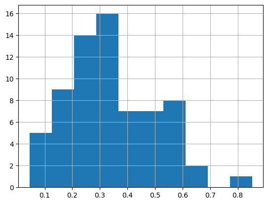

### Train/valid/test split

#### Using Kennard-Stone

``` python
df.lab.unique()
```

    array(['agrocares', 'argonne', 'csu-il', 'eth-alpha-1', 'eth-alpha-2',
           'eth-vertex', 'iaea-aug2022', 'kssl', 'landcare', 'lesotho', 'msu',
           'osu', 'rothamsted', 'scion', 'ughent', 'uiuc', 'usp',
           'uwisc-fine', 'woodwell-alpha', 'woodwell-vertex'], dtype=object)

``` python
df_selected = df[df.lab == 'kssl']
```

``` python
len(df_selected)
```

    69

``` python
from uhina.loading import LoaderFactory

src = Path.home() / 'pro/data/woodwell-ringtrial/drive-download-20231013T123706Z-001'
loader = LoaderFactory.get_loader(src, 'ringtrial')
data = loader.load_data(analytes='potassium_cmolkg')
print(f'X shape: {data.X.shape}')
```

    X shape: (1400, 1676)

``` python
# 44 is missing
indices_df = [name.split('.png')[0] for name in df_selected.fname]; indices_df
```

    ['kssl-rt-01',
     'kssl-rt-02',
     'kssl-rt-03',
     'kssl-rt-04',
     'kssl-rt-05',
     'kssl-rt-06',
     'kssl-rt-07',
     'kssl-rt-08',
     'kssl-rt-09',
     'kssl-rt-10',
     'kssl-rt-11',
     'kssl-rt-12',
     'kssl-rt-13',
     'kssl-rt-14',
     'kssl-rt-15',
     'kssl-rt-16',
     'kssl-rt-17',
     'kssl-rt-18',
     'kssl-rt-19',
     'kssl-rt-20',
     'kssl-rt-21',
     'kssl-rt-22',
     'kssl-rt-23',
     'kssl-rt-24',
     'kssl-rt-25',
     'kssl-rt-26',
     'kssl-rt-27',
     'kssl-rt-28',
     'kssl-rt-29',
     'kssl-rt-30',
     'kssl-rt-31',
     'kssl-rt-32',
     'kssl-rt-33',
     'kssl-rt-34',
     'kssl-rt-35',
     'kssl-rt-36',
     'kssl-rt-37',
     'kssl-rt-38',
     'kssl-rt-39',
     'kssl-rt-40',
     'kssl-rt-41',
     'kssl-rt-42',
     'kssl-rt-43',
     'kssl-rt-45',
     'kssl-rt-46',
     'kssl-rt-47',
     'kssl-rt-48',
     'kssl-rt-49',
     'kssl-rt-50',
     'kssl-rt-51',
     'kssl-rt-52',
     'kssl-rt-53',
     'kssl-rt-54',
     'kssl-rt-55',
     'kssl-rt-56',
     'kssl-rt-57',
     'kssl-rt-58',
     'kssl-rt-59',
     'kssl-rt-60',
     'kssl-rt-61',
     'kssl-rt-62',
     'kssl-rt-63',
     'kssl-rt-64',
     'kssl-rt-65',
     'kssl-rt-66',
     'kssl-rt-67',
     'kssl-rt-68',
     'kssl-rt-69',
     'kssl-rt-70']

``` python
mask = np.isin(data.sample_indices, np.array(indices_df))
```

``` python
data.sample_indices[mask]
```

    array(['kssl-rt-01', 'kssl-rt-02', 'kssl-rt-03', 'kssl-rt-04',
           'kssl-rt-05', 'kssl-rt-06', 'kssl-rt-07', 'kssl-rt-08',
           'kssl-rt-09', 'kssl-rt-10', 'kssl-rt-11', 'kssl-rt-12',
           'kssl-rt-13', 'kssl-rt-14', 'kssl-rt-15', 'kssl-rt-16',
           'kssl-rt-17', 'kssl-rt-18', 'kssl-rt-19', 'kssl-rt-20',
           'kssl-rt-21', 'kssl-rt-22', 'kssl-rt-23', 'kssl-rt-24',
           'kssl-rt-25', 'kssl-rt-26', 'kssl-rt-27', 'kssl-rt-28',
           'kssl-rt-29', 'kssl-rt-30', 'kssl-rt-31', 'kssl-rt-32',
           'kssl-rt-33', 'kssl-rt-34', 'kssl-rt-35', 'kssl-rt-36',
           'kssl-rt-37', 'kssl-rt-38', 'kssl-rt-39', 'kssl-rt-40',
           'kssl-rt-41', 'kssl-rt-42', 'kssl-rt-43', 'kssl-rt-45',
           'kssl-rt-46', 'kssl-rt-47', 'kssl-rt-48', 'kssl-rt-49',
           'kssl-rt-50', 'kssl-rt-51', 'kssl-rt-52', 'kssl-rt-53',
           'kssl-rt-54', 'kssl-rt-55', 'kssl-rt-56', 'kssl-rt-57',
           'kssl-rt-58', 'kssl-rt-59', 'kssl-rt-60', 'kssl-rt-61',
           'kssl-rt-62', 'kssl-rt-63', 'kssl-rt-64', 'kssl-rt-65',
           'kssl-rt-66', 'kssl-rt-67', 'kssl-rt-68', 'kssl-rt-69',
           'kssl-rt-70'], dtype=object)

``` python
data.sample_indices[mask]
```

    array(['kssl-rt-01', 'kssl-rt-02', 'kssl-rt-03', 'kssl-rt-04',
           'kssl-rt-05', 'kssl-rt-06', 'kssl-rt-07', 'kssl-rt-08',
           'kssl-rt-09', 'kssl-rt-10', 'kssl-rt-11', 'kssl-rt-12',
           'kssl-rt-13', 'kssl-rt-14', 'kssl-rt-15', 'kssl-rt-16',
           'kssl-rt-17', 'kssl-rt-18', 'kssl-rt-19', 'kssl-rt-20',
           'kssl-rt-21', 'kssl-rt-22', 'kssl-rt-23', 'kssl-rt-24',
           'kssl-rt-25', 'kssl-rt-26', 'kssl-rt-27', 'kssl-rt-28',
           'kssl-rt-29', 'kssl-rt-30', 'kssl-rt-31', 'kssl-rt-32',
           'kssl-rt-33', 'kssl-rt-34', 'kssl-rt-35', 'kssl-rt-36',
           'kssl-rt-37', 'kssl-rt-38', 'kssl-rt-39', 'kssl-rt-40',
           'kssl-rt-41', 'kssl-rt-42', 'kssl-rt-43', 'kssl-rt-45',
           'kssl-rt-46', 'kssl-rt-47', 'kssl-rt-48', 'kssl-rt-49',
           'kssl-rt-50', 'kssl-rt-51', 'kssl-rt-52', 'kssl-rt-53',
           'kssl-rt-54', 'kssl-rt-55', 'kssl-rt-56', 'kssl-rt-57',
           'kssl-rt-58', 'kssl-rt-59', 'kssl-rt-60', 'kssl-rt-61',
           'kssl-rt-62', 'kssl-rt-63', 'kssl-rt-64', 'kssl-rt-65',
           'kssl-rt-66', 'kssl-rt-67', 'kssl-rt-68', 'kssl-rt-69',
           'kssl-rt-70'], dtype=object)

``` python
df_selected.reset_index(inplace=True, drop=True)
```

``` python
data.sample_indices[mask]
```

    array(['kssl-rt-01', 'kssl-rt-02', 'kssl-rt-03', 'kssl-rt-04',
           'kssl-rt-05', 'kssl-rt-06', 'kssl-rt-07', 'kssl-rt-08',
           'kssl-rt-09', 'kssl-rt-10', 'kssl-rt-11', 'kssl-rt-12',
           'kssl-rt-13', 'kssl-rt-14', 'kssl-rt-15', 'kssl-rt-16',
           'kssl-rt-17', 'kssl-rt-18', 'kssl-rt-19', 'kssl-rt-20',
           'kssl-rt-21', 'kssl-rt-22', 'kssl-rt-23', 'kssl-rt-24',
           'kssl-rt-25', 'kssl-rt-26', 'kssl-rt-27', 'kssl-rt-28',
           'kssl-rt-29', 'kssl-rt-30', 'kssl-rt-31', 'kssl-rt-32',
           'kssl-rt-33', 'kssl-rt-34', 'kssl-rt-35', 'kssl-rt-36',
           'kssl-rt-37', 'kssl-rt-38', 'kssl-rt-39', 'kssl-rt-40',
           'kssl-rt-41', 'kssl-rt-42', 'kssl-rt-43', 'kssl-rt-45',
           'kssl-rt-46', 'kssl-rt-47', 'kssl-rt-48', 'kssl-rt-49',
           'kssl-rt-50', 'kssl-rt-51', 'kssl-rt-52', 'kssl-rt-53',
           'kssl-rt-54', 'kssl-rt-55', 'kssl-rt-56', 'kssl-rt-57',
           'kssl-rt-58', 'kssl-rt-59', 'kssl-rt-60', 'kssl-rt-61',
           'kssl-rt-62', 'kssl-rt-63', 'kssl-rt-64', 'kssl-rt-65',
           'kssl-rt-66', 'kssl-rt-67', 'kssl-rt-68', 'kssl-rt-69',
           'kssl-rt-70'], dtype=object)

``` python
# mask = np.char.find(data.sample_indices.astype(str), 'kssl') != -1
X_lab, y_lab = data.X[mask], np.log1p(data.y[mask])
```

``` python
data.sample_indices[mask]
```

    array(['kssl-rt-01', 'kssl-rt-02', 'kssl-rt-03', 'kssl-rt-04',
           'kssl-rt-05', 'kssl-rt-06', 'kssl-rt-07', 'kssl-rt-08',
           'kssl-rt-09', 'kssl-rt-10', 'kssl-rt-11', 'kssl-rt-12',
           'kssl-rt-13', 'kssl-rt-14', 'kssl-rt-15', 'kssl-rt-16',
           'kssl-rt-17', 'kssl-rt-18', 'kssl-rt-19', 'kssl-rt-20',
           'kssl-rt-21', 'kssl-rt-22', 'kssl-rt-23', 'kssl-rt-24',
           'kssl-rt-25', 'kssl-rt-26', 'kssl-rt-27', 'kssl-rt-28',
           'kssl-rt-29', 'kssl-rt-30', 'kssl-rt-31', 'kssl-rt-32',
           'kssl-rt-33', 'kssl-rt-34', 'kssl-rt-35', 'kssl-rt-36',
           'kssl-rt-37', 'kssl-rt-38', 'kssl-rt-39', 'kssl-rt-40',
           'kssl-rt-41', 'kssl-rt-42', 'kssl-rt-43', 'kssl-rt-45',
           'kssl-rt-46', 'kssl-rt-47', 'kssl-rt-48', 'kssl-rt-49',
           'kssl-rt-50', 'kssl-rt-51', 'kssl-rt-52', 'kssl-rt-53',
           'kssl-rt-54', 'kssl-rt-55', 'kssl-rt-56', 'kssl-rt-57',
           'kssl-rt-58', 'kssl-rt-59', 'kssl-rt-60', 'kssl-rt-61',
           'kssl-rt-62', 'kssl-rt-63', 'kssl-rt-64', 'kssl-rt-65',
           'kssl-rt-66', 'kssl-rt-67', 'kssl-rt-68', 'kssl-rt-69',
           'kssl-rt-70'], dtype=object)

``` python
df_selected
```

<div>
<style scoped>
    .dataframe tbody tr th:only-of-type {
        vertical-align: middle;
    }
&#10;    .dataframe tbody tr th {
        vertical-align: top;
    }
&#10;    .dataframe thead th {
        text-align: right;
    }
</style>

<table class="dataframe" data-quarto-postprocess="true" data-border="1">
<thead>
<tr class="header" style="text-align: right;">
<th data-quarto-table-cell-role="th"></th>
<th data-quarto-table-cell-role="th">fname</th>
<th data-quarto-table-cell-role="th">potassium_cmolkg</th>
<th data-quarto-table-cell-role="th">lab</th>
</tr>
</thead>
<tbody>
<tr class="odd">
<td data-quarto-table-cell-role="th">0</td>
<td>kssl-rt-01.png</td>
<td>0.238276</td>
<td>kssl</td>
</tr>
<tr class="even">
<td data-quarto-table-cell-role="th">1</td>
<td>kssl-rt-02.png</td>
<td>0.209848</td>
<td>kssl</td>
</tr>
<tr class="odd">
<td data-quarto-table-cell-role="th">2</td>
<td>kssl-rt-03.png</td>
<td>0.255487</td>
<td>kssl</td>
</tr>
<tr class="even">
<td data-quarto-table-cell-role="th">3</td>
<td>kssl-rt-04.png</td>
<td>0.404965</td>
<td>kssl</td>
</tr>
<tr class="odd">
<td data-quarto-table-cell-role="th">4</td>
<td>kssl-rt-05.png</td>
<td>0.469860</td>
<td>kssl</td>
</tr>
<tr class="even">
<td data-quarto-table-cell-role="th">5</td>
<td>kssl-rt-06.png</td>
<td>0.495470</td>
<td>kssl</td>
</tr>
<tr class="odd">
<td data-quarto-table-cell-role="th">6</td>
<td>kssl-rt-07.png</td>
<td>0.393716</td>
<td>kssl</td>
</tr>
<tr class="even">
<td data-quarto-table-cell-role="th">7</td>
<td>kssl-rt-08.png</td>
<td>0.106628</td>
<td>kssl</td>
</tr>
<tr class="odd">
<td data-quarto-table-cell-role="th">8</td>
<td>kssl-rt-09.png</td>
<td>0.976900</td>
<td>kssl</td>
</tr>
<tr class="even">
<td data-quarto-table-cell-role="th">9</td>
<td>kssl-rt-10.png</td>
<td>0.315519</td>
<td>kssl</td>
</tr>
<tr class="odd">
<td data-quarto-table-cell-role="th">10</td>
<td>kssl-rt-11.png</td>
<td>0.335250</td>
<td>kssl</td>
</tr>
<tr class="even">
<td data-quarto-table-cell-role="th">11</td>
<td>kssl-rt-12.png</td>
<td>0.292252</td>
<td>kssl</td>
</tr>
<tr class="odd">
<td data-quarto-table-cell-role="th">12</td>
<td>kssl-rt-13.png</td>
<td>0.446620</td>
<td>kssl</td>
</tr>
<tr class="even">
<td data-quarto-table-cell-role="th">13</td>
<td>kssl-rt-14.png</td>
<td>0.210804</td>
<td>kssl</td>
</tr>
<tr class="odd">
<td data-quarto-table-cell-role="th">14</td>
<td>kssl-rt-15.png</td>
<td>0.482117</td>
<td>kssl</td>
</tr>
<tr class="even">
<td data-quarto-table-cell-role="th">15</td>
<td>kssl-rt-16.png</td>
<td>0.662054</td>
<td>kssl</td>
</tr>
<tr class="odd">
<td data-quarto-table-cell-role="th">16</td>
<td>kssl-rt-17.png</td>
<td>0.595782</td>
<td>kssl</td>
</tr>
<tr class="even">
<td data-quarto-table-cell-role="th">17</td>
<td>kssl-rt-18.png</td>
<td>0.360761</td>
<td>kssl</td>
</tr>
<tr class="odd">
<td data-quarto-table-cell-role="th">18</td>
<td>kssl-rt-19.png</td>
<td>0.340229</td>
<td>kssl</td>
</tr>
<tr class="even">
<td data-quarto-table-cell-role="th">19</td>
<td>kssl-rt-20.png</td>
<td>0.342816</td>
<td>kssl</td>
</tr>
<tr class="odd">
<td data-quarto-table-cell-role="th">20</td>
<td>kssl-rt-21.png</td>
<td>0.398024</td>
<td>kssl</td>
</tr>
<tr class="even">
<td data-quarto-table-cell-role="th">21</td>
<td>kssl-rt-22.png</td>
<td>0.082409</td>
<td>kssl</td>
</tr>
<tr class="odd">
<td data-quarto-table-cell-role="th">22</td>
<td>kssl-rt-23.png</td>
<td>0.312743</td>
<td>kssl</td>
</tr>
<tr class="even">
<td data-quarto-table-cell-role="th">23</td>
<td>kssl-rt-24.png</td>
<td>0.173592</td>
<td>kssl</td>
</tr>
<tr class="odd">
<td data-quarto-table-cell-role="th">24</td>
<td>kssl-rt-25.png</td>
<td>0.171825</td>
<td>kssl</td>
</tr>
<tr class="even">
<td data-quarto-table-cell-role="th">25</td>
<td>kssl-rt-26.png</td>
<td>0.155182</td>
<td>kssl</td>
</tr>
<tr class="odd">
<td data-quarto-table-cell-role="th">26</td>
<td>kssl-rt-27.png</td>
<td>0.147696</td>
<td>kssl</td>
</tr>
<tr class="even">
<td data-quarto-table-cell-role="th">27</td>
<td>kssl-rt-28.png</td>
<td>0.676835</td>
<td>kssl</td>
</tr>
<tr class="odd">
<td data-quarto-table-cell-role="th">28</td>
<td>kssl-rt-29.png</td>
<td>0.306528</td>
<td>kssl</td>
</tr>
<tr class="even">
<td data-quarto-table-cell-role="th">29</td>
<td>kssl-rt-30.png</td>
<td>0.351649</td>
<td>kssl</td>
</tr>
<tr class="odd">
<td data-quarto-table-cell-role="th">30</td>
<td>kssl-rt-31.png</td>
<td>0.358387</td>
<td>kssl</td>
</tr>
<tr class="even">
<td data-quarto-table-cell-role="th">31</td>
<td>kssl-rt-32.png</td>
<td>0.338556</td>
<td>kssl</td>
</tr>
<tr class="odd">
<td data-quarto-table-cell-role="th">32</td>
<td>kssl-rt-33.png</td>
<td>0.452482</td>
<td>kssl</td>
</tr>
<tr class="even">
<td data-quarto-table-cell-role="th">33</td>
<td>kssl-rt-34.png</td>
<td>0.105971</td>
<td>kssl</td>
</tr>
<tr class="odd">
<td data-quarto-table-cell-role="th">34</td>
<td>kssl-rt-35.png</td>
<td>0.085691</td>
<td>kssl</td>
</tr>
<tr class="even">
<td data-quarto-table-cell-role="th">35</td>
<td>kssl-rt-36.png</td>
<td>0.152824</td>
<td>kssl</td>
</tr>
<tr class="odd">
<td data-quarto-table-cell-role="th">36</td>
<td>kssl-rt-37.png</td>
<td>0.134627</td>
<td>kssl</td>
</tr>
<tr class="even">
<td data-quarto-table-cell-role="th">37</td>
<td>kssl-rt-38.png</td>
<td>0.046282</td>
<td>kssl</td>
</tr>
<tr class="odd">
<td data-quarto-table-cell-role="th">38</td>
<td>kssl-rt-39.png</td>
<td>0.396687</td>
<td>kssl</td>
</tr>
<tr class="even">
<td data-quarto-table-cell-role="th">39</td>
<td>kssl-rt-40.png</td>
<td>0.673883</td>
<td>kssl</td>
</tr>
<tr class="odd">
<td data-quarto-table-cell-role="th">40</td>
<td>kssl-rt-41.png</td>
<td>0.701621</td>
<td>kssl</td>
</tr>
<tr class="even">
<td data-quarto-table-cell-role="th">41</td>
<td>kssl-rt-42.png</td>
<td>0.420853</td>
<td>kssl</td>
</tr>
<tr class="odd">
<td data-quarto-table-cell-role="th">42</td>
<td>kssl-rt-43.png</td>
<td>0.262710</td>
<td>kssl</td>
</tr>
<tr class="even">
<td data-quarto-table-cell-role="th">43</td>
<td>kssl-rt-45.png</td>
<td>0.311652</td>
<td>kssl</td>
</tr>
<tr class="odd">
<td data-quarto-table-cell-role="th">44</td>
<td>kssl-rt-46.png</td>
<td>0.359945</td>
<td>kssl</td>
</tr>
<tr class="even">
<td data-quarto-table-cell-role="th">45</td>
<td>kssl-rt-47.png</td>
<td>0.292476</td>
<td>kssl</td>
</tr>
<tr class="odd">
<td data-quarto-table-cell-role="th">46</td>
<td>kssl-rt-48.png</td>
<td>0.724215</td>
<td>kssl</td>
</tr>
<tr class="even">
<td data-quarto-table-cell-role="th">47</td>
<td>kssl-rt-49.png</td>
<td>0.442131</td>
<td>kssl</td>
</tr>
<tr class="odd">
<td data-quarto-table-cell-role="th">48</td>
<td>kssl-rt-50.png</td>
<td>0.720475</td>
<td>kssl</td>
</tr>
<tr class="even">
<td data-quarto-table-cell-role="th">49</td>
<td>kssl-rt-51.png</td>
<td>0.728205</td>
<td>kssl</td>
</tr>
<tr class="odd">
<td data-quarto-table-cell-role="th">50</td>
<td>kssl-rt-52.png</td>
<td>0.328282</td>
<td>kssl</td>
</tr>
<tr class="even">
<td data-quarto-table-cell-role="th">51</td>
<td>kssl-rt-53.png</td>
<td>0.400788</td>
<td>kssl</td>
</tr>
<tr class="odd">
<td data-quarto-table-cell-role="th">52</td>
<td>kssl-rt-54.png</td>
<td>0.328678</td>
<td>kssl</td>
</tr>
<tr class="even">
<td data-quarto-table-cell-role="th">53</td>
<td>kssl-rt-55.png</td>
<td>0.358884</td>
<td>kssl</td>
</tr>
<tr class="odd">
<td data-quarto-table-cell-role="th">54</td>
<td>kssl-rt-56.png</td>
<td>0.718293</td>
<td>kssl</td>
</tr>
<tr class="even">
<td data-quarto-table-cell-role="th">55</td>
<td>kssl-rt-57.png</td>
<td>0.731367</td>
<td>kssl</td>
</tr>
<tr class="odd">
<td data-quarto-table-cell-role="th">56</td>
<td>kssl-rt-58.png</td>
<td>0.735776</td>
<td>kssl</td>
</tr>
<tr class="even">
<td data-quarto-table-cell-role="th">57</td>
<td>kssl-rt-59.png</td>
<td>0.463199</td>
<td>kssl</td>
</tr>
<tr class="odd">
<td data-quarto-table-cell-role="th">58</td>
<td>kssl-rt-60.png</td>
<td>0.588014</td>
<td>kssl</td>
</tr>
<tr class="even">
<td data-quarto-table-cell-role="th">59</td>
<td>kssl-rt-61.png</td>
<td>0.461032</td>
<td>kssl</td>
</tr>
<tr class="odd">
<td data-quarto-table-cell-role="th">60</td>
<td>kssl-rt-62.png</td>
<td>0.249902</td>
<td>kssl</td>
</tr>
<tr class="even">
<td data-quarto-table-cell-role="th">61</td>
<td>kssl-rt-63.png</td>
<td>0.249902</td>
<td>kssl</td>
</tr>
<tr class="odd">
<td data-quarto-table-cell-role="th">62</td>
<td>kssl-rt-64.png</td>
<td>0.140544</td>
<td>kssl</td>
</tr>
<tr class="even">
<td data-quarto-table-cell-role="th">63</td>
<td>kssl-rt-65.png</td>
<td>0.253882</td>
<td>kssl</td>
</tr>
<tr class="odd">
<td data-quarto-table-cell-role="th">64</td>
<td>kssl-rt-66.png</td>
<td>1.345212</td>
<td>kssl</td>
</tr>
<tr class="even">
<td data-quarto-table-cell-role="th">65</td>
<td>kssl-rt-67.png</td>
<td>0.857869</td>
<td>kssl</td>
</tr>
<tr class="odd">
<td data-quarto-table-cell-role="th">66</td>
<td>kssl-rt-68.png</td>
<td>0.627098</td>
<td>kssl</td>
</tr>
<tr class="even">
<td data-quarto-table-cell-role="th">67</td>
<td>kssl-rt-69.png</td>
<td>0.681596</td>
<td>kssl</td>
</tr>
<tr class="odd">
<td data-quarto-table-cell-role="th">68</td>
<td>kssl-rt-70.png</td>
<td>0.735732</td>
<td>kssl</td>
</tr>
</tbody>
</table>

</div>

``` python
X_lab
```

    array([[1.2708 , 1.26602, 1.26191, ..., 0.15597, 0.15574, 0.15549],
           [1.68078, 1.69329, 1.70438, ..., 0.22922, 0.22891, 0.22859],
           [1.69767, 1.69935, 1.70112, ..., 0.38133, 0.38056, 0.3798 ],
           ...,
           [1.65483, 1.65777, 1.6626 , ..., 0.22134, 0.22078, 0.2202 ],
           [1.86684, 1.86213, 1.85727, ..., 0.14837, 0.14783, 0.14725],
           [1.62302, 1.62296, 1.62328, ..., 0.2393 , 0.23909, 0.23888]])

``` python
from uhina.preprocessing import SNV, TakeDerivative
from sklearn.pipeline import Pipeline

pipe = Pipeline([
    ('SNV', SNV()),
    ('Derivative', TakeDerivative())
])

X_lab_trans = pipe.fit_transform(X_lab)
```

``` python
df_selected
```

<div>
<style scoped>
    .dataframe tbody tr th:only-of-type {
        vertical-align: middle;
    }
&#10;    .dataframe tbody tr th {
        vertical-align: top;
    }
&#10;    .dataframe thead th {
        text-align: right;
    }
</style>

<table class="dataframe" data-quarto-postprocess="true" data-border="1">
<thead>
<tr class="header" style="text-align: right;">
<th data-quarto-table-cell-role="th"></th>
<th data-quarto-table-cell-role="th">fname</th>
<th data-quarto-table-cell-role="th">potassium_cmolkg</th>
<th data-quarto-table-cell-role="th">lab</th>
</tr>
</thead>
<tbody>
<tr class="odd">
<td data-quarto-table-cell-role="th">0</td>
<td>kssl-rt-01.png</td>
<td>0.238276</td>
<td>kssl</td>
</tr>
<tr class="even">
<td data-quarto-table-cell-role="th">1</td>
<td>kssl-rt-02.png</td>
<td>0.209848</td>
<td>kssl</td>
</tr>
<tr class="odd">
<td data-quarto-table-cell-role="th">2</td>
<td>kssl-rt-03.png</td>
<td>0.255487</td>
<td>kssl</td>
</tr>
<tr class="even">
<td data-quarto-table-cell-role="th">3</td>
<td>kssl-rt-04.png</td>
<td>0.404965</td>
<td>kssl</td>
</tr>
<tr class="odd">
<td data-quarto-table-cell-role="th">4</td>
<td>kssl-rt-05.png</td>
<td>0.469860</td>
<td>kssl</td>
</tr>
<tr class="even">
<td data-quarto-table-cell-role="th">5</td>
<td>kssl-rt-06.png</td>
<td>0.495470</td>
<td>kssl</td>
</tr>
<tr class="odd">
<td data-quarto-table-cell-role="th">6</td>
<td>kssl-rt-07.png</td>
<td>0.393716</td>
<td>kssl</td>
</tr>
<tr class="even">
<td data-quarto-table-cell-role="th">7</td>
<td>kssl-rt-08.png</td>
<td>0.106628</td>
<td>kssl</td>
</tr>
<tr class="odd">
<td data-quarto-table-cell-role="th">8</td>
<td>kssl-rt-09.png</td>
<td>0.976900</td>
<td>kssl</td>
</tr>
<tr class="even">
<td data-quarto-table-cell-role="th">9</td>
<td>kssl-rt-10.png</td>
<td>0.315519</td>
<td>kssl</td>
</tr>
<tr class="odd">
<td data-quarto-table-cell-role="th">10</td>
<td>kssl-rt-11.png</td>
<td>0.335250</td>
<td>kssl</td>
</tr>
<tr class="even">
<td data-quarto-table-cell-role="th">11</td>
<td>kssl-rt-12.png</td>
<td>0.292252</td>
<td>kssl</td>
</tr>
<tr class="odd">
<td data-quarto-table-cell-role="th">12</td>
<td>kssl-rt-13.png</td>
<td>0.446620</td>
<td>kssl</td>
</tr>
<tr class="even">
<td data-quarto-table-cell-role="th">13</td>
<td>kssl-rt-14.png</td>
<td>0.210804</td>
<td>kssl</td>
</tr>
<tr class="odd">
<td data-quarto-table-cell-role="th">14</td>
<td>kssl-rt-15.png</td>
<td>0.482117</td>
<td>kssl</td>
</tr>
<tr class="even">
<td data-quarto-table-cell-role="th">15</td>
<td>kssl-rt-16.png</td>
<td>0.662054</td>
<td>kssl</td>
</tr>
<tr class="odd">
<td data-quarto-table-cell-role="th">16</td>
<td>kssl-rt-17.png</td>
<td>0.595782</td>
<td>kssl</td>
</tr>
<tr class="even">
<td data-quarto-table-cell-role="th">17</td>
<td>kssl-rt-18.png</td>
<td>0.360761</td>
<td>kssl</td>
</tr>
<tr class="odd">
<td data-quarto-table-cell-role="th">18</td>
<td>kssl-rt-19.png</td>
<td>0.340229</td>
<td>kssl</td>
</tr>
<tr class="even">
<td data-quarto-table-cell-role="th">19</td>
<td>kssl-rt-20.png</td>
<td>0.342816</td>
<td>kssl</td>
</tr>
<tr class="odd">
<td data-quarto-table-cell-role="th">20</td>
<td>kssl-rt-21.png</td>
<td>0.398024</td>
<td>kssl</td>
</tr>
<tr class="even">
<td data-quarto-table-cell-role="th">21</td>
<td>kssl-rt-22.png</td>
<td>0.082409</td>
<td>kssl</td>
</tr>
<tr class="odd">
<td data-quarto-table-cell-role="th">22</td>
<td>kssl-rt-23.png</td>
<td>0.312743</td>
<td>kssl</td>
</tr>
<tr class="even">
<td data-quarto-table-cell-role="th">23</td>
<td>kssl-rt-24.png</td>
<td>0.173592</td>
<td>kssl</td>
</tr>
<tr class="odd">
<td data-quarto-table-cell-role="th">24</td>
<td>kssl-rt-25.png</td>
<td>0.171825</td>
<td>kssl</td>
</tr>
<tr class="even">
<td data-quarto-table-cell-role="th">25</td>
<td>kssl-rt-26.png</td>
<td>0.155182</td>
<td>kssl</td>
</tr>
<tr class="odd">
<td data-quarto-table-cell-role="th">26</td>
<td>kssl-rt-27.png</td>
<td>0.147696</td>
<td>kssl</td>
</tr>
<tr class="even">
<td data-quarto-table-cell-role="th">27</td>
<td>kssl-rt-28.png</td>
<td>0.676835</td>
<td>kssl</td>
</tr>
<tr class="odd">
<td data-quarto-table-cell-role="th">28</td>
<td>kssl-rt-29.png</td>
<td>0.306528</td>
<td>kssl</td>
</tr>
<tr class="even">
<td data-quarto-table-cell-role="th">29</td>
<td>kssl-rt-30.png</td>
<td>0.351649</td>
<td>kssl</td>
</tr>
<tr class="odd">
<td data-quarto-table-cell-role="th">30</td>
<td>kssl-rt-31.png</td>
<td>0.358387</td>
<td>kssl</td>
</tr>
<tr class="even">
<td data-quarto-table-cell-role="th">31</td>
<td>kssl-rt-32.png</td>
<td>0.338556</td>
<td>kssl</td>
</tr>
<tr class="odd">
<td data-quarto-table-cell-role="th">32</td>
<td>kssl-rt-33.png</td>
<td>0.452482</td>
<td>kssl</td>
</tr>
<tr class="even">
<td data-quarto-table-cell-role="th">33</td>
<td>kssl-rt-34.png</td>
<td>0.105971</td>
<td>kssl</td>
</tr>
<tr class="odd">
<td data-quarto-table-cell-role="th">34</td>
<td>kssl-rt-35.png</td>
<td>0.085691</td>
<td>kssl</td>
</tr>
<tr class="even">
<td data-quarto-table-cell-role="th">35</td>
<td>kssl-rt-36.png</td>
<td>0.152824</td>
<td>kssl</td>
</tr>
<tr class="odd">
<td data-quarto-table-cell-role="th">36</td>
<td>kssl-rt-37.png</td>
<td>0.134627</td>
<td>kssl</td>
</tr>
<tr class="even">
<td data-quarto-table-cell-role="th">37</td>
<td>kssl-rt-38.png</td>
<td>0.046282</td>
<td>kssl</td>
</tr>
<tr class="odd">
<td data-quarto-table-cell-role="th">38</td>
<td>kssl-rt-39.png</td>
<td>0.396687</td>
<td>kssl</td>
</tr>
<tr class="even">
<td data-quarto-table-cell-role="th">39</td>
<td>kssl-rt-40.png</td>
<td>0.673883</td>
<td>kssl</td>
</tr>
<tr class="odd">
<td data-quarto-table-cell-role="th">40</td>
<td>kssl-rt-41.png</td>
<td>0.701621</td>
<td>kssl</td>
</tr>
<tr class="even">
<td data-quarto-table-cell-role="th">41</td>
<td>kssl-rt-42.png</td>
<td>0.420853</td>
<td>kssl</td>
</tr>
<tr class="odd">
<td data-quarto-table-cell-role="th">42</td>
<td>kssl-rt-43.png</td>
<td>0.262710</td>
<td>kssl</td>
</tr>
<tr class="even">
<td data-quarto-table-cell-role="th">43</td>
<td>kssl-rt-45.png</td>
<td>0.311652</td>
<td>kssl</td>
</tr>
<tr class="odd">
<td data-quarto-table-cell-role="th">44</td>
<td>kssl-rt-46.png</td>
<td>0.359945</td>
<td>kssl</td>
</tr>
<tr class="even">
<td data-quarto-table-cell-role="th">45</td>
<td>kssl-rt-47.png</td>
<td>0.292476</td>
<td>kssl</td>
</tr>
<tr class="odd">
<td data-quarto-table-cell-role="th">46</td>
<td>kssl-rt-48.png</td>
<td>0.724215</td>
<td>kssl</td>
</tr>
<tr class="even">
<td data-quarto-table-cell-role="th">47</td>
<td>kssl-rt-49.png</td>
<td>0.442131</td>
<td>kssl</td>
</tr>
<tr class="odd">
<td data-quarto-table-cell-role="th">48</td>
<td>kssl-rt-50.png</td>
<td>0.720475</td>
<td>kssl</td>
</tr>
<tr class="even">
<td data-quarto-table-cell-role="th">49</td>
<td>kssl-rt-51.png</td>
<td>0.728205</td>
<td>kssl</td>
</tr>
<tr class="odd">
<td data-quarto-table-cell-role="th">50</td>
<td>kssl-rt-52.png</td>
<td>0.328282</td>
<td>kssl</td>
</tr>
<tr class="even">
<td data-quarto-table-cell-role="th">51</td>
<td>kssl-rt-53.png</td>
<td>0.400788</td>
<td>kssl</td>
</tr>
<tr class="odd">
<td data-quarto-table-cell-role="th">52</td>
<td>kssl-rt-54.png</td>
<td>0.328678</td>
<td>kssl</td>
</tr>
<tr class="even">
<td data-quarto-table-cell-role="th">53</td>
<td>kssl-rt-55.png</td>
<td>0.358884</td>
<td>kssl</td>
</tr>
<tr class="odd">
<td data-quarto-table-cell-role="th">54</td>
<td>kssl-rt-56.png</td>
<td>0.718293</td>
<td>kssl</td>
</tr>
<tr class="even">
<td data-quarto-table-cell-role="th">55</td>
<td>kssl-rt-57.png</td>
<td>0.731367</td>
<td>kssl</td>
</tr>
<tr class="odd">
<td data-quarto-table-cell-role="th">56</td>
<td>kssl-rt-58.png</td>
<td>0.735776</td>
<td>kssl</td>
</tr>
<tr class="even">
<td data-quarto-table-cell-role="th">57</td>
<td>kssl-rt-59.png</td>
<td>0.463199</td>
<td>kssl</td>
</tr>
<tr class="odd">
<td data-quarto-table-cell-role="th">58</td>
<td>kssl-rt-60.png</td>
<td>0.588014</td>
<td>kssl</td>
</tr>
<tr class="even">
<td data-quarto-table-cell-role="th">59</td>
<td>kssl-rt-61.png</td>
<td>0.461032</td>
<td>kssl</td>
</tr>
<tr class="odd">
<td data-quarto-table-cell-role="th">60</td>
<td>kssl-rt-62.png</td>
<td>0.249902</td>
<td>kssl</td>
</tr>
<tr class="even">
<td data-quarto-table-cell-role="th">61</td>
<td>kssl-rt-63.png</td>
<td>0.249902</td>
<td>kssl</td>
</tr>
<tr class="odd">
<td data-quarto-table-cell-role="th">62</td>
<td>kssl-rt-64.png</td>
<td>0.140544</td>
<td>kssl</td>
</tr>
<tr class="even">
<td data-quarto-table-cell-role="th">63</td>
<td>kssl-rt-65.png</td>
<td>0.253882</td>
<td>kssl</td>
</tr>
<tr class="odd">
<td data-quarto-table-cell-role="th">64</td>
<td>kssl-rt-66.png</td>
<td>1.345212</td>
<td>kssl</td>
</tr>
<tr class="even">
<td data-quarto-table-cell-role="th">65</td>
<td>kssl-rt-67.png</td>
<td>0.857869</td>
<td>kssl</td>
</tr>
<tr class="odd">
<td data-quarto-table-cell-role="th">66</td>
<td>kssl-rt-68.png</td>
<td>0.627098</td>
<td>kssl</td>
</tr>
<tr class="even">
<td data-quarto-table-cell-role="th">67</td>
<td>kssl-rt-69.png</td>
<td>0.681596</td>
<td>kssl</td>
</tr>
<tr class="odd">
<td data-quarto-table-cell-role="th">68</td>
<td>kssl-rt-70.png</td>
<td>0.735732</td>
<td>kssl</td>
</tr>
</tbody>
</table>

</div>

``` python
X_lab_trans.shape
```

    (69, 1676)

``` python
import kennard_stone as ks

# train_idx, valid_idx, X_train, X_valid = ks.train_test_split(np.array(range(len(X_lab_trans))).reshape(-1, 1), 
#                                                              X_lab_trans, test_size = 0.2)

# train_idx = train_idx.ravel()
# valid_idx = valid_idx.ravel()
X_train, X_valid, train_idx, valid_idx = ks.train_test_split(X_lab_trans, 
                                                             range(len(X_lab_trans)), 
                                                             test_size = 0.2)
```

    Calculating pairwise distances using scikit-learn.
    Calculating pairwise distances using scikit-learn.

``` python
valid_idx
```

    [35, 6, 24, 12, 3, 31, 30, 5, 2, 25, 49, 28, 44, 40]

``` python
df_selected.loc[train_idx, :]['potassium_cmolkg'].hist()
```

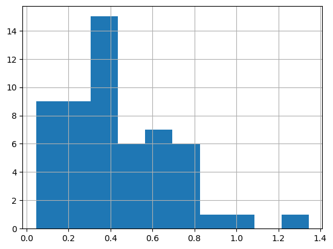

``` python
df_selected.loc[valid_idx, :]['potassium_cmolkg'].hist()
```

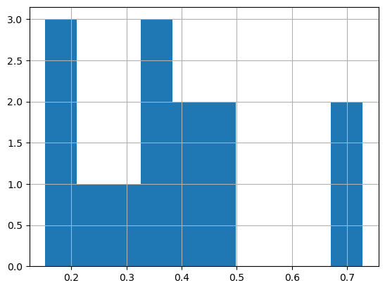

``` python
from sklearn.cross_decomposition import PLSRegression
scores = []
for n in range(1,20):
    pls = PLSRegression(n_components=n)
    pls.fit(X_lab_trans[train_idx], y_lab[train_idx])
    y_predicted = pls.predict(X_lab_trans[valid_idx])
    print(n, r2_score(y_predicted, y_lab[valid_idx]))
    scores.append(r2_score(y_predicted, y_lab[valid_idx]))

plt.plot(range(1, 20), scores)
```

    1 0.9167139331659132
    2 0.8169940843443368
    3 0.8201480463134329
    4 0.8330463354402591
    5 0.8336164418584839
    6 0.8066819139016866
    7 0.8063689082131712
    8 0.8476483270390328
    9 0.8442719648387733
    10 0.8550880328401899
    11 0.85550155049048
    12 0.8773457853046793
    13 0.8640833529184554
    14 0.8467865332449903
    15 0.8598890265246808
    16 0.860227416062531
    17 0.8890976617393181
    18 0.8975066928044428
    19 0.9022963785020354

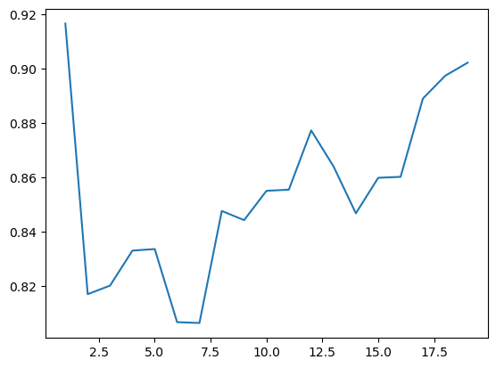

``` python
pls = PLSRegression(n_components=1)
pls.fit(X_lab_trans[train_idx], np.log1p(data.y[mask][train_idx]))
y_predicted = pls.predict(X_lab_trans[valid_idx])
```

``` python
x, y = y_predicted, np.log1p(data.y[mask][valid_idx])
plt.plot(x, y, '.')
# Add the diagonal line
min_val = min(y.min(), x.min())
max_val = max(y.max(), x.max())
plt.plot([min_val, max_val], [min_val, max_val], 'k--', lw=1)
```

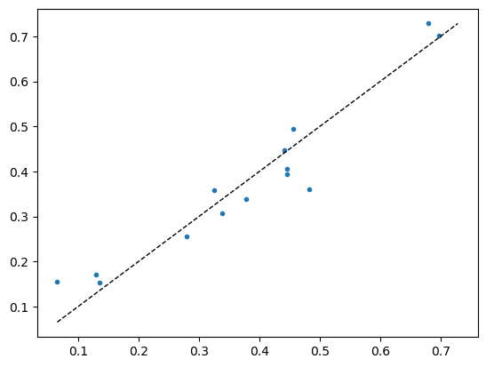

``` python
# dblock = DataBlock(blocks=(ImageBlock, RegressionBlock),
#                    get_x=ColReader(0, pref='../../_data/ringtrial-tfm/im/'),
#                    get_y=ColReader(1),
#                    splitter=RandomSplitter(valid_pct=0, seed=41),
#                    batch_tfms=[RatioResize(224)],
#                    item_tfms=[Quantize()])
```

``` python
# class ModelEvaluator:
#     def __init__(self, model_path, dblock):
#         self.learn = load_learner(model_path, cpu=True)
#         self.dblock = dblock

#     def evaluate(self, df_selected, batch_size=16, use_tta=False, tta_n=4):
#         dls = self.dblock.dataloaders(df_selected, bs=batch_size)
#         if use_tta:
#             val_preds, val_targets = self.learn.tta(dl=dls.train, n=tta_n)
#         else:
#             val_preds, val_targets = self.learn.get_preds(dl=dls.train)
        
#         r2 = r2_score(val_targets, val_preds)
#         return val_preds, val_targets, r2
```

``` python
# model_path = './models/650-4000-epoch-25-lr-3e-3.pkl'
# evaluator = ModelEvaluator(model_path, dblock)
```

``` python
len(train_idx), len(valid_idx)
```

    (55, 14)

``` python
def has_common_elements(list1, list2): return bool(set(list1) & set(list2))
fc.test_eq(has_common_elements(train_idx, valid_idx), False)
```

``` python
df_selected
```

<div>
<style scoped>
    .dataframe tbody tr th:only-of-type {
        vertical-align: middle;
    }
&#10;    .dataframe tbody tr th {
        vertical-align: top;
    }
&#10;    .dataframe thead th {
        text-align: right;
    }
</style>

<table class="dataframe" data-quarto-postprocess="true" data-border="1">
<thead>
<tr class="header" style="text-align: right;">
<th data-quarto-table-cell-role="th"></th>
<th data-quarto-table-cell-role="th">fname</th>
<th data-quarto-table-cell-role="th">potassium_cmolkg</th>
<th data-quarto-table-cell-role="th">lab</th>
</tr>
</thead>
<tbody>
<tr class="odd">
<td data-quarto-table-cell-role="th">0</td>
<td>eth-alpha-1-rt-01.png</td>
<td>0.238276</td>
<td>eth-alpha-1</td>
</tr>
<tr class="even">
<td data-quarto-table-cell-role="th">1</td>
<td>eth-alpha-1-rt-02.png</td>
<td>0.209848</td>
<td>eth-alpha-1</td>
</tr>
<tr class="odd">
<td data-quarto-table-cell-role="th">2</td>
<td>eth-alpha-1-rt-03.png</td>
<td>0.255487</td>
<td>eth-alpha-1</td>
</tr>
<tr class="even">
<td data-quarto-table-cell-role="th">3</td>
<td>eth-alpha-1-rt-04.png</td>
<td>0.404965</td>
<td>eth-alpha-1</td>
</tr>
<tr class="odd">
<td data-quarto-table-cell-role="th">4</td>
<td>eth-alpha-1-rt-05.png</td>
<td>0.469860</td>
<td>eth-alpha-1</td>
</tr>
<tr class="even">
<td data-quarto-table-cell-role="th">5</td>
<td>eth-alpha-1-rt-06.png</td>
<td>0.495470</td>
<td>eth-alpha-1</td>
</tr>
<tr class="odd">
<td data-quarto-table-cell-role="th">6</td>
<td>eth-alpha-1-rt-07.png</td>
<td>0.393716</td>
<td>eth-alpha-1</td>
</tr>
<tr class="even">
<td data-quarto-table-cell-role="th">7</td>
<td>eth-alpha-1-rt-08.png</td>
<td>0.106628</td>
<td>eth-alpha-1</td>
</tr>
<tr class="odd">
<td data-quarto-table-cell-role="th">8</td>
<td>eth-alpha-1-rt-09.png</td>
<td>0.976900</td>
<td>eth-alpha-1</td>
</tr>
<tr class="even">
<td data-quarto-table-cell-role="th">9</td>
<td>eth-alpha-1-rt-10.png</td>
<td>0.315519</td>
<td>eth-alpha-1</td>
</tr>
<tr class="odd">
<td data-quarto-table-cell-role="th">10</td>
<td>eth-alpha-1-rt-11.png</td>
<td>0.335250</td>
<td>eth-alpha-1</td>
</tr>
<tr class="even">
<td data-quarto-table-cell-role="th">11</td>
<td>eth-alpha-1-rt-12.png</td>
<td>0.292252</td>
<td>eth-alpha-1</td>
</tr>
<tr class="odd">
<td data-quarto-table-cell-role="th">12</td>
<td>eth-alpha-1-rt-13.png</td>
<td>0.446620</td>
<td>eth-alpha-1</td>
</tr>
<tr class="even">
<td data-quarto-table-cell-role="th">13</td>
<td>eth-alpha-1-rt-14.png</td>
<td>0.210804</td>
<td>eth-alpha-1</td>
</tr>
<tr class="odd">
<td data-quarto-table-cell-role="th">14</td>
<td>eth-alpha-1-rt-15.png</td>
<td>0.482117</td>
<td>eth-alpha-1</td>
</tr>
<tr class="even">
<td data-quarto-table-cell-role="th">15</td>
<td>eth-alpha-1-rt-16.png</td>
<td>0.662054</td>
<td>eth-alpha-1</td>
</tr>
<tr class="odd">
<td data-quarto-table-cell-role="th">16</td>
<td>eth-alpha-1-rt-17.png</td>
<td>0.595782</td>
<td>eth-alpha-1</td>
</tr>
<tr class="even">
<td data-quarto-table-cell-role="th">17</td>
<td>eth-alpha-1-rt-18.png</td>
<td>0.360761</td>
<td>eth-alpha-1</td>
</tr>
<tr class="odd">
<td data-quarto-table-cell-role="th">18</td>
<td>eth-alpha-1-rt-19.png</td>
<td>0.340229</td>
<td>eth-alpha-1</td>
</tr>
<tr class="even">
<td data-quarto-table-cell-role="th">19</td>
<td>eth-alpha-1-rt-20.png</td>
<td>0.342816</td>
<td>eth-alpha-1</td>
</tr>
<tr class="odd">
<td data-quarto-table-cell-role="th">20</td>
<td>eth-alpha-1-rt-21.png</td>
<td>0.398024</td>
<td>eth-alpha-1</td>
</tr>
<tr class="even">
<td data-quarto-table-cell-role="th">21</td>
<td>eth-alpha-1-rt-22.png</td>
<td>0.082409</td>
<td>eth-alpha-1</td>
</tr>
<tr class="odd">
<td data-quarto-table-cell-role="th">22</td>
<td>eth-alpha-1-rt-23.png</td>
<td>0.312743</td>
<td>eth-alpha-1</td>
</tr>
<tr class="even">
<td data-quarto-table-cell-role="th">23</td>
<td>eth-alpha-1-rt-24.png</td>
<td>0.173592</td>
<td>eth-alpha-1</td>
</tr>
<tr class="odd">
<td data-quarto-table-cell-role="th">24</td>
<td>eth-alpha-1-rt-25.png</td>
<td>0.171825</td>
<td>eth-alpha-1</td>
</tr>
<tr class="even">
<td data-quarto-table-cell-role="th">25</td>
<td>eth-alpha-1-rt-26.png</td>
<td>0.155182</td>
<td>eth-alpha-1</td>
</tr>
<tr class="odd">
<td data-quarto-table-cell-role="th">26</td>
<td>eth-alpha-1-rt-27.png</td>
<td>0.147696</td>
<td>eth-alpha-1</td>
</tr>
<tr class="even">
<td data-quarto-table-cell-role="th">27</td>
<td>eth-alpha-1-rt-28.png</td>
<td>0.676835</td>
<td>eth-alpha-1</td>
</tr>
<tr class="odd">
<td data-quarto-table-cell-role="th">28</td>
<td>eth-alpha-1-rt-29.png</td>
<td>0.306528</td>
<td>eth-alpha-1</td>
</tr>
<tr class="even">
<td data-quarto-table-cell-role="th">29</td>
<td>eth-alpha-1-rt-30.png</td>
<td>0.351649</td>
<td>eth-alpha-1</td>
</tr>
<tr class="odd">
<td data-quarto-table-cell-role="th">30</td>
<td>eth-alpha-1-rt-31.png</td>
<td>0.358387</td>
<td>eth-alpha-1</td>
</tr>
<tr class="even">
<td data-quarto-table-cell-role="th">31</td>
<td>eth-alpha-1-rt-32.png</td>
<td>0.338556</td>
<td>eth-alpha-1</td>
</tr>
<tr class="odd">
<td data-quarto-table-cell-role="th">32</td>
<td>eth-alpha-1-rt-33.png</td>
<td>0.452482</td>
<td>eth-alpha-1</td>
</tr>
<tr class="even">
<td data-quarto-table-cell-role="th">33</td>
<td>eth-alpha-1-rt-34.png</td>
<td>0.105971</td>
<td>eth-alpha-1</td>
</tr>
<tr class="odd">
<td data-quarto-table-cell-role="th">34</td>
<td>eth-alpha-1-rt-35.png</td>
<td>0.085691</td>
<td>eth-alpha-1</td>
</tr>
<tr class="even">
<td data-quarto-table-cell-role="th">35</td>
<td>eth-alpha-1-rt-36.png</td>
<td>0.152824</td>
<td>eth-alpha-1</td>
</tr>
<tr class="odd">
<td data-quarto-table-cell-role="th">36</td>
<td>eth-alpha-1-rt-37.png</td>
<td>0.134627</td>
<td>eth-alpha-1</td>
</tr>
<tr class="even">
<td data-quarto-table-cell-role="th">37</td>
<td>eth-alpha-1-rt-38.png</td>
<td>0.046282</td>
<td>eth-alpha-1</td>
</tr>
<tr class="odd">
<td data-quarto-table-cell-role="th">38</td>
<td>eth-alpha-1-rt-39.png</td>
<td>0.396687</td>
<td>eth-alpha-1</td>
</tr>
<tr class="even">
<td data-quarto-table-cell-role="th">39</td>
<td>eth-alpha-1-rt-40.png</td>
<td>0.673883</td>
<td>eth-alpha-1</td>
</tr>
<tr class="odd">
<td data-quarto-table-cell-role="th">40</td>
<td>eth-alpha-1-rt-41.png</td>
<td>0.701621</td>
<td>eth-alpha-1</td>
</tr>
<tr class="even">
<td data-quarto-table-cell-role="th">41</td>
<td>eth-alpha-1-rt-42.png</td>
<td>0.420853</td>
<td>eth-alpha-1</td>
</tr>
<tr class="odd">
<td data-quarto-table-cell-role="th">42</td>
<td>eth-alpha-1-rt-43.png</td>
<td>0.262710</td>
<td>eth-alpha-1</td>
</tr>
<tr class="even">
<td data-quarto-table-cell-role="th">43</td>
<td>eth-alpha-1-rt-45.png</td>
<td>0.311652</td>
<td>eth-alpha-1</td>
</tr>
<tr class="odd">
<td data-quarto-table-cell-role="th">44</td>
<td>eth-alpha-1-rt-46.png</td>
<td>0.359945</td>
<td>eth-alpha-1</td>
</tr>
<tr class="even">
<td data-quarto-table-cell-role="th">45</td>
<td>eth-alpha-1-rt-47.png</td>
<td>0.292476</td>
<td>eth-alpha-1</td>
</tr>
<tr class="odd">
<td data-quarto-table-cell-role="th">46</td>
<td>eth-alpha-1-rt-48.png</td>
<td>0.724215</td>
<td>eth-alpha-1</td>
</tr>
<tr class="even">
<td data-quarto-table-cell-role="th">47</td>
<td>eth-alpha-1-rt-49.png</td>
<td>0.442131</td>
<td>eth-alpha-1</td>
</tr>
<tr class="odd">
<td data-quarto-table-cell-role="th">48</td>
<td>eth-alpha-1-rt-50.png</td>
<td>0.720475</td>
<td>eth-alpha-1</td>
</tr>
<tr class="even">
<td data-quarto-table-cell-role="th">49</td>
<td>eth-alpha-1-rt-51.png</td>
<td>0.728205</td>
<td>eth-alpha-1</td>
</tr>
<tr class="odd">
<td data-quarto-table-cell-role="th">50</td>
<td>eth-alpha-1-rt-52.png</td>
<td>0.328282</td>
<td>eth-alpha-1</td>
</tr>
<tr class="even">
<td data-quarto-table-cell-role="th">51</td>
<td>eth-alpha-1-rt-53.png</td>
<td>0.400788</td>
<td>eth-alpha-1</td>
</tr>
<tr class="odd">
<td data-quarto-table-cell-role="th">52</td>
<td>eth-alpha-1-rt-54.png</td>
<td>0.328678</td>
<td>eth-alpha-1</td>
</tr>
<tr class="even">
<td data-quarto-table-cell-role="th">53</td>
<td>eth-alpha-1-rt-55.png</td>
<td>0.358884</td>
<td>eth-alpha-1</td>
</tr>
<tr class="odd">
<td data-quarto-table-cell-role="th">54</td>
<td>eth-alpha-1-rt-56.png</td>
<td>0.718293</td>
<td>eth-alpha-1</td>
</tr>
<tr class="even">
<td data-quarto-table-cell-role="th">55</td>
<td>eth-alpha-1-rt-57.png</td>
<td>0.731367</td>
<td>eth-alpha-1</td>
</tr>
<tr class="odd">
<td data-quarto-table-cell-role="th">56</td>
<td>eth-alpha-1-rt-58.png</td>
<td>0.735776</td>
<td>eth-alpha-1</td>
</tr>
<tr class="even">
<td data-quarto-table-cell-role="th">57</td>
<td>eth-alpha-1-rt-59.png</td>
<td>0.463199</td>
<td>eth-alpha-1</td>
</tr>
<tr class="odd">
<td data-quarto-table-cell-role="th">58</td>
<td>eth-alpha-1-rt-60.png</td>
<td>0.588014</td>
<td>eth-alpha-1</td>
</tr>
<tr class="even">
<td data-quarto-table-cell-role="th">59</td>
<td>eth-alpha-1-rt-61.png</td>
<td>0.461032</td>
<td>eth-alpha-1</td>
</tr>
<tr class="odd">
<td data-quarto-table-cell-role="th">60</td>
<td>eth-alpha-1-rt-62.png</td>
<td>0.249902</td>
<td>eth-alpha-1</td>
</tr>
<tr class="even">
<td data-quarto-table-cell-role="th">61</td>
<td>eth-alpha-1-rt-63.png</td>
<td>0.249902</td>
<td>eth-alpha-1</td>
</tr>
<tr class="odd">
<td data-quarto-table-cell-role="th">62</td>
<td>eth-alpha-1-rt-64.png</td>
<td>0.140544</td>
<td>eth-alpha-1</td>
</tr>
<tr class="even">
<td data-quarto-table-cell-role="th">63</td>
<td>eth-alpha-1-rt-65.png</td>
<td>0.253882</td>
<td>eth-alpha-1</td>
</tr>
<tr class="odd">
<td data-quarto-table-cell-role="th">64</td>
<td>eth-alpha-1-rt-66.png</td>
<td>1.345212</td>
<td>eth-alpha-1</td>
</tr>
<tr class="even">
<td data-quarto-table-cell-role="th">65</td>
<td>eth-alpha-1-rt-67.png</td>
<td>0.857869</td>
<td>eth-alpha-1</td>
</tr>
<tr class="odd">
<td data-quarto-table-cell-role="th">66</td>
<td>eth-alpha-1-rt-68.png</td>
<td>0.627098</td>
<td>eth-alpha-1</td>
</tr>
<tr class="even">
<td data-quarto-table-cell-role="th">67</td>
<td>eth-alpha-1-rt-69.png</td>
<td>0.681596</td>
<td>eth-alpha-1</td>
</tr>
<tr class="odd">
<td data-quarto-table-cell-role="th">68</td>
<td>eth-alpha-1-rt-70.png</td>
<td>0.735732</td>
<td>eth-alpha-1</td>
</tr>
</tbody>
</table>

</div>

``` python
df_selected.loc[train_idx, :]
```

<div>
<style scoped>
    .dataframe tbody tr th:only-of-type {
        vertical-align: middle;
    }
&#10;    .dataframe tbody tr th {
        vertical-align: top;
    }
&#10;    .dataframe thead th {
        text-align: right;
    }
</style>

<table class="dataframe" data-quarto-postprocess="true" data-border="1">
<thead>
<tr class="header" style="text-align: right;">
<th data-quarto-table-cell-role="th"></th>
<th data-quarto-table-cell-role="th">fname</th>
<th data-quarto-table-cell-role="th">potassium_cmolkg</th>
<th data-quarto-table-cell-role="th">lab</th>
</tr>
</thead>
<tbody>
<tr class="odd">
<td data-quarto-table-cell-role="th">15</td>
<td>eth-alpha-1-rt-16.png</td>
<td>0.662054</td>
<td>eth-alpha-1</td>
</tr>
<tr class="even">
<td data-quarto-table-cell-role="th">16</td>
<td>eth-alpha-1-rt-17.png</td>
<td>0.595782</td>
<td>eth-alpha-1</td>
</tr>
<tr class="odd">
<td data-quarto-table-cell-role="th">46</td>
<td>eth-alpha-1-rt-48.png</td>
<td>0.724215</td>
<td>eth-alpha-1</td>
</tr>
<tr class="even">
<td data-quarto-table-cell-role="th">49</td>
<td>eth-alpha-1-rt-51.png</td>
<td>0.728205</td>
<td>eth-alpha-1</td>
</tr>
<tr class="odd">
<td data-quarto-table-cell-role="th">48</td>
<td>eth-alpha-1-rt-50.png</td>
<td>0.720475</td>
<td>eth-alpha-1</td>
</tr>
<tr class="even">
<td data-quarto-table-cell-role="th">59</td>
<td>eth-alpha-1-rt-61.png</td>
<td>0.461032</td>
<td>eth-alpha-1</td>
</tr>
<tr class="odd">
<td data-quarto-table-cell-role="th">47</td>
<td>eth-alpha-1-rt-49.png</td>
<td>0.442131</td>
<td>eth-alpha-1</td>
</tr>
<tr class="even">
<td data-quarto-table-cell-role="th">54</td>
<td>eth-alpha-1-rt-56.png</td>
<td>0.718293</td>
<td>eth-alpha-1</td>
</tr>
<tr class="odd">
<td data-quarto-table-cell-role="th">39</td>
<td>eth-alpha-1-rt-40.png</td>
<td>0.673883</td>
<td>eth-alpha-1</td>
</tr>
<tr class="even">
<td data-quarto-table-cell-role="th">36</td>
<td>eth-alpha-1-rt-37.png</td>
<td>0.134627</td>
<td>eth-alpha-1</td>
</tr>
<tr class="odd">
<td data-quarto-table-cell-role="th">55</td>
<td>eth-alpha-1-rt-57.png</td>
<td>0.731367</td>
<td>eth-alpha-1</td>
</tr>
<tr class="even">
<td data-quarto-table-cell-role="th">53</td>
<td>eth-alpha-1-rt-55.png</td>
<td>0.358884</td>
<td>eth-alpha-1</td>
</tr>
<tr class="odd">
<td data-quarto-table-cell-role="th">56</td>
<td>eth-alpha-1-rt-58.png</td>
<td>0.735776</td>
<td>eth-alpha-1</td>
</tr>
<tr class="even">
<td data-quarto-table-cell-role="th">7</td>
<td>eth-alpha-1-rt-08.png</td>
<td>0.106628</td>
<td>eth-alpha-1</td>
</tr>
<tr class="odd">
<td data-quarto-table-cell-role="th">30</td>
<td>eth-alpha-1-rt-31.png</td>
<td>0.358387</td>
<td>eth-alpha-1</td>
</tr>
<tr class="even">
<td data-quarto-table-cell-role="th">61</td>
<td>eth-alpha-1-rt-63.png</td>
<td>0.249902</td>
<td>eth-alpha-1</td>
</tr>
<tr class="odd">
<td data-quarto-table-cell-role="th">45</td>
<td>eth-alpha-1-rt-47.png</td>
<td>0.292476</td>
<td>eth-alpha-1</td>
</tr>
<tr class="even">
<td data-quarto-table-cell-role="th">52</td>
<td>eth-alpha-1-rt-54.png</td>
<td>0.328678</td>
<td>eth-alpha-1</td>
</tr>
<tr class="odd">
<td data-quarto-table-cell-role="th">37</td>
<td>eth-alpha-1-rt-38.png</td>
<td>0.046282</td>
<td>eth-alpha-1</td>
</tr>
<tr class="even">
<td data-quarto-table-cell-role="th">51</td>
<td>eth-alpha-1-rt-53.png</td>
<td>0.400788</td>
<td>eth-alpha-1</td>
</tr>
<tr class="odd">
<td data-quarto-table-cell-role="th">44</td>
<td>eth-alpha-1-rt-46.png</td>
<td>0.359945</td>
<td>eth-alpha-1</td>
</tr>
<tr class="even">
<td data-quarto-table-cell-role="th">5</td>
<td>eth-alpha-1-rt-06.png</td>
<td>0.495470</td>
<td>eth-alpha-1</td>
</tr>
<tr class="odd">
<td data-quarto-table-cell-role="th">65</td>
<td>eth-alpha-1-rt-67.png</td>
<td>0.857869</td>
<td>eth-alpha-1</td>
</tr>
<tr class="even">
<td data-quarto-table-cell-role="th">11</td>
<td>eth-alpha-1-rt-12.png</td>
<td>0.292252</td>
<td>eth-alpha-1</td>
</tr>
<tr class="odd">
<td data-quarto-table-cell-role="th">58</td>
<td>eth-alpha-1-rt-60.png</td>
<td>0.588014</td>
<td>eth-alpha-1</td>
</tr>
<tr class="even">
<td data-quarto-table-cell-role="th">64</td>
<td>eth-alpha-1-rt-66.png</td>
<td>1.345212</td>
<td>eth-alpha-1</td>
</tr>
<tr class="odd">
<td data-quarto-table-cell-role="th">57</td>
<td>eth-alpha-1-rt-59.png</td>
<td>0.463199</td>
<td>eth-alpha-1</td>
</tr>
<tr class="even">
<td data-quarto-table-cell-role="th">68</td>
<td>eth-alpha-1-rt-70.png</td>
<td>0.735732</td>
<td>eth-alpha-1</td>
</tr>
<tr class="odd">
<td data-quarto-table-cell-role="th">0</td>
<td>eth-alpha-1-rt-01.png</td>
<td>0.238276</td>
<td>eth-alpha-1</td>
</tr>
<tr class="even">
<td data-quarto-table-cell-role="th">13</td>
<td>eth-alpha-1-rt-14.png</td>
<td>0.210804</td>
<td>eth-alpha-1</td>
</tr>
<tr class="odd">
<td data-quarto-table-cell-role="th">66</td>
<td>eth-alpha-1-rt-68.png</td>
<td>0.627098</td>
<td>eth-alpha-1</td>
</tr>
<tr class="even">
<td data-quarto-table-cell-role="th">63</td>
<td>eth-alpha-1-rt-65.png</td>
<td>0.253882</td>
<td>eth-alpha-1</td>
</tr>
<tr class="odd">
<td data-quarto-table-cell-role="th">38</td>
<td>eth-alpha-1-rt-39.png</td>
<td>0.396687</td>
<td>eth-alpha-1</td>
</tr>
<tr class="even">
<td data-quarto-table-cell-role="th">43</td>
<td>eth-alpha-1-rt-45.png</td>
<td>0.311652</td>
<td>eth-alpha-1</td>
</tr>
<tr class="odd">
<td data-quarto-table-cell-role="th">33</td>
<td>eth-alpha-1-rt-34.png</td>
<td>0.105971</td>
<td>eth-alpha-1</td>
</tr>
<tr class="even">
<td data-quarto-table-cell-role="th">25</td>
<td>eth-alpha-1-rt-26.png</td>
<td>0.155182</td>
<td>eth-alpha-1</td>
</tr>
<tr class="odd">
<td data-quarto-table-cell-role="th">19</td>
<td>eth-alpha-1-rt-20.png</td>
<td>0.342816</td>
<td>eth-alpha-1</td>
</tr>
<tr class="even">
<td data-quarto-table-cell-role="th">27</td>
<td>eth-alpha-1-rt-28.png</td>
<td>0.676835</td>
<td>eth-alpha-1</td>
</tr>
<tr class="odd">
<td data-quarto-table-cell-role="th">60</td>
<td>eth-alpha-1-rt-62.png</td>
<td>0.249902</td>
<td>eth-alpha-1</td>
</tr>
<tr class="even">
<td data-quarto-table-cell-role="th">10</td>
<td>eth-alpha-1-rt-11.png</td>
<td>0.335250</td>
<td>eth-alpha-1</td>
</tr>
<tr class="odd">
<td data-quarto-table-cell-role="th">34</td>
<td>eth-alpha-1-rt-35.png</td>
<td>0.085691</td>
<td>eth-alpha-1</td>
</tr>
<tr class="even">
<td data-quarto-table-cell-role="th">40</td>
<td>eth-alpha-1-rt-41.png</td>
<td>0.701621</td>
<td>eth-alpha-1</td>
</tr>
<tr class="odd">
<td data-quarto-table-cell-role="th">67</td>
<td>eth-alpha-1-rt-69.png</td>
<td>0.681596</td>
<td>eth-alpha-1</td>
</tr>
<tr class="even">
<td data-quarto-table-cell-role="th">20</td>
<td>eth-alpha-1-rt-21.png</td>
<td>0.398024</td>
<td>eth-alpha-1</td>
</tr>
<tr class="odd">
<td data-quarto-table-cell-role="th">1</td>
<td>eth-alpha-1-rt-02.png</td>
<td>0.209848</td>
<td>eth-alpha-1</td>
</tr>
<tr class="even">
<td data-quarto-table-cell-role="th">24</td>
<td>eth-alpha-1-rt-25.png</td>
<td>0.171825</td>
<td>eth-alpha-1</td>
</tr>
<tr class="odd">
<td data-quarto-table-cell-role="th">8</td>
<td>eth-alpha-1-rt-09.png</td>
<td>0.976900</td>
<td>eth-alpha-1</td>
</tr>
<tr class="even">
<td data-quarto-table-cell-role="th">32</td>
<td>eth-alpha-1-rt-33.png</td>
<td>0.452482</td>
<td>eth-alpha-1</td>
</tr>
<tr class="odd">
<td data-quarto-table-cell-role="th">2</td>
<td>eth-alpha-1-rt-03.png</td>
<td>0.255487</td>
<td>eth-alpha-1</td>
</tr>
<tr class="even">
<td data-quarto-table-cell-role="th">21</td>
<td>eth-alpha-1-rt-22.png</td>
<td>0.082409</td>
<td>eth-alpha-1</td>
</tr>
<tr class="odd">
<td data-quarto-table-cell-role="th">42</td>
<td>eth-alpha-1-rt-43.png</td>
<td>0.262710</td>
<td>eth-alpha-1</td>
</tr>
<tr class="even">
<td data-quarto-table-cell-role="th">22</td>
<td>eth-alpha-1-rt-23.png</td>
<td>0.312743</td>
<td>eth-alpha-1</td>
</tr>
<tr class="odd">
<td data-quarto-table-cell-role="th">62</td>
<td>eth-alpha-1-rt-64.png</td>
<td>0.140544</td>
<td>eth-alpha-1</td>
</tr>
<tr class="even">
<td data-quarto-table-cell-role="th">26</td>
<td>eth-alpha-1-rt-27.png</td>
<td>0.147696</td>
<td>eth-alpha-1</td>
</tr>
<tr class="odd">
<td data-quarto-table-cell-role="th">41</td>
<td>eth-alpha-1-rt-42.png</td>
<td>0.420853</td>
<td>eth-alpha-1</td>
</tr>
</tbody>
</table>

</div>

``` python
def ks_splitter(items): return [train_idx, valid_idx]

dblock = DataBlock(
    blocks=(ImageBlock, RegressionBlock),
    get_x=ColReader(0, pref='../../_data/ringtrial-tfm/im/'),
    get_y=ColReader(1),
    splitter = ks_splitter,
    item_tfms=[OrderedQuantize(n_valid=len(valid_idx))],
    batch_tfms=[
    OrderedRatioResize(224),
    Normalize.from_stats(*imagenet_stats)
    ]
)
dls = dblock.dataloaders(df_selected, bs=16)

learn = load_learner('./models/frozen-epoch-30-lr-1.5e-3-12102024.pkl', cpu=True)
learn.dls = dls
learn.freeze()
```

``` python
learn.lr_find()
```

<style>
    /* Turns off some styling */
    progress {
        /* gets rid of default border in Firefox and Opera. */
        border: none;
        /* Needs to be in here for Safari polyfill so background images work as expected. */
        background-size: auto;
    }
    progress:not([value]), progress:not([value])::-webkit-progress-bar {
        background: repeating-linear-gradient(45deg, #7e7e7e, #7e7e7e 10px, #5c5c5c 10px, #5c5c5c 20px);
    }
    .progress-bar-interrupted, .progress-bar-interrupted::-webkit-progress-bar {
        background: #F44336;
    }
</style>

    SuggestedLRs(valley=0.001737800776027143)

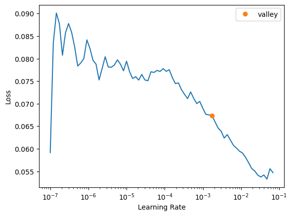

``` python
learn.fit_one_cycle(10, 1.5e-3)
```

<style>
    /* Turns off some styling */
    progress {
        /* gets rid of default border in Firefox and Opera. */
        border: none;
        /* Needs to be in here for Safari polyfill so background images work as expected. */
        background-size: auto;
    }
    progress:not([value]), progress:not([value])::-webkit-progress-bar {
        background: repeating-linear-gradient(45deg, #7e7e7e, #7e7e7e 10px, #5c5c5c 10px, #5c5c5c 20px);
    }
    .progress-bar-interrupted, .progress-bar-interrupted::-webkit-progress-bar {
        background: #F44336;
    }
</style>

<table class="dataframe" data-quarto-postprocess="true" data-border="1">
<thead>
<tr class="header" style="text-align: left;">
<th data-quarto-table-cell-role="th">epoch</th>
<th data-quarto-table-cell-role="th">train_loss</th>
<th data-quarto-table-cell-role="th">valid_loss</th>
<th data-quarto-table-cell-role="th">r2_score</th>
<th data-quarto-table-cell-role="th">time</th>
</tr>
</thead>
<tbody>
<tr class="odd">
<td>0</td>
<td>0.062678</td>
<td>0.070659</td>
<td>-7.250715</td>
<td>00:02</td>
</tr>
<tr class="even">
<td>1</td>
<td>0.060883</td>
<td>0.032091</td>
<td>-2.747149</td>
<td>00:01</td>
</tr>
<tr class="odd">
<td>2</td>
<td>0.064407</td>
<td>0.013675</td>
<td>-0.596789</td>
<td>00:01</td>
</tr>
<tr class="even">
<td>3</td>
<td>0.052951</td>
<td>0.005511</td>
<td>0.356464</td>
<td>00:01</td>
</tr>
<tr class="odd">
<td>4</td>
<td>0.048459</td>
<td>0.005013</td>
<td>0.414687</td>
<td>00:01</td>
</tr>
<tr class="even">
<td>5</td>
<td>0.043682</td>
<td>0.005526</td>
<td>0.354736</td>
<td>00:01</td>
</tr>
<tr class="odd">
<td>6</td>
<td>0.039910</td>
<td>0.006038</td>
<td>0.294921</td>
<td>00:02</td>
</tr>
<tr class="even">
<td>7</td>
<td>0.036788</td>
<td>0.006592</td>
<td>0.230292</td>
<td>00:01</td>
</tr>
<tr class="odd">
<td>8</td>
<td>0.034137</td>
<td>0.006361</td>
<td>0.257186</td>
<td>00:01</td>
</tr>
<tr class="even">
<td>9</td>
<td>0.032073</td>
<td>0.006753</td>
<td>0.211423</td>
<td>00:01</td>
</tr>
</tbody>
</table>

``` python
# val_preds, val_targets = learn.get_preds(dl=dls.valid)
val_preds, val_targets = learn.tta(dl=dls.valid, n=30)
r2_score(val_targets, val_preds)
```

<style>
    /* Turns off some styling */
    progress {
        /* gets rid of default border in Firefox and Opera. */
        border: none;
        /* Needs to be in here for Safari polyfill so background images work as expected. */
        background-size: auto;
    }
    progress:not([value]), progress:not([value])::-webkit-progress-bar {
        background: repeating-linear-gradient(45deg, #7e7e7e, #7e7e7e 10px, #5c5c5c 10px, #5c5c5c 20px);
    }
    .progress-bar-interrupted, .progress-bar-interrupted::-webkit-progress-bar {
        background: #F44336;
    }
</style>

    <div>
      <progress value='0' class='' max='10' style='width:300px; height:20px; vertical-align: middle;'></progress>
      &#10;    </div>
    

<style>
    /* Turns off some styling */
    progress {
        /* gets rid of default border in Firefox and Opera. */
        border: none;
        /* Needs to be in here for Safari polyfill so background images work as expected. */
        background-size: auto;
    }
    progress:not([value]), progress:not([value])::-webkit-progress-bar {
        background: repeating-linear-gradient(45deg, #7e7e7e, #7e7e7e 10px, #5c5c5c 10px, #5c5c5c 20px);
    }
    .progress-bar-interrupted, .progress-bar-interrupted::-webkit-progress-bar {
        background: #F44336;
    }
</style>

    0.8524203732220106

``` python
x, y = val_preds, val_targets
plt.plot(x, y, '.')
# Add the diagonal line
min_val = min(y.min(), x.min())
max_val = max(y.max(), x.max())
plt.plot([min_val, max_val], [min_val, max_val], 'k--', lw=1)
```

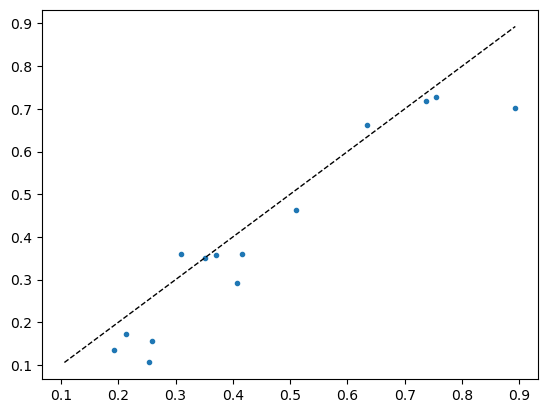

#### Using cross-validation

``` python
def cross_validation(df, target, valid_size=0.2, 
                     num_bins=2, epochs=1, lr=1.5e-3, 
                     n_tta=10, seed=31):
    from sklearn.model_selection import train_test_split
    df = df.copy()
    df.reset_index(inplace=True, drop=True)
    train_df, valid_df = train_test_split(df, test_size=valid_size, 
                                          stratify=pd.qcut(df[target], q=num_bins, labels=False), 
                                          random_state=seed)
    
    train_idx, valid_idx = train_df.index, valid_df.index
    
    def stratified_splitter(items): return [train_idx, valid_idx]
   
    dblock = DataBlock(
        blocks=(ImageBlock, RegressionBlock),
        get_x=ColReader(0, pref='../../_data/ringtrial-tfm/im/'),
        get_y=ColReader(1),
        splitter=stratified_splitter,
        item_tfms=[OrderedQuantize(n_valid=len(valid_idx))],
        batch_tfms=[
        OrderedRatioResize(224),
        Normalize.from_stats(*imagenet_stats)
        ]
    )
    dls = dblock.dataloaders(df, bs=16)
    learn = load_learner('./models/frozen-epoch-30-lr-1.5e-3-12102024.pkl', cpu=True)
    learn.dls = dls
    learn.freeze()
    learn.fit_one_cycle(epochs, lr)
    # val_preds, val_targets = learn.get_preds(dl=dls.valid)
    val_preds, val_targets = learn.tta(dl=dls.valid, n=n_tta)
    return r2_score(val_targets, val_preds)
```

``` python
df_selected = df[df.lab == 'kssl']
scores = []
for seed in range(1, 10):
    score = cross_validation(df_selected, 'potassium_cmolkg', 
                             valid_size=0.2, num_bins=4, 
                             epochs=3, seed=seed)
    scores.append(score )
```

<style>
    /* Turns off some styling */
    progress {
        /* gets rid of default border in Firefox and Opera. */
        border: none;
        /* Needs to be in here for Safari polyfill so background images work as expected. */
        background-size: auto;
    }
    progress:not([value]), progress:not([value])::-webkit-progress-bar {
        background: repeating-linear-gradient(45deg, #7e7e7e, #7e7e7e 10px, #5c5c5c 10px, #5c5c5c 20px);
    }
    .progress-bar-interrupted, .progress-bar-interrupted::-webkit-progress-bar {
        background: #F44336;
    }
</style>

<table class="dataframe" data-quarto-postprocess="true" data-border="1">
<thead>
<tr class="header" style="text-align: left;">
<th data-quarto-table-cell-role="th">epoch</th>
<th data-quarto-table-cell-role="th">train_loss</th>
<th data-quarto-table-cell-role="th">valid_loss</th>
<th data-quarto-table-cell-role="th">r2_score</th>
<th data-quarto-table-cell-role="th">time</th>
</tr>
</thead>
<tbody>
<tr class="odd">
<td>0</td>
<td>0.080839</td>
<td>0.318125</td>
<td>0.302815</td>
<td>00:02</td>
</tr>
<tr class="even">
<td>1</td>
<td>0.073392</td>
<td>0.298006</td>
<td>0.346907</td>
<td>00:01</td>
</tr>
<tr class="odd">
<td>2</td>
<td>0.065199</td>
<td>0.292256</td>
<td>0.359508</td>
<td>00:01</td>
</tr>
</tbody>
</table>

<style>
    /* Turns off some styling */
    progress {
        /* gets rid of default border in Firefox and Opera. */
        border: none;
        /* Needs to be in here for Safari polyfill so background images work as expected. */
        background-size: auto;
    }
    progress:not([value]), progress:not([value])::-webkit-progress-bar {
        background: repeating-linear-gradient(45deg, #7e7e7e, #7e7e7e 10px, #5c5c5c 10px, #5c5c5c 20px);
    }
    .progress-bar-interrupted, .progress-bar-interrupted::-webkit-progress-bar {
        background: #F44336;
    }
</style>

    <div>
      <progress value='0' class='' max='3' style='width:300px; height:20px; vertical-align: middle;'></progress>
      &#10;    </div>
    

<style>
    /* Turns off some styling */
    progress {
        /* gets rid of default border in Firefox and Opera. */
        border: none;
        /* Needs to be in here for Safari polyfill so background images work as expected. */
        background-size: auto;
    }
    progress:not([value]), progress:not([value])::-webkit-progress-bar {
        background: repeating-linear-gradient(45deg, #7e7e7e, #7e7e7e 10px, #5c5c5c 10px, #5c5c5c 20px);
    }
    .progress-bar-interrupted, .progress-bar-interrupted::-webkit-progress-bar {
        background: #F44336;
    }
</style>


<style>
    /* Turns off some styling */
    progress {
        /* gets rid of default border in Firefox and Opera. */
        border: none;
        /* Needs to be in here for Safari polyfill so background images work as expected. */
        background-size: auto;
    }
    progress:not([value]), progress:not([value])::-webkit-progress-bar {
        background: repeating-linear-gradient(45deg, #7e7e7e, #7e7e7e 10px, #5c5c5c 10px, #5c5c5c 20px);
    }
    .progress-bar-interrupted, .progress-bar-interrupted::-webkit-progress-bar {
        background: #F44336;
    }
</style>

<table class="dataframe" data-quarto-postprocess="true" data-border="1">
<thead>
<tr class="header" style="text-align: left;">
<th data-quarto-table-cell-role="th">epoch</th>
<th data-quarto-table-cell-role="th">train_loss</th>
<th data-quarto-table-cell-role="th">valid_loss</th>
<th data-quarto-table-cell-role="th">r2_score</th>
<th data-quarto-table-cell-role="th">time</th>
</tr>
</thead>
<tbody>
<tr class="odd">
<td>0</td>
<td>0.078712</td>
<td>0.058278</td>
<td>0.567448</td>
<td>00:01</td>
</tr>
<tr class="even">
<td>1</td>
<td>0.103297</td>
<td>0.037975</td>
<td>0.718140</td>
<td>00:01</td>
</tr>
<tr class="odd">
<td>2</td>
<td>0.106955</td>
<td>0.029388</td>
<td>0.781878</td>
<td>00:01</td>
</tr>
</tbody>
</table>

<style>
    /* Turns off some styling */
    progress {
        /* gets rid of default border in Firefox and Opera. */
        border: none;
        /* Needs to be in here for Safari polyfill so background images work as expected. */
        background-size: auto;
    }
    progress:not([value]), progress:not([value])::-webkit-progress-bar {
        background: repeating-linear-gradient(45deg, #7e7e7e, #7e7e7e 10px, #5c5c5c 10px, #5c5c5c 20px);
    }
    .progress-bar-interrupted, .progress-bar-interrupted::-webkit-progress-bar {
        background: #F44336;
    }
</style>

    <div>
      <progress value='0' class='' max='3' style='width:300px; height:20px; vertical-align: middle;'></progress>
      &#10;    </div>
    

<style>
    /* Turns off some styling */
    progress {
        /* gets rid of default border in Firefox and Opera. */
        border: none;
        /* Needs to be in here for Safari polyfill so background images work as expected. */
        background-size: auto;
    }
    progress:not([value]), progress:not([value])::-webkit-progress-bar {
        background: repeating-linear-gradient(45deg, #7e7e7e, #7e7e7e 10px, #5c5c5c 10px, #5c5c5c 20px);
    }
    .progress-bar-interrupted, .progress-bar-interrupted::-webkit-progress-bar {
        background: #F44336;
    }
</style>


<style>
    /* Turns off some styling */
    progress {
        /* gets rid of default border in Firefox and Opera. */
        border: none;
        /* Needs to be in here for Safari polyfill so background images work as expected. */
        background-size: auto;
    }
    progress:not([value]), progress:not([value])::-webkit-progress-bar {
        background: repeating-linear-gradient(45deg, #7e7e7e, #7e7e7e 10px, #5c5c5c 10px, #5c5c5c 20px);
    }
    .progress-bar-interrupted, .progress-bar-interrupted::-webkit-progress-bar {
        background: #F44336;
    }
</style>

<table class="dataframe" data-quarto-postprocess="true" data-border="1">
<thead>
<tr class="header" style="text-align: left;">
<th data-quarto-table-cell-role="th">epoch</th>
<th data-quarto-table-cell-role="th">train_loss</th>
<th data-quarto-table-cell-role="th">valid_loss</th>
<th data-quarto-table-cell-role="th">r2_score</th>
<th data-quarto-table-cell-role="th">time</th>
</tr>
</thead>
<tbody>
<tr class="odd">
<td>0</td>
<td>0.040163</td>
<td>0.132989</td>
<td>0.170330</td>
<td>00:02</td>
</tr>
<tr class="even">
<td>1</td>
<td>0.085821</td>
<td>0.117681</td>
<td>0.265833</td>
<td>00:02</td>
</tr>
<tr class="odd">
<td>2</td>
<td>0.085760</td>
<td>0.110825</td>
<td>0.308603</td>
<td>00:02</td>
</tr>
</tbody>
</table>

<style>
    /* Turns off some styling */
    progress {
        /* gets rid of default border in Firefox and Opera. */
        border: none;
        /* Needs to be in here for Safari polyfill so background images work as expected. */
        background-size: auto;
    }
    progress:not([value]), progress:not([value])::-webkit-progress-bar {
        background: repeating-linear-gradient(45deg, #7e7e7e, #7e7e7e 10px, #5c5c5c 10px, #5c5c5c 20px);
    }
    .progress-bar-interrupted, .progress-bar-interrupted::-webkit-progress-bar {
        background: #F44336;
    }
</style>

    <div>
      <progress value='0' class='' max='3' style='width:300px; height:20px; vertical-align: middle;'></progress>
      &#10;    </div>
    

<style>
    /* Turns off some styling */
    progress {
        /* gets rid of default border in Firefox and Opera. */
        border: none;
        /* Needs to be in here for Safari polyfill so background images work as expected. */
        background-size: auto;
    }
    progress:not([value]), progress:not([value])::-webkit-progress-bar {
        background: repeating-linear-gradient(45deg, #7e7e7e, #7e7e7e 10px, #5c5c5c 10px, #5c5c5c 20px);
    }
    .progress-bar-interrupted, .progress-bar-interrupted::-webkit-progress-bar {
        background: #F44336;
    }
</style>


<style>
    /* Turns off some styling */
    progress {
        /* gets rid of default border in Firefox and Opera. */
        border: none;
        /* Needs to be in here for Safari polyfill so background images work as expected. */
        background-size: auto;
    }
    progress:not([value]), progress:not([value])::-webkit-progress-bar {
        background: repeating-linear-gradient(45deg, #7e7e7e, #7e7e7e 10px, #5c5c5c 10px, #5c5c5c 20px);
    }
    .progress-bar-interrupted, .progress-bar-interrupted::-webkit-progress-bar {
        background: #F44336;
    }
</style>

<table class="dataframe" data-quarto-postprocess="true" data-border="1">
<thead>
<tr class="header" style="text-align: left;">
<th data-quarto-table-cell-role="th">epoch</th>
<th data-quarto-table-cell-role="th">train_loss</th>
<th data-quarto-table-cell-role="th">valid_loss</th>
<th data-quarto-table-cell-role="th">r2_score</th>
<th data-quarto-table-cell-role="th">time</th>
</tr>
</thead>
<tbody>
<tr class="odd">
<td>0</td>
<td>0.073621</td>
<td>0.045193</td>
<td>0.553941</td>
<td>00:02</td>
</tr>
<tr class="even">
<td>1</td>
<td>0.106387</td>
<td>0.029305</td>
<td>0.710762</td>
<td>00:03</td>
</tr>
<tr class="odd">
<td>2</td>
<td>0.082117</td>
<td>0.021391</td>
<td>0.788873</td>
<td>00:02</td>
</tr>
</tbody>
</table>

<style>
    /* Turns off some styling */
    progress {
        /* gets rid of default border in Firefox and Opera. */
        border: none;
        /* Needs to be in here for Safari polyfill so background images work as expected. */
        background-size: auto;
    }
    progress:not([value]), progress:not([value])::-webkit-progress-bar {
        background: repeating-linear-gradient(45deg, #7e7e7e, #7e7e7e 10px, #5c5c5c 10px, #5c5c5c 20px);
    }
    .progress-bar-interrupted, .progress-bar-interrupted::-webkit-progress-bar {
        background: #F44336;
    }
</style>

    <div>
      <progress value='0' class='' max='3' style='width:300px; height:20px; vertical-align: middle;'></progress>
      &#10;    </div>
    

<style>
    /* Turns off some styling */
    progress {
        /* gets rid of default border in Firefox and Opera. */
        border: none;
        /* Needs to be in here for Safari polyfill so background images work as expected. */
        background-size: auto;
    }
    progress:not([value]), progress:not([value])::-webkit-progress-bar {
        background: repeating-linear-gradient(45deg, #7e7e7e, #7e7e7e 10px, #5c5c5c 10px, #5c5c5c 20px);
    }
    .progress-bar-interrupted, .progress-bar-interrupted::-webkit-progress-bar {
        background: #F44336;
    }
</style>


<style>
    /* Turns off some styling */
    progress {
        /* gets rid of default border in Firefox and Opera. */
        border: none;
        /* Needs to be in here for Safari polyfill so background images work as expected. */
        background-size: auto;
    }
    progress:not([value]), progress:not([value])::-webkit-progress-bar {
        background: repeating-linear-gradient(45deg, #7e7e7e, #7e7e7e 10px, #5c5c5c 10px, #5c5c5c 20px);
    }
    .progress-bar-interrupted, .progress-bar-interrupted::-webkit-progress-bar {
        background: #F44336;
    }
</style>

<table class="dataframe" data-quarto-postprocess="true" data-border="1">
<thead>
<tr class="header" style="text-align: left;">
<th data-quarto-table-cell-role="th">epoch</th>
<th data-quarto-table-cell-role="th">train_loss</th>
<th data-quarto-table-cell-role="th">valid_loss</th>
<th data-quarto-table-cell-role="th">r2_score</th>
<th data-quarto-table-cell-role="th">time</th>
</tr>
</thead>
<tbody>
<tr class="odd">
<td>0</td>
<td>0.077322</td>
<td>0.299385</td>
<td>0.362233</td>
<td>00:02</td>
</tr>
<tr class="even">
<td>1</td>
<td>0.071211</td>
<td>0.292716</td>
<td>0.376440</td>
<td>00:01</td>
</tr>
<tr class="odd">
<td>2</td>
<td>0.061952</td>
<td>0.281709</td>
<td>0.399887</td>
<td>00:01</td>
</tr>
</tbody>
</table>

<style>
    /* Turns off some styling */
    progress {
        /* gets rid of default border in Firefox and Opera. */
        border: none;
        /* Needs to be in here for Safari polyfill so background images work as expected. */
        background-size: auto;
    }
    progress:not([value]), progress:not([value])::-webkit-progress-bar {
        background: repeating-linear-gradient(45deg, #7e7e7e, #7e7e7e 10px, #5c5c5c 10px, #5c5c5c 20px);
    }
    .progress-bar-interrupted, .progress-bar-interrupted::-webkit-progress-bar {
        background: #F44336;
    }
</style>

    <div>
      <progress value='0' class='' max='3' style='width:300px; height:20px; vertical-align: middle;'></progress>
      &#10;    </div>
    

<style>
    /* Turns off some styling */
    progress {
        /* gets rid of default border in Firefox and Opera. */
        border: none;
        /* Needs to be in here for Safari polyfill so background images work as expected. */
        background-size: auto;
    }
    progress:not([value]), progress:not([value])::-webkit-progress-bar {
        background: repeating-linear-gradient(45deg, #7e7e7e, #7e7e7e 10px, #5c5c5c 10px, #5c5c5c 20px);
    }
    .progress-bar-interrupted, .progress-bar-interrupted::-webkit-progress-bar {
        background: #F44336;
    }
</style>


<style>
    /* Turns off some styling */
    progress {
        /* gets rid of default border in Firefox and Opera. */
        border: none;
        /* Needs to be in here for Safari polyfill so background images work as expected. */
        background-size: auto;
    }
    progress:not([value]), progress:not([value])::-webkit-progress-bar {
        background: repeating-linear-gradient(45deg, #7e7e7e, #7e7e7e 10px, #5c5c5c 10px, #5c5c5c 20px);
    }
    .progress-bar-interrupted, .progress-bar-interrupted::-webkit-progress-bar {
        background: #F44336;
    }
</style>

<table class="dataframe" data-quarto-postprocess="true" data-border="1">
<thead>
<tr class="header" style="text-align: left;">
<th data-quarto-table-cell-role="th">epoch</th>
<th data-quarto-table-cell-role="th">train_loss</th>
<th data-quarto-table-cell-role="th">valid_loss</th>
<th data-quarto-table-cell-role="th">r2_score</th>
<th data-quarto-table-cell-role="th">time</th>
</tr>
</thead>
<tbody>
<tr class="odd">
<td>0</td>
<td>0.155731</td>
<td>0.052831</td>
<td>0.586981</td>
<td>00:02</td>
</tr>
<tr class="even">
<td>1</td>
<td>0.147657</td>
<td>0.045921</td>
<td>0.641001</td>
<td>00:03</td>
</tr>
<tr class="odd">
<td>2</td>
<td>0.127009</td>
<td>0.043383</td>
<td>0.660838</td>
<td>00:02</td>
</tr>
</tbody>
</table>

<style>
    /* Turns off some styling */
    progress {
        /* gets rid of default border in Firefox and Opera. */
        border: none;
        /* Needs to be in here for Safari polyfill so background images work as expected. */
        background-size: auto;
    }
    progress:not([value]), progress:not([value])::-webkit-progress-bar {
        background: repeating-linear-gradient(45deg, #7e7e7e, #7e7e7e 10px, #5c5c5c 10px, #5c5c5c 20px);
    }
    .progress-bar-interrupted, .progress-bar-interrupted::-webkit-progress-bar {
        background: #F44336;
    }
</style>

    <div>
      <progress value='0' class='' max='3' style='width:300px; height:20px; vertical-align: middle;'></progress>
      &#10;    </div>
    

<style>
    /* Turns off some styling */
    progress {
        /* gets rid of default border in Firefox and Opera. */
        border: none;
        /* Needs to be in here for Safari polyfill so background images work as expected. */
        background-size: auto;
    }
    progress:not([value]), progress:not([value])::-webkit-progress-bar {
        background: repeating-linear-gradient(45deg, #7e7e7e, #7e7e7e 10px, #5c5c5c 10px, #5c5c5c 20px);
    }
    .progress-bar-interrupted, .progress-bar-interrupted::-webkit-progress-bar {
        background: #F44336;
    }
</style>


<style>
    /* Turns off some styling */
    progress {
        /* gets rid of default border in Firefox and Opera. */
        border: none;
        /* Needs to be in here for Safari polyfill so background images work as expected. */
        background-size: auto;
    }
    progress:not([value]), progress:not([value])::-webkit-progress-bar {
        background: repeating-linear-gradient(45deg, #7e7e7e, #7e7e7e 10px, #5c5c5c 10px, #5c5c5c 20px);
    }
    .progress-bar-interrupted, .progress-bar-interrupted::-webkit-progress-bar {
        background: #F44336;
    }
</style>

<table class="dataframe" data-quarto-postprocess="true" data-border="1">
<thead>
<tr class="header" style="text-align: left;">
<th data-quarto-table-cell-role="th">epoch</th>
<th data-quarto-table-cell-role="th">train_loss</th>
<th data-quarto-table-cell-role="th">valid_loss</th>
<th data-quarto-table-cell-role="th">r2_score</th>
<th data-quarto-table-cell-role="th">time</th>
</tr>
</thead>
<tbody>
<tr class="odd">
<td>0</td>
<td>0.130341</td>
<td>0.135900</td>
<td>0.309171</td>
<td>00:01</td>
</tr>
<tr class="even">
<td>1</td>
<td>0.119079</td>
<td>0.105886</td>
<td>0.461744</td>
<td>00:01</td>
</tr>
<tr class="odd">
<td>2</td>
<td>0.102005</td>
<td>0.097154</td>
<td>0.506130</td>
<td>00:01</td>
</tr>
</tbody>
</table>

<style>
    /* Turns off some styling */
    progress {
        /* gets rid of default border in Firefox and Opera. */
        border: none;
        /* Needs to be in here for Safari polyfill so background images work as expected. */
        background-size: auto;
    }
    progress:not([value]), progress:not([value])::-webkit-progress-bar {
        background: repeating-linear-gradient(45deg, #7e7e7e, #7e7e7e 10px, #5c5c5c 10px, #5c5c5c 20px);
    }
    .progress-bar-interrupted, .progress-bar-interrupted::-webkit-progress-bar {
        background: #F44336;
    }
</style>

    <div>
      <progress value='0' class='' max='3' style='width:300px; height:20px; vertical-align: middle;'></progress>
      &#10;    </div>
    

<style>
    /* Turns off some styling */
    progress {
        /* gets rid of default border in Firefox and Opera. */
        border: none;
        /* Needs to be in here for Safari polyfill so background images work as expected. */
        background-size: auto;
    }
    progress:not([value]), progress:not([value])::-webkit-progress-bar {
        background: repeating-linear-gradient(45deg, #7e7e7e, #7e7e7e 10px, #5c5c5c 10px, #5c5c5c 20px);
    }
    .progress-bar-interrupted, .progress-bar-interrupted::-webkit-progress-bar {
        background: #F44336;
    }
</style>


<style>
    /* Turns off some styling */
    progress {
        /* gets rid of default border in Firefox and Opera. */
        border: none;
        /* Needs to be in here for Safari polyfill so background images work as expected. */
        background-size: auto;
    }
    progress:not([value]), progress:not([value])::-webkit-progress-bar {
        background: repeating-linear-gradient(45deg, #7e7e7e, #7e7e7e 10px, #5c5c5c 10px, #5c5c5c 20px);
    }
    .progress-bar-interrupted, .progress-bar-interrupted::-webkit-progress-bar {
        background: #F44336;
    }
</style>

<table class="dataframe" data-quarto-postprocess="true" data-border="1">
<thead>
<tr class="header" style="text-align: left;">
<th data-quarto-table-cell-role="th">epoch</th>
<th data-quarto-table-cell-role="th">train_loss</th>
<th data-quarto-table-cell-role="th">valid_loss</th>
<th data-quarto-table-cell-role="th">r2_score</th>
<th data-quarto-table-cell-role="th">time</th>
</tr>
</thead>
<tbody>
<tr class="odd">
<td>0</td>
<td>0.159416</td>
<td>0.036709</td>
<td>0.643722</td>
<td>00:02</td>
</tr>
<tr class="even">
<td>1</td>
<td>0.147401</td>
<td>0.028988</td>
<td>0.718660</td>
<td>00:02</td>
</tr>
<tr class="odd">
<td>2</td>
<td>0.133312</td>
<td>0.023979</td>
<td>0.767270</td>
<td>00:01</td>
</tr>
</tbody>
</table>

<style>
    /* Turns off some styling */
    progress {
        /* gets rid of default border in Firefox and Opera. */
        border: none;
        /* Needs to be in here for Safari polyfill so background images work as expected. */
        background-size: auto;
    }
    progress:not([value]), progress:not([value])::-webkit-progress-bar {
        background: repeating-linear-gradient(45deg, #7e7e7e, #7e7e7e 10px, #5c5c5c 10px, #5c5c5c 20px);
    }
    .progress-bar-interrupted, .progress-bar-interrupted::-webkit-progress-bar {
        background: #F44336;
    }
</style>

    <div>
      <progress value='0' class='' max='3' style='width:300px; height:20px; vertical-align: middle;'></progress>
      &#10;    </div>
    

<style>
    /* Turns off some styling */
    progress {
        /* gets rid of default border in Firefox and Opera. */
        border: none;
        /* Needs to be in here for Safari polyfill so background images work as expected. */
        background-size: auto;
    }
    progress:not([value]), progress:not([value])::-webkit-progress-bar {
        background: repeating-linear-gradient(45deg, #7e7e7e, #7e7e7e 10px, #5c5c5c 10px, #5c5c5c 20px);
    }
    .progress-bar-interrupted, .progress-bar-interrupted::-webkit-progress-bar {
        background: #F44336;
    }
</style>


<style>
    /* Turns off some styling */
    progress {
        /* gets rid of default border in Firefox and Opera. */
        border: none;
        /* Needs to be in here for Safari polyfill so background images work as expected. */
        background-size: auto;
    }
    progress:not([value]), progress:not([value])::-webkit-progress-bar {
        background: repeating-linear-gradient(45deg, #7e7e7e, #7e7e7e 10px, #5c5c5c 10px, #5c5c5c 20px);
    }
    .progress-bar-interrupted, .progress-bar-interrupted::-webkit-progress-bar {
        background: #F44336;
    }
</style>

<table class="dataframe" data-quarto-postprocess="true" data-border="1">
<thead>
<tr class="header" style="text-align: left;">
<th data-quarto-table-cell-role="th">epoch</th>
<th data-quarto-table-cell-role="th">train_loss</th>
<th data-quarto-table-cell-role="th">valid_loss</th>
<th data-quarto-table-cell-role="th">r2_score</th>
<th data-quarto-table-cell-role="th">time</th>
</tr>
</thead>
<tbody>
<tr class="odd">
<td>0</td>
<td>0.186754</td>
<td>0.042557</td>
<td>0.596722</td>
<td>00:01</td>
</tr>
<tr class="even">
<td>1</td>
<td>0.122767</td>
<td>0.023109</td>
<td>0.781009</td>
<td>00:01</td>
</tr>
<tr class="odd">
<td>2</td>
<td>0.114166</td>
<td>0.018596</td>
<td>0.823780</td>
<td>00:01</td>
</tr>
</tbody>
</table>

<style>
    /* Turns off some styling */
    progress {
        /* gets rid of default border in Firefox and Opera. */
        border: none;
        /* Needs to be in here for Safari polyfill so background images work as expected. */
        background-size: auto;
    }
    progress:not([value]), progress:not([value])::-webkit-progress-bar {
        background: repeating-linear-gradient(45deg, #7e7e7e, #7e7e7e 10px, #5c5c5c 10px, #5c5c5c 20px);
    }
    .progress-bar-interrupted, .progress-bar-interrupted::-webkit-progress-bar {
        background: #F44336;
    }
</style>

    <div>
      <progress value='0' class='' max='3' style='width:300px; height:20px; vertical-align: middle;'></progress>
      &#10;    </div>
    

<style>
    /* Turns off some styling */
    progress {
        /* gets rid of default border in Firefox and Opera. */
        border: none;
        /* Needs to be in here for Safari polyfill so background images work as expected. */
        background-size: auto;
    }
    progress:not([value]), progress:not([value])::-webkit-progress-bar {
        background: repeating-linear-gradient(45deg, #7e7e7e, #7e7e7e 10px, #5c5c5c 10px, #5c5c5c 20px);
    }
    .progress-bar-interrupted, .progress-bar-interrupted::-webkit-progress-bar {
        background: #F44336;
    }
</style>

``` python
plt.hist(np.array(scores))
```

    (array([1., 1., 1., 0., 1., 0., 0., 1., 0., 4.]),
     array([0.26426539, 0.31865215, 0.37303891, 0.42742567, 0.48181243,
            0.53619919, 0.59058595, 0.64497271, 0.69935947, 0.75374623,
            0.80813299]),
     <BarContainer object of 10 artists>)

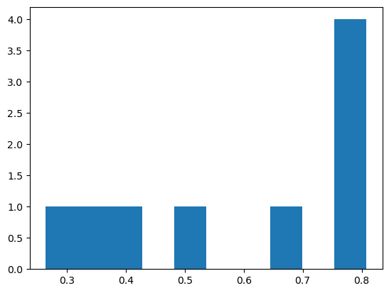

``` python
def stratified_split(df, target, valid_size=0.2, test_size=0.2, num_bins=2, seed=41):
    from sklearn.model_selection import train_test_split
    df = df.copy()
    df.reset_index(inplace=True, drop=True)
    train_df, test_df = train_test_split(df, test_size=test_size, 
                                        stratify=pd.qcut(df[target], q=num_bins, labels=False), 
                                        random_state=seed)

    train_df, valid_df = train_test_split(train_df, test_size=test_size, 
                                        stratify=pd.qcut(train_df[target], q=num_bins, labels=False), 
                                        random_state=seed)
    
    return train_df, train_df.index, valid_df, valid_df.index, test_df, test_df.index
```

``` python
data = stratified_split(df_selected, 'potassium_cmolkg', valid_size=0.3, test_size=0.2, num_bins=2)
train_df, train_idx, valid_df, valid_idx, test_df, test_idx = data
```

``` python
# Check they have nothing in common
def has_common_elements(list1, list2): return bool(set(list1) & set(list2))

fc.test_eq(has_common_elements(train_idx, test_idx), False)
fc.test_eq(has_common_elements(train_idx, valid_idx), False)
fc.test_eq(has_common_elements(test_idx, valid_idx), False)
```

    AssertionError: ==:
    True
    False
    ---------------------------------------------------------------------------
    AssertionError                            Traceback (most recent call last)
    Cell In[422], line 4
          1 # Check they have nothing in common
          2 def has_common_elements(list1, list2): return bool(set(list1) & set(list2))
    ----> 4 fc.test_eq(has_common_elements(train_idx, test_idx), False)
          5 fc.test_eq(has_common_elements(train_idx, valid_idx), False)
          6 fc.test_eq(has_common_elements(test_idx, valid_idx), False)

    File ~/mambaforge/envs/uhina/lib/python3.12/site-packages/fastcore/test.py:39, in test_eq(a, b)
         37 def test_eq(a,b):
         38     "`test` that `a==b`"
    ---> 39     test(a,b,equals, cname='==')

    File ~/mambaforge/envs/uhina/lib/python3.12/site-packages/fastcore/test.py:29, in test(a, b, cmp, cname)
         27 "`assert` that `cmp(a,b)`; display inputs and `cname or cmp.__name__` if it fails"
         28 if cname is None: cname=cmp.__name__
    ---> 29 assert cmp(a,b),f"{cname}:\n{a}\n{b}"

    AssertionError: ==:
    True
    False

``` python
train_idx, valid_idx
```

    (Index([26, 40, 17, 67, 22, 13, 16, 41, 49, 18,  2,  9, 47, 44, 52, 63, 61, 37,
            57, 59, 66, 30, 54, 33,  7, 55, 15, 46, 19, 53, 29, 60,  4,  3, 64, 45,
            11, 20],
           dtype='int64'),
     Index([21, 58, 14, 65, 34, 56, 50, 6, 35, 62, 68, 32, 25, 24, 43, 10, 48], dtype='int64'))

``` python
len(train_df), len(valid_df), len(test_df)
```

    (38, 17, 14)

``` python
test_df
```

<div>
<style scoped>
    .dataframe tbody tr th:only-of-type {
        vertical-align: middle;
    }
&#10;    .dataframe tbody tr th {
        vertical-align: top;
    }
&#10;    .dataframe thead th {
        text-align: right;
    }
</style>

<table class="dataframe" data-quarto-postprocess="true" data-border="1">
<thead>
<tr class="header" style="text-align: right;">
<th data-quarto-table-cell-role="th"></th>
<th data-quarto-table-cell-role="th">fname</th>
<th data-quarto-table-cell-role="th">potassium_cmolkg</th>
<th data-quarto-table-cell-role="th">lab</th>
</tr>
</thead>
<tbody>
<tr class="odd">
<td data-quarto-table-cell-role="th">28</td>
<td>kssl-rt-29.png</td>
<td>0.306528</td>
<td>kssl</td>
</tr>
<tr class="even">
<td data-quarto-table-cell-role="th">39</td>
<td>kssl-rt-40.png</td>
<td>0.673883</td>
<td>kssl</td>
</tr>
<tr class="odd">
<td data-quarto-table-cell-role="th">23</td>
<td>kssl-rt-24.png</td>
<td>0.173592</td>
<td>kssl</td>
</tr>
<tr class="even">
<td data-quarto-table-cell-role="th">0</td>
<td>kssl-rt-01.png</td>
<td>0.238276</td>
<td>kssl</td>
</tr>
<tr class="odd">
<td data-quarto-table-cell-role="th">42</td>
<td>kssl-rt-43.png</td>
<td>0.262710</td>
<td>kssl</td>
</tr>
<tr class="even">
<td data-quarto-table-cell-role="th">27</td>
<td>kssl-rt-28.png</td>
<td>0.676835</td>
<td>kssl</td>
</tr>
<tr class="odd">
<td data-quarto-table-cell-role="th">31</td>
<td>kssl-rt-32.png</td>
<td>0.338556</td>
<td>kssl</td>
</tr>
<tr class="even">
<td data-quarto-table-cell-role="th">38</td>
<td>kssl-rt-39.png</td>
<td>0.396687</td>
<td>kssl</td>
</tr>
<tr class="odd">
<td data-quarto-table-cell-role="th">8</td>
<td>kssl-rt-09.png</td>
<td>0.976900</td>
<td>kssl</td>
</tr>
<tr class="even">
<td data-quarto-table-cell-role="th">1</td>
<td>kssl-rt-02.png</td>
<td>0.209848</td>
<td>kssl</td>
</tr>
<tr class="odd">
<td data-quarto-table-cell-role="th">36</td>
<td>kssl-rt-37.png</td>
<td>0.134627</td>
<td>kssl</td>
</tr>
<tr class="even">
<td data-quarto-table-cell-role="th">51</td>
<td>kssl-rt-53.png</td>
<td>0.400788</td>
<td>kssl</td>
</tr>
<tr class="odd">
<td data-quarto-table-cell-role="th">5</td>
<td>kssl-rt-06.png</td>
<td>0.495470</td>
<td>kssl</td>
</tr>
<tr class="even">
<td data-quarto-table-cell-role="th">12</td>
<td>kssl-rt-13.png</td>
<td>0.446620</td>
<td>kssl</td>
</tr>
</tbody>
</table>

</div>

``` python
def stratified_splitter(items): return [train_idx, valid_idx]

# dblock = DataBlock(blocks=(ImageBlock, RegressionBlock),
#                    get_x=ColReader(0, pref='../../_data/ringtrial-tfm/im/'),
#                    get_y=ColReader(1),
#                    splitter=stratified_splitter,
#                    batch_tfms=[RatioResize(224)],
#                    item_tfms=[Quantize(n_valid=len(valid_idx))])

dblock = DataBlock(
    blocks=(ImageBlock, RegressionBlock),
    get_x=ColReader(0, pref='../../_data/ringtrial-tfm/im/'),
    get_y=ColReader(1),
    splitter=stratified_splitter,
    item_tfms=[OrderedQuantize(n_valid=len(valid_idx))],
    batch_tfms=[
        OrderedRatioResize(224),
        Normalize.from_stats(*imagenet_stats)
    ]
)
```

``` python
# dblock.summary(df_selected)
```

    Setting-up type transforms pipelines
    Collecting items from               fname  potassium_cmolkg   lab
    483  kssl-rt-01.png          0.238276  kssl
    484  kssl-rt-02.png          0.209848  kssl
    485  kssl-rt-03.png          0.255487  kssl
    486  kssl-rt-04.png          0.404965  kssl
    487  kssl-rt-05.png          0.469860  kssl
    488  kssl-rt-06.png          0.495470  kssl
    489  kssl-rt-07.png          0.393716  kssl
    490  kssl-rt-08.png          0.106628  kssl
    491  kssl-rt-09.png          0.976900  kssl
    492  kssl-rt-10.png          0.315519  kssl
    493  kssl-rt-11.png          0.335250  kssl
    494  kssl-rt-12.png          0.292252  kssl
    495  kssl-rt-13.png          0.446620  kssl
    496  kssl-rt-14.png          0.210804  kssl
    497  kssl-rt-15.png          0.482117  kssl
    498  kssl-rt-16.png          0.662054  kssl
    499  kssl-rt-17.png          0.595782  kssl
    500  kssl-rt-18.png          0.360761  kssl
    501  kssl-rt-19.png          0.340229  kssl
    502  kssl-rt-20.png          0.342816  kssl
    503  kssl-rt-21.png          0.398024  kssl
    504  kssl-rt-22.png          0.082409  kssl
    505  kssl-rt-23.png          0.312743  kssl
    506  kssl-rt-24.png          0.173592  kssl
    507  kssl-rt-25.png          0.171825  kssl
    508  kssl-rt-26.png          0.155182  kssl
    509  kssl-rt-27.png          0.147696  kssl
    510  kssl-rt-28.png          0.676835  kssl
    511  kssl-rt-29.png          0.306528  kssl
    512  kssl-rt-30.png          0.351649  kssl
    513  kssl-rt-31.png          0.358387  kssl
    514  kssl-rt-32.png          0.338556  kssl
    515  kssl-rt-33.png          0.452482  kssl
    516  kssl-rt-34.png          0.105971  kssl
    517  kssl-rt-35.png          0.085691  kssl
    518  kssl-rt-36.png          0.152824  kssl
    519  kssl-rt-37.png          0.134627  kssl
    520  kssl-rt-38.png          0.046282  kssl
    521  kssl-rt-39.png          0.396687  kssl
    522  kssl-rt-40.png          0.673883  kssl
    523  kssl-rt-41.png          0.701621  kssl
    524  kssl-rt-42.png          0.420853  kssl
    525  kssl-rt-43.png          0.262710  kssl
    526  kssl-rt-45.png          0.311652  kssl
    527  kssl-rt-46.png          0.359945  kssl
    528  kssl-rt-47.png          0.292476  kssl
    529  kssl-rt-48.png          0.724215  kssl
    530  kssl-rt-49.png          0.442131  kssl
    531  kssl-rt-50.png          0.720475  kssl
    532  kssl-rt-51.png          0.728205  kssl
    533  kssl-rt-52.png          0.328282  kssl
    534  kssl-rt-53.png          0.400788  kssl
    535  kssl-rt-54.png          0.328678  kssl
    536  kssl-rt-55.png          0.358884  kssl
    537  kssl-rt-56.png          0.718293  kssl
    538  kssl-rt-57.png          0.731367  kssl
    539  kssl-rt-58.png          0.735776  kssl
    540  kssl-rt-59.png          0.463199  kssl
    541  kssl-rt-60.png          0.588014  kssl
    542  kssl-rt-61.png          0.461032  kssl
    543  kssl-rt-62.png          0.249902  kssl
    544  kssl-rt-63.png          0.249902  kssl
    545  kssl-rt-64.png          0.140544  kssl
    546  kssl-rt-65.png          0.253882  kssl
    547  kssl-rt-66.png          1.345212  kssl
    548  kssl-rt-67.png          0.857869  kssl
    549  kssl-rt-68.png          0.627098  kssl
    550  kssl-rt-69.png          0.681596  kssl
    551  kssl-rt-70.png          0.735732  kssl
    Found 69 items
    2 datasets of sizes 38,17
    Setting up Pipeline: ColReader -- {'cols': 0, 'pref': '../../_data/ringtrial-tfm/im/', 'suff': '', 'label_delim': None} -> PILBase.create
    Setting up Pipeline: ColReader -- {'cols': 1, 'pref': '', 'suff': '', 'label_delim': None} -> RegressionSetup -- {'c': None}

    Building one sample
      Pipeline: ColReader -- {'cols': 0, 'pref': '../../_data/ringtrial-tfm/im/', 'suff': '', 'label_delim': None} -> PILBase.create
        starting from
          fname               kssl-rt-27.png
    potassium_cmolkg          0.147696
    lab                           kssl
    Name: 509, dtype: object
        applying ColReader -- {'cols': 0, 'pref': '../../_data/ringtrial-tfm/im/', 'suff': '', 'label_delim': None} gives
          ../../_data/ringtrial-tfm/im/kssl-rt-27.png
        applying PILBase.create gives
          PILImage mode=RGB size=669x221
      Pipeline: ColReader -- {'cols': 1, 'pref': '', 'suff': '', 'label_delim': None} -> RegressionSetup -- {'c': None}
        starting from
          fname               kssl-rt-27.png
    potassium_cmolkg          0.147696
    lab                           kssl
    Name: 509, dtype: object
        applying ColReader -- {'cols': 1, 'pref': '', 'suff': '', 'label_delim': None} gives
          0.14769560487272498
        applying RegressionSetup -- {'c': None} gives
          tensor(0.1477)

    Final sample: (PILImage mode=RGB size=669x221, tensor(0.1477))


    Collecting items from               fname  potassium_cmolkg   lab
    483  kssl-rt-01.png          0.238276  kssl
    484  kssl-rt-02.png          0.209848  kssl
    485  kssl-rt-03.png          0.255487  kssl
    486  kssl-rt-04.png          0.404965  kssl
    487  kssl-rt-05.png          0.469860  kssl
    488  kssl-rt-06.png          0.495470  kssl
    489  kssl-rt-07.png          0.393716  kssl
    490  kssl-rt-08.png          0.106628  kssl
    491  kssl-rt-09.png          0.976900  kssl
    492  kssl-rt-10.png          0.315519  kssl
    493  kssl-rt-11.png          0.335250  kssl
    494  kssl-rt-12.png          0.292252  kssl
    495  kssl-rt-13.png          0.446620  kssl
    496  kssl-rt-14.png          0.210804  kssl
    497  kssl-rt-15.png          0.482117  kssl
    498  kssl-rt-16.png          0.662054  kssl
    499  kssl-rt-17.png          0.595782  kssl
    500  kssl-rt-18.png          0.360761  kssl
    501  kssl-rt-19.png          0.340229  kssl
    502  kssl-rt-20.png          0.342816  kssl
    503  kssl-rt-21.png          0.398024  kssl
    504  kssl-rt-22.png          0.082409  kssl
    505  kssl-rt-23.png          0.312743  kssl
    506  kssl-rt-24.png          0.173592  kssl
    507  kssl-rt-25.png          0.171825  kssl
    508  kssl-rt-26.png          0.155182  kssl
    509  kssl-rt-27.png          0.147696  kssl
    510  kssl-rt-28.png          0.676835  kssl
    511  kssl-rt-29.png          0.306528  kssl
    512  kssl-rt-30.png          0.351649  kssl
    513  kssl-rt-31.png          0.358387  kssl
    514  kssl-rt-32.png          0.338556  kssl
    515  kssl-rt-33.png          0.452482  kssl
    516  kssl-rt-34.png          0.105971  kssl
    517  kssl-rt-35.png          0.085691  kssl
    518  kssl-rt-36.png          0.152824  kssl
    519  kssl-rt-37.png          0.134627  kssl
    520  kssl-rt-38.png          0.046282  kssl
    521  kssl-rt-39.png          0.396687  kssl
    522  kssl-rt-40.png          0.673883  kssl
    523  kssl-rt-41.png          0.701621  kssl
    524  kssl-rt-42.png          0.420853  kssl
    525  kssl-rt-43.png          0.262710  kssl
    526  kssl-rt-45.png          0.311652  kssl
    527  kssl-rt-46.png          0.359945  kssl
    528  kssl-rt-47.png          0.292476  kssl
    529  kssl-rt-48.png          0.724215  kssl
    530  kssl-rt-49.png          0.442131  kssl
    531  kssl-rt-50.png          0.720475  kssl
    532  kssl-rt-51.png          0.728205  kssl
    533  kssl-rt-52.png          0.328282  kssl
    534  kssl-rt-53.png          0.400788  kssl
    535  kssl-rt-54.png          0.328678  kssl
    536  kssl-rt-55.png          0.358884  kssl
    537  kssl-rt-56.png          0.718293  kssl
    538  kssl-rt-57.png          0.731367  kssl
    539  kssl-rt-58.png          0.735776  kssl
    540  kssl-rt-59.png          0.463199  kssl
    541  kssl-rt-60.png          0.588014  kssl
    542  kssl-rt-61.png          0.461032  kssl
    543  kssl-rt-62.png          0.249902  kssl
    544  kssl-rt-63.png          0.249902  kssl
    545  kssl-rt-64.png          0.140544  kssl
    546  kssl-rt-65.png          0.253882  kssl
    547  kssl-rt-66.png          1.345212  kssl
    548  kssl-rt-67.png          0.857869  kssl
    549  kssl-rt-68.png          0.627098  kssl
    550  kssl-rt-69.png          0.681596  kssl
    551  kssl-rt-70.png          0.735732  kssl
    Found 69 items
    2 datasets of sizes 38,17
    Setting up Pipeline: ColReader -- {'cols': 0, 'pref': '../../_data/ringtrial-tfm/im/', 'suff': '', 'label_delim': None} -> PILBase.create
    Setting up Pipeline: ColReader -- {'cols': 1, 'pref': '', 'suff': '', 'label_delim': None} -> RegressionSetup -- {'c': None}
    Setting up after_item: Pipeline: OrderedQuantize -- {'n_valid': 17, 'p': 1.0} -> ToTensor
    Setting up before_batch: Pipeline: 
    Setting up after_batch: Pipeline: OrderedRatioResize -- {'max_sz': 224, 'resamples': (<Resampling.BILINEAR: 2>, <Resampling.NEAREST: 0>)} -> IntToFloatTensor -- {'div': 255.0, 'div_mask': 1} -> Normalize -- {'mean': tensor([[[[0.4850]],

             [[0.4560]],

             [[0.4060]]]], device='mps:0'), 'std': tensor([[[[0.2290]],

             [[0.2240]],

             [[0.2250]]]], device='mps:0'), 'axes': (0, 2, 3)}

    Building one batch
    Applying item_tfms to the first sample:
      Pipeline: OrderedQuantize -- {'n_valid': 17, 'p': 1.0} -> ToTensor
        starting from
          (PILImage mode=RGB size=669x221, tensor(0.1477))
        applying OrderedQuantize -- {'n_valid': 17, 'p': 1.0} gives
          (PILImage mode=RGB size=669x221, tensor(0.1477))
        applying ToTensor gives
          (TensorImage of size 3x221x669, tensor(0.1477))

    Adding the next 3 samples

    No before_batch transform to apply

    Collating items in a batch

    Applying batch_tfms to the batch built
      Pipeline: OrderedRatioResize -- {'max_sz': 224, 'resamples': (<Resampling.BILINEAR: 2>, <Resampling.NEAREST: 0>)} -> IntToFloatTensor -- {'div': 255.0, 'div_mask': 1} -> Normalize -- {'mean': tensor([[[[0.4850]],

             [[0.4560]],

             [[0.4060]]]], device='mps:0'), 'std': tensor([[[[0.2290]],

             [[0.2240]],

             [[0.2250]]]], device='mps:0'), 'axes': (0, 2, 3)}
        starting from
          (TensorImage of size 4x3x221x669, tensor([0.1477, 0.7016, 0.3608, 0.6816], device='mps:0'))
        applying OrderedRatioResize -- {'max_sz': 224, 'resamples': (<Resampling.BILINEAR: 2>, <Resampling.NEAREST: 0>)} gives
          (TensorImage of size 4x3x221x669, tensor([0.1477, 0.7016, 0.3608, 0.6816], device='mps:0'))
        applying IntToFloatTensor -- {'div': 255.0, 'div_mask': 1} gives
          (TensorImage of size 4x3x221x669, tensor([0.1477, 0.7016, 0.3608, 0.6816], device='mps:0'))
        applying Normalize -- {'mean': tensor([[[[0.4850]],

             [[0.4560]],

             [[0.4060]]]], device='mps:0'), 'std': tensor([[[[0.2290]],

             [[0.2240]],

             [[0.2250]]]], device='mps:0'), 'axes': (0, 2, 3)} gives
          (TensorImage of size 4x3x221x669, tensor([0.1477, 0.7016, 0.3608, 0.6816], device='mps:0'))

``` python
dls = dblock.dataloaders(df_selected, bs=16)
```

``` python
dls.train.n, dls.valid.n
```

    (38, 17)

``` python
dls.show_batch(nrows=6, ncols=2, figsize=(12, 13))
```

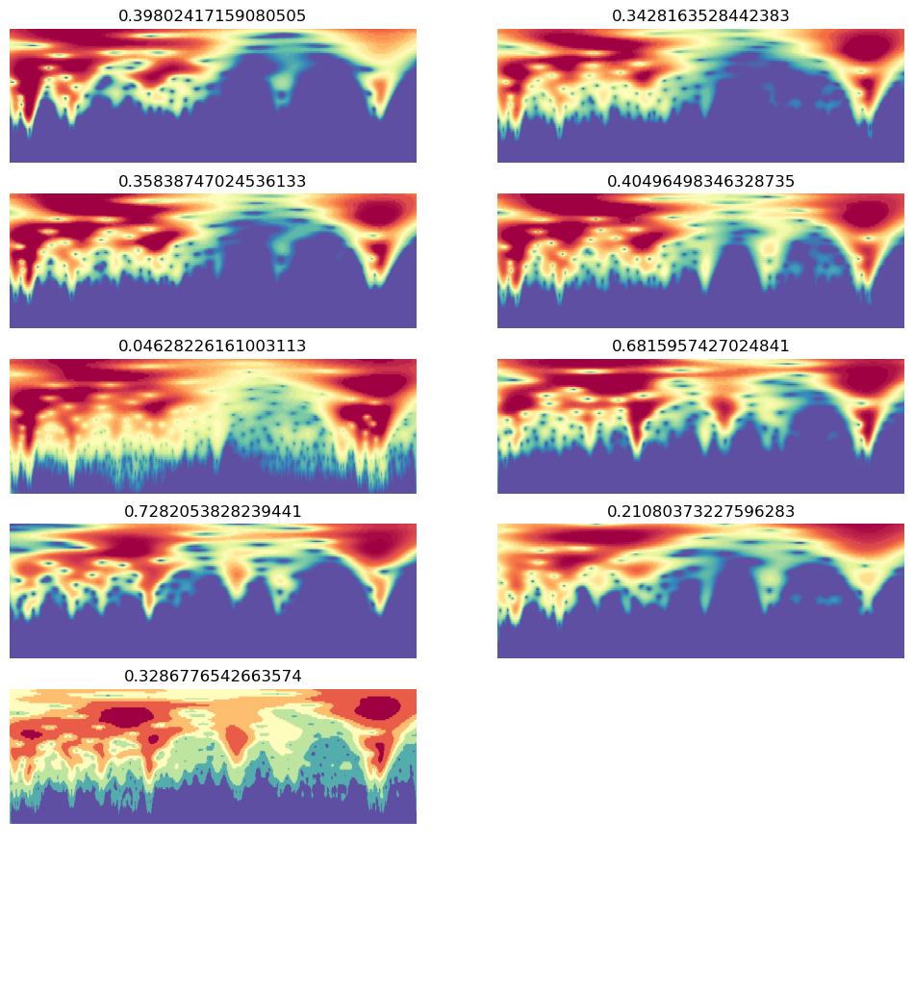

``` python
learn.dls = dls
```

``` python
# learn.summary()
```

``` python
learn.freeze()
```

``` python
# learn.summary()
```

``` python
learn.lr_find()
```

<style>
    /* Turns off some styling */
    progress {
        /* gets rid of default border in Firefox and Opera. */
        border: none;
        /* Needs to be in here for Safari polyfill so background images work as expected. */
        background-size: auto;
    }
    progress:not([value]), progress:not([value])::-webkit-progress-bar {
        background: repeating-linear-gradient(45deg, #7e7e7e, #7e7e7e 10px, #5c5c5c 10px, #5c5c5c 20px);
    }
    .progress-bar-interrupted, .progress-bar-interrupted::-webkit-progress-bar {
        background: #F44336;
    }
</style>

    SuggestedLRs(valley=0.0014454397605732083)

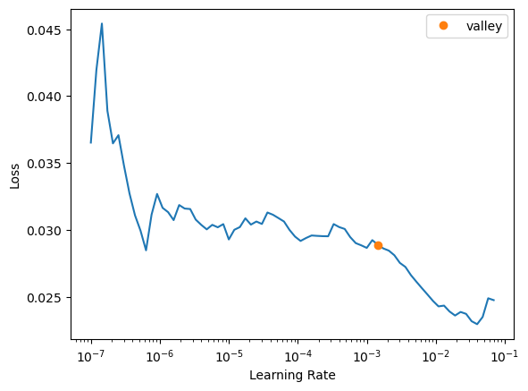

``` python
learn.fit_one_cycle(1, 1.5e-3)
```

<style>
    /* Turns off some styling */
    progress {
        /* gets rid of default border in Firefox and Opera. */
        border: none;
        /* Needs to be in here for Safari polyfill so background images work as expected. */
        background-size: auto;
    }
    progress:not([value]), progress:not([value])::-webkit-progress-bar {
        background: repeating-linear-gradient(45deg, #7e7e7e, #7e7e7e 10px, #5c5c5c 10px, #5c5c5c 20px);
    }
    .progress-bar-interrupted, .progress-bar-interrupted::-webkit-progress-bar {
        background: #F44336;
    }
</style>

<table class="dataframe" data-quarto-postprocess="true" data-border="1">
<thead>
<tr class="header" style="text-align: left;">
<th data-quarto-table-cell-role="th">epoch</th>
<th data-quarto-table-cell-role="th">train_loss</th>
<th data-quarto-table-cell-role="th">valid_loss</th>
<th data-quarto-table-cell-role="th">r2_score</th>
<th data-quarto-table-cell-role="th">time</th>
</tr>
</thead>
<tbody>
<tr class="odd">
<td>0</td>
<td>0.033352</td>
<td>0.007514</td>
<td>0.877129</td>
<td>00:02</td>
</tr>
</tbody>
</table>

``` python
val_preds, val_targets = learn.get_preds(dl=dls.valid)
r2_score(val_targets, val_preds)
```

<style>
    /* Turns off some styling */
    progress {
        /* gets rid of default border in Firefox and Opera. */
        border: none;
        /* Needs to be in here for Safari polyfill so background images work as expected. */
        background-size: auto;
    }
    progress:not([value]), progress:not([value])::-webkit-progress-bar {
        background: repeating-linear-gradient(45deg, #7e7e7e, #7e7e7e 10px, #5c5c5c 10px, #5c5c5c 20px);
    }
    .progress-bar-interrupted, .progress-bar-interrupted::-webkit-progress-bar {
        background: #F44336;
    }
</style>

    InvalidParameterError: The 'y_true' parameter of r2_score must be an array-like. Got None instead.
    ---------------------------------------------------------------------------
    InvalidParameterError                     Traceback (most recent call last)
    Cell In[131], line 2
          1 val_preds, val_targets = learn.get_preds(dl=dls.valid)
    ----> 2 r2_score(val_targets, val_preds)

    File ~/mambaforge/envs/uhina/lib/python3.12/site-packages/sklearn/utils/_param_validation.py:203, in validate_params.<locals>.decorator.<locals>.wrapper(*args, **kwargs)
        200 to_ignore += ["self", "cls"]
        201 params = {k: v for k, v in params.arguments.items() if k not in to_ignore}
    --> 203 validate_parameter_constraints(
        204     parameter_constraints, params, caller_name=func.__qualname__
        205 )
        207 try:
        208     with config_context(
        209         skip_parameter_validation=(
        210             prefer_skip_nested_validation or global_skip_validation
        211         )
        212     ):

    File ~/mambaforge/envs/uhina/lib/python3.12/site-packages/sklearn/utils/_param_validation.py:95, in validate_parameter_constraints(parameter_constraints, params, caller_name)
         89 else:
         90     constraints_str = (
         91         f"{', '.join([str(c) for c in constraints[:-1]])} or"
         92         f" {constraints[-1]}"
         93     )
    ---> 95 raise InvalidParameterError(
         96     f"The {param_name!r} parameter of {caller_name} must be"
         97     f" {constraints_str}. Got {param_val!r} instead."
         98 )

    InvalidParameterError: The 'y_true' parameter of r2_score must be an array-like. Got None instead.

### Evaluate fine-tuned model

``` python
len(test_df)
```

    14

``` python
dblock = DataBlock(blocks=(ImageBlock, RegressionBlock),
                   get_x=ColReader(0, pref='../../_data/ringtrial-tfm/im/'),
                   get_y=ColReader(1),
                   splitter=RandomSplitter(valid_pct=0, seed=41),
                   item_tfms=[OrderedQuantize(n_valid=len(test_df))],
                   batch_tfms=[
                       OrderedRatioResize(224),
                       Normalize.from_stats(*imagenet_stats)]
                   )

dls = dblock.dataloaders(test_df, bs=len(test_df))
```

``` python
val_preds, val_targets = learn.get_preds(dl=dls.train)
```

<style>
    /* Turns off some styling */
    progress {
        /* gets rid of default border in Firefox and Opera. */
        border: none;
        /* Needs to be in here for Safari polyfill so background images work as expected. */
        background-size: auto;
    }
    progress:not([value]), progress:not([value])::-webkit-progress-bar {
        background: repeating-linear-gradient(45deg, #7e7e7e, #7e7e7e 10px, #5c5c5c 10px, #5c5c5c 20px);
    }
    .progress-bar-interrupted, .progress-bar-interrupted::-webkit-progress-bar {
        background: #F44336;
    }
</style>

``` python
r2_score(val_targets, val_preds)
```

    0.18065004067315227

``` python
val_preds, val_targets = learn.tta(dl=dls.train, n=30)
```

<style>
    /* Turns off some styling */
    progress {
        /* gets rid of default border in Firefox and Opera. */
        border: none;
        /* Needs to be in here for Safari polyfill so background images work as expected. */
        background-size: auto;
    }
    progress:not([value]), progress:not([value])::-webkit-progress-bar {
        background: repeating-linear-gradient(45deg, #7e7e7e, #7e7e7e 10px, #5c5c5c 10px, #5c5c5c 20px);
    }
    .progress-bar-interrupted, .progress-bar-interrupted::-webkit-progress-bar {
        background: #F44336;
    }
</style>

    <div>
      <progress value='0' class='' max='1' style='width:300px; height:20px; vertical-align: middle;'></progress>
      &#10;    </div>
    

<style>
    /* Turns off some styling */
    progress {
        /* gets rid of default border in Firefox and Opera. */
        border: none;
        /* Needs to be in here for Safari polyfill so background images work as expected. */
        background-size: auto;
    }
    progress:not([value]), progress:not([value])::-webkit-progress-bar {
        background: repeating-linear-gradient(45deg, #7e7e7e, #7e7e7e 10px, #5c5c5c 10px, #5c5c5c 20px);
    }
    .progress-bar-interrupted, .progress-bar-interrupted::-webkit-progress-bar {
        background: #F44336;
    }
</style>

``` python
r2_score(val_targets, val_preds)
```

    0.31174768615708437

``` python
np.c_[val_preds, val_targets]
```

    array([[0.28596842, 0.33855578],
           [0.34872288, 0.30652836],
           [0.16156155, 0.1735919 ],
           [0.15021066, 0.20984755],
           [0.7913804 , 0.6738828 ],
           [0.6016631 , 0.9769003 ],
           [0.12963496, 0.23827647],
           [0.476924  , 0.3966867 ],
           [0.41498667, 0.44661984],
           [0.3885079 , 0.26271036],
           [0.4440051 , 0.49547035],
           [0.1741274 , 0.13462704],
           [0.38449523, 0.40078753],
           [0.5929916 , 0.6768349 ]], dtype=float32)

<table>
<thead>
<tr class="header">
<th>lab</th>
<th>lr</th>
<th>n_epochs (fine-tuning)</th>
<th>r2_score</th>
<th>n_tta</th>
</tr>
</thead>
<tbody>
<tr class="odd">
<td>iaea-aug2022</td>
<td>1.5e-3</td>
<td>20</td>
<td>0.867</td>
<td>30</td>
</tr>
<tr class="even">
<td>kssl</td>
<td>1.5e-3</td>
<td>20</td>
<td>0.931</td>
<td>30</td>
</tr>
</tbody>
</table>

<!-- | kssl | 1e-3 | 5 | 0.89 | 30 |
| agrocares | 1e-3 | 20 | 0.75 | 30 |
| argonne | 1e-3 | 5 | 0.92 | 30 |
&#10;| csu-il | 1e-3 | 5 | 0.85 | 30 |
| eth-alpha-1 | 1e-3 | 30 | 0.93 | 30 |
&#10; -->

``` python
learn.predict('/Users/franckalbinet/pro/dev/uhina/_data/ringtrial-tfm/im/kssl-rt-01.png')
```

<style>
    /* Turns off some styling */
    progress {
        /* gets rid of default border in Firefox and Opera. */
        border: none;
        /* Needs to be in here for Safari polyfill so background images work as expected. */
        background-size: auto;
    }
    progress:not([value]), progress:not([value])::-webkit-progress-bar {
        background: repeating-linear-gradient(45deg, #7e7e7e, #7e7e7e 10px, #5c5c5c 10px, #5c5c5c 20px);
    }
    .progress-bar-interrupted, .progress-bar-interrupted::-webkit-progress-bar {
        background: #F44336;
    }
</style>

    ((0.2232206165790558,), tensor([0.2232]), tensor([0.2232]))

``` python
np.c_[val_preds, val_targets]
```

    array([[0.573713  , 0.66205376],
           [0.23120013, 0.25548682],
           [0.29060498, 0.23827647],
           [0.3890785 , 0.3588835 ],
           [0.72690636, 0.6738828 ],
           [0.52095914, 0.48211747],
           [0.5956749 , 0.6768349 ],
           [0.55163294, 0.71829337],
           [0.41514462, 0.46985987],
           [0.6461811 , 0.73577553],
           [0.3656289 , 0.24990232],
           [0.6311119 , 0.68159574],
           [0.16741446, 0.1476956 ],
           [0.3227809 , 0.31551853]], dtype=float32)

``` python
x, y = val_preds, val_targets
plt.plot(x, y, '.')
# Add the diagonal line
min_val = min(y.min(), x.min())
max_val = max(y.max(), x.max())
plt.plot([min_val, max_val], [min_val, max_val], 'k--', lw=1)
```

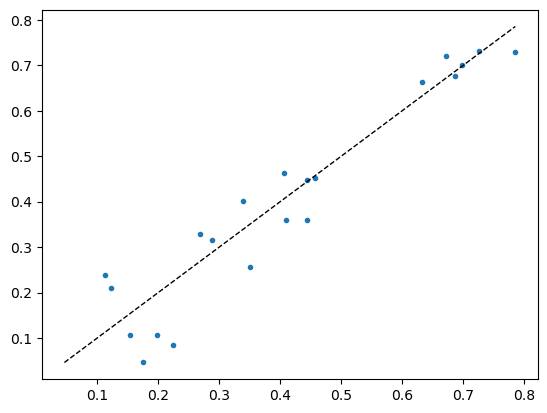

### On single images

``` python
def predict_with_transforms(learn, img_path, n_predictions=5):
    # Load the image
    img = PILImage.create(img_path)
    
    # Create instances of the transforms
    ratio_resize = RatioResize(224)
    quantize = Quantize()
    
    predictions = []
    for _ in range(n_predictions):
        # Apply transforms
        img_resized = ratio_resize(img)
        img_quantized = quantize(img_resized)
        
        # Predict
        pred, _, _ = learn.predict(img_quantized)
        predictions.append(pred[0])
    
    from statistics import mode
    # Calculate mean and standard deviation
    mean_pred = np.mean(predictions)
    std_pred = np.std(predictions)
    median_pred = np.median(predictions)
    mode_pred = mode(predictions)
    return mean_pred, std_pred, median_pred, mode_pred, predictions
```

``` python
test_df
```

<div>
<style scoped>
    .dataframe tbody tr th:only-of-type {
        vertical-align: middle;
    }
&#10;    .dataframe tbody tr th {
        vertical-align: top;
    }
&#10;    .dataframe thead th {
        text-align: right;
    }
</style>

<table class="dataframe" data-quarto-postprocess="true" data-border="1">
<thead>
<tr class="header" style="text-align: right;">
<th data-quarto-table-cell-role="th"></th>
<th data-quarto-table-cell-role="th">fname</th>
<th data-quarto-table-cell-role="th">potassium_cmolkg</th>
<th data-quarto-table-cell-role="th">lab</th>
</tr>
</thead>
<tbody>
<tr class="odd">
<td data-quarto-table-cell-role="th">416</td>
<td>iaea-aug2022-rt-03.png</td>
<td>0.255487</td>
<td>iaea-aug2022</td>
</tr>
<tr class="even">
<td data-quarto-table-cell-role="th">453</td>
<td>iaea-aug2022-rt-40.png</td>
<td>0.673883</td>
<td>iaea-aug2022</td>
</tr>
<tr class="odd">
<td data-quarto-table-cell-role="th">414</td>
<td>iaea-aug2022-rt-01.png</td>
<td>0.238276</td>
<td>iaea-aug2022</td>
</tr>
<tr class="even">
<td data-quarto-table-cell-role="th">441</td>
<td>iaea-aug2022-rt-28.png</td>
<td>0.676835</td>
<td>iaea-aug2022</td>
</tr>
<tr class="odd">
<td data-quarto-table-cell-role="th">470</td>
<td>iaea-aug2022-rt-58.png</td>
<td>0.735776</td>
<td>iaea-aug2022</td>
</tr>
<tr class="even">
<td data-quarto-table-cell-role="th">423</td>
<td>iaea-aug2022-rt-10.png</td>
<td>0.315519</td>
<td>iaea-aug2022</td>
</tr>
<tr class="odd">
<td data-quarto-table-cell-role="th">429</td>
<td>iaea-aug2022-rt-16.png</td>
<td>0.662054</td>
<td>iaea-aug2022</td>
</tr>
<tr class="even">
<td data-quarto-table-cell-role="th">468</td>
<td>iaea-aug2022-rt-56.png</td>
<td>0.718293</td>
<td>iaea-aug2022</td>
</tr>
<tr class="odd">
<td data-quarto-table-cell-role="th">428</td>
<td>iaea-aug2022-rt-15.png</td>
<td>0.482117</td>
<td>iaea-aug2022</td>
</tr>
<tr class="even">
<td data-quarto-table-cell-role="th">467</td>
<td>iaea-aug2022-rt-55.png</td>
<td>0.358884</td>
<td>iaea-aug2022</td>
</tr>
<tr class="odd">
<td data-quarto-table-cell-role="th">481</td>
<td>iaea-aug2022-rt-69.png</td>
<td>0.681596</td>
<td>iaea-aug2022</td>
</tr>
<tr class="even">
<td data-quarto-table-cell-role="th">440</td>
<td>iaea-aug2022-rt-27.png</td>
<td>0.147696</td>
<td>iaea-aug2022</td>
</tr>
<tr class="odd">
<td data-quarto-table-cell-role="th">475</td>
<td>iaea-aug2022-rt-63.png</td>
<td>0.249902</td>
<td>iaea-aug2022</td>
</tr>
<tr class="even">
<td data-quarto-table-cell-role="th">418</td>
<td>iaea-aug2022-rt-05.png</td>
<td>0.469860</td>
<td>iaea-aug2022</td>
</tr>
</tbody>
</table>

</div>

``` python
learn.predict('/Users/franckalbinet/pro/dev/uhina/_data/ringtrial-tfm/im/iaea-aug2022-rt-03.png')
```

<style>
    /* Turns off some styling */
    progress {
        /* gets rid of default border in Firefox and Opera. */
        border: none;
        /* Needs to be in here for Safari polyfill so background images work as expected. */
        background-size: auto;
    }
    progress:not([value]), progress:not([value])::-webkit-progress-bar {
        background: repeating-linear-gradient(45deg, #7e7e7e, #7e7e7e 10px, #5c5c5c 10px, #5c5c5c 20px);
    }
    .progress-bar-interrupted, .progress-bar-interrupted::-webkit-progress-bar {
        background: #F44336;
    }
</style>

    ((0.22924283146858215,), tensor([0.2292]), tensor([0.2292]))

``` python
def predict_with_tta_histogram(learn, img_path, n_tta=40):
    # Load the image
    img = PILImage.create(img_path)
    
    # Create a test DataLoader with a single image
    test_dl = learn.dls.test_dl([img])
    
    # Collect predictions
    all_preds = []
    for _ in range(n_tta):
        # Get prediction with TTA (n=1 for a single augmentation each time)
        preds, _ = learn.tta(dl=test_dl, n=1)
        all_preds.append(preds[0][0].item())  # Assuming single output
    
    all_preds = np.array(all_preds)
    
    # Calculate statistics
    mean_pred = np.mean(all_preds)
    std_pred = np.std(all_preds)
    median_pred = np.median(all_preds)
    
    return mean_pred, std_pred, median_pred, all_preds
```

``` python
# Use the function
fname = 'iaea-aug2022-rt-03.png'
img_path = Path('/Users/franckalbinet/pro/dev/uhina/_data/ringtrial-tfm/im/') / fname
mean, std, median, all_preds = predict_with_tta_histogram(learn, img_path, n_tta=30)

print(f"Mean prediction: {mean:.4f}")
print(f"Standard deviation: {std:.4f}")
print(f"Median prediction: {median:.4f}")
print(f"All predictions: {all_preds}")

# If you want to compare with the ground truth
print('Ground truth:', df[df.fname == fname]['potassium_cmolkg'].values[0])

# Plot histogram
plt.hist(all_preds, bins=10)
plt.title('Histogram of TTA Predictions')
plt.xlabel('Predicted Value')
plt.ylabel('Frequency')
plt.show()
```

<style>
    /* Turns off some styling */
    progress {
        /* gets rid of default border in Firefox and Opera. */
        border: none;
        /* Needs to be in here for Safari polyfill so background images work as expected. */
        background-size: auto;
    }
    progress:not([value]), progress:not([value])::-webkit-progress-bar {
        background: repeating-linear-gradient(45deg, #7e7e7e, #7e7e7e 10px, #5c5c5c 10px, #5c5c5c 20px);
    }
    .progress-bar-interrupted, .progress-bar-interrupted::-webkit-progress-bar {
        background: #F44336;
    }
</style>

    <div>
      <progress value='0' class='' max='20' style='width:300px; height:20px; vertical-align: middle;'></progress>
      &#10;    </div>
    

<style>
    /* Turns off some styling */
    progress {
        /* gets rid of default border in Firefox and Opera. */
        border: none;
        /* Needs to be in here for Safari polyfill so background images work as expected. */
        background-size: auto;
    }
    progress:not([value]), progress:not([value])::-webkit-progress-bar {
        background: repeating-linear-gradient(45deg, #7e7e7e, #7e7e7e 10px, #5c5c5c 10px, #5c5c5c 20px);
    }
    .progress-bar-interrupted, .progress-bar-interrupted::-webkit-progress-bar {
        background: #F44336;
    }
</style>


<style>
    /* Turns off some styling */
    progress {
        /* gets rid of default border in Firefox and Opera. */
        border: none;
        /* Needs to be in here for Safari polyfill so background images work as expected. */
        background-size: auto;
    }
    progress:not([value]), progress:not([value])::-webkit-progress-bar {
        background: repeating-linear-gradient(45deg, #7e7e7e, #7e7e7e 10px, #5c5c5c 10px, #5c5c5c 20px);
    }
    .progress-bar-interrupted, .progress-bar-interrupted::-webkit-progress-bar {
        background: #F44336;
    }
</style>

    <div>
      <progress value='0' class='' max='20' style='width:300px; height:20px; vertical-align: middle;'></progress>
      &#10;    </div>
    

<style>
    /* Turns off some styling */
    progress {
        /* gets rid of default border in Firefox and Opera. */
        border: none;
        /* Needs to be in here for Safari polyfill so background images work as expected. */
        background-size: auto;
    }
    progress:not([value]), progress:not([value])::-webkit-progress-bar {
        background: repeating-linear-gradient(45deg, #7e7e7e, #7e7e7e 10px, #5c5c5c 10px, #5c5c5c 20px);
    }
    .progress-bar-interrupted, .progress-bar-interrupted::-webkit-progress-bar {
        background: #F44336;
    }
</style>


<style>
    /* Turns off some styling */
    progress {
        /* gets rid of default border in Firefox and Opera. */
        border: none;
        /* Needs to be in here for Safari polyfill so background images work as expected. */
        background-size: auto;
    }
    progress:not([value]), progress:not([value])::-webkit-progress-bar {
        background: repeating-linear-gradient(45deg, #7e7e7e, #7e7e7e 10px, #5c5c5c 10px, #5c5c5c 20px);
    }
    .progress-bar-interrupted, .progress-bar-interrupted::-webkit-progress-bar {
        background: #F44336;
    }
</style>

    <div>
      <progress value='0' class='' max='20' style='width:300px; height:20px; vertical-align: middle;'></progress>
      &#10;    </div>
    

<style>
    /* Turns off some styling */
    progress {
        /* gets rid of default border in Firefox and Opera. */
        border: none;
        /* Needs to be in here for Safari polyfill so background images work as expected. */
        background-size: auto;
    }
    progress:not([value]), progress:not([value])::-webkit-progress-bar {
        background: repeating-linear-gradient(45deg, #7e7e7e, #7e7e7e 10px, #5c5c5c 10px, #5c5c5c 20px);
    }
    .progress-bar-interrupted, .progress-bar-interrupted::-webkit-progress-bar {
        background: #F44336;
    }
</style>


<style>
    /* Turns off some styling */
    progress {
        /* gets rid of default border in Firefox and Opera. */
        border: none;
        /* Needs to be in here for Safari polyfill so background images work as expected. */
        background-size: auto;
    }
    progress:not([value]), progress:not([value])::-webkit-progress-bar {
        background: repeating-linear-gradient(45deg, #7e7e7e, #7e7e7e 10px, #5c5c5c 10px, #5c5c5c 20px);
    }
    .progress-bar-interrupted, .progress-bar-interrupted::-webkit-progress-bar {
        background: #F44336;
    }
</style>

    <div>
      <progress value='0' class='' max='20' style='width:300px; height:20px; vertical-align: middle;'></progress>
      &#10;    </div>
    

<style>
    /* Turns off some styling */
    progress {
        /* gets rid of default border in Firefox and Opera. */
        border: none;
        /* Needs to be in here for Safari polyfill so background images work as expected. */
        background-size: auto;
    }
    progress:not([value]), progress:not([value])::-webkit-progress-bar {
        background: repeating-linear-gradient(45deg, #7e7e7e, #7e7e7e 10px, #5c5c5c 10px, #5c5c5c 20px);
    }
    .progress-bar-interrupted, .progress-bar-interrupted::-webkit-progress-bar {
        background: #F44336;
    }
</style>


<style>
    /* Turns off some styling */
    progress {
        /* gets rid of default border in Firefox and Opera. */
        border: none;
        /* Needs to be in here for Safari polyfill so background images work as expected. */
        background-size: auto;
    }
    progress:not([value]), progress:not([value])::-webkit-progress-bar {
        background: repeating-linear-gradient(45deg, #7e7e7e, #7e7e7e 10px, #5c5c5c 10px, #5c5c5c 20px);
    }
    .progress-bar-interrupted, .progress-bar-interrupted::-webkit-progress-bar {
        background: #F44336;
    }
</style>

    <div>
      <progress value='0' class='' max='20' style='width:300px; height:20px; vertical-align: middle;'></progress>
      &#10;    </div>
    

<style>
    /* Turns off some styling */
    progress {
        /* gets rid of default border in Firefox and Opera. */
        border: none;
        /* Needs to be in here for Safari polyfill so background images work as expected. */
        background-size: auto;
    }
    progress:not([value]), progress:not([value])::-webkit-progress-bar {
        background: repeating-linear-gradient(45deg, #7e7e7e, #7e7e7e 10px, #5c5c5c 10px, #5c5c5c 20px);
    }
    .progress-bar-interrupted, .progress-bar-interrupted::-webkit-progress-bar {
        background: #F44336;
    }
</style>


<style>
    /* Turns off some styling */
    progress {
        /* gets rid of default border in Firefox and Opera. */
        border: none;
        /* Needs to be in here for Safari polyfill so background images work as expected. */
        background-size: auto;
    }
    progress:not([value]), progress:not([value])::-webkit-progress-bar {
        background: repeating-linear-gradient(45deg, #7e7e7e, #7e7e7e 10px, #5c5c5c 10px, #5c5c5c 20px);
    }
    .progress-bar-interrupted, .progress-bar-interrupted::-webkit-progress-bar {
        background: #F44336;
    }
</style>

    <div>
      <progress value='0' class='' max='20' style='width:300px; height:20px; vertical-align: middle;'></progress>
      &#10;    </div>
    

<style>
    /* Turns off some styling */
    progress {
        /* gets rid of default border in Firefox and Opera. */
        border: none;
        /* Needs to be in here for Safari polyfill so background images work as expected. */
        background-size: auto;
    }
    progress:not([value]), progress:not([value])::-webkit-progress-bar {
        background: repeating-linear-gradient(45deg, #7e7e7e, #7e7e7e 10px, #5c5c5c 10px, #5c5c5c 20px);
    }
    .progress-bar-interrupted, .progress-bar-interrupted::-webkit-progress-bar {
        background: #F44336;
    }
</style>


<style>
    /* Turns off some styling */
    progress {
        /* gets rid of default border in Firefox and Opera. */
        border: none;
        /* Needs to be in here for Safari polyfill so background images work as expected. */
        background-size: auto;
    }
    progress:not([value]), progress:not([value])::-webkit-progress-bar {
        background: repeating-linear-gradient(45deg, #7e7e7e, #7e7e7e 10px, #5c5c5c 10px, #5c5c5c 20px);
    }
    .progress-bar-interrupted, .progress-bar-interrupted::-webkit-progress-bar {
        background: #F44336;
    }
</style>

    <div>
      <progress value='0' class='' max='20' style='width:300px; height:20px; vertical-align: middle;'></progress>
      &#10;    </div>
    

<style>
    /* Turns off some styling */
    progress {
        /* gets rid of default border in Firefox and Opera. */
        border: none;
        /* Needs to be in here for Safari polyfill so background images work as expected. */
        background-size: auto;
    }
    progress:not([value]), progress:not([value])::-webkit-progress-bar {
        background: repeating-linear-gradient(45deg, #7e7e7e, #7e7e7e 10px, #5c5c5c 10px, #5c5c5c 20px);
    }
    .progress-bar-interrupted, .progress-bar-interrupted::-webkit-progress-bar {
        background: #F44336;
    }
</style>


<style>
    /* Turns off some styling */
    progress {
        /* gets rid of default border in Firefox and Opera. */
        border: none;
        /* Needs to be in here for Safari polyfill so background images work as expected. */
        background-size: auto;
    }
    progress:not([value]), progress:not([value])::-webkit-progress-bar {
        background: repeating-linear-gradient(45deg, #7e7e7e, #7e7e7e 10px, #5c5c5c 10px, #5c5c5c 20px);
    }
    .progress-bar-interrupted, .progress-bar-interrupted::-webkit-progress-bar {
        background: #F44336;
    }
</style>

    <div>
      <progress value='0' class='' max='20' style='width:300px; height:20px; vertical-align: middle;'></progress>
      &#10;    </div>
    

<style>
    /* Turns off some styling */
    progress {
        /* gets rid of default border in Firefox and Opera. */
        border: none;
        /* Needs to be in here for Safari polyfill so background images work as expected. */
        background-size: auto;
    }
    progress:not([value]), progress:not([value])::-webkit-progress-bar {
        background: repeating-linear-gradient(45deg, #7e7e7e, #7e7e7e 10px, #5c5c5c 10px, #5c5c5c 20px);
    }
    .progress-bar-interrupted, .progress-bar-interrupted::-webkit-progress-bar {
        background: #F44336;
    }
</style>


<style>
    /* Turns off some styling */
    progress {
        /* gets rid of default border in Firefox and Opera. */
        border: none;
        /* Needs to be in here for Safari polyfill so background images work as expected. */
        background-size: auto;
    }
    progress:not([value]), progress:not([value])::-webkit-progress-bar {
        background: repeating-linear-gradient(45deg, #7e7e7e, #7e7e7e 10px, #5c5c5c 10px, #5c5c5c 20px);
    }
    .progress-bar-interrupted, .progress-bar-interrupted::-webkit-progress-bar {
        background: #F44336;
    }
</style>

    <div>
      <progress value='0' class='' max='20' style='width:300px; height:20px; vertical-align: middle;'></progress>
      &#10;    </div>
    

<style>
    /* Turns off some styling */
    progress {
        /* gets rid of default border in Firefox and Opera. */
        border: none;
        /* Needs to be in here for Safari polyfill so background images work as expected. */
        background-size: auto;
    }
    progress:not([value]), progress:not([value])::-webkit-progress-bar {
        background: repeating-linear-gradient(45deg, #7e7e7e, #7e7e7e 10px, #5c5c5c 10px, #5c5c5c 20px);
    }
    .progress-bar-interrupted, .progress-bar-interrupted::-webkit-progress-bar {
        background: #F44336;
    }
</style>


<style>
    /* Turns off some styling */
    progress {
        /* gets rid of default border in Firefox and Opera. */
        border: none;
        /* Needs to be in here for Safari polyfill so background images work as expected. */
        background-size: auto;
    }
    progress:not([value]), progress:not([value])::-webkit-progress-bar {
        background: repeating-linear-gradient(45deg, #7e7e7e, #7e7e7e 10px, #5c5c5c 10px, #5c5c5c 20px);
    }
    .progress-bar-interrupted, .progress-bar-interrupted::-webkit-progress-bar {
        background: #F44336;
    }
</style>

    <div>
      <progress value='0' class='' max='20' style='width:300px; height:20px; vertical-align: middle;'></progress>
      &#10;    </div>
    

<style>
    /* Turns off some styling */
    progress {
        /* gets rid of default border in Firefox and Opera. */
        border: none;
        /* Needs to be in here for Safari polyfill so background images work as expected. */
        background-size: auto;
    }
    progress:not([value]), progress:not([value])::-webkit-progress-bar {
        background: repeating-linear-gradient(45deg, #7e7e7e, #7e7e7e 10px, #5c5c5c 10px, #5c5c5c 20px);
    }
    .progress-bar-interrupted, .progress-bar-interrupted::-webkit-progress-bar {
        background: #F44336;
    }
</style>


<style>
    /* Turns off some styling */
    progress {
        /* gets rid of default border in Firefox and Opera. */
        border: none;
        /* Needs to be in here for Safari polyfill so background images work as expected. */
        background-size: auto;
    }
    progress:not([value]), progress:not([value])::-webkit-progress-bar {
        background: repeating-linear-gradient(45deg, #7e7e7e, #7e7e7e 10px, #5c5c5c 10px, #5c5c5c 20px);
    }
    .progress-bar-interrupted, .progress-bar-interrupted::-webkit-progress-bar {
        background: #F44336;
    }
</style>

    <div>
      <progress value='0' class='' max='20' style='width:300px; height:20px; vertical-align: middle;'></progress>
      &#10;    </div>
    

<style>
    /* Turns off some styling */
    progress {
        /* gets rid of default border in Firefox and Opera. */
        border: none;
        /* Needs to be in here for Safari polyfill so background images work as expected. */
        background-size: auto;
    }
    progress:not([value]), progress:not([value])::-webkit-progress-bar {
        background: repeating-linear-gradient(45deg, #7e7e7e, #7e7e7e 10px, #5c5c5c 10px, #5c5c5c 20px);
    }
    .progress-bar-interrupted, .progress-bar-interrupted::-webkit-progress-bar {
        background: #F44336;
    }
</style>


<style>
    /* Turns off some styling */
    progress {
        /* gets rid of default border in Firefox and Opera. */
        border: none;
        /* Needs to be in here for Safari polyfill so background images work as expected. */
        background-size: auto;
    }
    progress:not([value]), progress:not([value])::-webkit-progress-bar {
        background: repeating-linear-gradient(45deg, #7e7e7e, #7e7e7e 10px, #5c5c5c 10px, #5c5c5c 20px);
    }
    .progress-bar-interrupted, .progress-bar-interrupted::-webkit-progress-bar {
        background: #F44336;
    }
</style>

    <div>
      <progress value='0' class='' max='20' style='width:300px; height:20px; vertical-align: middle;'></progress>
      &#10;    </div>
    

<style>
    /* Turns off some styling */
    progress {
        /* gets rid of default border in Firefox and Opera. */
        border: none;
        /* Needs to be in here for Safari polyfill so background images work as expected. */
        background-size: auto;
    }
    progress:not([value]), progress:not([value])::-webkit-progress-bar {
        background: repeating-linear-gradient(45deg, #7e7e7e, #7e7e7e 10px, #5c5c5c 10px, #5c5c5c 20px);
    }
    .progress-bar-interrupted, .progress-bar-interrupted::-webkit-progress-bar {
        background: #F44336;
    }
</style>


<style>
    /* Turns off some styling */
    progress {
        /* gets rid of default border in Firefox and Opera. */
        border: none;
        /* Needs to be in here for Safari polyfill so background images work as expected. */
        background-size: auto;
    }
    progress:not([value]), progress:not([value])::-webkit-progress-bar {
        background: repeating-linear-gradient(45deg, #7e7e7e, #7e7e7e 10px, #5c5c5c 10px, #5c5c5c 20px);
    }
    .progress-bar-interrupted, .progress-bar-interrupted::-webkit-progress-bar {
        background: #F44336;
    }
</style>

    <div>
      <progress value='0' class='' max='20' style='width:300px; height:20px; vertical-align: middle;'></progress>
      &#10;    </div>
    

<style>
    /* Turns off some styling */
    progress {
        /* gets rid of default border in Firefox and Opera. */
        border: none;
        /* Needs to be in here for Safari polyfill so background images work as expected. */
        background-size: auto;
    }
    progress:not([value]), progress:not([value])::-webkit-progress-bar {
        background: repeating-linear-gradient(45deg, #7e7e7e, #7e7e7e 10px, #5c5c5c 10px, #5c5c5c 20px);
    }
    .progress-bar-interrupted, .progress-bar-interrupted::-webkit-progress-bar {
        background: #F44336;
    }
</style>


<style>
    /* Turns off some styling */
    progress {
        /* gets rid of default border in Firefox and Opera. */
        border: none;
        /* Needs to be in here for Safari polyfill so background images work as expected. */
        background-size: auto;
    }
    progress:not([value]), progress:not([value])::-webkit-progress-bar {
        background: repeating-linear-gradient(45deg, #7e7e7e, #7e7e7e 10px, #5c5c5c 10px, #5c5c5c 20px);
    }
    .progress-bar-interrupted, .progress-bar-interrupted::-webkit-progress-bar {
        background: #F44336;
    }
</style>

    <div>
      <progress value='0' class='' max='20' style='width:300px; height:20px; vertical-align: middle;'></progress>
      &#10;    </div>
    

<style>
    /* Turns off some styling */
    progress {
        /* gets rid of default border in Firefox and Opera. */
        border: none;
        /* Needs to be in here for Safari polyfill so background images work as expected. */
        background-size: auto;
    }
    progress:not([value]), progress:not([value])::-webkit-progress-bar {
        background: repeating-linear-gradient(45deg, #7e7e7e, #7e7e7e 10px, #5c5c5c 10px, #5c5c5c 20px);
    }
    .progress-bar-interrupted, .progress-bar-interrupted::-webkit-progress-bar {
        background: #F44336;
    }
</style>


<style>
    /* Turns off some styling */
    progress {
        /* gets rid of default border in Firefox and Opera. */
        border: none;
        /* Needs to be in here for Safari polyfill so background images work as expected. */
        background-size: auto;
    }
    progress:not([value]), progress:not([value])::-webkit-progress-bar {
        background: repeating-linear-gradient(45deg, #7e7e7e, #7e7e7e 10px, #5c5c5c 10px, #5c5c5c 20px);
    }
    .progress-bar-interrupted, .progress-bar-interrupted::-webkit-progress-bar {
        background: #F44336;
    }
</style>

    <div>
      <progress value='0' class='' max='20' style='width:300px; height:20px; vertical-align: middle;'></progress>
      &#10;    </div>
    

<style>
    /* Turns off some styling */
    progress {
        /* gets rid of default border in Firefox and Opera. */
        border: none;
        /* Needs to be in here for Safari polyfill so background images work as expected. */
        background-size: auto;
    }
    progress:not([value]), progress:not([value])::-webkit-progress-bar {
        background: repeating-linear-gradient(45deg, #7e7e7e, #7e7e7e 10px, #5c5c5c 10px, #5c5c5c 20px);
    }
    .progress-bar-interrupted, .progress-bar-interrupted::-webkit-progress-bar {
        background: #F44336;
    }
</style>


<style>
    /* Turns off some styling */
    progress {
        /* gets rid of default border in Firefox and Opera. */
        border: none;
        /* Needs to be in here for Safari polyfill so background images work as expected. */
        background-size: auto;
    }
    progress:not([value]), progress:not([value])::-webkit-progress-bar {
        background: repeating-linear-gradient(45deg, #7e7e7e, #7e7e7e 10px, #5c5c5c 10px, #5c5c5c 20px);
    }
    .progress-bar-interrupted, .progress-bar-interrupted::-webkit-progress-bar {
        background: #F44336;
    }
</style>

    <div>
      <progress value='0' class='' max='20' style='width:300px; height:20px; vertical-align: middle;'></progress>
      &#10;    </div>
    

<style>
    /* Turns off some styling */
    progress {
        /* gets rid of default border in Firefox and Opera. */
        border: none;
        /* Needs to be in here for Safari polyfill so background images work as expected. */
        background-size: auto;
    }
    progress:not([value]), progress:not([value])::-webkit-progress-bar {
        background: repeating-linear-gradient(45deg, #7e7e7e, #7e7e7e 10px, #5c5c5c 10px, #5c5c5c 20px);
    }
    .progress-bar-interrupted, .progress-bar-interrupted::-webkit-progress-bar {
        background: #F44336;
    }
</style>


<style>
    /* Turns off some styling */
    progress {
        /* gets rid of default border in Firefox and Opera. */
        border: none;
        /* Needs to be in here for Safari polyfill so background images work as expected. */
        background-size: auto;
    }
    progress:not([value]), progress:not([value])::-webkit-progress-bar {
        background: repeating-linear-gradient(45deg, #7e7e7e, #7e7e7e 10px, #5c5c5c 10px, #5c5c5c 20px);
    }
    .progress-bar-interrupted, .progress-bar-interrupted::-webkit-progress-bar {
        background: #F44336;
    }
</style>

    <div>
      <progress value='0' class='' max='20' style='width:300px; height:20px; vertical-align: middle;'></progress>
      &#10;    </div>
    

<style>
    /* Turns off some styling */
    progress {
        /* gets rid of default border in Firefox and Opera. */
        border: none;
        /* Needs to be in here for Safari polyfill so background images work as expected. */
        background-size: auto;
    }
    progress:not([value]), progress:not([value])::-webkit-progress-bar {
        background: repeating-linear-gradient(45deg, #7e7e7e, #7e7e7e 10px, #5c5c5c 10px, #5c5c5c 20px);
    }
    .progress-bar-interrupted, .progress-bar-interrupted::-webkit-progress-bar {
        background: #F44336;
    }
</style>


<style>
    /* Turns off some styling */
    progress {
        /* gets rid of default border in Firefox and Opera. */
        border: none;
        /* Needs to be in here for Safari polyfill so background images work as expected. */
        background-size: auto;
    }
    progress:not([value]), progress:not([value])::-webkit-progress-bar {
        background: repeating-linear-gradient(45deg, #7e7e7e, #7e7e7e 10px, #5c5c5c 10px, #5c5c5c 20px);
    }
    .progress-bar-interrupted, .progress-bar-interrupted::-webkit-progress-bar {
        background: #F44336;
    }
</style>

    <div>
      <progress value='0' class='' max='20' style='width:300px; height:20px; vertical-align: middle;'></progress>
      &#10;    </div>
    

<style>
    /* Turns off some styling */
    progress {
        /* gets rid of default border in Firefox and Opera. */
        border: none;
        /* Needs to be in here for Safari polyfill so background images work as expected. */
        background-size: auto;
    }
    progress:not([value]), progress:not([value])::-webkit-progress-bar {
        background: repeating-linear-gradient(45deg, #7e7e7e, #7e7e7e 10px, #5c5c5c 10px, #5c5c5c 20px);
    }
    .progress-bar-interrupted, .progress-bar-interrupted::-webkit-progress-bar {
        background: #F44336;
    }
</style>


<style>
    /* Turns off some styling */
    progress {
        /* gets rid of default border in Firefox and Opera. */
        border: none;
        /* Needs to be in here for Safari polyfill so background images work as expected. */
        background-size: auto;
    }
    progress:not([value]), progress:not([value])::-webkit-progress-bar {
        background: repeating-linear-gradient(45deg, #7e7e7e, #7e7e7e 10px, #5c5c5c 10px, #5c5c5c 20px);
    }
    .progress-bar-interrupted, .progress-bar-interrupted::-webkit-progress-bar {
        background: #F44336;
    }
</style>

    <div>
      <progress value='0' class='' max='20' style='width:300px; height:20px; vertical-align: middle;'></progress>
      &#10;    </div>
    

<style>
    /* Turns off some styling */
    progress {
        /* gets rid of default border in Firefox and Opera. */
        border: none;
        /* Needs to be in here for Safari polyfill so background images work as expected. */
        background-size: auto;
    }
    progress:not([value]), progress:not([value])::-webkit-progress-bar {
        background: repeating-linear-gradient(45deg, #7e7e7e, #7e7e7e 10px, #5c5c5c 10px, #5c5c5c 20px);
    }
    .progress-bar-interrupted, .progress-bar-interrupted::-webkit-progress-bar {
        background: #F44336;
    }
</style>


<style>
    /* Turns off some styling */
    progress {
        /* gets rid of default border in Firefox and Opera. */
        border: none;
        /* Needs to be in here for Safari polyfill so background images work as expected. */
        background-size: auto;
    }
    progress:not([value]), progress:not([value])::-webkit-progress-bar {
        background: repeating-linear-gradient(45deg, #7e7e7e, #7e7e7e 10px, #5c5c5c 10px, #5c5c5c 20px);
    }
    .progress-bar-interrupted, .progress-bar-interrupted::-webkit-progress-bar {
        background: #F44336;
    }
</style>

    <div>
      <progress value='0' class='' max='20' style='width:300px; height:20px; vertical-align: middle;'></progress>
      &#10;    </div>
    

<style>
    /* Turns off some styling */
    progress {
        /* gets rid of default border in Firefox and Opera. */
        border: none;
        /* Needs to be in here for Safari polyfill so background images work as expected. */
        background-size: auto;
    }
    progress:not([value]), progress:not([value])::-webkit-progress-bar {
        background: repeating-linear-gradient(45deg, #7e7e7e, #7e7e7e 10px, #5c5c5c 10px, #5c5c5c 20px);
    }
    .progress-bar-interrupted, .progress-bar-interrupted::-webkit-progress-bar {
        background: #F44336;
    }
</style>


<style>
    /* Turns off some styling */
    progress {
        /* gets rid of default border in Firefox and Opera. */
        border: none;
        /* Needs to be in here for Safari polyfill so background images work as expected. */
        background-size: auto;
    }
    progress:not([value]), progress:not([value])::-webkit-progress-bar {
        background: repeating-linear-gradient(45deg, #7e7e7e, #7e7e7e 10px, #5c5c5c 10px, #5c5c5c 20px);
    }
    .progress-bar-interrupted, .progress-bar-interrupted::-webkit-progress-bar {
        background: #F44336;
    }
</style>

    <div>
      <progress value='0' class='' max='20' style='width:300px; height:20px; vertical-align: middle;'></progress>
      &#10;    </div>
    

<style>
    /* Turns off some styling */
    progress {
        /* gets rid of default border in Firefox and Opera. */
        border: none;
        /* Needs to be in here for Safari polyfill so background images work as expected. */
        background-size: auto;
    }
    progress:not([value]), progress:not([value])::-webkit-progress-bar {
        background: repeating-linear-gradient(45deg, #7e7e7e, #7e7e7e 10px, #5c5c5c 10px, #5c5c5c 20px);
    }
    .progress-bar-interrupted, .progress-bar-interrupted::-webkit-progress-bar {
        background: #F44336;
    }
</style>


<style>
    /* Turns off some styling */
    progress {
        /* gets rid of default border in Firefox and Opera. */
        border: none;
        /* Needs to be in here for Safari polyfill so background images work as expected. */
        background-size: auto;
    }
    progress:not([value]), progress:not([value])::-webkit-progress-bar {
        background: repeating-linear-gradient(45deg, #7e7e7e, #7e7e7e 10px, #5c5c5c 10px, #5c5c5c 20px);
    }
    .progress-bar-interrupted, .progress-bar-interrupted::-webkit-progress-bar {
        background: #F44336;
    }
</style>

    <div>
      <progress value='0' class='' max='20' style='width:300px; height:20px; vertical-align: middle;'></progress>
      &#10;    </div>
    

<style>
    /* Turns off some styling */
    progress {
        /* gets rid of default border in Firefox and Opera. */
        border: none;
        /* Needs to be in here for Safari polyfill so background images work as expected. */
        background-size: auto;
    }
    progress:not([value]), progress:not([value])::-webkit-progress-bar {
        background: repeating-linear-gradient(45deg, #7e7e7e, #7e7e7e 10px, #5c5c5c 10px, #5c5c5c 20px);
    }
    .progress-bar-interrupted, .progress-bar-interrupted::-webkit-progress-bar {
        background: #F44336;
    }
</style>


<style>
    /* Turns off some styling */
    progress {
        /* gets rid of default border in Firefox and Opera. */
        border: none;
        /* Needs to be in here for Safari polyfill so background images work as expected. */
        background-size: auto;
    }
    progress:not([value]), progress:not([value])::-webkit-progress-bar {
        background: repeating-linear-gradient(45deg, #7e7e7e, #7e7e7e 10px, #5c5c5c 10px, #5c5c5c 20px);
    }
    .progress-bar-interrupted, .progress-bar-interrupted::-webkit-progress-bar {
        background: #F44336;
    }
</style>

    <div>
      <progress value='0' class='' max='20' style='width:300px; height:20px; vertical-align: middle;'></progress>
      &#10;    </div>
    

<style>
    /* Turns off some styling */
    progress {
        /* gets rid of default border in Firefox and Opera. */
        border: none;
        /* Needs to be in here for Safari polyfill so background images work as expected. */
        background-size: auto;
    }
    progress:not([value]), progress:not([value])::-webkit-progress-bar {
        background: repeating-linear-gradient(45deg, #7e7e7e, #7e7e7e 10px, #5c5c5c 10px, #5c5c5c 20px);
    }
    .progress-bar-interrupted, .progress-bar-interrupted::-webkit-progress-bar {
        background: #F44336;
    }
</style>


<style>
    /* Turns off some styling */
    progress {
        /* gets rid of default border in Firefox and Opera. */
        border: none;
        /* Needs to be in here for Safari polyfill so background images work as expected. */
        background-size: auto;
    }
    progress:not([value]), progress:not([value])::-webkit-progress-bar {
        background: repeating-linear-gradient(45deg, #7e7e7e, #7e7e7e 10px, #5c5c5c 10px, #5c5c5c 20px);
    }
    .progress-bar-interrupted, .progress-bar-interrupted::-webkit-progress-bar {
        background: #F44336;
    }
</style>

    <div>
      <progress value='0' class='' max='20' style='width:300px; height:20px; vertical-align: middle;'></progress>
      &#10;    </div>
    

<style>
    /* Turns off some styling */
    progress {
        /* gets rid of default border in Firefox and Opera. */
        border: none;
        /* Needs to be in here for Safari polyfill so background images work as expected. */
        background-size: auto;
    }
    progress:not([value]), progress:not([value])::-webkit-progress-bar {
        background: repeating-linear-gradient(45deg, #7e7e7e, #7e7e7e 10px, #5c5c5c 10px, #5c5c5c 20px);
    }
    .progress-bar-interrupted, .progress-bar-interrupted::-webkit-progress-bar {
        background: #F44336;
    }
</style>


<style>
    /* Turns off some styling */
    progress {
        /* gets rid of default border in Firefox and Opera. */
        border: none;
        /* Needs to be in here for Safari polyfill so background images work as expected. */
        background-size: auto;
    }
    progress:not([value]), progress:not([value])::-webkit-progress-bar {
        background: repeating-linear-gradient(45deg, #7e7e7e, #7e7e7e 10px, #5c5c5c 10px, #5c5c5c 20px);
    }
    .progress-bar-interrupted, .progress-bar-interrupted::-webkit-progress-bar {
        background: #F44336;
    }
</style>

    <div>
      <progress value='0' class='' max='20' style='width:300px; height:20px; vertical-align: middle;'></progress>
      &#10;    </div>
    

<style>
    /* Turns off some styling */
    progress {
        /* gets rid of default border in Firefox and Opera. */
        border: none;
        /* Needs to be in here for Safari polyfill so background images work as expected. */
        background-size: auto;
    }
    progress:not([value]), progress:not([value])::-webkit-progress-bar {
        background: repeating-linear-gradient(45deg, #7e7e7e, #7e7e7e 10px, #5c5c5c 10px, #5c5c5c 20px);
    }
    .progress-bar-interrupted, .progress-bar-interrupted::-webkit-progress-bar {
        background: #F44336;
    }
</style>


<style>
    /* Turns off some styling */
    progress {
        /* gets rid of default border in Firefox and Opera. */
        border: none;
        /* Needs to be in here for Safari polyfill so background images work as expected. */
        background-size: auto;
    }
    progress:not([value]), progress:not([value])::-webkit-progress-bar {
        background: repeating-linear-gradient(45deg, #7e7e7e, #7e7e7e 10px, #5c5c5c 10px, #5c5c5c 20px);
    }
    .progress-bar-interrupted, .progress-bar-interrupted::-webkit-progress-bar {
        background: #F44336;
    }
</style>

    <div>
      <progress value='0' class='' max='20' style='width:300px; height:20px; vertical-align: middle;'></progress>
      &#10;    </div>
    

<style>
    /* Turns off some styling */
    progress {
        /* gets rid of default border in Firefox and Opera. */
        border: none;
        /* Needs to be in here for Safari polyfill so background images work as expected. */
        background-size: auto;
    }
    progress:not([value]), progress:not([value])::-webkit-progress-bar {
        background: repeating-linear-gradient(45deg, #7e7e7e, #7e7e7e 10px, #5c5c5c 10px, #5c5c5c 20px);
    }
    .progress-bar-interrupted, .progress-bar-interrupted::-webkit-progress-bar {
        background: #F44336;
    }
</style>


<style>
    /* Turns off some styling */
    progress {
        /* gets rid of default border in Firefox and Opera. */
        border: none;
        /* Needs to be in here for Safari polyfill so background images work as expected. */
        background-size: auto;
    }
    progress:not([value]), progress:not([value])::-webkit-progress-bar {
        background: repeating-linear-gradient(45deg, #7e7e7e, #7e7e7e 10px, #5c5c5c 10px, #5c5c5c 20px);
    }
    .progress-bar-interrupted, .progress-bar-interrupted::-webkit-progress-bar {
        background: #F44336;
    }
</style>

    <div>
      <progress value='0' class='' max='20' style='width:300px; height:20px; vertical-align: middle;'></progress>
      &#10;    </div>
    

<style>
    /* Turns off some styling */
    progress {
        /* gets rid of default border in Firefox and Opera. */
        border: none;
        /* Needs to be in here for Safari polyfill so background images work as expected. */
        background-size: auto;
    }
    progress:not([value]), progress:not([value])::-webkit-progress-bar {
        background: repeating-linear-gradient(45deg, #7e7e7e, #7e7e7e 10px, #5c5c5c 10px, #5c5c5c 20px);
    }
    .progress-bar-interrupted, .progress-bar-interrupted::-webkit-progress-bar {
        background: #F44336;
    }
</style>


<style>
    /* Turns off some styling */
    progress {
        /* gets rid of default border in Firefox and Opera. */
        border: none;
        /* Needs to be in here for Safari polyfill so background images work as expected. */
        background-size: auto;
    }
    progress:not([value]), progress:not([value])::-webkit-progress-bar {
        background: repeating-linear-gradient(45deg, #7e7e7e, #7e7e7e 10px, #5c5c5c 10px, #5c5c5c 20px);
    }
    .progress-bar-interrupted, .progress-bar-interrupted::-webkit-progress-bar {
        background: #F44336;
    }
</style>

    <div>
      <progress value='0' class='' max='20' style='width:300px; height:20px; vertical-align: middle;'></progress>
      &#10;    </div>
    

<style>
    /* Turns off some styling */
    progress {
        /* gets rid of default border in Firefox and Opera. */
        border: none;
        /* Needs to be in here for Safari polyfill so background images work as expected. */
        background-size: auto;
    }
    progress:not([value]), progress:not([value])::-webkit-progress-bar {
        background: repeating-linear-gradient(45deg, #7e7e7e, #7e7e7e 10px, #5c5c5c 10px, #5c5c5c 20px);
    }
    .progress-bar-interrupted, .progress-bar-interrupted::-webkit-progress-bar {
        background: #F44336;
    }
</style>


<style>
    /* Turns off some styling */
    progress {
        /* gets rid of default border in Firefox and Opera. */
        border: none;
        /* Needs to be in here for Safari polyfill so background images work as expected. */
        background-size: auto;
    }
    progress:not([value]), progress:not([value])::-webkit-progress-bar {
        background: repeating-linear-gradient(45deg, #7e7e7e, #7e7e7e 10px, #5c5c5c 10px, #5c5c5c 20px);
    }
    .progress-bar-interrupted, .progress-bar-interrupted::-webkit-progress-bar {
        background: #F44336;
    }
</style>

    <div>
      <progress value='0' class='' max='20' style='width:300px; height:20px; vertical-align: middle;'></progress>
      &#10;    </div>
    

<style>
    /* Turns off some styling */
    progress {
        /* gets rid of default border in Firefox and Opera. */
        border: none;
        /* Needs to be in here for Safari polyfill so background images work as expected. */
        background-size: auto;
    }
    progress:not([value]), progress:not([value])::-webkit-progress-bar {
        background: repeating-linear-gradient(45deg, #7e7e7e, #7e7e7e 10px, #5c5c5c 10px, #5c5c5c 20px);
    }
    .progress-bar-interrupted, .progress-bar-interrupted::-webkit-progress-bar {
        background: #F44336;
    }
</style>


<style>
    /* Turns off some styling */
    progress {
        /* gets rid of default border in Firefox and Opera. */
        border: none;
        /* Needs to be in here for Safari polyfill so background images work as expected. */
        background-size: auto;
    }
    progress:not([value]), progress:not([value])::-webkit-progress-bar {
        background: repeating-linear-gradient(45deg, #7e7e7e, #7e7e7e 10px, #5c5c5c 10px, #5c5c5c 20px);
    }
    .progress-bar-interrupted, .progress-bar-interrupted::-webkit-progress-bar {
        background: #F44336;
    }
</style>

    <div>
      <progress value='0' class='' max='20' style='width:300px; height:20px; vertical-align: middle;'></progress>
      &#10;    </div>
    

<style>
    /* Turns off some styling */
    progress {
        /* gets rid of default border in Firefox and Opera. */
        border: none;
        /* Needs to be in here for Safari polyfill so background images work as expected. */
        background-size: auto;
    }
    progress:not([value]), progress:not([value])::-webkit-progress-bar {
        background: repeating-linear-gradient(45deg, #7e7e7e, #7e7e7e 10px, #5c5c5c 10px, #5c5c5c 20px);
    }
    .progress-bar-interrupted, .progress-bar-interrupted::-webkit-progress-bar {
        background: #F44336;
    }
</style>

    Mean prediction: 0.2245
    Standard deviation: 0.0293
    Median prediction: 0.2370
    All predictions: [0.2538105  0.20756826 0.16517167 0.18890977 0.23950726 0.25089669
     0.23727572 0.1606092  0.23708239 0.24203241 0.24409012 0.23063052
     0.22467479 0.22609089 0.21201754 0.24700734 0.24322104 0.1814348
     0.23694187 0.21401702 0.24518737 0.23962407 0.24665055 0.23783752
     0.23432088 0.13502732 0.24622732 0.22676304 0.24990481 0.23013265]
    Ground truth: 0.29109

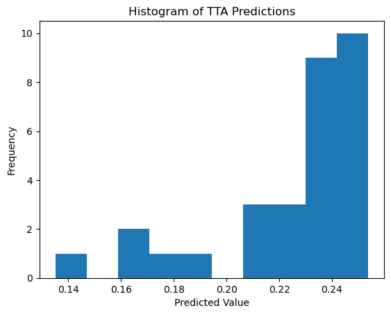

``` python
plt.plot(all_preds)
```

``` python
# Canonical fine-tuning
# from fastai.vision.all import *

# # Load the pretrained model
# learn = load_learner('./models/650-4000-epoch-25-lr-3e-3.pkl', cpu=False)

# # Prepare your new data
# path = 'path/to/your/data'
# dls = ImageDataLoaders.from_folder(path, valid_pct=0.2, item_tfms=Resize(224), batch_tfms=aug_transforms())

# # Set the new data
# learn.dls = dls

# # Fine-tune the head of the model
# learn.freeze()
# # alternatively: learn.freeze_to(n)
# learn.lr_find()
# learn.fit_one_cycle(5, 3e-3)

# # Fine-tune the entire model
# learn.unfreeze()
# learn.lr_find()
# learn.fit_one_cycle(5, slice(1e-5, 1e-3))
```

``` python
# learn = vision_learner(dls, resnet18, pretrained=False, metrics=R2Score()).to_fp16()
```

``` python
# learn.lr_find()
```

``` python
# learn.lr_find()
```

<style>
    /* Turns off some styling */
    progress {
        /* gets rid of default border in Firefox and Opera. */
        border: none;
        /* Needs to be in here for Safari polyfill so background images work as expected. */
        background-size: auto;
    }
    progress:not([value]), progress:not([value])::-webkit-progress-bar {
        background: repeating-linear-gradient(45deg, #7e7e7e, #7e7e7e 10px, #5c5c5c 10px, #5c5c5c 20px);
    }
    .progress-bar-interrupted, .progress-bar-interrupted::-webkit-progress-bar {
        background: #F44336;
    }
</style>

    SuggestedLRs(valley=0.002511886414140463)


``` python
# learn.fit_one_cycle(5, 3e-3)
```

## Evaluation

``` python
# Convert predictions and targets to numpy arrays
def assess_model(val_preds, val_targets):
    val_preds = val_preds.numpy().flatten()
    val_targets = val_targets.numpy()

    # Create a DataFrame with the results
    results_df = pd.DataFrame({
        'Predicted': val_preds,
        'Actual': val_targets
    })

    # Display the first few rows of the results
    print(results_df.head())

    # Calculate and print the R2 score
    from sklearn.metrics import r2_score
    r2 = r2_score(val_targets, val_preds)
    print(f"R2 Score on validation set: {r2:.4f}")
```

``` python
dls.train.n
```

    69

``` python
val_preds, val_targets = learn.get_preds(dl=dls.train)
assess_model(val_preds, val_targets)
```

<style>
    /* Turns off some styling */
    progress {
        /* gets rid of default border in Firefox and Opera. */
        border: none;
        /* Needs to be in here for Safari polyfill so background images work as expected. */
        background-size: auto;
    }
    progress:not([value]), progress:not([value])::-webkit-progress-bar {
        background: repeating-linear-gradient(45deg, #7e7e7e, #7e7e7e 10px, #5c5c5c 10px, #5c5c5c 20px);
    }
    .progress-bar-interrupted, .progress-bar-interrupted::-webkit-progress-bar {
        background: #F44336;
    }
</style>

       Predicted    Actual
    0   0.046272  0.210804
    1   0.528189  0.976900
    2   0.465372  0.469860
    3   0.258100  0.338556
    4   0.112802  0.147696
    R2 Score on validation set: 0.7392

``` python
val_preds, val_targets = learn.get_preds(dl=dls.train)
r2 = r2_score(val_targets, val_preds); r2
```

``` python
r2 = r2_score(val_targets, val_preds); r2
```

    0.7391959435205914

``` python
scores = []
for n in range(1, 20):
    val_preds, val_targets = learn.tta(dl=dls.train, n=n)
    scores.append(r2_score(val_targets, val_preds))
```

<style>
    /* Turns off some styling */
    progress {
        /* gets rid of default border in Firefox and Opera. */
        border: none;
        /* Needs to be in here for Safari polyfill so background images work as expected. */
        background-size: auto;
    }
    progress:not([value]), progress:not([value])::-webkit-progress-bar {
        background: repeating-linear-gradient(45deg, #7e7e7e, #7e7e7e 10px, #5c5c5c 10px, #5c5c5c 20px);
    }
    .progress-bar-interrupted, .progress-bar-interrupted::-webkit-progress-bar {
        background: #F44336;
    }
</style>

    <div>
      <progress value='0' class='' max='25' style='width:300px; height:20px; vertical-align: middle;'></progress>
      &#10;    </div>
    

<style>
    /* Turns off some styling */
    progress {
        /* gets rid of default border in Firefox and Opera. */
        border: none;
        /* Needs to be in here for Safari polyfill so background images work as expected. */
        background-size: auto;
    }
    progress:not([value]), progress:not([value])::-webkit-progress-bar {
        background: repeating-linear-gradient(45deg, #7e7e7e, #7e7e7e 10px, #5c5c5c 10px, #5c5c5c 20px);
    }
    .progress-bar-interrupted, .progress-bar-interrupted::-webkit-progress-bar {
        background: #F44336;
    }
</style>


<style>
    /* Turns off some styling */
    progress {
        /* gets rid of default border in Firefox and Opera. */
        border: none;
        /* Needs to be in here for Safari polyfill so background images work as expected. */
        background-size: auto;
    }
    progress:not([value]), progress:not([value])::-webkit-progress-bar {
        background: repeating-linear-gradient(45deg, #7e7e7e, #7e7e7e 10px, #5c5c5c 10px, #5c5c5c 20px);
    }
    .progress-bar-interrupted, .progress-bar-interrupted::-webkit-progress-bar {
        background: #F44336;
    }
</style>

    <div>
      <progress value='0' class='' max='25' style='width:300px; height:20px; vertical-align: middle;'></progress>
      &#10;    </div>
    

<style>
    /* Turns off some styling */
    progress {
        /* gets rid of default border in Firefox and Opera. */
        border: none;
        /* Needs to be in here for Safari polyfill so background images work as expected. */
        background-size: auto;
    }
    progress:not([value]), progress:not([value])::-webkit-progress-bar {
        background: repeating-linear-gradient(45deg, #7e7e7e, #7e7e7e 10px, #5c5c5c 10px, #5c5c5c 20px);
    }
    .progress-bar-interrupted, .progress-bar-interrupted::-webkit-progress-bar {
        background: #F44336;
    }
</style>


<style>
    /* Turns off some styling */
    progress {
        /* gets rid of default border in Firefox and Opera. */
        border: none;
        /* Needs to be in here for Safari polyfill so background images work as expected. */
        background-size: auto;
    }
    progress:not([value]), progress:not([value])::-webkit-progress-bar {
        background: repeating-linear-gradient(45deg, #7e7e7e, #7e7e7e 10px, #5c5c5c 10px, #5c5c5c 20px);
    }
    .progress-bar-interrupted, .progress-bar-interrupted::-webkit-progress-bar {
        background: #F44336;
    }
</style>

    <div>
      <progress value='0' class='' max='25' style='width:300px; height:20px; vertical-align: middle;'></progress>
      &#10;    </div>
    

<style>
    /* Turns off some styling */
    progress {
        /* gets rid of default border in Firefox and Opera. */
        border: none;
        /* Needs to be in here for Safari polyfill so background images work as expected. */
        background-size: auto;
    }
    progress:not([value]), progress:not([value])::-webkit-progress-bar {
        background: repeating-linear-gradient(45deg, #7e7e7e, #7e7e7e 10px, #5c5c5c 10px, #5c5c5c 20px);
    }
    .progress-bar-interrupted, .progress-bar-interrupted::-webkit-progress-bar {
        background: #F44336;
    }
</style>


<style>
    /* Turns off some styling */
    progress {
        /* gets rid of default border in Firefox and Opera. */
        border: none;
        /* Needs to be in here for Safari polyfill so background images work as expected. */
        background-size: auto;
    }
    progress:not([value]), progress:not([value])::-webkit-progress-bar {
        background: repeating-linear-gradient(45deg, #7e7e7e, #7e7e7e 10px, #5c5c5c 10px, #5c5c5c 20px);
    }
    .progress-bar-interrupted, .progress-bar-interrupted::-webkit-progress-bar {
        background: #F44336;
    }
</style>

    <div>
      <progress value='0' class='' max='25' style='width:300px; height:20px; vertical-align: middle;'></progress>
      &#10;    </div>
    

<style>
    /* Turns off some styling */
    progress {
        /* gets rid of default border in Firefox and Opera. */
        border: none;
        /* Needs to be in here for Safari polyfill so background images work as expected. */
        background-size: auto;
    }
    progress:not([value]), progress:not([value])::-webkit-progress-bar {
        background: repeating-linear-gradient(45deg, #7e7e7e, #7e7e7e 10px, #5c5c5c 10px, #5c5c5c 20px);
    }
    .progress-bar-interrupted, .progress-bar-interrupted::-webkit-progress-bar {
        background: #F44336;
    }
</style>


<style>
    /* Turns off some styling */
    progress {
        /* gets rid of default border in Firefox and Opera. */
        border: none;
        /* Needs to be in here for Safari polyfill so background images work as expected. */
        background-size: auto;
    }
    progress:not([value]), progress:not([value])::-webkit-progress-bar {
        background: repeating-linear-gradient(45deg, #7e7e7e, #7e7e7e 10px, #5c5c5c 10px, #5c5c5c 20px);
    }
    .progress-bar-interrupted, .progress-bar-interrupted::-webkit-progress-bar {
        background: #F44336;
    }
</style>

    <div>
      <progress value='0' class='' max='25' style='width:300px; height:20px; vertical-align: middle;'></progress>
      &#10;    </div>
    

<style>
    /* Turns off some styling */
    progress {
        /* gets rid of default border in Firefox and Opera. */
        border: none;
        /* Needs to be in here for Safari polyfill so background images work as expected. */
        background-size: auto;
    }
    progress:not([value]), progress:not([value])::-webkit-progress-bar {
        background: repeating-linear-gradient(45deg, #7e7e7e, #7e7e7e 10px, #5c5c5c 10px, #5c5c5c 20px);
    }
    .progress-bar-interrupted, .progress-bar-interrupted::-webkit-progress-bar {
        background: #F44336;
    }
</style>


<style>
    /* Turns off some styling */
    progress {
        /* gets rid of default border in Firefox and Opera. */
        border: none;
        /* Needs to be in here for Safari polyfill so background images work as expected. */
        background-size: auto;
    }
    progress:not([value]), progress:not([value])::-webkit-progress-bar {
        background: repeating-linear-gradient(45deg, #7e7e7e, #7e7e7e 10px, #5c5c5c 10px, #5c5c5c 20px);
    }
    .progress-bar-interrupted, .progress-bar-interrupted::-webkit-progress-bar {
        background: #F44336;
    }
</style>

    <div>
      <progress value='0' class='' max='25' style='width:300px; height:20px; vertical-align: middle;'></progress>
      &#10;    </div>
    

<style>
    /* Turns off some styling */
    progress {
        /* gets rid of default border in Firefox and Opera. */
        border: none;
        /* Needs to be in here for Safari polyfill so background images work as expected. */
        background-size: auto;
    }
    progress:not([value]), progress:not([value])::-webkit-progress-bar {
        background: repeating-linear-gradient(45deg, #7e7e7e, #7e7e7e 10px, #5c5c5c 10px, #5c5c5c 20px);
    }
    .progress-bar-interrupted, .progress-bar-interrupted::-webkit-progress-bar {
        background: #F44336;
    }
</style>


<style>
    /* Turns off some styling */
    progress {
        /* gets rid of default border in Firefox and Opera. */
        border: none;
        /* Needs to be in here for Safari polyfill so background images work as expected. */
        background-size: auto;
    }
    progress:not([value]), progress:not([value])::-webkit-progress-bar {
        background: repeating-linear-gradient(45deg, #7e7e7e, #7e7e7e 10px, #5c5c5c 10px, #5c5c5c 20px);
    }
    .progress-bar-interrupted, .progress-bar-interrupted::-webkit-progress-bar {
        background: #F44336;
    }
</style>

    <div>
      <progress value='0' class='' max='25' style='width:300px; height:20px; vertical-align: middle;'></progress>
      &#10;    </div>
    

<style>
    /* Turns off some styling */
    progress {
        /* gets rid of default border in Firefox and Opera. */
        border: none;
        /* Needs to be in here for Safari polyfill so background images work as expected. */
        background-size: auto;
    }
    progress:not([value]), progress:not([value])::-webkit-progress-bar {
        background: repeating-linear-gradient(45deg, #7e7e7e, #7e7e7e 10px, #5c5c5c 10px, #5c5c5c 20px);
    }
    .progress-bar-interrupted, .progress-bar-interrupted::-webkit-progress-bar {
        background: #F44336;
    }
</style>


<style>
    /* Turns off some styling */
    progress {
        /* gets rid of default border in Firefox and Opera. */
        border: none;
        /* Needs to be in here for Safari polyfill so background images work as expected. */
        background-size: auto;
    }
    progress:not([value]), progress:not([value])::-webkit-progress-bar {
        background: repeating-linear-gradient(45deg, #7e7e7e, #7e7e7e 10px, #5c5c5c 10px, #5c5c5c 20px);
    }
    .progress-bar-interrupted, .progress-bar-interrupted::-webkit-progress-bar {
        background: #F44336;
    }
</style>

    <div>
      <progress value='0' class='' max='25' style='width:300px; height:20px; vertical-align: middle;'></progress>
      &#10;    </div>
    

<style>
    /* Turns off some styling */
    progress {
        /* gets rid of default border in Firefox and Opera. */
        border: none;
        /* Needs to be in here for Safari polyfill so background images work as expected. */
        background-size: auto;
    }
    progress:not([value]), progress:not([value])::-webkit-progress-bar {
        background: repeating-linear-gradient(45deg, #7e7e7e, #7e7e7e 10px, #5c5c5c 10px, #5c5c5c 20px);
    }
    .progress-bar-interrupted, .progress-bar-interrupted::-webkit-progress-bar {
        background: #F44336;
    }
</style>


<style>
    /* Turns off some styling */
    progress {
        /* gets rid of default border in Firefox and Opera. */
        border: none;
        /* Needs to be in here for Safari polyfill so background images work as expected. */
        background-size: auto;
    }
    progress:not([value]), progress:not([value])::-webkit-progress-bar {
        background: repeating-linear-gradient(45deg, #7e7e7e, #7e7e7e 10px, #5c5c5c 10px, #5c5c5c 20px);
    }
    .progress-bar-interrupted, .progress-bar-interrupted::-webkit-progress-bar {
        background: #F44336;
    }
</style>

    <div>
      <progress value='0' class='' max='25' style='width:300px; height:20px; vertical-align: middle;'></progress>
      &#10;    </div>
    

<style>
    /* Turns off some styling */
    progress {
        /* gets rid of default border in Firefox and Opera. */
        border: none;
        /* Needs to be in here for Safari polyfill so background images work as expected. */
        background-size: auto;
    }
    progress:not([value]), progress:not([value])::-webkit-progress-bar {
        background: repeating-linear-gradient(45deg, #7e7e7e, #7e7e7e 10px, #5c5c5c 10px, #5c5c5c 20px);
    }
    .progress-bar-interrupted, .progress-bar-interrupted::-webkit-progress-bar {
        background: #F44336;
    }
</style>


<style>
    /* Turns off some styling */
    progress {
        /* gets rid of default border in Firefox and Opera. */
        border: none;
        /* Needs to be in here for Safari polyfill so background images work as expected. */
        background-size: auto;
    }
    progress:not([value]), progress:not([value])::-webkit-progress-bar {
        background: repeating-linear-gradient(45deg, #7e7e7e, #7e7e7e 10px, #5c5c5c 10px, #5c5c5c 20px);
    }
    .progress-bar-interrupted, .progress-bar-interrupted::-webkit-progress-bar {
        background: #F44336;
    }
</style>

    <div>
      <progress value='0' class='' max='25' style='width:300px; height:20px; vertical-align: middle;'></progress>
      &#10;    </div>
    

<style>
    /* Turns off some styling */
    progress {
        /* gets rid of default border in Firefox and Opera. */
        border: none;
        /* Needs to be in here for Safari polyfill so background images work as expected. */
        background-size: auto;
    }
    progress:not([value]), progress:not([value])::-webkit-progress-bar {
        background: repeating-linear-gradient(45deg, #7e7e7e, #7e7e7e 10px, #5c5c5c 10px, #5c5c5c 20px);
    }
    .progress-bar-interrupted, .progress-bar-interrupted::-webkit-progress-bar {
        background: #F44336;
    }
</style>


<style>
    /* Turns off some styling */
    progress {
        /* gets rid of default border in Firefox and Opera. */
        border: none;
        /* Needs to be in here for Safari polyfill so background images work as expected. */
        background-size: auto;
    }
    progress:not([value]), progress:not([value])::-webkit-progress-bar {
        background: repeating-linear-gradient(45deg, #7e7e7e, #7e7e7e 10px, #5c5c5c 10px, #5c5c5c 20px);
    }
    .progress-bar-interrupted, .progress-bar-interrupted::-webkit-progress-bar {
        background: #F44336;
    }
</style>

    <div>
      <progress value='0' class='' max='25' style='width:300px; height:20px; vertical-align: middle;'></progress>
      &#10;    </div>
    

<style>
    /* Turns off some styling */
    progress {
        /* gets rid of default border in Firefox and Opera. */
        border: none;
        /* Needs to be in here for Safari polyfill so background images work as expected. */
        background-size: auto;
    }
    progress:not([value]), progress:not([value])::-webkit-progress-bar {
        background: repeating-linear-gradient(45deg, #7e7e7e, #7e7e7e 10px, #5c5c5c 10px, #5c5c5c 20px);
    }
    .progress-bar-interrupted, .progress-bar-interrupted::-webkit-progress-bar {
        background: #F44336;
    }
</style>


<style>
    /* Turns off some styling */
    progress {
        /* gets rid of default border in Firefox and Opera. */
        border: none;
        /* Needs to be in here for Safari polyfill so background images work as expected. */
        background-size: auto;
    }
    progress:not([value]), progress:not([value])::-webkit-progress-bar {
        background: repeating-linear-gradient(45deg, #7e7e7e, #7e7e7e 10px, #5c5c5c 10px, #5c5c5c 20px);
    }
    .progress-bar-interrupted, .progress-bar-interrupted::-webkit-progress-bar {
        background: #F44336;
    }
</style>

    <div>
      <progress value='0' class='' max='25' style='width:300px; height:20px; vertical-align: middle;'></progress>
      &#10;    </div>
    

<style>
    /* Turns off some styling */
    progress {
        /* gets rid of default border in Firefox and Opera. */
        border: none;
        /* Needs to be in here for Safari polyfill so background images work as expected. */
        background-size: auto;
    }
    progress:not([value]), progress:not([value])::-webkit-progress-bar {
        background: repeating-linear-gradient(45deg, #7e7e7e, #7e7e7e 10px, #5c5c5c 10px, #5c5c5c 20px);
    }
    .progress-bar-interrupted, .progress-bar-interrupted::-webkit-progress-bar {
        background: #F44336;
    }
</style>


<style>
    /* Turns off some styling */
    progress {
        /* gets rid of default border in Firefox and Opera. */
        border: none;
        /* Needs to be in here for Safari polyfill so background images work as expected. */
        background-size: auto;
    }
    progress:not([value]), progress:not([value])::-webkit-progress-bar {
        background: repeating-linear-gradient(45deg, #7e7e7e, #7e7e7e 10px, #5c5c5c 10px, #5c5c5c 20px);
    }
    .progress-bar-interrupted, .progress-bar-interrupted::-webkit-progress-bar {
        background: #F44336;
    }
</style>

    <div>
      <progress value='0' class='' max='25' style='width:300px; height:20px; vertical-align: middle;'></progress>
      &#10;    </div>
    

<style>
    /* Turns off some styling */
    progress {
        /* gets rid of default border in Firefox and Opera. */
        border: none;
        /* Needs to be in here for Safari polyfill so background images work as expected. */
        background-size: auto;
    }
    progress:not([value]), progress:not([value])::-webkit-progress-bar {
        background: repeating-linear-gradient(45deg, #7e7e7e, #7e7e7e 10px, #5c5c5c 10px, #5c5c5c 20px);
    }
    .progress-bar-interrupted, .progress-bar-interrupted::-webkit-progress-bar {
        background: #F44336;
    }
</style>


<style>
    /* Turns off some styling */
    progress {
        /* gets rid of default border in Firefox and Opera. */
        border: none;
        /* Needs to be in here for Safari polyfill so background images work as expected. */
        background-size: auto;
    }
    progress:not([value]), progress:not([value])::-webkit-progress-bar {
        background: repeating-linear-gradient(45deg, #7e7e7e, #7e7e7e 10px, #5c5c5c 10px, #5c5c5c 20px);
    }
    .progress-bar-interrupted, .progress-bar-interrupted::-webkit-progress-bar {
        background: #F44336;
    }
</style>

    <div>
      <progress value='0' class='' max='25' style='width:300px; height:20px; vertical-align: middle;'></progress>
      &#10;    </div>
    

<style>
    /* Turns off some styling */
    progress {
        /* gets rid of default border in Firefox and Opera. */
        border: none;
        /* Needs to be in here for Safari polyfill so background images work as expected. */
        background-size: auto;
    }
    progress:not([value]), progress:not([value])::-webkit-progress-bar {
        background: repeating-linear-gradient(45deg, #7e7e7e, #7e7e7e 10px, #5c5c5c 10px, #5c5c5c 20px);
    }
    .progress-bar-interrupted, .progress-bar-interrupted::-webkit-progress-bar {
        background: #F44336;
    }
</style>


<style>
    /* Turns off some styling */
    progress {
        /* gets rid of default border in Firefox and Opera. */
        border: none;
        /* Needs to be in here for Safari polyfill so background images work as expected. */
        background-size: auto;
    }
    progress:not([value]), progress:not([value])::-webkit-progress-bar {
        background: repeating-linear-gradient(45deg, #7e7e7e, #7e7e7e 10px, #5c5c5c 10px, #5c5c5c 20px);
    }
    .progress-bar-interrupted, .progress-bar-interrupted::-webkit-progress-bar {
        background: #F44336;
    }
</style>

    <div>
      <progress value='0' class='' max='25' style='width:300px; height:20px; vertical-align: middle;'></progress>
      &#10;    </div>
    

<style>
    /* Turns off some styling */
    progress {
        /* gets rid of default border in Firefox and Opera. */
        border: none;
        /* Needs to be in here for Safari polyfill so background images work as expected. */
        background-size: auto;
    }
    progress:not([value]), progress:not([value])::-webkit-progress-bar {
        background: repeating-linear-gradient(45deg, #7e7e7e, #7e7e7e 10px, #5c5c5c 10px, #5c5c5c 20px);
    }
    .progress-bar-interrupted, .progress-bar-interrupted::-webkit-progress-bar {
        background: #F44336;
    }
</style>


<style>
    /* Turns off some styling */
    progress {
        /* gets rid of default border in Firefox and Opera. */
        border: none;
        /* Needs to be in here for Safari polyfill so background images work as expected. */
        background-size: auto;
    }
    progress:not([value]), progress:not([value])::-webkit-progress-bar {
        background: repeating-linear-gradient(45deg, #7e7e7e, #7e7e7e 10px, #5c5c5c 10px, #5c5c5c 20px);
    }
    .progress-bar-interrupted, .progress-bar-interrupted::-webkit-progress-bar {
        background: #F44336;
    }
</style>

    <div>
      <progress value='0' class='' max='25' style='width:300px; height:20px; vertical-align: middle;'></progress>
      &#10;    </div>
    

<style>
    /* Turns off some styling */
    progress {
        /* gets rid of default border in Firefox and Opera. */
        border: none;
        /* Needs to be in here for Safari polyfill so background images work as expected. */
        background-size: auto;
    }
    progress:not([value]), progress:not([value])::-webkit-progress-bar {
        background: repeating-linear-gradient(45deg, #7e7e7e, #7e7e7e 10px, #5c5c5c 10px, #5c5c5c 20px);
    }
    .progress-bar-interrupted, .progress-bar-interrupted::-webkit-progress-bar {
        background: #F44336;
    }
</style>


<style>
    /* Turns off some styling */
    progress {
        /* gets rid of default border in Firefox and Opera. */
        border: none;
        /* Needs to be in here for Safari polyfill so background images work as expected. */
        background-size: auto;
    }
    progress:not([value]), progress:not([value])::-webkit-progress-bar {
        background: repeating-linear-gradient(45deg, #7e7e7e, #7e7e7e 10px, #5c5c5c 10px, #5c5c5c 20px);
    }
    .progress-bar-interrupted, .progress-bar-interrupted::-webkit-progress-bar {
        background: #F44336;
    }
</style>

    <div>
      <progress value='0' class='' max='25' style='width:300px; height:20px; vertical-align: middle;'></progress>
      &#10;    </div>
    

<style>
    /* Turns off some styling */
    progress {
        /* gets rid of default border in Firefox and Opera. */
        border: none;
        /* Needs to be in here for Safari polyfill so background images work as expected. */
        background-size: auto;
    }
    progress:not([value]), progress:not([value])::-webkit-progress-bar {
        background: repeating-linear-gradient(45deg, #7e7e7e, #7e7e7e 10px, #5c5c5c 10px, #5c5c5c 20px);
    }
    .progress-bar-interrupted, .progress-bar-interrupted::-webkit-progress-bar {
        background: #F44336;
    }
</style>


<style>
    /* Turns off some styling */
    progress {
        /* gets rid of default border in Firefox and Opera. */
        border: none;
        /* Needs to be in here for Safari polyfill so background images work as expected. */
        background-size: auto;
    }
    progress:not([value]), progress:not([value])::-webkit-progress-bar {
        background: repeating-linear-gradient(45deg, #7e7e7e, #7e7e7e 10px, #5c5c5c 10px, #5c5c5c 20px);
    }
    .progress-bar-interrupted, .progress-bar-interrupted::-webkit-progress-bar {
        background: #F44336;
    }
</style>

    <div>
      <progress value='0' class='' max='25' style='width:300px; height:20px; vertical-align: middle;'></progress>
      &#10;    </div>
    

<style>
    /* Turns off some styling */
    progress {
        /* gets rid of default border in Firefox and Opera. */
        border: none;
        /* Needs to be in here for Safari polyfill so background images work as expected. */
        background-size: auto;
    }
    progress:not([value]), progress:not([value])::-webkit-progress-bar {
        background: repeating-linear-gradient(45deg, #7e7e7e, #7e7e7e 10px, #5c5c5c 10px, #5c5c5c 20px);
    }
    .progress-bar-interrupted, .progress-bar-interrupted::-webkit-progress-bar {
        background: #F44336;
    }
</style>


<style>
    /* Turns off some styling */
    progress {
        /* gets rid of default border in Firefox and Opera. */
        border: none;
        /* Needs to be in here for Safari polyfill so background images work as expected. */
        background-size: auto;
    }
    progress:not([value]), progress:not([value])::-webkit-progress-bar {
        background: repeating-linear-gradient(45deg, #7e7e7e, #7e7e7e 10px, #5c5c5c 10px, #5c5c5c 20px);
    }
    .progress-bar-interrupted, .progress-bar-interrupted::-webkit-progress-bar {
        background: #F44336;
    }
</style>

    <div>
      <progress value='0' class='' max='25' style='width:300px; height:20px; vertical-align: middle;'></progress>
      &#10;    </div>
    

<style>
    /* Turns off some styling */
    progress {
        /* gets rid of default border in Firefox and Opera. */
        border: none;
        /* Needs to be in here for Safari polyfill so background images work as expected. */
        background-size: auto;
    }
    progress:not([value]), progress:not([value])::-webkit-progress-bar {
        background: repeating-linear-gradient(45deg, #7e7e7e, #7e7e7e 10px, #5c5c5c 10px, #5c5c5c 20px);
    }
    .progress-bar-interrupted, .progress-bar-interrupted::-webkit-progress-bar {
        background: #F44336;
    }
</style>

``` python
x = list(range(1, 20))
plt.plot(x, scores)
```

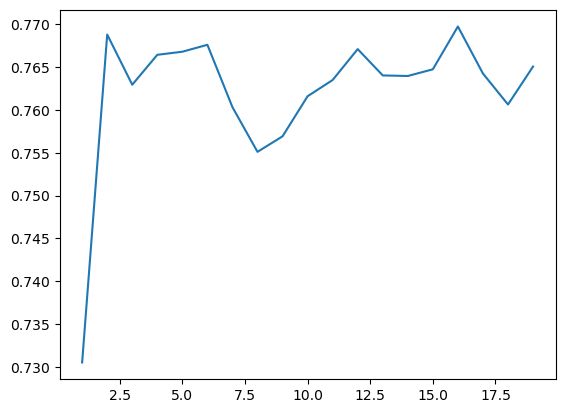

``` python
# EXAMPLE of TTA on single item
# from fastai.vision.all import *

# # Define your TTA transforms
# tta_tfms = [
#     RandomResizedCrop(224, min_scale=0.5),
#     Flip(),
#     Rotate(degrees=(-15, 15)),
#     Brightness(max_lighting=0.2),
#     Contrast(max_lighting=0.2)
# ]

# # Create a pipeline of TTA transformations
# tta_pipeline = Pipeline(tta_tfms)

# # Load your model
# learn = load_learner('path/to/your/model.pkl')

# # Define the input data (e.g., an image)
# input_data = PILImage.create('path/to/your/image.jpg')

# # Apply TTA transforms to the input data and make predictions
# predictions = []
# for _ in range(5):  # Apply 5 different augmentations
#     augmented_data = tta_pipeline(input_data)
#     prediction = learn.predict(augmented_data)
#     predictions.append(prediction)

# # Average the predictions
# average_prediction = sum(predictions) / len(predictions)

# print(average_prediction)
```

``` python
# Assuming you have a new CSV file for your test data
# test_source = '../../_data/ossl-tfm/ossl-tfm-test.csv'
# test_df = pd.read_csv(test_source)

# # Create a new DataLoader for the test data
# test_dl = learn.dls.test_dl(test_df)

# # Get predictions on the test set
# test_preds, test_targets = learn.get_preds(dl=test_dl)

# # Now you can use test_preds and test_targets for further analysis
```

``` python
assess_model(val_preds, val_targets)
```

       Predicted    Actual
    0   0.312483  0.000000
    1   0.126990  0.184960
    2   0.365726  0.194201
    3   0.239089  0.262364
    4   0.402980  0.355799
    R2 Score on validation set: 0.8325

``` python
assess_model(val_preds_tta, val_targets_tta)
```

       Predicted    Actual
    0   0.246857  0.000000
    1   0.148590  0.184960
    2   0.371643  0.194201
    3   0.226535  0.262364
    4   0.407333  0.355799
    R2 Score on validation set: 0.8378

``` python
val_preds_np = val_preds
val_targets_np = val_targets

# Apply the transformation: exp(y) - 1
val_preds_transformed = np.exp(val_preds_np) - 1
val_targets_transformed = np.exp(val_targets_np) - 1

# Create a DataFrame with the results
results_df = pd.DataFrame({
    'Predicted': val_preds_transformed,
    'Actual': val_targets_transformed
})

# Display the first few rows of the results
print(results_df.head())

# Calculate and print the R2 score
from sklearn.metrics import r2_score
r2 = r2_score(val_targets_transformed, val_preds_transformed)
print(f"R2 Score on validation set (after transformation): {r2:.4f}")

# Calculate and print the MAPE, handling zero values
def mean_absolute_percentage_error(y_true, y_pred):
    non_zero = (y_true != 0)
    return np.mean(np.abs((y_true[non_zero] - y_pred[non_zero]) / y_true[non_zero])) * 100

mape = mean_absolute_percentage_error(val_targets_transformed, val_preds_transformed)
print(f"Mean Absolute Percentage Error (MAPE) on validation set: {mape:.2f}%")

# Calculate and print the MAE as an alternative metric
from sklearn.metrics import mean_absolute_error
mae = mean_absolute_error(val_targets_transformed, val_preds_transformed)
print(f"Mean Absolute Error (MAE) on validation set: {mae:.4f}")
```

       Predicted   Actual
    0   0.366814  0.00000
    1   0.135405  0.20317
    2   0.441560  0.21434
    3   0.270092  0.30000
    4   0.496277  0.42732
    R2 Score on validation set (after transformation): 0.6936
    Mean Absolute Percentage Error (MAPE) on validation set: 50.72%
    Mean Absolute Error (MAE) on validation set: 0.1956

``` python
plt.figure(figsize=(6, 6))

# Use logarithmic bins for the colormap
h = plt.hexbin(val_targets, val_preds, gridsize=65, 
               bins='log', cmap='Spectral_r', mincnt=1,
               alpha=0.9)

# Get the actual min and max counts from the hexbin data
counts = h.get_array()
min_count = counts[counts > 0].min()  # Minimum non-zero count
max_count = counts.max()

# Create a logarithmic colorbar
cb = plt.colorbar(h, label='Count in bin', shrink=0.73)
tick_locations = np.logspace(np.log10(min_count), np.log10(max_count), 5)
cb.set_ticks(tick_locations)
cb.set_ticklabels([f'{int(x)}' for x in tick_locations])

# Add the diagonal line
min_val = min(val_targets.min(), val_preds.min())
max_val = max(val_targets.max(), val_preds.max())
plt.plot([min_val, max_val], [min_val, max_val], 'k--', lw=1)

# Set labels and title
plt.xlabel('Actual Values')
plt.ylabel('Predicted Values')
plt.title('Predicted vs Actual Values (Hexbin with Log Scale)')

# Add grid lines
plt.grid(True, linestyle='--', alpha=0.65)

# Set the same limits for both axes
plt.xlim(min_val, max_val)
plt.ylim(min_val, max_val)

# Make the plot square
plt.gca().set_aspect('equal', adjustable='box')

plt.tight_layout()
plt.show()

# Print the range of counts in the hexbins
print(f"Min non-zero count in hexbins: {min_count}")
print(f"Max count in hexbins: {max_count}")
```


    Min non-zero count in hexbins: 1.0
    Max count in hexbins: 157.0

``` python
path_model = Path('./models')
learn.export(path_model / '0.pkl')
```

## Inference

``` python
ossl_source = Path('../../_data/ossl-tfm/img')
learn.predict(ossl_source / '0a0a0c647671fd3030cc13ba5432eb88.png')
```

<style>
    /* Turns off some styling */
    progress {
        /* gets rid of default border in Firefox and Opera. */
        border: none;
        /* Needs to be in here for Safari polyfill so background images work as expected. */
        background-size: auto;
    }
    progress:not([value]), progress:not([value])::-webkit-progress-bar {
        background: repeating-linear-gradient(45deg, #7e7e7e, #7e7e7e 10px, #5c5c5c 10px, #5c5c5c 20px);
    }
    .progress-bar-interrupted, .progress-bar-interrupted::-webkit-progress-bar {
        background: #F44336;
    }
</style>

    ((0.5229991674423218,), tensor([0.5230]), tensor([0.5230]))

``` python
df[df['fname'] == '0a0a0c647671fd3030cc13ba5432eb88.png']
```

<div>
<style scoped>
    .dataframe tbody tr th:only-of-type {
        vertical-align: middle;
    }
&#10;    .dataframe tbody tr th {
        vertical-align: top;
    }
&#10;    .dataframe thead th {
        text-align: right;
    }
</style>

<table class="dataframe" data-quarto-postprocess="true" data-border="1">
<thead>
<tr class="header" style="text-align: right;">
<th data-quarto-table-cell-role="th"></th>
<th data-quarto-table-cell-role="th">fname</th>
<th data-quarto-table-cell-role="th">kex</th>
</tr>
</thead>
<tbody>
<tr class="odd">
<td data-quarto-table-cell-role="th">28867</td>
<td>0a0a0c647671fd3030cc13ba5432eb88.png</td>
<td>0.525379</td>
</tr>
</tbody>
</table>

</div>

``` python
np.exp(3) - 1
```

    19.085536923187668

## Experiments:

Color scale: `viridis` | Discretization:
`percentiles = [i for i in range(60, 100)]`

<table>
<colgroup>
<col style="width: 10%" />
<col style="width: 11%" />
<col style="width: 15%" />
<col style="width: 7%" />
<col style="width: 9%" />
<col style="width: 15%" />
<col style="width: 11%" />
<col style="width: 15%" />
</colgroup>
<thead>
<tr class="header">
<th>Model</th>
<th>Image Size</th>
<th>Learning Rate</th>
<th>Epochs</th>
<th>R2 Score</th>
<th>Time per Epoch</th>
<th>Finetuning</th>
<th>with axis ticks</th>
</tr>
</thead>
<tbody>
<tr class="odd">
<td>ResNet-18</td>
<td>100</td>
<td>1e-3</td>
<td>10</td>
<td>0.648</td>
<td>05:12</td>
<td>No</td>
<td>Yes</td>
</tr>
<tr class="even">
<td>ResNet-18</td>
<td>224</td>
<td>2e-3</td>
<td>10</td>
<td>0.69</td>
<td>07:30</td>
<td>No</td>
<td>Yes</td>
</tr>
<tr class="odd">
<td>ResNet-18</td>
<td>750 (original size)</td>
<td>1e-3</td>
<td>10</td>
<td>0.71</td>
<td>36:00</td>
<td>No</td>
<td>Yes</td>
</tr>
<tr class="even">
<td>ResNet-18</td>
<td>224</td>
<td>2e-3</td>
<td>20</td>
<td>0.704</td>
<td>07:30</td>
<td>No</td>
<td>Yes</td>
</tr>
<tr class="odd">
<td>ResNet-18</td>
<td>224</td>
<td>2e-3</td>
<td>10</td>
<td>0.71</td>
<td>07:00</td>
<td>No</td>
<td>No</td>
</tr>
</tbody>
</table>

Discretization: `percentiles = [i for i in range(20, 100)]`

<table style="width:100%;">
<colgroup>
<col style="width: 9%" />
<col style="width: 10%" />
<col style="width: 13%" />
<col style="width: 6%" />
<col style="width: 8%" />
<col style="width: 13%" />
<col style="width: 10%" />
<col style="width: 14%" />
<col style="width: 12%" />
</colgroup>
<thead>
<tr class="header">
<th>Model</th>
<th>Image Size</th>
<th>Learning Rate</th>
<th>Epochs</th>
<th>R2 Score</th>
<th>Time per Epoch</th>
<th>Finetuning</th>
<th>with axis ticks</th>
<th>colour scale</th>
</tr>
</thead>
<tbody>
<tr class="odd">
<td>ResNet-18</td>
<td>224</td>
<td>2e-3</td>
<td>10</td>
<td>0.7</td>
<td>05:12</td>
<td>No</td>
<td>No</td>
<td><code>viridis</code></td>
</tr>
<tr class="even">
<td>ResNet-18</td>
<td>224</td>
<td>3e-3</td>
<td>10</td>
<td>0.71</td>
<td>05:12</td>
<td>No</td>
<td>No</td>
<td><code>jet</code></td>
</tr>
</tbody>
</table>

From now on `with axis ticks` is always `No`.

Discretization: esimated on `10000` cwt power percentiles
`[20, 30, 40, 50, 60, 70, 80, 90, 95, 97, 99]`

<table style="width:100%;">
<colgroup>
<col style="width: 9%" />
<col style="width: 10%" />
<col style="width: 13%" />
<col style="width: 6%" />
<col style="width: 8%" />
<col style="width: 13%" />
<col style="width: 10%" />
<col style="width: 14%" />
<col style="width: 12%" />
</colgroup>
<thead>
<tr class="header">
<th>Model</th>
<th>Image Size</th>
<th>Learning Rate</th>
<th>Epochs</th>
<th>R2 Score</th>
<th>Time per Epoch</th>
<th>Finetuning</th>
<th>remark</th>
<th>colour scale</th>
</tr>
</thead>
<tbody>
<tr class="odd">
<td>ResNet-18</td>
<td>224</td>
<td>2e-3</td>
<td>10</td>
<td>0.71</td>
<td>05:12</td>
<td>No</td>
<td>None</td>
<td><code>jet</code></td>
</tr>
<tr class="even">
<td>ResNet-18</td>
<td>224</td>
<td>2e-3</td>
<td>10</td>
<td>0.685</td>
<td>05:12</td>
<td>No</td>
<td>y range added</td>
<td><code>jet</code></td>
</tr>
</tbody>
</table>

From now on random splitter with `10%` validation and random seed `41`.

Discretization: esimated on `10000` cwt power percentiles
`[20, 30, 40, 50, 60, 70, 80, 90, 95, 97, 99]`

<table style="width:100%;">
<colgroup>
<col style="width: 9%" />
<col style="width: 10%" />
<col style="width: 13%" />
<col style="width: 6%" />
<col style="width: 8%" />
<col style="width: 13%" />
<col style="width: 10%" />
<col style="width: 14%" />
<col style="width: 12%" />
</colgroup>
<thead>
<tr class="header">
<th>Model</th>
<th>Image Size</th>
<th>Learning Rate</th>
<th>Epochs</th>
<th>R2 Score</th>
<th>Time per Epoch</th>
<th>Finetuning</th>
<th>remark</th>
<th>colour scale</th>
</tr>
</thead>
<tbody>
<tr class="odd">
<td>ResNet-18</td>
<td>224</td>
<td>2e-3</td>
<td>10</td>
<td>0.7</td>
<td>05:12</td>
<td>No</td>
<td>Pre-train &amp; normalize: True</td>
<td><code>jet</code></td>
</tr>
<tr class="even">
<td>ResNet-18</td>
<td>224</td>
<td>2e-3</td>
<td>10</td>
<td>0.796</td>
<td>08:12</td>
<td>No</td>
<td>No Pre-train</td>
<td><code>jet</code></td>
</tr>
<tr class="odd">
<td>ResNet-18</td>
<td>224</td>
<td>3e-3</td>
<td>10</td>
<td>0.7</td>
<td>05:12</td>
<td>No</td>
<td>Pre-train &amp; normalize: False</td>
<td><code>jet</code></td>
</tr>
<tr class="even">
<td>ResNet-18 (id=0)</td>
<td>224</td>
<td>2e-3</td>
<td>20</td>
<td><strong>0.829</strong></td>
<td>08:12</td>
<td>No</td>
<td>No Pre-train (try 18 epochs)</td>
<td><code>jet</code></td>
</tr>
</tbody>
</table>
