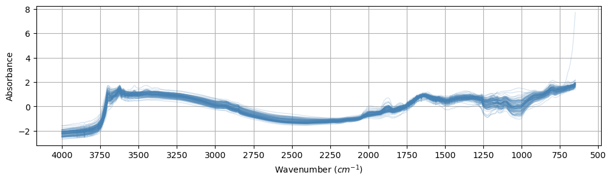
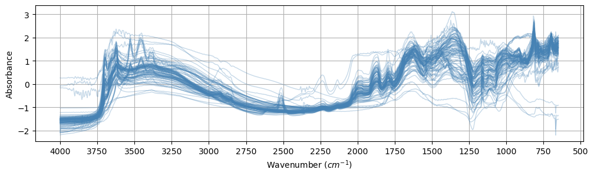

# Loading


<!-- WARNING: THIS FILE WAS AUTOGENERATED! DO NOT EDIT! -->

------------------------------------------------------------------------

<a
href="https://github.com/franckalbinet/uhina/blob/main/uhina/loading.py#L24"
target="_blank" style="float:right; font-size:smaller">source</a>

### plot_spectra

>      plot_spectra (data, var:str='X', n_spectra=None, snv:bool=False,
>                    xlabel='Wavenumber ($cm^{-1}$)', ylabel='Absorbance',
>                    figsize=(12, 4), locator=250, lw=1, color='steelblue',
>                    alpha=0.1, tight_layout=False)

<table>
<colgroup>
<col style="width: 6%" />
<col style="width: 25%" />
<col style="width: 34%" />
<col style="width: 34%" />
</colgroup>
<thead>
<tr class="header">
<th></th>
<th><strong>Type</strong></th>
<th><strong>Default</strong></th>
<th><strong>Details</strong></th>
</tr>
</thead>
<tbody>
<tr class="odd">
<td>data</td>
<td></td>
<td></td>
<td></td>
</tr>
<tr class="even">
<td>var</td>
<td>str</td>
<td>X</td>
<td></td>
</tr>
<tr class="odd">
<td>n_spectra</td>
<td>NoneType</td>
<td>None</td>
<td>Number of random spectra to plot (None for all)</td>
</tr>
<tr class="even">
<td>snv</td>
<td>bool</td>
<td>False</td>
<td>Apply SNV normalization</td>
</tr>
<tr class="odd">
<td>xlabel</td>
<td>str</td>
<td>Wavenumber (<span
class="math inline"><em>c</em><em>m</em>^−1</span>)</td>
<td></td>
</tr>
<tr class="even">
<td>ylabel</td>
<td>str</td>
<td>Absorbance</td>
<td></td>
</tr>
<tr class="odd">
<td>figsize</td>
<td>tuple</td>
<td>(12, 4)</td>
<td></td>
</tr>
<tr class="even">
<td>locator</td>
<td>int</td>
<td>250</td>
<td></td>
</tr>
<tr class="odd">
<td>lw</td>
<td>int</td>
<td>1</td>
<td></td>
</tr>
<tr class="even">
<td>color</td>
<td>str</td>
<td>steelblue</td>
<td></td>
</tr>
<tr class="odd">
<td>alpha</td>
<td>float</td>
<td>0.1</td>
<td>Single color with opacity</td>
</tr>
<tr class="even">
<td>tight_layout</td>
<td>bool</td>
<td>False</td>
<td></td>
</tr>
</tbody>
</table>

<details open class="code-fold">
<summary>Exported source</summary>

``` python
def plot_spectra(data, 
                 var: str = 'X',
                 n_spectra=None,  # Number of random spectra to plot (None for all)
                 snv: bool = False, # Apply SNV normalization
                 xlabel='Wavenumber ($cm^{-1}$)', ylabel='Absorbance',
                 figsize=(12, 4), locator=250, lw=1,
                 color='steelblue', alpha=0.1,  # Single color with opacity
                 tight_layout=False):
    
    fig, ax = plt.subplots(figsize=figsize)
    
    X_data = getattr(data, var)
    if n_spectra is not None and n_spectra < data.X.shape[0]:
        # Select n random spectra
        indices = np.random.choice(X_data.shape[0], n_spectra, replace=False)
        X_subset = X_data[indices]
    else:
        X_subset = X_data
    
    
    X_subset = SNV().fit_transform(X_subset) if snv else X_subset
    
    for i in range(X_subset.shape[0]):
        ax.plot(data.X_names, X_subset[i], lw=lw, color=color, alpha=alpha)
    
    ax.xaxis.set_major_locator(plt.MultipleLocator(locator))
    ax.grid(True)
    ax.invert_xaxis()
    ax.set_xlabel(xlabel)
    ax.set_ylabel(ylabel)
    
    if tight_layout:
        plt.tight_layout()
    
    return fig, ax
```

</details>

------------------------------------------------------------------------

<a
href="https://github.com/franckalbinet/uhina/blob/main/uhina/loading.py#L62"
target="_blank" style="float:right; font-size:smaller">source</a>

### SpectralData

>      SpectralData (X:numpy.ndarray, X_names:numpy.ndarray, y:numpy.ndarray,
>                    y_names:numpy.ndarray, sample_indices:numpy.ndarray,
>                    dataset_names:numpy.ndarray, dataset_labels:numpy.ndarray)

<details open class="code-fold">
<summary>Exported source</summary>

``` python
@dataclass
class SpectralData:
    X: np.ndarray
    X_names: np.ndarray
    y: np.ndarray
    y_names: np.ndarray
    sample_indices: np.ndarray
    dataset_names: np.ndarray
    dataset_labels: np.ndarray
```

</details>

------------------------------------------------------------------------

<a
href="https://github.com/franckalbinet/uhina/blob/main/uhina/loading.py#L75"
target="_blank" style="float:right; font-size:smaller">source</a>

### DataLoader

>      DataLoader ()

*Abstract class for data loading.*

<details open class="code-fold">
<summary>Exported source</summary>

``` python
fname_ossl = Path.home() / '.lssm/data/ossl/ossl_all_L0_v1.2.csv.gz'
```

</details>
<details open class="code-fold">
<summary>Exported source</summary>

``` python
class DataLoader(ABC):
    "Abstract class for data loading."
    @abstractmethod
    def load_data(self, 
                  analytes: str|list, # Analyte(s) of interest
                  ) -> tuple: # Return a tuple of the form (X, y, X_names, smp_idx, ds_name, ds_label)
        """Load data and return (X, y, X_names, smp_idx, ds_name, ds_label)."""
        pass
```

</details>

## OSSL loader

Describe OSSL …

------------------------------------------------------------------------

<a
href="https://github.com/franckalbinet/uhina/blob/main/uhina/loading.py#L85"
target="_blank" style="float:right; font-size:smaller">source</a>

### OSSLLoader

>      OSSLLoader (src:pathlib.Path=Path('/home/runner/.lssm/data/ossl/ossl_all_
>                  L0_v1.2.csv.gz'), spectra_type:str='visnir', cfgs:dict=None)

*Load OSSL data and filter it by spectra type and analytes of interest.*

<table>
<colgroup>
<col style="width: 6%" />
<col style="width: 25%" />
<col style="width: 34%" />
<col style="width: 34%" />
</colgroup>
<thead>
<tr class="header">
<th></th>
<th><strong>Type</strong></th>
<th><strong>Default</strong></th>
<th><strong>Details</strong></th>
</tr>
</thead>
<tbody>
<tr class="odd">
<td>src</td>
<td>Path</td>
<td>/home/runner/.lssm/data/ossl/ossl_all_L0_v1.2.csv.gz</td>
<td>Data source file name</td>
</tr>
<tr class="even">
<td>spectra_type</td>
<td>str</td>
<td>visnir</td>
<td>Spectra type</td>
</tr>
<tr class="odd">
<td>cfgs</td>
<td>dict</td>
<td>None</td>
<td>Spectra type configuration</td>
</tr>
</tbody>
</table>

<details open class="code-fold">
<summary>Exported source</summary>

``` python
class OSSLLoader(DataLoader):
    "Load OSSL data and filter it by spectra type and analytes of interest."
    DTYPE_DICT = {
        'id.layer_local_c': 'object',
        'id.location_olc_txt': 'object',
        'id.dataset.site_ascii_txt': 'object',
        'id.scan_local_c': 'object',
        'layer.texture_usda_txt': 'object',
        'pedon.taxa_usda_txt': 'object',
        'horizon.designation_usda_txt': 'object',
        'location.country_iso.3166_txt': 'object',
        'surveyor.address_utf8_txt': 'object',
        'efferv_usda.a479_class': 'object',
        'scan.mir.date.begin_iso.8601_yyyy.mm.dd': 'object',
        'scan.mir.date.end_iso.8601_yyyy.mm.dd': 'object',
        'scan.mir.model.name_utf8_txt': 'object',
        'scan.mir.model.code_any_txt': 'object',
        'scan.mir.method.optics_any_txt': 'object',
        'scan.mir.method.preparation_any_txt': 'object',
        'scan.mir.license.title_ascii_txt': 'object',
        'scan.mir.license.address_idn_url': 'object',
        'scan.mir.doi_idf_url': 'object',
        'scan.mir.contact.name_utf8_txt': 'object',
        'scan.mir.contact.email_ietf_txt': 'object',
        'scan.visnir.date.begin_iso.8601_yyyy.mm.dd': 'object',
        'scan.visnir.date.end_iso.8601_yyyy.mm.dd': 'object',
        'scan.visnir.model.name_utf8_txt': 'object',
        'scan.visnir.model.code_any_txt': 'object',
        'scan.visnir.method.optics_any_txt': 'object',
        'scan.visnir.method.preparation_any_txt': 'object',
        'scan.visnir.license.title_ascii_txt': 'object',
        'scan.visnir.license.address_idn_url': 'object',
        'scan.visnir.doi_idf_url': 'object',
        'scan.visnir.contact.name_utf8_txt': 'object',
        'scan.visnir.contact.email_ietf_txt': 'object'
    }
    def __init__(self, 
                 src: Path = Path.home() / '.lssm/data/ossl/ossl_all_L0_v1.2.csv.gz', # Data source file name
                 spectra_type: str='visnir', # Spectra type
                 cfgs: dict=None): # Spectra type configuration
        self.src = src
        self.spectra_type = spectra_type
        self.df = None
        self.ds_name_encoder = LabelEncoder()
        self.cfgs = cfgs or {
            'visnir': {'ref_col': 'scan_visnir.1500_ref', 'range': [400, 2500]},
            'mir': {'ref_col': 'scan_mir.1500_abs', 'range': [650, 4000]}
        }

    def _get_spectra(self, 
                    spectra_type: str # Spectra type
                    ):
        cols_ref = [name for name in self.df.columns if f'scan_{spectra_type}.' in name]
        X = self.df[cols_ref].values
        X_names = self._get_wavelengths(spectra_type)
        lower_limit, upper_limit = self.cfgs[spectra_type]['range']
        idxs = np.where((X_names >= lower_limit) & (X_names <= upper_limit))[0]
        return X[:, idxs], X_names[idxs]

    def _encode_dataset_names(self):
        return self.ds_name_encoder.fit_transform(self.df['dataset.code_ascii_txt'])

    def _get_wavelengths(self, 
                            spectra_type: str # Spectra type
                            ):
        pattern = r"scan_{}\.(\d+)_".format(spectra_type)
        return np.array([int(re.search(pattern, name).group(1)) for name in self.df.columns
                            if re.search(pattern, name)])
        
    def load_data(self, 
                  analytes: str|list, # Analyte(s) of interest
                  ) -> tuple: # Return a tuple of the form (X, y, X_names, smp_idx, ds_name, ds_label)
        "Load OSSL data and filter it by spectra type and analytes of interest."
        print(f'Loading data from {self.src} ...')
        self.df = pd.read_csv(self.src, dtype=self.DTYPE_DICT,
                              compression='infer', low_memory=True)

        analytes = [analytes] if isinstance(analytes, str) else analytes
        y_names = np.array(analytes)
        subset = analytes + [self.cfgs[self.spectra_type]['ref_col']]
        self.df = self.df.dropna(subset=subset, how='any')

        X, X_names = self._get_spectra(self.spectra_type)
        y = self.df[analytes].values
        smp_indices = self.df['id.layer_uuid_txt'].values
        ds_name = self._encode_dataset_names()
        
        return SpectralData(
            X=X,
            X_names=X_names,
            y=y,
            y_names=y_names,
            sample_indices=smp_indices,
            dataset_names=ds_name,
            dataset_labels=self.ds_name_encoder.classes_
        )

        # return X, y, X_names, smp_idx, ds_name, self.ds_name_encoder.classes_, np.array(analytes)
```

</details>

Usage example:

``` python
src = Path.home() / '.lssm/data/ossl/ossl_all_L0_v1.2.csv.gz'
loader = OSSLLoader(src=src, spectra_type='mir')

analytes = 'k.ext_usda.a725_cmolc.kg'
data = loader.load_data(analytes)

print(f'X shape: {data.X.shape}')
print(f'y shape: {data.y.shape}')
print(f'wavenumbers: {data.X_names}')
print(f'Analytes: {data.y_names}')
print(f'smp_idx: {data.sample_indices}')
print(f'ds_name: {data.dataset_names}')
print(f'ds_label: {data.dataset_labels}')
```

    Loading data from /Users/franckalbinet/.lssm/data/ossl/ossl_all_L0_v1.2.csv.gz ...
    X shape: (57674, 1676)
    y shape: (57674, 1)
    wavenumbers: [ 650  652  654 ... 3996 3998 4000]
    Analytes: ['k.ext_usda.a725_cmolc.kg']
    smp_idx: ['3998362dd2659e2252cd7f38b43c9b1f' '2bab4dbbac073b8648475ad50d40eb95'
     '29213d2193232be8867d85dec463ec00' ... 'b790da349d49885c5727a2b5fd67b13d'
     'a057a7ead9eebce24d4039de7fd5e01b' '80bf4a0dc30f60552a38193d5c09b9cd']
    ds_name: [0 0 0 ... 3 3 3]
    ds_label: ['GARRETT.SSL' 'ICRAF.ISRIC' 'KSSL.SSL' 'LUCAS.WOODWELL.SSL']

## Fukushima (Jumpei) data

Describe Jumpei’s data

------------------------------------------------------------------------

<a
href="https://github.com/franckalbinet/uhina/blob/main/uhina/loading.py#L185"
target="_blank" style="float:right; font-size:smaller">source</a>

### FukushimaJumpeiLoader

>      FukushimaJumpeiLoader (src:pathlib.Path|str)

*Load Fukushima (Jumpei) data.*

<table>
<thead>
<tr class="header">
<th></th>
<th><strong>Type</strong></th>
<th><strong>Details</strong></th>
</tr>
</thead>
<tbody>
<tr class="odd">
<td>src</td>
<td>pathlib.Path | str</td>
<td>Source directory</td>
</tr>
</tbody>
</table>

<details open class="code-fold">
<summary>Exported source</summary>

``` python
class FukushimaJumpeiLoader(DataLoader):
    "Load Fukushima (Jumpei) data."
    fname = 'Fukushimaall_Average.csv'
    analytes = ['soil_total_Cs134',
                'soil_total_Cs137',
                'soil_ex_Cs137',
                'exCs137_totalCs137',
                'soil_water_soluble_K2O',
                'soil_ex_K2O',
                'TF_plant_totalCs137',
                'TF_plant_exCs137',
                'soil_pH',
                'soil_C',
                'soil_N',
                'soil_CN_ratio',
                'soil_CEC',
                'soil_MgO',
                'soil_CaO',
                'soil_P_absorption_coefficient',
                'avaiable_Pi',
                'course_sand',
                'fine_sand',
                'silt',
                'clay']
    
    def __init__(self, 
                 src: Path|str, # Source directory
                 ): 
        self.src = src if isinstance(src, Path) else Path(src)
        self.ds_name_encoder = LabelEncoder()
        
    def load_mir(self, df):
        wn_cols = [col for col in df.columns if col.isdigit()]
        return df[wn_cols].values, np.array([int(col) for col in wn_cols])
    
    def load_wetchem(self):
        fname = self.src / self.fname_wetchem
        return pd.read_csv(fname)
    
    def separate_spectra_and_others(self, df_merged: pd.DataFrame) -> tuple:
        "Separate the merged dataframe into spectral data and metadata."
        spectral_cols = [col for col in df_merged.columns if col.isdigit()]
        metadata_cols = [col for col in df_merged.columns if not col.isdigit()]
        df_spectra = df_merged[spectral_cols]
        df_others = df_merged[metadata_cols]
        return df_spectra, df_others
        
    def make_idx(self, df: pd.DataFrame) -> pd.DataFrame:
        "Make a unique index for the samples."
        return (df.iloc[:, :3].astype(str).apply('-'.join, axis=1))
    
    def _encode_dataset_names(self, df: pd.DataFrame):
        return self.ds_name_encoder.fit_transform(df)

    def load_data(self,
                  analytes: str|list=None, # Analytes of interest
                  ) -> tuple:
        "Load Ringtrial data and return SpectralData."
        df = pd.read_csv(self.src / self.fname, low_memory=False)
        X, X_names = self.load_mir(df)
    
        if analytes is None: analytes = self.analytes
    
        # y = df[analytes].values
        y = df[analytes].apply(pd.to_numeric, errors='coerce').values
        y_names = np.array(analytes)
        smp_indices = self.make_idx(df).values
        ds_name = self._encode_dataset_names(pd.Series(['fukushima-jumpei'] * len(df), index=df.index))
        
        return SpectralData(
            X=X,
            X_names=X_names,
            y=y,
            y_names=y_names,
            sample_indices=smp_indices,
            dataset_names=ds_name,
            dataset_labels=self.ds_name_encoder.classes_
        )
```

</details>

``` python
src = Path.home() / 'pro/data/fk-jumpei'
loader = FukushimaJumpeiLoader(src)
data = loader.load_data()

print(f'X shape: {data.X.shape}')
print(f'y shape: {data.y.shape}')
print(f'wavenumbers: {data.X_names}')
print(f'Analytes: {data.y_names}')
print(f'smp_idx: {data.sample_indices}')
print(f'ds_name: {data.dataset_names}')
print(f'ds_label: {data.dataset_labels}')

plot_spectra(data, n_spectra=100, snv=True, alpha=0.2, figsize=(12, 3));
```

    X shape: (635, 1675)
    y shape: (635, 21)
    wavenumbers: [ 650  652  654 ... 3996 3998 4000]
    Analytes: ['soil_total_Cs134' 'soil_total_Cs137' 'soil_ex_Cs137'
     'exCs137_totalCs137' 'soil_water_soluble_K2O' 'soil_ex_K2O'
     'TF_plant_totalCs137' 'TF_plant_exCs137' 'soil_pH' 'soil_C' 'soil_N'
     'soil_CN_ratio' 'soil_CEC' 'soil_MgO' 'soil_CaO'
     'soil_P_absorption_coefficient' 'avaiable_Pi' 'course_sand' 'fine_sand'
     'silt' 'clay']
    smp_idx: ['20-2013-paddy_rice' '28-2014-paddy_rice' '33-2014-paddy_rice'
     '35-2014-paddy_rice' '36-2014-paddy_rice' '38-2014-paddy_rice'
     '40-2014-paddy_rice' '41-2014-paddy_rice' '44-2014-paddy_rice'
     '49-2014-paddy_rice' '51-2015-paddy_rice' '53-2015-paddy_rice'
     '58-2015-paddy_rice' '64-2015-paddy_rice' '66-2015-paddy_rice'
     '68-2015-paddy_rice' '69-2015-paddy_rice' '72-2015-paddy_rice'
     '73-2015-paddy_rice' '74-2015-paddy_rice' '75-2015-paddy_rice'
     '78-2015-paddy_rice' '80-2016-paddy_rice' '81-2016-paddy_rice'
     '85-2016-paddy_rice' '93-2016-paddy_rice' '94-2016-paddy_rice'
     '95-2016-paddy_rice' '98-2016-paddy_rice' '100-2017-paddy_rice'
     '101-2017-paddy_rice' '102-2017-paddy_rice' '103-2017-paddy_rice'
     '104-2017-paddy_rice' '105-2013-paddy_rice' '106-2013-paddy_rice'
     '108-2013-paddy_rice' '109-2013-paddy_rice' '110-2013-paddy_rice'
     '111-2013-paddy_rice' '112-2013-paddy_rice' '113-2013-paddy_rice'
     '114-2013-paddy_rice' '115-2013-paddy_rice' '116-2013-paddy_rice'
     '117-2013-paddy_rice' '118-2013-paddy_rice' '119-2013-paddy_rice'
     '120-2014-paddy_rice' '121-2014-paddy_rice' '122-2014-paddy_rice'
     '125-2014-paddy_rice' '128-2014-paddy_rice' '129-2014-paddy_rice'
     '130-2014-paddy_rice' '131-2014-paddy_rice' '133-2015-paddy_rice'
     '135-2015-paddy_rice' '137-2015-paddy_rice' '140-2015-paddy_rice'
     '142-2015-paddy_rice' '144-2015-paddy_rice' '145-2015-paddy_rice'
     '146-2015-paddy_rice' '147-2015-paddy_rice' '148-2015-paddy_rice'
     '149-2015-paddy_rice' '150-2015-paddy_rice' '152-2015-paddy_rice'
     '154-2015-paddy_rice' '157-2016-paddy_rice' '158-2016-paddy_rice'
     '159-2016-paddy_rice' '160-2016-paddy_rice' '161-2016-paddy_rice'
     '163-2016-paddy_rice' '164-2016-paddy_rice' '166-2016-paddy_rice'
     '167-2016-paddy_rice' '168-2016-paddy_rice' '169-2016-paddy_rice'
     '170-2016-paddy_rice' '175-2017-paddy_rice' '176-2017-paddy_rice'
     '177-2017-paddy_rice' '178-2017-paddy_rice' '181-2017-paddy_rice'
     '182-2017-paddy_rice' '190-2017-paddy_rice' '193-2017-paddy_rice'
     '195-2017-paddy_rice' '196-2017-paddy_rice' '197-2017-paddy_rice'
     '198-2017-paddy_rice' '199-2017-paddy_rice' '200-2017-paddy_rice'
     '201-2017-paddy_rice' '203-2017-paddy_rice' '204-2017-paddy_rice'
     '205-2017-paddy_rice' '206-2017-paddy_rice' '207-2017-paddy_rice'
     '208-2017-paddy_rice' '212-2017-paddy_rice' '213-2017-paddy_rice'
     '214-2017-paddy_rice' '215-2017-paddy_rice' '216-2017-paddy_rice'
     '217-2017-paddy_rice' '218-2017-paddy_rice' '219-2017-paddy_rice'
     '220-2017-paddy_rice' '221-2017-paddy_rice' '222-2017-paddy_rice'
     '223-2017-paddy_rice' '224-2017-paddy_rice' '225-2017-paddy_rice'
     '226-2017-paddy_rice' '227-2017-paddy_rice' '228-2017-paddy_rice'
     '229-2017-paddy_rice' '230-2017-paddy_rice' '231-2017-paddy_rice'
     '232-2017-paddy_rice' '233-2017-paddy_rice' '235-2017-paddy_rice'
     '236-2017-paddy_rice' '237-2017-paddy_rice' '238-2017-paddy_rice'
     '239-2017-paddy_rice' '241-2017-paddy_rice' '242-2017-paddy_rice'
     '244-2017-paddy_rice' '245-2017-paddy_rice' '246-2017-paddy_rice'
     '247-2017-paddy_rice' '248-2017-paddy_rice' '250-2017-paddy_rice'
     '251-2017-paddy_rice' '252-2017-paddy_rice' '253-2017-paddy_rice'
     '254-2017-paddy_rice' '255-2017-paddy_rice' '256-2017-paddy_rice'
     '258-2017-paddy_rice' '259-2017-paddy_rice' '260-2017-paddy_rice'
     '261-2017-paddy_rice' '262-2018-paddy_rice' '263-2018-paddy_rice'
     '264-2018-paddy_rice' '265-2018-paddy_rice' '266-2018-paddy_rice'
     '267-2018-paddy_rice' '268-2018-paddy_rice' '269-2018-paddy_rice'
     '271-2018-paddy_rice' '272-2018-paddy_rice' '273-2018-paddy_rice'
     '274-2018-paddy_rice' '275-2018-paddy_rice' '276-2018-paddy_rice'
     '277-2018-paddy_rice' '278-2018-paddy_rice' '279-2018-paddy_rice'
     '289-2019-paddy_rice' '290-2019-paddy_rice' '291-2019-paddy_rice'
     '292-2019-paddy_rice' '293-2019-paddy_rice' '294-2019-paddy_rice'
     '295-2019-paddy_rice' '296-2019-paddy_rice' '297-2019-paddy_rice'
     '298-2019-paddy_rice' '299-2019-paddy_rice' '691-2014-paddy_rice'
     '694-2014-paddy_rice' '699-2014-paddy_rice' '703-2014-paddy_rice'
     '707-2014-paddy_rice' '722-2014-soybean' '726-2014-paddy_rice'
     '729-2014-paddy_rice' '732-2014-paddy_rice' '735-2014-paddy_rice'
     '738-2014-paddy_rice' '741-2014-paddy_rice' '743-2014-paddy_rice'
     '744-2014-paddy_rice' '745-2014-paddy_rice' '747-2014-soybean'
     '749-2014-soybean' '752-2014-soybean' '755-2014-soybean'
     '758-2014-soybean' '764-2014-soybean' '769-2014-paddy_rice'
     '771-2014-soybean' '774-2014-soybean' '775-2014-buckwheat'
     '798-2014-paddy_rice' '802-2014-soybean' '805-2014-soybean'
     '808-2014-soybean' '811-2014-soybean' '813-2014-soybean'
     '816-2014-soybean' '819-2014-soybean' '822-2014-soybean'
     '825-2014-buckwheat' '827-2014-soybean' '829-2014-soybean'
     '831-2014-soybean' '836-2014-paddy_rice' '840-2014-paddy_rice'
     '844-2014-paddy_rice' '859-2014-paddy_rice' '861-2014-soybean'
     '867-2014-soybean' '869-2014-soybean' '872-2014-soybean'
     '874-2014-soybean' '884-2014-paddy_rice' '888-2014-paddy_rice'
     '905-2014-paddy_rice' '908-2014-paddy_rice' '912-2014-paddy_rice'
     '915-2014-soybean' '919-2014-soybean' '921-2014-paddy_rice'
     '923-2014-paddy_rice' '925-2014-soybean' '927-2014-soybean'
     '928-2014-soybean' '930-2014-buckwheat' '934-2014-paddy_rice'
     '946-2014-paddy_rice' '951-2014-paddy_rice' '959-2014-paddy_rice'
     '961-2014-paddy_rice' '964-2014-paddy_rice' '966-2014-paddy_rice'
     '968-2014-paddy_rice' '970-2014-paddy_rice' '972-2014-paddy_rice'
     '973-2014-soybean' '974-2014-paddy_rice' '976-2014-paddy_rice'
     '983-2014-paddy_rice' '989-2014-paddy_rice' '1019-2014-paddy_rice'
     '1022-2014-paddy_rice' '1024-2014-paddy_rice' '1026-2014-paddy_rice'
     '1031-2014-soybean' '1034-2014-paddy_rice' '1037-2014-paddy_rice'
     '1041-2014-soybean' '1044-2014-buckwheat' '1046-2014-buckwheat'
     '1048-2014-paddy_rice' '1050-2014-buckwheat' '1052-2014-buckwheat'
     '1055-2014-paddy_rice' '1059-2014-buckwheat' '1062-2014-paddy_rice'
     '1070-2014-paddy_rice' '1088-2014-paddy_rice' '1093-2014-soybean'
     '1099-2014-buckwheat' '1104-2014-paddy_rice' '1106-2014-paddy_rice'
     '1108-2014-buckwheat' '1111-2014-soybean' '1114-2014-paddy_rice'
     '1115-2014-buckwheat' '1117-2014-buckwheat' '1123-2014-paddy_rice'
     '1134-2014-buckwheat' '1139-2014-paddy_rice' '1143-2014-buckwheat'
     '1147-2014-paddy_rice' '1152-2014-buckwheat' '1156-2014-buckwheat'
     '1164-2014-soybean' '1165-2014-soybean' '1167-2014-soybean'
     '1169-2014-buckwheat' '1182-2014-paddy_rice' '1188-2014-paddy_rice'
     '1195-2014-paddy_rice' '1198-2014-buckwheat' '1201-2014-buckwheat'
     '1204-2014-soybean' '1213-2014-buckwheat' '1217-2014-paddy_rice'
     '1220-2014-buckwheat' '1224-2014-paddy_rice' '1230-2014-buckwheat'
     '1234-2014-buckwheat' '1241-2014-paddy_rice' '1244-2014-buckwheat'
     '1247-2014-buckwheat' '1249-2014-soybean' '1254-2014-paddy_rice'
     '1260-2014-buckwheat' '1268-2014-paddy_rice' '1273-2014-buckwheat'
     '1275-2014-paddy_rice' '1296-2014-paddy_rice' '1300-2014-paddy_rice'
     '1305-2014-soybean' '1307-2014-paddy_rice' '1310-2014-soybean'
     '1339-2014-paddy_rice' '1341-2014-paddy_rice' '1343-2014-paddy_rice'
     '1347-2014-paddy_rice' '1350-2014-paddy_rice' '1351-2014-paddy_rice'
     '1352-2014-paddy_rice' '1354-2014-paddy_rice' '1356-2014-paddy_rice'
     '1357-2014-paddy_rice' '1361-2014-paddy_rice' '1362-2014-paddy_rice'
     '1364-2014-paddy_rice' '1365-2014-paddy_rice' '1367-2014-paddy_rice'
     '1368-2014-paddy_rice' '1369-2014-paddy_rice' '1370-2014-paddy_rice'
     '1371-2014-paddy_rice' '1372-2014-paddy_rice' '1374-2014-paddy_rice'
     '1375-2014-paddy_rice' '1376-2014-paddy_rice' '1416-2014-paddy_rice'
     '1428-2014-paddy_rice' '1431-2014-paddy_rice' '1433-2014-buckwheat'
     '1435-2014-buckwheat' '1440-2014-paddy_rice' '1445-2014-paddy_rice'
     '1448-2014-paddy_rice' '1454-2014-buckwheat' '1457-2014-paddy_rice'
     '1460-2014-buckwheat' '1465-2014-paddy_rice' '1468-2014-buckwheat'
     '1471-2014-paddy_rice' '1473-2014-paddy_rice' '1474-2014-paddy_rice'
     '1475-2014-paddy_rice' '1477-2014-paddy_rice' '1479-2014-paddy_rice'
     '1481-2014-paddy_rice' '1484-2014-soybean' '1485-2014-soybean'
     '1486-2014-buckwheat' '1488-2014-buckwheat' '1490-2014-paddy_rice'
     '1492-2014-paddy_rice' '1494-2014-paddy_rice' '1496-2014-paddy_rice'
     '1498-2014-paddy_rice' '1500-2014-paddy_rice' '1503-2014-soybean'
     '1505-2014-soybean' '1507-2014-buckwheat' '1508-2014-buckwheat'
     '1510-2014-paddy_rice' '1511-2014-paddy_rice' '1512-2014-paddy_rice'
     '1984-2018-paddy_rice' '1985-2018-paddy_rice' '1986-2018-paddy_rice'
     '1987-2018-soil' '1988-2018-paddy_rice' '1989-2018-soil'
     '1990-2018-paddy_rice' '1991-2018-paddy_rice' '1992-2018-soybean'
     '1993-2018-paddy_rice' '1994-2018-soil' '1995-2018-paddy_rice'
     '1996-2018-buckwheat' '1997-2018-paddy_rice' '1998-2018-paddy_rice'
     '1999-2018-paddy_rice' '2000-2018-paddy_rice' '2001-2018-soybean'
     '2002-2018-soybean' '2003-2018-soil' '2004-2018-soil' '2005-2018-soybean'
     '2006-2018-paddy_rice' '2007-2018-soybean' '2008-2018-soybean'
     '2009-2018-soybean' '2010-2018-soil' '2011-2018-soil' '2012-2018-soybean'
     '2013-2018-soybean' '2014-2018-soybean' '2015-2018-soil'
     '2016-2018-soybean' '2017-2018-soil' '2018-2018-paddy_rice'
     '2019-2018-paddy_rice' '2020-2018-soybean' '2021-2018-paddy_rice'
     '2022-2018-soybean' '2023-2018-buckwheat' '2024-2018-paddy_rice'
     '2025-2018-buckwheat' '2026-2018-paddy_rice' '2027-2018-soil'
     '2028-2018-paddy_rice' '2029-2018-paddy_rice' '2030-2018-buckwheat'
     '2031-2018-soybean' '2032-2018-paddy_rice' '2033-2018-buckwheat'
     '2034-2018-paddy_rice' '2035-2018-buckwheat' '2036-2018-buckwheat'
     '2037-2018-paddy_rice' '2038-2018-buckwheat' '2039-2018-buckwheat'
     '2040-2018-buckwheat' '2041-2018-paddy_rice' '2042-2018-buckwheat'
     '2043-2018-soil' '2044-2018-paddy_rice' '2045-2018-buckwheat'
     '2046-2018-soybean' '2047-2018-soil' '2048-2018-paddy_rice'
     '2049-2018-buckwheat' '2050-2018-paddy_rice' '2051-2018-paddy_rice'
     '2052-2018-soybean' '2053-2018-soil' '2054-2018-buckwheat'
     '2055-2018-buckwheat' '2056-2018-paddy_rice' '2057-2018-buckwheat'
     '2058-2018-soil' '2059-2018-paddy_rice' '2060-2018-soil'
     '2061-2018-buckwheat' '2062-2018-paddy_rice' '2063-2018-soil'
     '2064-2018-soil' '2065-2018-paddy_rice' '2066-2018-paddy_rice'
     '2067-2018-buckwheat' '2068-2018-soil' '2069-2018-paddy_rice'
     '2070-2018-buckwheat' '2071-2018-paddy_rice' '2072-2018-paddy_rice'
     '2073-2018-paddy_rice' '2074-2018-paddy_rice' '2075-2018-paddy_rice'
     '2076-2018-paddy_rice' '2077-2018-paddy_rice' '2078-2018-paddy_rice'
     '2079-2018-soil' '2080-2018-soil' '2081-2018-soil' '2082-2018-paddy_rice'
     '2083-2018-paddy_rice' '2084-2018-paddy_rice' '2085-2018-soil'
     '2086-2018-paddy_rice' '2087-2018-soil' '2088-2018-soil' '2089-2018-soil'
     '2090-2018-paddy_rice' '2091-2018-paddy_rice' '2092-2018-soil'
     '2093-2018-soil' '2094-2018-soil' '2095-2018-soil' '2096-2018-soil'
     '2097-2018-soil' '2099-2018-paddy_rice' '2100-2018-paddy_rice'
     '2101-2018-soybean' '2102-2018-soybean' '2103-2018-paddy_rice'
     '2104-2018-paddy_rice' '2105-2018-paddy_rice' '2106-2018-paddy_rice'
     '2107-2018-paddy_rice' '2108-2018-paddy_rice' '2109-2018-paddy_rice'
     '2110-2018-paddy_rice' '2111-2018-paddy_rice' '2112-2018-paddy_rice'
     '2113-2018-paddy_rice' '2114-2018-paddy_rice' '2115-2018-paddy_rice'
     '2116-2018-paddy_rice' '2117-2018-soil' '2118-2018-paddy_rice'
     '2119-2018-paddy_rice' '2120-2018-paddy_rice' '2121-2018-soil'
     '2122-2018-paddy_rice' '2123-2018-paddy_rice' '2124-2018-soybean'
     '2125-2018-paddy_rice' '2126-2018-soil' '2127-2018-paddy_rice'
     '2128-2018-paddy_rice' '2129-2018-paddy_rice' '2130-2018-paddy_rice'
     '2131-2018-paddy_rice' '2132-2018-paddy_rice' '2133-2018-soil'
     '2134-2018-soil' '2135-2018-soil' '2136-2018-paddy_rice'
     '2137-2018-paddy_rice' '2138-2018-paddy_rice' '2139-2018-paddy_rice'
     '2140-2018-paddy_rice' '2141-2018-paddy_rice' '2142-2018-paddy_rice'
     '2143-2018-paddy_rice' '2144-2018-paddy_rice' '2145-2018-paddy_rice'
     '2146-2018-paddy_rice' '2147-2018-paddy_rice' '2148-2018-paddy_rice'
     '2149-2018-paddy_rice' '2150-2018-paddy_rice' '2151-2018-paddy_rice'
     '2152-2018-soil' '2153-2018-paddy_rice' '2154-2018-paddy_rice'
     '2155-2018-paddy_rice' '2156-2018-paddy_rice' '2157-2018-soil'
     '2158-2018-soybean' '2159-2018-paddy_rice' '2160-2018-paddy_rice'
     '2161-2018-buckwheat' '2162-2018-paddy_rice' '2163-2018-paddy_rice'
     '2164-2018-soybean' '2165-2018-paddy_rice' '2166-2018-paddy_rice'
     '2167-2018-paddy_rice' '2168-2018-buckwheat' '2169-2018-soybean'
     '2170-2018-soybean' '2171-2018-soybean' '2172-2018-soybean'
     '2173-2018-maize' '2174-2018-paddy_rice' '2175-2018-buckwheat'
     '2176-2018-paddy_rice' '2177-2018-soil' '2178-2018-paddy_rice'
     '2179-2018-paddy_rice' '2180-2018-soybean' '2181-2018-paddy_rice'
     '2182-2018-paddy_rice' '2183-2018-paddy_rice' '2184-2018-soil'
     '2368-2020-paddy_rice' '2369-2020-paddy_rice' '2374-2020-soil_only'
     '2376-2020-soybean' '2389-2020-paddy_rice' '2390-2020-soil_only'
     '2391-2020-paddy_rice' '2392-2020-soybean' '2394-2020-soil_only'
     '2395-2020-paddy_rice' '2396-2020-soil_only' '2397-2020-soil_only'
     '2398-2020-soybean' '2399-2020-soybean' '2400-2020-soil_only'
     '2401-2020-soil_only' '2402-2020-paddy_rice' '2403-2020-soybean'
     '2404-2020-soybean' '2405-2020-soybean' '2406-2020-soil_only'
     '2407-2020-soil_only' '2408-2020-soil_only' '2409-2020-paddy_rice'
     '2410-2020-paddy_rice' '2413-2020-buckwheat' '2414-2020-paddy_rice'
     '2415-2020-buckwheat' '2416-2020-paddy_rice' '2417-2020-soybean'
     '2419-2020-paddy_rice' '2421-2020-soil_only' '2422-2020-paddy_rice'
     '2423-2020-buckwheat' '2424-2020-buckwheat' '2425-2020-soil_only'
     '2426-2020-paddy_rice' '2427-2020-buckwheat' '2428-2020-soil_only'
     '2429-2020-paddy_rice' '2430-2020-buckwheat' '2431-2020-paddy_rice'
     '2432-2020-paddy_rice' '2433-2020-buckwheat' '2434-2020-paddy_rice'
     '2435-2020-paddy_rice' '2436-2020-soybean' '2437-2020-soil_only'
     '2438-2020-buckwheat' '2439-2020-paddy_rice' '2440-2020-buckwheat'
     '2442-2020-soil_only' '2443-2020-soil_only' '2444-2020-paddy_rice'
     '2445-2020-buckwheat' '2446-2020-paddy_rice' '2447-2020-soil_only'
     '2448-2020-paddy_rice' '2517-2020-paddy_rice' '2532-2020-buckwheat']
    ds_name: [0 0 0 0 0 0 0 0 0 0 0 0 0 0 0 0 0 0 0 0 0 0 0 0 0 0 0 0 0 0 0 0 0 0 0 0 0
     0 0 0 0 0 0 0 0 0 0 0 0 0 0 0 0 0 0 0 0 0 0 0 0 0 0 0 0 0 0 0 0 0 0 0 0 0
     0 0 0 0 0 0 0 0 0 0 0 0 0 0 0 0 0 0 0 0 0 0 0 0 0 0 0 0 0 0 0 0 0 0 0 0 0
     0 0 0 0 0 0 0 0 0 0 0 0 0 0 0 0 0 0 0 0 0 0 0 0 0 0 0 0 0 0 0 0 0 0 0 0 0
     0 0 0 0 0 0 0 0 0 0 0 0 0 0 0 0 0 0 0 0 0 0 0 0 0 0 0 0 0 0 0 0 0 0 0 0 0
     0 0 0 0 0 0 0 0 0 0 0 0 0 0 0 0 0 0 0 0 0 0 0 0 0 0 0 0 0 0 0 0 0 0 0 0 0
     0 0 0 0 0 0 0 0 0 0 0 0 0 0 0 0 0 0 0 0 0 0 0 0 0 0 0 0 0 0 0 0 0 0 0 0 0
     0 0 0 0 0 0 0 0 0 0 0 0 0 0 0 0 0 0 0 0 0 0 0 0 0 0 0 0 0 0 0 0 0 0 0 0 0
     0 0 0 0 0 0 0 0 0 0 0 0 0 0 0 0 0 0 0 0 0 0 0 0 0 0 0 0 0 0 0 0 0 0 0 0 0
     0 0 0 0 0 0 0 0 0 0 0 0 0 0 0 0 0 0 0 0 0 0 0 0 0 0 0 0 0 0 0 0 0 0 0 0 0
     0 0 0 0 0 0 0 0 0 0 0 0 0 0 0 0 0 0 0 0 0 0 0 0 0 0 0 0 0 0 0 0 0 0 0 0 0
     0 0 0 0 0 0 0 0 0 0 0 0 0 0 0 0 0 0 0 0 0 0 0 0 0 0 0 0 0 0 0 0 0 0 0 0 0
     0 0 0 0 0 0 0 0 0 0 0 0 0 0 0 0 0 0 0 0 0 0 0 0 0 0 0 0 0 0 0 0 0 0 0 0 0
     0 0 0 0 0 0 0 0 0 0 0 0 0 0 0 0 0 0 0 0 0 0 0 0 0 0 0 0 0 0 0 0 0 0 0 0 0
     0 0 0 0 0 0 0 0 0 0 0 0 0 0 0 0 0 0 0 0 0 0 0 0 0 0 0 0 0 0 0 0 0 0 0 0 0
     0 0 0 0 0 0 0 0 0 0 0 0 0 0 0 0 0 0 0 0 0 0 0 0 0 0 0 0 0 0 0 0 0 0 0 0 0
     0 0 0 0 0 0 0 0 0 0 0 0 0 0 0 0 0 0 0 0 0 0 0 0 0 0 0 0 0 0 0 0 0 0 0 0 0
     0 0 0 0 0 0]
    ds_label: ['fukushima-jumpei']



## Ringtrial data

Describe Ringtrial …

------------------------------------------------------------------------

<a
href="https://github.com/franckalbinet/uhina/blob/main/uhina/loading.py#L268"
target="_blank" style="float:right; font-size:smaller">source</a>

### RingtrialLoader

>      RingtrialLoader
>                       (src:pathlib.Path|str=Path('/home/runner/pro/data/woodwe
>                       ll-ringtrial/drive-download-20231013T123706Z-001'))

*Load Ringtrial data.*

<table>
<colgroup>
<col style="width: 6%" />
<col style="width: 25%" />
<col style="width: 34%" />
<col style="width: 34%" />
</colgroup>
<thead>
<tr class="header">
<th></th>
<th><strong>Type</strong></th>
<th><strong>Default</strong></th>
<th><strong>Details</strong></th>
</tr>
</thead>
<tbody>
<tr class="odd">
<td>src</td>
<td>pathlib.Path | str</td>
<td>/home/runner/pro/data/woodwell-ringtrial/drive-download-20231013T123706Z-001</td>
<td>Source directory</td>
</tr>
</tbody>
</table>

<details open class="code-fold">
<summary>Exported source</summary>

``` python
src_dir_rt = Path.home() / 'pro/data/woodwell-ringtrial/drive-download-20231013T123706Z-001'
```

</details>
<details open class="code-fold">
<summary>Exported source</summary>

``` python
class RingtrialLoader(DataLoader):
    "Load Ringtrial data."
    fname_mir = 'RT_STD_allMIRspectra_raw.csv'
    fname_wetchem = 'RT_wetchem_soildata.csv'
    def __init__(self, 
                 src: Path|str = src_dir_rt, # Source directory
                #  target: str = 'soil_ex_K2O', # Target analyte
                 ): # Spectra type configuration
        self.src = src if isinstance(src, Path) else Path(src)
        self.ds_name_encoder = LabelEncoder()
        
    def load_mir(self):
        fname = self.src / self.fname_mir
        return pd.read_csv(fname)
    
    def load_wetchem(self):
        fname = self.src / self.fname_wetchem
        return pd.read_csv(fname)
    
    def separate_spectra_and_others(self, df_merged: pd.DataFrame) -> tuple:
        "Separate the merged dataframe into spectral data and metadata."
        spectral_cols = [col for col in df_merged.columns if col.isdigit()]
        metadata_cols = [col for col in df_merged.columns if not col.isdigit()]
        df_spectra = df_merged[spectral_cols]
        df_others = df_merged[metadata_cols]
        return df_spectra, df_others
        
    def make_idx(self, df: pd.DataFrame) -> pd.DataFrame:
        "Make a unique index for the samples."
        return (df['organization'] + '-' + df['sample_id']).str.lower().str.replace('_', '-')
    
    def _encode_dataset_names(self, df: pd.DataFrame):
        return self.ds_name_encoder.fit_transform(df)

    def load_data(self,
                  analytes: str|list='potassium_cmolkg', # Analytes of interest
                  ) -> tuple:
        "Load Ringtrial data and return (X, y, X_names, smp_idx, ds_name, ds_label)."
        df_merged = pd.merge(self.load_mir(), 
                            self.load_wetchem().rename(columns={'\tsample_id': 'sample_id'}),
                            on='sample_id', how='inner')
        
        df_spectra, df_others = self.separate_spectra_and_others(df_merged)
        
        X = df_spectra.values
        analytes = [analytes] if isinstance(analytes, str) else analytes
        y = df_others[analytes].values
        y_names = np.array(analytes)
        X_names = df_spectra.columns.astype(int).values
        smp_indices = self.make_idx(df_others).values
        ds_name = self._encode_dataset_names(df_others['organization'])
        
        return SpectralData(
            X=X,
            X_names=X_names,
            y=y,
            y_names=y_names,
            sample_indices=smp_indices,
            dataset_names=ds_name,
            dataset_labels=self.ds_name_encoder.classes_
        )
```

</details>

``` python
src = Path.home() / 'pro/data/woodwell-ringtrial/drive-download-20231013T123706Z-001'

loader = RingtrialLoader(src)
data = RingtrialLoader().load_data()

print(f'X shape: {data.X.shape}')
print(f'y shape: {data.y.shape}')
print(f'wavenumbers: {data.X_names}')
print(f'Analytes: {data.y_names}')
print(f'smp_idx: {data.sample_indices}')
print(f'ds_name: {data.dataset_names}')
print(f'ds_label: {data.dataset_labels}')

plot_spectra(data, n_spectra=100, snv=True, alpha=0.3, figsize=(12, 3));
```

    X shape: (1400, 1676)
    y shape: (1400, 1)
    wavenumbers: [ 650  652  654 ... 3996 3998 4000]
    Analytes: ['potassium_cmolkg']
    smp_idx: ['agrocares-rt-01' 'agrocares-rt-02' 'agrocares-rt-03' ...
     'woodwell-vertex-rt-68' 'woodwell-vertex-rt-69' 'woodwell-vertex-rt-70']
    ds_name: [ 0  0  0 ... 19 19 19]
    ds_label: ['Agrocares' 'Argonne' 'CSU_IL' 'ETH_alpha_1' 'ETH_alpha_2' 'ETH_vertex'
     'IAEA_aug2022' 'KSSL' 'LandCare' 'Lesotho' 'MSU' 'OSU' 'Rothamsted'
     'Scion' 'UGhent' 'UIUC' 'USP' 'UWisc_fine' 'Woodwell_alpha'
     'Woodwell_vertex']



## Loader factory

This is a factory class to get the appropriate loader for a given
dataset.

------------------------------------------------------------------------

<a
href="https://github.com/franckalbinet/uhina/blob/main/uhina/loading.py#L331"
target="_blank" style="float:right; font-size:smaller">source</a>

### LoaderFactory

>      LoaderFactory ()

*Initialize self. See help(type(self)) for accurate signature.*

<details open class="code-fold">
<summary>Exported source</summary>

``` python
class LoaderFactory:
    @staticmethod
    def get_loader(src: Path, dataset: str, **kwargs) -> DataLoader:
        if dataset == 'ossl':
            return OSSLLoader(src, **kwargs)
        elif dataset == 'ringtrial':
            return RingtrialLoader(src)
        elif dataset == 'fk-jumpei':
            return FukushimaJumpeiLoader(src)
        else:
            raise ValueError(f"Dataset {dataset} not supported yet ...")
```

</details>

``` python
src = Path.home() / 'pro/data/woodwell-ringtrial/drive-download-20231013T123706Z-001'
loader = LoaderFactory.get_loader(src, 'ringtrial')
data = loader.load_data(analytes='potassium_cmolkg')
print(f'X shape: {data.X.shape}')
```

    X shape: (1400, 1676)

``` python
src = Path.home() / '.lssm/data/ossl/ossl_all_L0_v1.2.csv.gz'
loader = LoaderFactory.get_loader(src, 'ossl', spectra_type='mir')
data = loader.load_data(analytes='k.ext_usda.a725_cmolc.kg')
print(f'X shape: {data.X.shape}')
```

    Loading data from /Users/franckalbinet/.lssm/data/ossl/ossl_all_L0_v1.2.csv.gz ...
    X shape: (57674, 1676)

``` python
src = Path.home() / 'pro/data/fk-jumpei'
loader = LoaderFactory.get_loader(src, 'fk-jumpei')
data = loader.load_data()
print(f'X shape: {data.X.shape}')
```

    X shape: (635, 1675)
