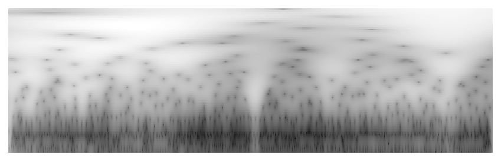
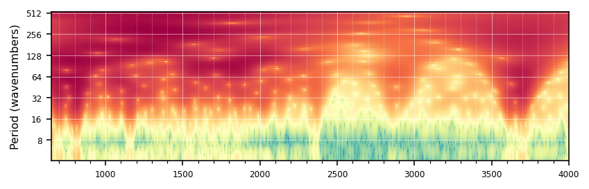

> Simple wrapper around `pywt.cwt` to perform continuous wavelet transform.


::: {#cell-3 .cell 0='e' 1='x' 2='p' 3='o' 4='r' 5='t'}
``` {.python .cell-code}
import pycwt
from pycwt import cwt
import fastcore.all as fc
import pandas as pd
import numpy as np
import matplotlib.pyplot as plt
from multiprocessing import Pool, cpu_count
import os
import io
from PIL import Image
from pathlib import Path
from tqdm.auto import tqdm
```

::: {.cell-output .cell-output-stderr}
```
/Users/franckalbinet/mambaforge/envs/uhina/lib/python3.12/site-packages/tqdm/auto.py:21: TqdmWarning: IProgress not found. Please update jupyter and ipywidgets. See https://ipywidgets.readthedocs.io/en/stable/user_install.html
  from .autonotebook import tqdm as notebook_tqdm
```
:::
:::


::: {#cell-4 .cell 0='h' 1='i' 2='d' 3='e'}
``` {.python .cell-code}
from sklearn.pipeline import Pipeline
from uhina.preprocessing import SNV, TakeDerivative
from uhina.loading import OSSLLoader, LoaderFactory

import warnings
warnings.filterwarnings('ignore')
```
:::


::: {#cell-5 .cell 0='e' 1='x' 2='p' 3='o' 4='r' 5='t' 6='s'}
``` {.python .cell-code}
class CWT: 
    def __init__(self, data, dt=2, mother=pycwt.Morlet(6)):
        fc.store_attr()
        self.normalize()
        self.init_params()
        
    def init_params(self):
        self.N = self.data.size
        self.s0 = 2 * self.dt  # Starting scale, in this case 2 * 0.25 years = 6 months  
        self.dj = 1 / 12  # Twelve sub-octaves per octaves
        self.J = 7 / self.dj  # Seven powers of two with dj sub-octaves
            
    def normalize(self):
        self.std = self.data.std()  # Standard deviation
        self.var = self.std ** 2  # Variance
        self.data /= self.std  # Normalized dataset
    
    def get_wavelet(self):
        cwt_results = cwt(self.data, self.dt, self.dj, self.s0, self.J, self.mother)
        (self.wave, self.scales, self.freqs, self.coi, self.fft, self.fftfreqs) = cwt_results
    
    def get_powers(self):    
        self.power = (np.abs(self.wave)) ** 2
    
    def get_period(self): 
        self.period = 1 / self.freqs
    
    def __call__(self):
        self.get_wavelet()
        self.get_powers()
        self.get_period()
        return self
```
:::


::: {#cell-6 .cell 0='e' 1='x' 2='p' 3='o' 4='r' 5='t' 6='s'}
``` {.python .cell-code}
def plot_cwt(cwt, wavenumbers,
             dt=2, 
             figprops=dict(figsize=(6, 2), dpi=144), tight=True, 
             fontsize=8, title='', cmap=plt.cm.grey, save_path=None, 
             show_plot=True, show_coi:bool=False):
    "Plot the continuous wavelet transform."
    fig, ax = plt.subplots(**figprops)
    # if levels is None:
    #     levels = [np.percentile(cwt.power, p) for p in [10, 20, 30, 40, 50, 75, 90, 95, 99, 99.5]]
        
    # log2_levels = np.log2(levels)
    # contourf = ax.contourf(wavenumbers, np.log2(cwt.period), np.log2(cwt.power), 
    #                        log2_levels, extend='both', cmap=cmap)
    # extent = [wavenumbers.min(), wavenumbers.max(), 0, max(cwt.period)]

    im = ax.imshow(np.log2(cwt.power), aspect='auto', cmap=cmap,
                   extent=[wavenumbers.min(), wavenumbers.max(), 
                           np.log2(cwt.period.max()), np.log2(cwt.period.min())],
                   interpolation='nearest')
    
    # if show_coi:
    #     ax.fill(np.concatenate([wavenumbers, wavenumbers[-1:] + dt, wavenumbers[-1:] + dt,
    #                            wavenumbers[:1] - dt, wavenumbers[:1] - dt]),
    #             np.concatenate([np.log2(cwt.coi), [1e-9], np.log2(cwt.period[-1:]),
    #                            np.log2(cwt.period[-1:]), [1e-9]]),
    #             'black', alpha=0.5 if not save_path else 1, 
    #             hatch='x'
    #         )

    ax.set_xlim(wavenumbers.min(), wavenumbers.max())
    ax.set_ylim(np.log2(cwt.period.min()), np.log2(cwt.period.max()))
    # ax.set_ylim(8, np.log2(cwt.period.max()))

    if not save_path: 
        ax.set_title(title, fontsize=fontsize)
        ax.set_ylabel('Period (wavenumbers)', fontsize=fontsize)
        if not tight: ax.set_xlabel('Wavenumber', fontsize=fontsize)  # Added x-axis label

    Yticks = 2 ** np.arange(np.ceil(np.log2(cwt.period.min())),
                               np.ceil(np.log2(cwt.period.max())))
    Yticks = Yticks.astype(int)

    ax.set_yticks(np.log2(Yticks))
    ax.set_yticklabels(Yticks, fontsize=fontsize-2)
    
    # Set major and minor ticks for x-axis
    ax.xaxis.set_major_locator(plt.MultipleLocator(500))
    ax.xaxis.set_minor_locator(plt.MultipleLocator(100))
    
    # Customize tick parameters
    ax.tick_params(axis='x', which='major', labelsize=fontsize-2)
    ax.tick_params(axis='x', which='minor', bottom=True)
    
    if not save_path:
        # Add grid for both major and minor ticks
        ax.grid(which='major', linestyle='-', linewidth='0.5', color='white', alpha=0.5)
        ax.grid(which='minor', linestyle=':', linewidth='0.5', color='white', alpha=0.5)
    
        # Create a new colorbar with correct logarithmic scaling
        # cbar = plt.colorbar(contourf, ax=ax, ticks=log2_levels)
        # cbar = plt.colorbar(im, ax=ax, ticks=log2_levels)
        # cbar.ax.set_yticklabels([f'{2**x:.1e}' for x in log2_levels])
        # cbar.ax.tick_params(labelsize=fontsize-2)
        # cbar.set_label('Power', fontsize=fontsize)
    
    if save_path:
        ax.axis('off')
        
        # plt.savefig(save_path, bbox_inches='tight', pad_inches=0)
        buf = io.BytesIO()
        fig.savefig(buf, format='png', dpi=figprops['dpi'], bbox_inches='tight', pad_inches=0)
        buf.seek(0)
        img = Image.open(buf).convert('L')  # Convert to black and white
        img.save(save_path)
        buf.close()
    
    if show_plot:
        plt.tight_layout()
        plt.show()
    else:
        plt.close(fig)  # Close the figure without displaying it
```
:::


::: {#cell-7 .cell}
``` {.python .cell-code}
# Ringtrial data
src = Path.home() / 'pro/data/woodwell-ringtrial/drive-download-20231013T123706Z-001'
loader = LoaderFactory.get_loader(src, 'ringtrial')
X, y, wavenumbers, smp_idx, ds_name, ds_label = loader.load_data(analytes='potassium_cmolkg')
print(f'X shape: {X.shape}')

```

::: {.cell-output .cell-output-stdout}
```
X shape: (1400, 1676)
```
:::
:::


::: {#cell-8 .cell}
``` {.python .cell-code}
use_test_dataset = False

if use_test_dataset:
    X, y, wavenumbers, smp_idx, ds_name, ds_label = fc.load_pickle('./files/spectrum-and-all.pkl')
else:
    loader = OSSLLoader(cfgs={
        'visnir': {'ref_col': 'scan_visnir.1500_ref', 'range': [400, 2500]},
        'mir': {'ref_col': 'scan_mir.1500_abs', 'range': [650, 4000]}})
    analytes = 'k.ext_usda.a725_cmolc.kg'
    X, y, wavenumbers, smp_idx, ds_name, ds_label = loader.load_data(analytes, spectra_type='mir')
```

::: {.cell-output .cell-output-stdout}
```
Loading data from /Users/franckalbinet/.lssm/data/ossl/ossl_all_L0_v1.2.csv.gz ...
```
:::
:::


::: {#cell-9 .cell}
``` {.python .cell-code}
pipe = Pipeline([
    ('SNV', SNV()),
    ('Derivative', TakeDerivative())
])

X_trans = pipe.fit_transform(X)
```
:::


::: {#cell-10 .cell 0='e' 1='x' 2='p' 3='o' 4='r' 5='t' 6='s'}
``` {.python .cell-code}
import numpy as np

class OnlinePercentileEstimator:
    def __init__(self, percentiles):
        self.percentiles = percentiles
        self.values = []

    def update(self, array):
        self.values.extend(array.flatten())

    def calculate_percentiles(self):
        self.values = np.array(self.values)
        return np.percentile(self.values, self.percentiles)
```
:::


Example usage:

::: {#cell-12 .cell}
``` {.python .cell-code}
array_list = [np.random.rand(85, 1700) for _ in range(10)]  # Replace with your actual arrays
percentiles = [10, 50, 90]

estimator = OnlinePercentileEstimator(percentiles)

for array in array_list:
    estimator.update(array)

results = estimator.calculate_percentiles()
print(results)
```

::: {.cell-output .cell-output-stdout}
```
[0.09974468 0.50061319 0.89970337]
```
:::
:::


::: {#cell-13 .cell 0='e' 1='x' 2='p' 3='o' 4='r' 5='t' 6='s'}
``` {.python .cell-code}
class OnlinePercentileEstimator:
    "Estimate the percentiles of the power of the wavelet transform of the spectra."
    def __init__(self, percentiles, n_samples=1000):
        self.percentiles = percentiles
        self.n_samples = n_samples
        self.values = np.empty((n_samples, len(percentiles)))
        self.current_index = 0
        self.is_full = False

    def update(self, array):
        array_flat = array.flatten()
        percentiles_values = np.percentile(array_flat, self.percentiles)
        n = len(percentiles_values)
        if self.current_index + 1 > self.n_samples:
            self.is_full = True
            self.current_index = 0  # Overwrite from the beginning if buffer is full
        self.values[self.current_index, :] = percentiles_values
        self.current_index += 1

    def calculate_percentiles(self):
        if self.is_full:
            combined_values = self.values
        else:
            combined_values = self.values[:self.current_index, :]
        return np.percentile(combined_values.flatten(), self.percentiles, axis=0)
```
:::


::: {#cell-14 .cell 0='e' 1='x' 2='p' 3='o' 4='r' 5='t' 6='s'}
``` {.python .cell-code}
def estimate_percentiles(X_trans, 
                         n_samples=100, 
                         percentiles=[10, 20, 30, 40, 50, 60, 70, 80, 90, 95, 99]):
    "Estimate the percentiles of the power of the wavelet transform of the spectra."
    random_indices = np.random.choice(X_trans.shape[0], n_samples, replace=False)
    estimator = OnlinePercentileEstimator(percentiles)
    for i in tqdm(random_indices):
        estimator.update(CWT(X_trans[i, :])().power)
        
    return estimator.calculate_percentiles()

```
:::


::: {#cell-15 .cell}
``` {.python .cell-code}
percentiles_result = estimate_percentiles(X_trans, 
                                          n_samples=1000,
                                          percentiles=[20, 30, 40, 50, 60, 70, 80, 90, 95, 97, 99])
percentiles_result
```

::: {.cell-output .cell-output-stderr}
```
100%|██████████| 1000/1000 [00:04<00:00, 224.53it/s]
```
:::

::: {.cell-output .cell-output-display}
```
array([4.36853870e-03, 4.55577419e-02, 3.48299797e-01, 1.96312606e+00,
       8.16566542e+00, 2.48355509e+01, 4.17488328e+01, 5.81917738e+01,
       7.27800829e+01, 7.79890255e+01, 9.08328558e+01])
```
:::
:::


::: {#cell-16 .cell}
``` {.python .cell-code}
plot_cwt(CWT(X_trans[1, :])(), wavenumbers=wavenumbers, 
         cmap=plt.cm.grey, save_path='../_data/test-1.png')
```

::: {.cell-output .cell-output-display}
{}
:::
:::


::: {#cell-17 .cell}
``` {.python .cell-code}
plot_cwt(CWT(X_trans[0, :])(), wavenumbers=wavenumbers, cmap=plt.cm.Spectral_r)
```

::: {.cell-output .cell-output-display}
{}
:::
:::


::: {#cell-18 .cell 0='e' 1='x' 2='p' 3='o' 4='r' 5='t' 6='s'}
``` {.python .cell-code}
def estimate_conversion_time(seconds=1000, samples=1000):
    "Estimate the time to convert all spectra to images."
    return seconds * (samples / 1000) / 60
```
:::


::: {#cell-19 .cell 0='e' 1='x' 2='p' 3='o' 4='r' 5='t' 6='s'}
``` {.python .cell-code}
def create_image_target_csv(smp_idx: np.ndarray, # sample indices     
                            y: np.ndarray, # target values
                            n_samples: int = None, # number of samples to process
                            output_dir: str = '../_data/ossl-tfm/', # path to save the CSV file
                            fname:str = 'im-targets-lut.csv'
                            ) -> None: 
    "Create a CSV file with the image names and the target values."
    n_samples = len(smp_idx) if n_samples is None else n_samples
    
    items = {
        'fname': [f'{id}.png' for id in smp_idx[:n_samples]],
        'kex': [np.log1p(y[i].item()) for i in range(n_samples)]
    }
    
    df = pd.DataFrame(items).dropna()
    df.to_csv(Path(output_dir) / fname, index=False)
```
:::


::: {#cell-20 .cell}
``` {.python .cell-code}
create_image_target_csv(smp_idx, y, n_samples=None, output_dir='../_data/ringtrial-tfm')  
pd.read_csv('../_data/ringtrial-tfm/im-targets-lut.csv').head()
```

::: {.cell-output .cell-output-display}

```{=html}
<div>
<style scoped>
    .dataframe tbody tr th:only-of-type {
        vertical-align: middle;
    }

    .dataframe tbody tr th {
        vertical-align: top;
    }

    .dataframe thead th {
        text-align: right;
    }
</style>
<table border="1" class="dataframe">
  <thead>
    <tr style="text-align: right;">
      <th></th>
      <th>fname</th>
      <th>kex</th>
    </tr>
  </thead>
  <tbody>
    <tr>
      <th>0</th>
      <td>kssl-rt-01.png</td>
      <td>0.238276</td>
    </tr>
    <tr>
      <th>1</th>
      <td>kssl-rt-02.png</td>
      <td>0.209848</td>
    </tr>
    <tr>
      <th>2</th>
      <td>kssl-rt-03.png</td>
      <td>0.255487</td>
    </tr>
    <tr>
      <th>3</th>
      <td>kssl-rt-04.png</td>
      <td>0.404965</td>
    </tr>
    <tr>
      <th>4</th>
      <td>kssl-rt-05.png</td>
      <td>0.469860</td>
    </tr>
  </tbody>
</table>
</div>
```

:::
:::


::: {#cell-21 .cell 0='e' 1='x' 2='p' 3='o' 4='r' 5='t' 6='s'}
``` {.python .cell-code}
def create_output_directory(output_dir):
    "Create the output directory if it does not exist."
    os.makedirs(output_dir, exist_ok=True)
```
:::


::: {#cell-22 .cell 0='e' 1='x' 2='p' 3='o' 4='r' 5='t' 6='s'}
``` {.python .cell-code}
def process_single_sample(args):
    "Process a single sample and save the wavelet image to the output directory."
    i, id, X_trans_i, wavenumbers, output_dir, cwt_kwargs, plot_kwargs = args
    fname_img = f'{output_dir}/{id}.png'
    cwt_result = CWT(X_trans_i, **cwt_kwargs)()
    plot_cwt(cwt_result, wavenumbers=wavenumbers, 
             save_path=fname_img, show_plot=False, **plot_kwargs)
```
:::


::: {#cell-23 .cell 0='e' 1='x' 2='p' 3='o' 4='r' 5='t' 6='s'}
``` {.python .cell-code}
def batch_indices(n_samples: int, batch_size: int) -> range:
    "Generate batch indices for processing."
    for start in range(0, n_samples, batch_size):
        end = min(start + batch_size, n_samples)
        yield range(start, end)
```
:::


::: {#cell-24 .cell 0='e' 1='x' 2='p' 3='o' 4='r' 5='t' 6='s'}
``` {.python .cell-code}
def convert_to_wavelet_images(X_trans: np.ndarray,
                              smp_idx: np.ndarray,
                              wavenumbers: np.ndarray,
                              output_dir: str = '../_data/im',
                              cwt_kwargs: dict = None,
                              plot_kwargs: dict = None,
                              n_samples: int = None,
                              batch_size: int = 100,
                              n_workers: int = None,
                              ) -> None:
    "Process samples in parallel batches and save wavelet images to output directory."
    create_output_directory(output_dir)
    
    cwt_kwargs = cwt_kwargs or {}
    plot_kwargs = plot_kwargs or {}

    n_samples = len(smp_idx) if n_samples is None else min(n_samples, len(smp_idx))
    n_workers = n_workers or max(1, cpu_count() - 1)  # Use all cores except one by default
    
    with tqdm(total=n_samples, desc="Processing samples") as pbar:
        for batch in batch_indices(n_samples, batch_size):
            args = [(i, smp_idx[i], X_trans[i, :], wavenumbers, output_dir, cwt_kwargs, plot_kwargs) for i in batch]
            with Pool(n_workers) as pool:
                pool.map(process_single_sample, args)
            
            pbar.update(len(batch))
    
    return None
```
:::


::: {#cell-25 .cell}
``` {.python .cell-code}
convert_to_wavelet_images(X_trans, smp_idx, wavenumbers, 
                          output_dir='../_data/ringtrial-tfm/im', n_samples=200, batch_size=10)
```

::: {.cell-output .cell-output-stderr}
```
Processing samples: 100%|██████████| 200/200 [00:10<00:00, 19.76it/s]
```
:::
:::


