> CWT spectra data augmentation example.


::: {#cell-2 .cell}
``` {.python .cell-code}
import pandas as pd
from pathlib import Path
import fastcore.all as fc

from fastai.data.all import *
from fastai.vision.all import *

import warnings
warnings.filterwarnings('ignore')
```
:::


::: {#cell-3 .cell}
``` {.python .cell-code}
# ossl_source = '../../_data/ossl-tfm/ossl-tfm.csv'
# df = pd.read_csv(ossl_source); df.head()
```
:::


::: {#cell-4 .cell}
``` {.python .cell-code}
# df['kex'].min(), df['kex'].max() 
```
:::


::: {#cell-5 .cell}
``` {.python .cell-code}
im = Image.open('../../_data/ossl-tfm/im-bw/0a4a799aade039b885aaec0efa6d2d97.png')
im.mode
```

::: {.cell-output .cell-output-display}
```
'RGBA'
```
:::
:::


::: {#cell-6 .cell}
``` {.python .cell-code}
im = Image.open('../../_data/test-0.png')
im_tensor = image2tensor(im)[0]
print(len(np.unique(im_tensor)))
im

```

::: {.cell-output .cell-output-stdout}
```
202
```
:::

::: {.cell-output .cell-output-display}
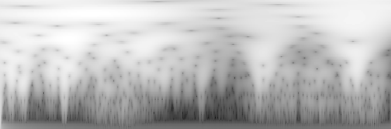{}
:::
:::


::: {#cell-7 .cell}
``` {.python .cell-code}
plt.hist(im_tensor.flatten(), bins=50);
```

::: {.cell-output .cell-output-display}
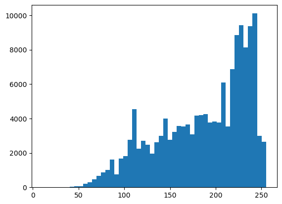{}
:::
:::


::: {#cell-8 .cell}
``` {.python .cell-code}
im_array = np.array(im_rgba)
```
:::


::: {#cell-9 .cell}
``` {.python .cell-code}
percentiles = np.linspace(0, 99.9, 255)
len(percentiles)
```

::: {.cell-output .cell-output-display}
```
255
```
:::
:::


::: {#cell-10 .cell}
``` {.python .cell-code}
percentiles
```

::: {.cell-output .cell-output-display}
```
array([ 0.        ,  0.39330709,  0.78661417,  1.17992126,  1.57322835,
        1.96653543,  2.35984252,  2.75314961,  3.14645669,  3.53976378,
        3.93307087,  4.32637795,  4.71968504,  5.11299213,  5.50629921,
        5.8996063 ,  6.29291339,  6.68622047,  7.07952756,  7.47283465,
        7.86614173,  8.25944882,  8.65275591,  9.04606299,  9.43937008,
        9.83267717, 10.22598425, 10.61929134, 11.01259843, 11.40590551,
       11.7992126 , 12.19251969, 12.58582677, 12.97913386, 13.37244094,
       13.76574803, 14.15905512, 14.5523622 , 14.94566929, 15.33897638,
       15.73228346, 16.12559055, 16.51889764, 16.91220472, 17.30551181,
       17.6988189 , 18.09212598, 18.48543307, 18.87874016, 19.27204724,
       19.66535433, 20.05866142, 20.4519685 , 20.84527559, 21.23858268,
       21.63188976, 22.02519685, 22.41850394, 22.81181102, 23.20511811,
       23.5984252 , 23.99173228, 24.38503937, 24.77834646, 25.17165354,
       25.56496063, 25.95826772, 26.3515748 , 26.74488189, 27.13818898,
       27.53149606, 27.92480315, 28.31811024, 28.71141732, 29.10472441,
       29.4980315 , 29.89133858, 30.28464567, 30.67795276, 31.07125984,
       31.46456693, 31.85787402, 32.2511811 , 32.64448819, 33.03779528,
       33.43110236, 33.82440945, 34.21771654, 34.61102362, 35.00433071,
       35.3976378 , 35.79094488, 36.18425197, 36.57755906, 36.97086614,
       37.36417323, 37.75748031, 38.1507874 , 38.54409449, 38.93740157,
       39.33070866, 39.72401575, 40.11732283, 40.51062992, 40.90393701,
       41.29724409, 41.69055118, 42.08385827, 42.47716535, 42.87047244,
       43.26377953, 43.65708661, 44.0503937 , 44.44370079, 44.83700787,
       45.23031496, 45.62362205, 46.01692913, 46.41023622, 46.80354331,
       47.19685039, 47.59015748, 47.98346457, 48.37677165, 48.77007874,
       49.16338583, 49.55669291, 49.95      , 50.34330709, 50.73661417,
       51.12992126, 51.52322835, 51.91653543, 52.30984252, 52.70314961,
       53.09645669, 53.48976378, 53.88307087, 54.27637795, 54.66968504,
       55.06299213, 55.45629921, 55.8496063 , 56.24291339, 56.63622047,
       57.02952756, 57.42283465, 57.81614173, 58.20944882, 58.60275591,
       58.99606299, 59.38937008, 59.78267717, 60.17598425, 60.56929134,
       60.96259843, 61.35590551, 61.7492126 , 62.14251969, 62.53582677,
       62.92913386, 63.32244094, 63.71574803, 64.10905512, 64.5023622 ,
       64.89566929, 65.28897638, 65.68228346, 66.07559055, 66.46889764,
       66.86220472, 67.25551181, 67.6488189 , 68.04212598, 68.43543307,
       68.82874016, 69.22204724, 69.61535433, 70.00866142, 70.4019685 ,
       70.79527559, 71.18858268, 71.58188976, 71.97519685, 72.36850394,
       72.76181102, 73.15511811, 73.5484252 , 73.94173228, 74.33503937,
       74.72834646, 75.12165354, 75.51496063, 75.90826772, 76.3015748 ,
       76.69488189, 77.08818898, 77.48149606, 77.87480315, 78.26811024,
       78.66141732, 79.05472441, 79.4480315 , 79.84133858, 80.23464567,
       80.62795276, 81.02125984, 81.41456693, 81.80787402, 82.2011811 ,
       82.59448819, 82.98779528, 83.38110236, 83.77440945, 84.16771654,
       84.56102362, 84.95433071, 85.3476378 , 85.74094488, 86.13425197,
       86.52755906, 86.92086614, 87.31417323, 87.70748031, 88.1007874 ,
       88.49409449, 88.88740157, 89.28070866, 89.67401575, 90.06732283,
       90.46062992, 90.85393701, 91.24724409, 91.64055118, 92.03385827,
       92.42716535, 92.82047244, 93.21377953, 93.60708661, 94.0003937 ,
       94.39370079, 94.78700787, 95.18031496, 95.57362205, 95.96692913,
       96.36023622, 96.75354331, 97.14685039, 97.54015748, 97.93346457,
       98.32677165, 98.72007874, 99.11338583, 99.50669291, 99.9       ])
```
:::
:::


::: {#cell-11 .cell}
``` {.python .cell-code}
np.unique(im_array)
```

::: {.cell-output .cell-output-display}
```
array([ 83, 101, 105, 108, 110, 113, 114, 116, 118, 119, 121, 122, 123,
       124, 125, 127, 128, 129, 130, 131, 132, 133, 134, 135, 136, 137,
       138, 139, 140, 141, 142, 143, 144, 145, 146, 147, 148, 149, 150,
       151, 152, 153, 154, 155, 156, 157, 158, 159, 160, 161, 162, 163,
       164, 165, 166, 167, 168, 169, 170, 171, 172, 173, 174, 175, 176,
       177, 178, 179, 180, 181, 182, 183, 184, 185, 186, 187, 188, 189,
       190, 191, 192, 193, 194, 195, 196, 197, 198, 199, 200, 201, 202,
       203, 204, 205, 206, 207, 208, 209, 210, 211, 212, 213, 214, 215,
       216, 217, 218, 219, 220, 221, 222, 223, 224, 225, 226, 227, 228,
       229, 230, 231, 232, 233, 234, 235, 236, 237, 238, 239, 240, 241,
       242, 243, 244, 245, 246, 247, 248, 249, 250, 251, 252, 253, 254,
       255], dtype=uint8)
```
:::
:::


::: {#cell-13 .cell}
``` {.python .cell-code}
im_rgba.size
im_rgba.getbands()
im_rgba.getcolors()
im_rgba.getbbox()
im_rgba.getdata()
im_rgba.getextrema()
im_rgba.getpalette()
im_rgba.getpixel()
im_rgba.getprojection()
im_rgba.getxmpmetadata()
```
:::


::: {#cell-14 .cell}
``` {.python .cell-code}
# Open the image
im_rgba = Image.open('../../_data/all-grey-255.png')
```
:::


::: {#cell-15 .cell}
``` {.python .cell-code}
import numpy as np
from PIL import Image
import matplotlib.pyplot as plt

```
:::


::: {#cell-16 .cell}
``` {.python .cell-code}
@delegates()
class Quantize(DisplayedTransform):
    # split_idx,mode,mode_mask,order = None,BILINEAR,NEAREST,1
    "Quantize B&W image into `num_colors` colors."
    def __init__(self, 
        num_colors:int=10,
        **kwargs
    ):
        store_attr()
        super().__init__(**kwargs)

    def before_call(self, 
        b, 
        split_idx:int # Index of the train/valid dataset
    ):
        pass

    def encodes(self, x:Image.Image):
        # im_gray = x.convert('L')
        im_array = np.array(x)

        im_array = np.array(im_gray)
        percentiles = range(40, 99, 1)
        levels = np.percentile(im_array, percentiles)
        im_quant = np.digitize(im_array, levels)

        cmap = plt.get_cmap('Spectral_r')
        im_color = cmap(im_quant / (len(percentiles)))
        im_color_8bit = (im_color * 255).astype(np.uint8)
        return Image.fromarray(im_color_8bit)
    
```
:::


::: {#cell-17 .cell}
``` {.python .cell-code}
Quantize()(im)
```

::: {.cell-output .cell-output-display}
```
<PIL.PngImagePlugin.PngImageFile image mode=RGBA size=669x221>
```
:::
:::


::: {#cell-18 .cell}
``` {.python .cell-code}

# Convert to grayscale

im_array = np.array(im)

im_array = np.array(im_gray)
# percentiles = range(0.1, 99, 5)
percentiles= np.linspace(0.1, 99.9, 20)
levels = np.percentile(im_array, percentiles)
im_quant = np.digitize(im_array, levels)

cmap = plt.get_cmap('Spectral_r')
im_color = cmap(im_quant / (len(percentiles)))
im_color_8bit = (im_color * 255).astype(np.uint8)
im_final = Image.fromarray(im_color_8bit)
im_final

```

::: {.cell-output .cell-output-display}
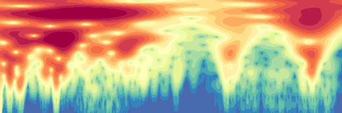{}
:::
:::


::: {#cell-19 .cell}
``` {.python .cell-code}
im_tensor = image2tensor(im_gray)[0]
percentiles = torch.arange(40, 99, dtype=torch.float32)
levels = torch.quantile(im_tensor.float(), percentiles / 100)

# Digitize the image
im_quant = torch.bucketize(im_tensor.float(), levels)
```
:::


::: {#cell-20 .cell}
``` {.python .cell-code}
# Calculate percentiles
# percentiles = [10, 20, 30, 40, 50, 60, 70, 80, 90]
# percentiles = [30, 50, 60, 70, 80, 90, 95, 97, 99]
# percentiles = range(40, 99, 1)
# percentiles = list(range(40, 80, 4)) + list(range(82, 99, 1))
# levels = np.percentile(im_array, percentiles)
```
:::


::: {#cell-21 .cell}
``` {.python .cell-code}
# Quantize the image
# im_quant = np.digitize(im_array, levels)

```
:::


::: {#cell-22 .cell}
``` {.python .cell-code}
# Create a colormap
cmap = plt.get_cmap('Spectral_r')
```
:::


::: {#cell-23 .cell}
``` {.python .cell-code}
# Apply colormap
im_color = cmap(im_quant / (len(percentiles)))
```
:::


::: {#cell-24 .cell}
``` {.python .cell-code}
type(im_color)
```

::: {.cell-output .cell-output-display}
```
numpy.ndarray
```
:::
:::


::: {#cell-25 .cell}
``` {.python .cell-code}
# Convert back to 8-bit color values
im_color_8bit = (im_color * 255).astype(np.uint8)

# im_color_8bit = (im_color * 255).round().to(torch.uint8)
```
:::


::: {#cell-26 .cell}
``` {.python .cell-code}
# Create a new image
im_final = Image.fromarray(im_color_8bit)
im_final
```

::: {.cell-output .cell-output-display}
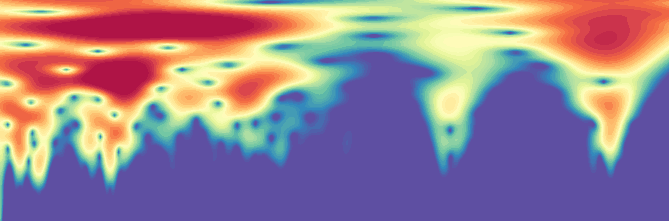{}
:::
:::


::: {#cell-27 .cell}
``` {.python .cell-code}
im_gray = im_rgba.convert('L')
```
:::


::: {#cell-28 .cell}
``` {.python .cell-code}
im_gray
```

::: {.cell-output .cell-output-display}
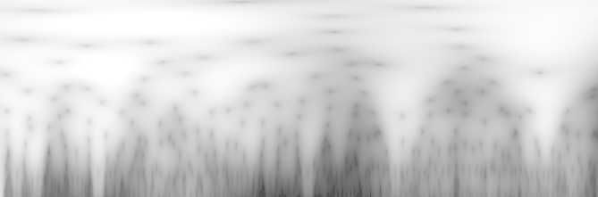{}
:::
:::


::: {#cell-29 .cell}
``` {.python .cell-code}
im_array = np.array(im_gray)
```
:::


::: {#cell-30 .cell}
``` {.python .cell-code}
im_array
```

::: {.cell-output .cell-output-display}
```
array([[244, 244, 244, ..., 246, 246, 246],
       [243, 243, 244, ..., 245, 245, 245],
       [242, 242, 243, ..., 245, 245, 244],
       ...,
       [223, 219, 210, ..., 116, 129, 137],
       [222, 219, 210, ..., 114, 128, 137],
       [222, 219, 209, ..., 113, 128, 136]], dtype=uint8)
```
:::
:::


::: {#cell-31 .cell}
``` {.python .cell-code}
percentiles = [10, 20, 30, 40, 50, 60, 70, 80, 90]
levels = np.percentile(im_array, percentiles)
```
:::


::: {#cell-32 .cell}
``` {.python .cell-code}
im_quant = np.digitize(im_array, levels)
```
:::


::: {#cell-33 .cell}
``` {.python .cell-code}
im_rgb = im_rgba.convert('RGB'); im_rgb
```

::: {.cell-output .cell-output-display}
{}
:::
:::


::: {#cell-34 .cell}
``` {.python .cell-code}
image2tensor(im_rgb)[0,:10, :10]
```

::: {.cell-output .cell-output-display}
```
tensor([[244, 244, 244, 244, 245, 245, 245, 245, 245, 245],
        [243, 243, 244, 244, 244, 244, 244, 244, 244, 244],
        [242, 242, 243, 243, 243, 243, 243, 243, 243, 244],
        [242, 242, 242, 242, 242, 242, 242, 242, 243, 243],
        [241, 241, 241, 241, 242, 242, 242, 242, 242, 242],
        [240, 240, 241, 241, 241, 241, 241, 241, 241, 241],
        [239, 240, 240, 240, 240, 240, 240, 240, 240, 240],
        [239, 239, 239, 239, 239, 239, 239, 239, 239, 239],
        [238, 238, 238, 238, 238, 238, 238, 238, 238, 238],
        [238, 237, 237, 237, 237, 237, 237, 237, 237, 237]], dtype=torch.uint8)
```
:::
:::


::: {#cell-35 .cell}
``` {.python .cell-code}
im_rgb.getcolors()
```

::: {.cell-output .cell-output-display}
```
[(4869, (255, 255, 255)),
 (875, (253, 253, 253)),
 (2249, (251, 251, 251)),
 (2294, (249, 249, 249)),
 (2054, (247, 247, 247)),
 (2033, (245, 245, 245)),
 (1970, (243, 243, 243)),
 (1887, (241, 241, 241)),
 (2486, (239, 239, 239)),
 (2011, (237, 237, 237)),
 (2736, (235, 235, 235)),
 (2638, (233, 233, 233)),
 (1720, (231, 231, 231)),
 (1594, (229, 229, 229)),
 (1311, (227, 227, 227)),
 (1432, (225, 225, 225)),
 (1310, (223, 223, 223)),
 (1258, (221, 221, 221)),
 (1311, (219, 219, 219)),
 (1165, (217, 217, 217)),
 (1067, (215, 215, 215)),
 (1076, (213, 213, 213)),
 (1217, (211, 211, 211)),
 (573, (209, 209, 209)),
 (653, (207, 207, 207)),
 (632, (205, 205, 205)),
 (693, (203, 203, 203)),
 (762, (201, 201, 201)),
 (1469, (199, 199, 199)),
 (1513, (197, 197, 197)),
 (1513, (195, 195, 195)),
 (1483, (193, 193, 193)),
 (1371, (191, 191, 191)),
 (1328, (189, 189, 189)),
 (1272, (187, 187, 187)),
 (611, (185, 185, 185)),
 (553, (183, 183, 183)),
 (597, (181, 181, 181)),
 (619, (179, 179, 179)),
 (583, (177, 177, 177)),
 (590, (175, 175, 175)),
 (578, (173, 173, 173)),
 (1096, (171, 171, 171)),
 (1017, (169, 169, 169)),
 (1013, (167, 167, 167)),
 (498, (165, 165, 165)),
 (497, (163, 163, 163)),
 (553, (161, 161, 161)),
 (424, (159, 159, 159)),
 (423, (157, 157, 157)),
 (412, (155, 155, 155)),
 (379, (153, 153, 153)),
 (289, (151, 151, 151)),
 (535, (149, 149, 149)),
 (263, (147, 147, 147)),
 (220, (145, 145, 145)),
 (455, (143, 143, 143)),
 (197, (141, 141, 141)),
 (192, (139, 139, 139)),
 (203, (137, 137, 137)),
 (199, (135, 135, 135)),
 (209, (133, 133, 133)),
 (197, (131, 131, 131)),
 (195, (129, 129, 129)),
 (188, (127, 127, 127)),
 (207, (125, 125, 125)),
 (204, (123, 123, 123)),
 (172, (121, 121, 121)),
 (168, (119, 119, 119)),
 (253, (113, 113, 113)),
 (374, (105, 105, 105)),
 (357, (101, 101, 101)),
 (318, (83, 83, 83)),
 (636, (254, 254, 254)),
 (1219, (252, 252, 252)),
 (3064, (250, 250, 250)),
 (3285, (248, 248, 248)),
 (2638, (246, 246, 246)),
 (2698, (244, 244, 244)),
 (2600, (242, 242, 242)),
 (1918, (240, 240, 240)),
 (2076, (238, 238, 238)),
 (2570, (236, 236, 236)),
 (1795, (234, 234, 234)),
 (2531, (232, 232, 232)),
 (2679, (230, 230, 230)),
 (2129, (228, 228, 228)),
 (2178, (226, 226, 226)),
 (1388, (224, 224, 224)),
 (2083, (222, 222, 222)),
 (1373, (220, 220, 220)),
 (1285, (218, 218, 218)),
 (592, (216, 216, 216)),
 (1095, (214, 214, 214)),
 (533, (212, 212, 212)),
 (1134, (210, 210, 210)),
 (1251, (208, 208, 208)),
 (1243, (206, 206, 206)),
 (1296, (204, 204, 204)),
 (1352, (202, 202, 202)),
 (833, (200, 200, 200)),
 (716, (198, 198, 198)),
 (740, (196, 196, 196)),
 (648, (194, 194, 194)),
 (726, (192, 192, 192)),
 (672, (190, 190, 190)),
 (650, (188, 188, 188)),
 (1241, (186, 186, 186)),
 (1178, (184, 184, 184)),
 (1243, (182, 182, 182)),
 (1219, (180, 180, 180)),
 (1139, (178, 178, 178)),
 (1169, (176, 176, 176)),
 (1190, (174, 174, 174)),
 (1174, (172, 172, 172)),
 (530, (170, 170, 170)),
 (517, (168, 168, 168)),
 (1037, (166, 166, 166)),
 (965, (164, 164, 164)),
 (1049, (162, 162, 162)),
 (988, (160, 160, 160)),
 (911, (158, 158, 158)),
 (808, (156, 156, 156)),
 (772, (154, 154, 154)),
 (709, (152, 152, 152)),
 (295, (150, 150, 150)),
 (277, (148, 148, 148)),
 (505, (146, 146, 146)),
 (221, (144, 144, 144)),
 (212, (142, 142, 142)),
 (208, (140, 140, 140)),
 (388, (138, 138, 138)),
 (201, (136, 136, 136)),
 (218, (134, 134, 134)),
 (204, (132, 132, 132)),
 (184, (130, 130, 130)),
 (205, (128, 128, 128)),
 (200, (124, 124, 124)),
 (175, (122, 122, 122)),
 (186, (118, 118, 118)),
 (226, (116, 116, 116)),
 (218, (114, 114, 114)),
 (299, (110, 110, 110)),
 (299, (108, 108, 108))]
```
:::
:::


::: {#cell-36 .cell}
``` {.python .cell-code}
image2tensor(im_rgba)[0,:,:].unique()
```

::: {.cell-output .cell-output-display}
```
tensor([  0,   1,   2,   3,   4,   5,   6,   7,   8,   9,  10,  11,  12,  13,
         14,  15,  16,  17,  18,  19,  20,  21,  22,  23,  24,  25,  26,  27,
         28,  29,  30,  31,  32,  33,  34,  35,  36,  37,  38,  39,  40,  41,
         42,  43,  44,  45,  46,  47,  48,  49,  50,  51,  53,  54,  55,  56,
         57,  58,  59,  60,  62,  63,  64,  65,  66,  67,  68,  69,  70,  71,
         72,  73,  74,  75,  76,  77,  78,  80,  82,  83,  84,  85,  86,  87,
         88,  89,  90,  91,  92,  93,  94,  95,  96,  98,  99, 100, 101, 102,
        103, 104, 105, 106, 107, 108, 109, 110, 111, 112, 113, 114, 116, 117,
        118, 119, 120, 121, 122, 123, 124, 125, 126, 127, 128, 129, 130, 131,
        132, 133, 134, 135, 136, 137, 138, 139, 140, 141, 142, 143, 144, 145,
        146, 147, 148, 149, 150, 151, 152, 153, 154, 155, 156, 157, 158, 159,
        160, 161, 162, 163, 164, 165, 166, 167, 168, 169, 170, 171, 172, 173,
        174, 175, 176, 177, 178, 179, 180, 181, 182, 183, 184, 185, 186, 187,
        188, 189, 190, 191, 192, 193, 194, 195, 196, 197, 198, 199, 200, 201,
        202, 203, 204, 205, 206, 207, 208, 209, 210, 211, 212, 213, 214, 215,
        216, 217, 218, 219, 220, 221, 222, 223, 224, 225, 226, 227, 228, 229,
        230, 231, 232, 233, 234, 235, 236, 237, 238, 239, 240, 241, 242, 243,
        244, 245, 246, 247, 248, 249, 250, 251, 252, 253, 254, 255],
       dtype=torch.uint8)
```
:::
:::


::: {#cell-37 .cell}
``` {.python .cell-code}
image2tensor(im_rgba)[0,:,:]
```

::: {.cell-output .cell-output-display}
```
tensor([[  0,   0,   0,  ...,   0,   0,   0],
        [  0,   0,   0,  ...,   0,   0,   0],
        [  0,   0,   0,  ...,   0,   0,   0],
        ...,
        [  0,   0, 196,  ..., 116,  67,   0],
        [  0,   0, 205,  ..., 114,  72,   0],
        [  0,   5, 209,  ..., 113,  78,   0]], dtype=torch.uint8)
```
:::
:::


::: {#cell-38 .cell}
``` {.python .cell-code}
import torch
import numpy as np
import matplotlib.pyplot as plt
from PIL import Image

# Assuming you have a tensor with values from 0 to 250
# For this example, let's create a sample tensor
tensor = torch.randint(0, 251, (100, 100))  # 100x100 tensor with random values 0-250

```

::: {.cell-output .cell-output-display}
```
torch.Size([100, 100])
```
:::
:::


::: {#cell-39 .cell}
``` {.python .cell-code}
tensor = image2tensor(im_rgba)[0,::]
```
:::


::: {#cell-40 .cell}
``` {.python .cell-code}
bins = np.linspace(0, 250, 20 + 1)
bins
```

::: {.cell-output .cell-output-display}
```
array([  0. ,  12.5,  25. ,  37.5,  50. ,  62.5,  75. ,  87.5, 100. ,
       112.5, 125. , 137.5, 150. , 162.5, 175. , 187.5, 200. , 212.5,
       225. , 237.5, 250. ])
```
:::
:::


::: {#cell-41 .cell}
``` {.python .cell-code}


bins = [np.percentile(valid_tensor, p) for p in range(1, 99, 5)]
print(f'bins: {bins}')
num_colors = len(bins) - 1
print(f'num_colors: {num_colors}')
```

::: {.cell-output .cell-output-stdout}
```
bins: [105.0, 145.0, 159.0, 168.0, 176.0, 183.0, 190.0, 196.0, 203.0, 210.0, 217.0, 222.0, 226.0, 230.0, 233.0, 236.0, 240.0, 244.0, 248.0, 253.0]
num_colors: 19
```
:::
:::


::: {#cell-42 .cell}
``` {.python .cell-code}
mask = ~(tensor == 0)
```
:::


::: {#cell-43 .cell}
``` {.python .cell-code}
mask

```

::: {.cell-output .cell-output-display}
```
tensor([[False, False, False,  ..., False, False, False],
        [False, False, False,  ..., False, False, False],
        [False, False, False,  ..., False, False, False],
        ...,
        [False, False,  True,  ...,  True,  True, False],
        [False, False,  True,  ...,  True,  True, False],
        [False,  True,  True,  ...,  True,  True, False]])
```
:::
:::


::: {#cell-44 .cell}
``` {.python .cell-code}
# To define bins an colors
import torch
import numpy as np
import matplotlib.pyplot as plt
from PIL import Image
from matplotlib.colors import BoundaryNorm

# Assuming tensor is your input tensor
tensor_im_rgba = image2tensor(im_rgba)[0,::]
# valid_tensor = tensor_im_rgba[mask]
bins = [np.percentile(tensor_im_rgba, p) for p in range(40, 99, 5)]
print(f'bins: {bins}')
num_colors = len(bins) - 1
print(f'num_colors: {num_colors}')
# num_colors = 12

# Create a color map object for 'jet' palette
cmap = plt.get_cmap('jet', num_colors)

# Create a norm to map values to colormap
norm = BoundaryNorm(bins, cmap.N)

```

::: {.cell-output .cell-output-stdout}
```
bins: [193.0, 200.0, 208.0, 216.0, 222.0, 227.0, 231.0, 234.0, 238.0, 242.0, 246.0, 251.0]
num_colors: 11
```
:::
:::


::: {#cell-45 .cell}
``` {.python .cell-code}

# # Convert to 8-bit color values
# colored_array_8bit = (colored_array * 255).astype(np.uint8)

# # set mask to black (to be adapted below)
# colored_array[~mask] = [0, 0, 0, alpha[~mask]]

# Create a PIL Image
# img = Image.fromarray(colored_array_8bit)
# img
```
:::


::: {#cell-46 .cell}
``` {.python .cell-code}
tensor = image2tensor(im_rgba)[0,::]
# Create a color map object for 'jet' palette
cmap = plt.get_cmap('jet')

# Normalize the tensor values to be between 0 and 1
normalized_tensor = tensor.float() / 250

# Convert the tensor to a numpy array
np_array = normalized_tensor.numpy()

# Apply the colormap
colored_array = cmap(np_array)

# Convert to 8-bit color values
colored_array_8bit = (colored_array * 255).astype(np.uint8)

# Create a PIL Image
img = Image.fromarray(colored_array_8bit)
img
```

::: {.cell-output .cell-output-display}
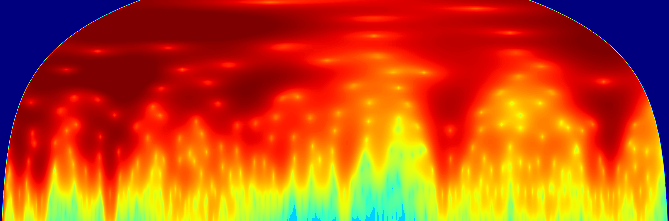{}
:::
:::


::: {#cell-47 .cell}
``` {.python .cell-code}
len(image2tensor(im_rgba).unique())
```

::: {.cell-output .cell-output-display}
```
250
```
:::
:::


::: {#cell-48 .cell}
``` {.python .cell-code}
im_rgb = im_rgba.convert('RGB')
```
:::


::: {#cell-49 .cell}
``` {.python .cell-code}
image2tensor(im_rgb)[0,:10,:10]
```

::: {.cell-output .cell-output-display}
```
tensor([[0, 0, 0, 0, 0, 0, 0, 0, 0, 0],
        [0, 0, 0, 0, 0, 0, 0, 0, 0, 0],
        [0, 0, 0, 0, 0, 0, 0, 0, 0, 0],
        [0, 0, 0, 0, 0, 0, 0, 0, 0, 0],
        [0, 0, 0, 0, 0, 0, 0, 0, 0, 0],
        [0, 0, 0, 0, 0, 0, 0, 0, 0, 0],
        [0, 0, 0, 0, 0, 0, 0, 0, 0, 0],
        [0, 0, 0, 0, 0, 0, 0, 0, 0, 0],
        [0, 0, 0, 0, 0, 0, 0, 0, 0, 0],
        [0, 0, 0, 0, 0, 0, 0, 0, 0, 0]], dtype=torch.uint8)
```
:::
:::


::: {#cell-50 .cell}
``` {.python .cell-code}
im_rgb.getcolors()

```

::: {.cell-output .cell-output-display}
```
[(4558, (255, 255, 255)),
 (704, (253, 253, 253)),
 (1065, (251, 251, 251)),
 (1184, (249, 249, 249)),
 (1226, (247, 247, 247)),
 (1502, (245, 245, 245)),
 (1607, (243, 243, 243)),
 (1622, (241, 241, 241)),
 (2133, (239, 239, 239)),
 (1822, (237, 237, 237)),
 (2530, (235, 235, 235)),
 (2482, (233, 233, 233)),
 (1641, (231, 231, 231)),
 (1507, (229, 229, 229)),
 (1242, (227, 227, 227)),
 (1371, (225, 225, 225)),
 (1247, (223, 223, 223)),
 (1211, (221, 221, 221)),
 (1263, (219, 219, 219)),
 (1131, (217, 217, 217)),
 (1030, (215, 215, 215)),
 (1047, (213, 213, 213)),
 (1180, (211, 211, 211)),
 (558, (209, 209, 209)),
 (646, (207, 207, 207)),
 (620, (205, 205, 205)),
 (686, (203, 203, 203)),
 (753, (201, 201, 201)),
 (1452, (199, 199, 199)),
 (1499, (197, 197, 197)),
 (1495, (195, 195, 195)),
 (1475, (193, 193, 193)),
 (1361, (191, 191, 191)),
 (1315, (189, 189, 189)),
 (1263, (187, 187, 187)),
 (608, (185, 185, 185)),
 (551, (183, 183, 183)),
 (586, (181, 181, 181)),
 (608, (179, 179, 179)),
 (570, (177, 177, 177)),
 (582, (175, 175, 175)),
 (566, (173, 173, 173)),
 (1082, (171, 171, 171)),
 (993, (169, 169, 169)),
 (987, (167, 167, 167)),
 (486, (165, 165, 165)),
 (488, (163, 163, 163)),
 (541, (161, 161, 161)),
 (409, (159, 159, 159)),
 (406, (157, 157, 157)),
 (397, (155, 155, 155)),
 (362, (153, 153, 153)),
 (273, (151, 151, 151)),
 (503, (149, 149, 149)),
 (259, (147, 147, 147)),
 (213, (145, 145, 145)),
 (448, (143, 143, 143)),
 (191, (141, 141, 141)),
 (188, (139, 139, 139)),
 (198, (137, 137, 137)),
 (195, (135, 135, 135)),
 (201, (133, 133, 133)),
 (195, (131, 131, 131)),
 (187, (129, 129, 129)),
 (185, (127, 127, 127)),
 (203, (125, 125, 125)),
 (205, (123, 123, 123)),
 (175, (121, 121, 121)),
 (169, (119, 119, 119)),
 (1, (117, 117, 117)),
 (254, (113, 113, 113)),
 (1, (111, 111, 111)),
 (4, (109, 109, 109)),
 (1, (107, 107, 107)),
 (379, (105, 105, 105)),
 (3, (103, 103, 103)),
 (359, (101, 101, 101)),
 (3, (99, 99, 99)),
 (4, (95, 95, 95)),
 (1, (93, 93, 93)),
 (1, (91, 91, 91)),
 (1, (89, 89, 89)),
 (2, (87, 87, 87)),
 (4, (85, 85, 85)),
 (320, (83, 83, 83)),
 (4, (77, 77, 77)),
 (2, (75, 75, 75)),
 (2, (73, 73, 73)),
 (3, (71, 71, 71)),
 (2, (69, 69, 69)),
 (4, (67, 67, 67)),
 (2, (65, 65, 65)),
 (3, (63, 63, 63)),
 (2, (59, 59, 59)),
 (2, (57, 57, 57)),
 (2, (55, 55, 55)),
 (3, (53, 53, 53)),
 (1, (51, 51, 51)),
 (5, (49, 49, 49)),
 (1, (47, 47, 47)),
 (2, (45, 45, 45)),
 (1, (43, 43, 43)),
 (4, (41, 41, 41)),
 (3, (39, 39, 39)),
 (4, (37, 37, 37)),
 (4, (35, 35, 35)),
 (3, (33, 33, 33)),
 (3, (31, 31, 31)),
 (5, (29, 29, 29)),
 (2, (27, 27, 27)),
 (1, (25, 25, 25)),
 (3, (23, 23, 23)),
 (4, (21, 21, 21)),
 (2, (19, 19, 19)),
 (2, (17, 17, 17)),
 (4, (15, 15, 15)),
 (3, (13, 13, 13)),
 (5, (11, 11, 11)),
 (5, (9, 9, 9)),
 (6, (7, 7, 7)),
 (7, (5, 5, 5)),
 (9, (3, 3, 3)),
 (13, (1, 1, 1)),
 (518, (254, 254, 254)),
 (874, (252, 252, 252)),
 (1651, (250, 250, 250)),
 (1640, (248, 248, 248)),
 (1786, (246, 246, 246)),
 (2128, (244, 244, 244)),
 (2154, (242, 242, 242)),
 (1668, (240, 240, 240)),
 (1804, (238, 238, 238)),
 (2377, (236, 236, 236)),
 (1688, (234, 234, 234)),
 (2379, (232, 232, 232)),
 (2548, (230, 230, 230)),
 (2014, (228, 228, 228)),
 (2066, (226, 226, 226)),
 (1298, (224, 224, 224)),
 (1983, (222, 222, 222)),
 (1325, (220, 220, 220)),
 (1238, (218, 218, 218)),
 (576, (216, 216, 216)),
 (1058, (214, 214, 214)),
 (520, (212, 212, 212)),
 (1107, (210, 210, 210)),
 (1232, (208, 208, 208)),
 (1223, (206, 206, 206)),
 (1279, (204, 204, 204)),
 (1334, (202, 202, 202)),
 (829, (200, 200, 200)),
 (711, (198, 198, 198)),
 (739, (196, 196, 196)),
 (647, (194, 194, 194)),
 (722, (192, 192, 192)),
 (671, (190, 190, 190)),
 (650, (188, 188, 188)),
 (1232, (186, 186, 186)),
 (1165, (184, 184, 184)),
 (1217, (182, 182, 182)),
 (1193, (180, 180, 180)),
 (1120, (178, 178, 178)),
 (1142, (176, 176, 176)),
 (1162, (174, 174, 174)),
 (1145, (172, 172, 172)),
 (512, (170, 170, 170)),
 (513, (168, 168, 168)),
 (1015, (166, 166, 166)),
 (945, (164, 164, 164)),
 (1017, (162, 162, 162)),
 (965, (160, 160, 160)),
 (878, (158, 158, 158)),
 (777, (156, 156, 156)),
 (728, (154, 154, 154)),
 (670, (152, 152, 152)),
 (286, (150, 150, 150)),
 (271, (148, 148, 148)),
 (491, (146, 146, 146)),
 (213, (144, 144, 144)),
 (202, (142, 142, 142)),
 (203, (140, 140, 140)),
 (361, (138, 138, 138)),
 (196, (136, 136, 136)),
 (210, (134, 134, 134)),
 (198, (132, 132, 132)),
 (180, (130, 130, 130)),
 (197, (128, 128, 128)),
 (1, (126, 126, 126)),
 (199, (124, 124, 124)),
 (176, (122, 122, 122)),
 (4, (120, 120, 120)),
 (188, (118, 118, 118)),
 (226, (116, 116, 116)),
 (220, (114, 114, 114)),
 (5, (112, 112, 112)),
 (300, (110, 110, 110)),
 (300, (108, 108, 108)),
 (2, (106, 106, 106)),
 (3, (104, 104, 104)),
 (1, (102, 102, 102)),
 (2, (100, 100, 100)),
 (5, (98, 98, 98)),
 (3, (96, 96, 96)),
 (2, (94, 94, 94)),
 (3, (92, 92, 92)),
 (3, (90, 90, 90)),
 (2, (88, 88, 88)),
 (4, (86, 86, 86)),
 (1, (84, 84, 84)),
 (2, (82, 82, 82)),
 (1, (80, 80, 80)),
 (7, (78, 78, 78)),
 (6, (76, 76, 76)),
 (3, (74, 74, 74)),
 (3, (72, 72, 72)),
 (2, (70, 70, 70)),
 (3, (68, 68, 68)),
 (2, (66, 66, 66)),
 (1, (64, 64, 64)),
 (4, (62, 62, 62)),
 (3, (60, 60, 60)),
 (2, (58, 58, 58)),
 (1, (56, 56, 56)),
 (2, (54, 54, 54)),
 (3, (50, 50, 50)),
 (3, (48, 48, 48)),
 (7, (46, 46, 46)),
 (2, (44, 44, 44)),
 (3, (42, 42, 42)),
 (3, (40, 40, 40)),
 (2, (38, 38, 38)),
 (2, (36, 36, 36)),
 (4, (34, 34, 34)),
 (5, (32, 32, 32)),
 (2, (30, 30, 30)),
 (3, (28, 28, 28)),
 (3, (26, 26, 26)),
 (8, (24, 24, 24)),
 (5, (22, 22, 22)),
 (5, (20, 20, 20)),
 (2, (18, 18, 18)),
 (4, (16, 16, 16)),
 (3, (14, 14, 14)),
 (4, (12, 12, 12)),
 (4, (10, 10, 10)),
 (4, (8, 8, 8)),
 (10, (6, 6, 6)),
 (10, (4, 4, 4)),
 (6, (2, 2, 2)),
 (14100, (0, 0, 0))]
```
:::
:::


::: {#cell-51 .cell}
``` {.python .cell-code}
im_rgb.size
```

::: {.cell-output .cell-output-display}
```
(669, 221)
```
:::
:::


::: {#cell-52 .cell}
``` {.python .cell-code}
?im_rgb.quantize

```

::: {.cell-output .cell-output-stdout}
``````````````````
Signature:
im_rgb.quantize(
    colors: 'int' = 256,
    method: 'int | None' = None,
    kmeans: 'int' = 0,
    palette=None,
    dither: 'Dither' = <Dither.FLOYDSTEINBERG: 3>,
) -> 'Image'
Docstring:
Convert the image to 'P' mode with the specified number
of colors.

:param colors: The desired number of colors, <= 256
:param method: :data:`Quantize.MEDIANCUT` (median cut),
               :data:`Quantize.MAXCOVERAGE` (maximum coverage),
               :data:`Quantize.FASTOCTREE` (fast octree),
               :data:`Quantize.LIBIMAGEQUANT` (libimagequant; check support
               using :py:func:`PIL.features.check_feature` with
               ``feature="libimagequant"``).

               By default, :data:`Quantize.MEDIANCUT` will be used.

               The exception to this is RGBA images. :data:`Quantize.MEDIANCUT`
               and :data:`Quantize.MAXCOVERAGE` do not support RGBA images, so
               :data:`Quantize.FASTOCTREE` is used by default instead.
:param kmeans: Integer greater than or equal to zero.
:param palette: Quantize to the palette of given
                :py:class:`PIL.Image.Image`.
:param dither: Dithering method, used when converting from
   mode "RGB" to "P" or from "RGB" or "L" to "1".
   Available methods are :data:`Dither.NONE` or :data:`Dither.FLOYDSTEINBERG`
   (default).
:returns: A new image
File:      ~/mambaforge/envs/uhina/lib/python3.12/site-packages/PIL/Image.py
Type:      method
``````````````````
:::
:::


::: {#cell-53 .cell}
``` {.python .cell-code}
im_p = im_rgb.quantize(colors=256, method=Image.MEDIANCUT)
```
:::


::: {#cell-54 .cell}
``` {.python .cell-code}
image2tensor(im_p)[0,:10,:10]

```

::: {.cell-output .cell-output-display}
```
tensor([[249, 249, 249, 249, 249, 249, 249, 249, 249, 249],
        [249, 249, 249, 249, 249, 249, 249, 249, 249, 249],
        [249, 249, 249, 249, 249, 249, 249, 249, 249, 249],
        [249, 249, 249, 249, 249, 249, 249, 249, 249, 249],
        [249, 249, 249, 249, 249, 249, 249, 249, 249, 249],
        [249, 249, 249, 249, 249, 249, 249, 249, 249, 249],
        [249, 249, 249, 249, 249, 249, 249, 249, 249, 249],
        [249, 249, 249, 249, 249, 249, 249, 249, 249, 249],
        [249, 249, 249, 249, 249, 249, 249, 249, 249, 249],
        [249, 249, 249, 249, 249, 249, 249, 249, 249, 249]], dtype=torch.uint8)
```
:::
:::


::: {#cell-55 .cell}
``` {.python .cell-code}
image2tensor(im_p).unique()
```

::: {.cell-output .cell-output-display}
```
tensor([  0,   1,   2,   3,   4,   5,   6,   7,   8,   9,  10,  11,  12,  13,
         14,  15,  16,  17,  18,  19,  20,  21,  22,  23,  24,  25,  26,  27,
         28,  29,  30,  31,  32,  33,  34,  35,  36,  37,  38,  39,  40,  41,
         42,  43,  44,  45,  46,  47,  48,  49,  50,  51,  52,  53,  54,  55,
         56,  57,  58,  59,  60,  61,  62,  63,  64,  65,  66,  67,  68,  69,
         70,  71,  72,  73,  74,  75,  76,  77,  78,  79,  80,  81,  82,  83,
         84,  85,  86,  87,  88,  89,  90,  91,  92,  93,  94,  95,  96,  97,
         98,  99, 100, 101, 102, 103, 104, 105, 106, 107, 108, 109, 110, 111,
        112, 113, 114, 115, 116, 117, 118, 119, 120, 121, 122, 123, 124, 125,
        126, 127, 128, 129, 130, 131, 132, 133, 134, 135, 136, 137, 138, 139,
        140, 141, 142, 143, 144, 145, 146, 147, 148, 149, 150, 151, 152, 153,
        154, 155, 156, 157, 158, 159, 160, 161, 162, 163, 164, 165, 166, 167,
        168, 169, 170, 171, 172, 173, 174, 175, 176, 177, 178, 179, 180, 181,
        182, 183, 184, 185, 186, 187, 188, 189, 190, 191, 192, 193, 194, 195,
        196, 197, 198, 199, 200, 201, 202, 203, 204, 205, 206, 207, 208, 209,
        210, 211, 212, 213, 214, 215, 216, 217, 218, 219, 220, 221, 222, 223,
        224, 225, 226, 227, 228, 229, 230, 231, 232, 233, 234, 235, 236, 237,
        238, 239, 240, 241, 242, 243, 244, 245, 246, 247, 248, 249],
       dtype=torch.uint8)
```
:::
:::


::: {#cell-56 .cell}
``` {.python .cell-code}
?im_p.getpalette
```

::: {.cell-output .cell-output-stdout}
```
Signature: im_p.getpalette(rawmode: 'str | None' = 'RGB') -> 'list[int] | None'
Docstring:
Returns the image palette as a list.

:param rawmode: The mode in which to return the palette. ``None`` will
   return the palette in its current mode.

   .. versionadded:: 9.1.0

:returns: A list of color values [r, g, b, ...], or None if the
   image has no palette.
File:      ~/mambaforge/envs/uhina/lib/python3.12/site-packages/PIL/Image.py
Type:      method
```
:::
:::


::: {#cell-57 .cell}
``` {.python .cell-code}
im_p.getpalette()
```

::: {.cell-output .cell-output-display}
```
[255,
 255,
 255,
 254,
 254,
 254,
 253,
 253,
 253,
 252,
 252,
 252,
 251,
 251,
 251,
 250,
 250,
 250,
 249,
 249,
 249,
 248,
 248,
 248,
 247,
 247,
 247,
 246,
 246,
 246,
 245,
 245,
 245,
 244,
 244,
 244,
 243,
 243,
 243,
 242,
 242,
 242,
 241,
 241,
 241,
 240,
 240,
 240,
 239,
 239,
 239,
 238,
 238,
 238,
 237,
 237,
 237,
 236,
 236,
 236,
 235,
 235,
 235,
 234,
 234,
 234,
 233,
 233,
 233,
 232,
 232,
 232,
 231,
 231,
 231,
 230,
 230,
 230,
 229,
 229,
 229,
 228,
 228,
 228,
 227,
 227,
 227,
 226,
 226,
 226,
 225,
 225,
 225,
 224,
 224,
 224,
 223,
 223,
 223,
 222,
 222,
 222,
 221,
 221,
 221,
 220,
 220,
 220,
 219,
 219,
 219,
 218,
 218,
 218,
 217,
 217,
 217,
 216,
 216,
 216,
 215,
 215,
 215,
 214,
 214,
 214,
 213,
 213,
 213,
 212,
 212,
 212,
 211,
 211,
 211,
 210,
 210,
 210,
 209,
 209,
 209,
 208,
 208,
 208,
 207,
 207,
 207,
 206,
 206,
 206,
 205,
 205,
 205,
 204,
 204,
 204,
 203,
 203,
 203,
 202,
 202,
 202,
 201,
 201,
 201,
 200,
 200,
 200,
 199,
 199,
 199,
 198,
 198,
 198,
 197,
 197,
 197,
 196,
 196,
 196,
 195,
 195,
 195,
 194,
 194,
 194,
 193,
 193,
 193,
 192,
 192,
 192,
 191,
 191,
 191,
 190,
 190,
 190,
 189,
 189,
 189,
 188,
 188,
 188,
 187,
 187,
 187,
 186,
 186,
 186,
 185,
 185,
 185,
 184,
 184,
 184,
 183,
 183,
 183,
 182,
 182,
 182,
 181,
 181,
 181,
 180,
 180,
 180,
 179,
 179,
 179,
 178,
 178,
 178,
 177,
 177,
 177,
 176,
 176,
 176,
 175,
 175,
 175,
 174,
 174,
 174,
 173,
 173,
 173,
 172,
 172,
 172,
 171,
 171,
 171,
 170,
 170,
 170,
 169,
 169,
 169,
 168,
 168,
 168,
 167,
 167,
 167,
 166,
 166,
 166,
 165,
 165,
 165,
 164,
 164,
 164,
 163,
 163,
 163,
 162,
 162,
 162,
 161,
 161,
 161,
 160,
 160,
 160,
 159,
 159,
 159,
 158,
 158,
 158,
 157,
 157,
 157,
 156,
 156,
 156,
 155,
 155,
 155,
 154,
 154,
 154,
 153,
 153,
 153,
 152,
 152,
 152,
 151,
 151,
 151,
 150,
 150,
 150,
 149,
 149,
 149,
 148,
 148,
 148,
 147,
 147,
 147,
 146,
 146,
 146,
 145,
 145,
 145,
 144,
 144,
 144,
 143,
 143,
 143,
 142,
 142,
 142,
 141,
 141,
 141,
 140,
 140,
 140,
 139,
 139,
 139,
 138,
 138,
 138,
 137,
 137,
 137,
 136,
 136,
 136,
 135,
 135,
 135,
 134,
 134,
 134,
 133,
 133,
 133,
 132,
 132,
 132,
 131,
 131,
 131,
 130,
 130,
 130,
 129,
 129,
 129,
 128,
 128,
 128,
 127,
 127,
 127,
 126,
 126,
 126,
 125,
 125,
 125,
 124,
 124,
 124,
 123,
 123,
 123,
 122,
 122,
 122,
 121,
 121,
 121,
 120,
 120,
 120,
 119,
 119,
 119,
 118,
 118,
 118,
 117,
 117,
 117,
 116,
 116,
 116,
 114,
 114,
 114,
 113,
 113,
 113,
 112,
 112,
 112,
 111,
 111,
 111,
 110,
 110,
 110,
 109,
 109,
 109,
 108,
 108,
 108,
 107,
 107,
 107,
 106,
 106,
 106,
 105,
 105,
 105,
 104,
 104,
 104,
 103,
 103,
 103,
 102,
 102,
 102,
 101,
 101,
 101,
 100,
 100,
 100,
 99,
 99,
 99,
 98,
 98,
 98,
 96,
 96,
 96,
 95,
 95,
 95,
 94,
 94,
 94,
 93,
 93,
 93,
 92,
 92,
 92,
 91,
 91,
 91,
 90,
 90,
 90,
 89,
 89,
 89,
 88,
 88,
 88,
 87,
 87,
 87,
 86,
 86,
 86,
 85,
 85,
 85,
 84,
 84,
 84,
 83,
 83,
 83,
 82,
 82,
 82,
 80,
 80,
 80,
 78,
 78,
 78,
 77,
 77,
 77,
 76,
 76,
 76,
 75,
 75,
 75,
 74,
 74,
 74,
 73,
 73,
 73,
 72,
 72,
 72,
 71,
 71,
 71,
 70,
 70,
 70,
 69,
 69,
 69,
 68,
 68,
 68,
 67,
 67,
 67,
 66,
 66,
 66,
 65,
 65,
 65,
 64,
 64,
 64,
 63,
 63,
 63,
 62,
 62,
 62,
 60,
 60,
 60,
 59,
 59,
 59,
 58,
 58,
 58,
 57,
 57,
 57,
 56,
 56,
 56,
 55,
 55,
 55,
 54,
 54,
 54,
 53,
 53,
 53,
 51,
 51,
 51,
 50,
 50,
 50,
 49,
 49,
 49,
 48,
 48,
 48,
 47,
 47,
 47,
 46,
 46,
 46,
 45,
 45,
 45,
 44,
 44,
 44,
 43,
 43,
 43,
 42,
 42,
 42,
 41,
 41,
 41,
 40,
 40,
 40,
 39,
 39,
 39,
 38,
 38,
 38,
 37,
 37,
 37,
 36,
 36,
 36,
 35,
 35,
 35,
 34,
 34,
 34,
 33,
 33,
 33,
 32,
 32,
 32,
 31,
 31,
 31,
 30,
 30,
 30,
 29,
 29,
 29,
 28,
 28,
 28,
 27,
 27,
 27,
 26,
 26,
 26,
 25,
 25,
 25,
 24,
 24,
 24,
 23,
 23,
 23,
 22,
 22,
 22,
 21,
 21,
 21,
 20,
 20,
 20,
 19,
 19,
 19,
 18,
 18,
 18,
 17,
 17,
 17,
 16,
 16,
 16,
 15,
 15,
 15,
 14,
 14,
 14,
 13,
 13,
 13,
 12,
 12,
 12,
 11,
 11,
 11,
 10,
 10,
 10,
 9,
 9,
 9,
 8,
 8,
 8,
 7,
 7,
 7,
 6,
 6,
 6,
 5,
 5,
 5,
 4,
 4,
 4,
 3,
 3,
 3,
 2,
 2,
 2,
 1,
 1,
 1,
 0,
 0,
 0]
```
:::
:::


::: {#cell-58 .cell}
``` {.python .cell-code}
?im_p.getcolors
```

::: {.cell-output .cell-output-stdout}
```
Signature: im_p.getcolors(maxcolors: 'int' = 256)
Docstring:
Returns a list of colors used in this image.

The colors will be in the image's mode. For example, an RGB image will
return a tuple of (red, green, blue) color values, and a P image will
return the index of the color in the palette.

:param maxcolors: Maximum number of colors.  If this number is
   exceeded, this method returns None.  The default limit is
   256 colors.
:returns: An unsorted list of (count, pixel) values.
File:      ~/mambaforge/envs/uhina/lib/python3.12/site-packages/PIL/Image.py
Type:      method
```
:::
:::


::: {#cell-59 .cell}
``` {.python .cell-code}
# list of (count, pixel) values
im_p.getcolors()
```

::: {.cell-output .cell-output-display}
```
[(4558, 0),
 (518, 1),
 (704, 2),
 (874, 3),
 (1065, 4),
 (1651, 5),
 (1184, 6),
 (1640, 7),
 (1226, 8),
 (1786, 9),
 (1502, 10),
 (2128, 11),
 (1607, 12),
 (2154, 13),
 (1622, 14),
 (1668, 15),
 (2133, 16),
 (1804, 17),
 (1822, 18),
 (2377, 19),
 (2530, 20),
 (1688, 21),
 (2482, 22),
 (2379, 23),
 (1641, 24),
 (2548, 25),
 (1507, 26),
 (2014, 27),
 (1242, 28),
 (2066, 29),
 (1371, 30),
 (1298, 31),
 (1247, 32),
 (1983, 33),
 (1211, 34),
 (1325, 35),
 (1263, 36),
 (1238, 37),
 (1131, 38),
 (576, 39),
 (1030, 40),
 (1058, 41),
 (1047, 42),
 (520, 43),
 (1180, 44),
 (1107, 45),
 (558, 46),
 (1232, 47),
 (646, 48),
 (1223, 49),
 (620, 50),
 (1279, 51),
 (686, 52),
 (1334, 53),
 (753, 54),
 (829, 55),
 (1452, 56),
 (711, 57),
 (1499, 58),
 (739, 59),
 (1495, 60),
 (647, 61),
 (1475, 62),
 (722, 63),
 (1361, 64),
 (671, 65),
 (1315, 66),
 (650, 67),
 (1263, 68),
 (1232, 69),
 (608, 70),
 (1165, 71),
 (551, 72),
 (1217, 73),
 (586, 74),
 (1193, 75),
 (608, 76),
 (1120, 77),
 (570, 78),
 (1142, 79),
 (582, 80),
 (1162, 81),
 (566, 82),
 (1145, 83),
 (1082, 84),
 (512, 85),
 (993, 86),
 (513, 87),
 (987, 88),
 (1015, 89),
 (486, 90),
 (945, 91),
 (488, 92),
 (1017, 93),
 (541, 94),
 (965, 95),
 (409, 96),
 (878, 97),
 (406, 98),
 (777, 99),
 (397, 100),
 (728, 101),
 (362, 102),
 (670, 103),
 (273, 104),
 (286, 105),
 (503, 106),
 (271, 107),
 (259, 108),
 (491, 109),
 (213, 110),
 (213, 111),
 (448, 112),
 (202, 113),
 (191, 114),
 (203, 115),
 (188, 116),
 (361, 117),
 (198, 118),
 (196, 119),
 (195, 120),
 (210, 121),
 (201, 122),
 (198, 123),
 (195, 124),
 (180, 125),
 (187, 126),
 (197, 127),
 (185, 128),
 (1, 129),
 (203, 130),
 (199, 131),
 (205, 132),
 (176, 133),
 (175, 134),
 (4, 135),
 (169, 136),
 (188, 137),
 (1, 138),
 (226, 139),
 (220, 140),
 (254, 141),
 (5, 142),
 (1, 143),
 (300, 144),
 (4, 145),
 (300, 146),
 (1, 147),
 (2, 148),
 (379, 149),
 (3, 150),
 (3, 151),
 (1, 152),
 (359, 153),
 (2, 154),
 (3, 155),
 (5, 156),
 (3, 157),
 (4, 158),
 (2, 159),
 (1, 160),
 (3, 161),
 (1, 162),
 (3, 163),
 (1, 164),
 (2, 165),
 (2, 166),
 (4, 167),
 (4, 168),
 (1, 169),
 (320, 170),
 (2, 171),
 (1, 172),
 (7, 173),
 (4, 174),
 (6, 175),
 (2, 176),
 (3, 177),
 (2, 178),
 (3, 179),
 (3, 180),
 (2, 181),
 (2, 182),
 (3, 183),
 (4, 184),
 (2, 185),
 (2, 186),
 (1, 187),
 (3, 188),
 (4, 189),
 (3, 190),
 (2, 191),
 (2, 192),
 (2, 193),
 (1, 194),
 (2, 195),
 (2, 196),
 (3, 197),
 (1, 198),
 (3, 199),
 (5, 200),
 (3, 201),
 (1, 202),
 (7, 203),
 (2, 204),
 (2, 205),
 (1, 206),
 (3, 207),
 (4, 208),
 (3, 209),
 (3, 210),
 (2, 211),
 (4, 212),
 (2, 213),
 (4, 214),
 (4, 215),
 (3, 216),
 (5, 217),
 (3, 218),
 (2, 219),
 (5, 220),
 (3, 221),
 (2, 222),
 (3, 223),
 (1, 224),
 (8, 225),
 (3, 226),
 (5, 227),
 (4, 228),
 (5, 229),
 (2, 230),
 (2, 231),
 (2, 232),
 (4, 233),
 (4, 234),
 (3, 235),
 (3, 236),
 (4, 237),
 (5, 238),
 (4, 239),
 (5, 240),
 (4, 241),
 (6, 242),
 (10, 243),
 (7, 244),
 (10, 245),
 (9, 246),
 (6, 247),
 (13, 248),
 (14100, 249)]
```
:::
:::


::: {#cell-60 .cell}
``` {.python .cell-code}
import matplotlib.pyplot as plt
import matplotlib.cm as cm
import numpy as np

# Specify the colormap and the number of levels
cmap_name = 'jet'
num_levels = 20

# Create a colormap object
cmap = cm.get_cmap(cmap_name)

# Generate evenly spaced values between 0 and 1
values = np.linspace(0, 1, num_levels)

# Get the colors for each level
colors = cmap(values)

# Print the RGB values (excluding alpha)
for i, color in enumerate(colors):
    print(f"Level {i}: RGB = {color[:3]}")

# Optionally, visualize the colors
fig, ax = plt.subplots(figsize=(12, 0.4))
for i, color in enumerate(colors):
    ax.add_patch(plt.Rectangle((i, 0), 1, 1, color=color))
ax.set_xlim(0, num_levels)
ax.set_ylim(0, 1)
ax.axis('off')
plt.show()
```

::: {.cell-output .cell-output-stdout}
```
Level 0: RGB = [0.  0.  0.5]
Level 1: RGB = [0.         0.         0.73172906]
Level 2: RGB = [0.         0.         0.96345811]
Level 3: RGB = [0.         0.12745098 1.        ]
Level 4: RGB = [0.         0.33137255 1.        ]
Level 5: RGB = [0.         0.55098039 1.        ]
Level 6: RGB = [0.         0.75490196 1.        ]
Level 7: RGB = [0.06008855 0.9745098  0.90765338]
Level 8: RGB = [0.22454143 1.         0.74320051]
Level 9: RGB = [0.40164453 1.         0.56609741]
Level 10: RGB = [0.56609741 1.         0.40164453]
Level 11: RGB = [0.74320051 1.         0.22454143]
Level 12: RGB = [0.90765338 1.         0.06008855]
Level 13: RGB = [1.         0.82861293 0.        ]
Level 14: RGB = [1.         0.63979666 0.        ]
Level 15: RGB = [1.         0.43645606 0.        ]
Level 16: RGB = [1.        0.2476398 0.       ]
Level 17: RGB = [0.96345811 0.0442992  0.        ]
Level 18: RGB = [0.73172906 0.         0.        ]
Level 19: RGB = [0.5 0.  0. ]
```
:::

::: {.cell-output .cell-output-display}
{}
:::
:::


::: {#cell-61 .cell}
``` {.python .cell-code}
im_p.getpalette()
```

::: {.cell-output .cell-output-display}
```
[255,
 255,
 255,
 254,
 254,
 254,
 253,
 253,
 253,
 252,
 252,
 252,
 251,
 251,
 251,
 250,
 250,
 250,
 249,
 249,
 249,
 248,
 248,
 248,
 247,
 247,
 247,
 246,
 246,
 246,
 245,
 245,
 245,
 244,
 244,
 244,
 243,
 243,
 243,
 242,
 242,
 242,
 241,
 241,
 241,
 240,
 240,
 240,
 239,
 239,
 239,
 238,
 238,
 238,
 237,
 237,
 237,
 236,
 236,
 236,
 235,
 235,
 235,
 234,
 234,
 234,
 233,
 233,
 233,
 232,
 232,
 232,
 231,
 231,
 231,
 230,
 230,
 230,
 229,
 229,
 229,
 228,
 228,
 228,
 227,
 227,
 227,
 226,
 226,
 226,
 225,
 225,
 225,
 224,
 224,
 224,
 223,
 223,
 223,
 222,
 222,
 222,
 221,
 221,
 221,
 220,
 220,
 220,
 219,
 219,
 219,
 218,
 218,
 218,
 217,
 217,
 217,
 216,
 216,
 216,
 215,
 215,
 215,
 214,
 214,
 214,
 213,
 213,
 213,
 212,
 212,
 212,
 211,
 211,
 211,
 210,
 210,
 210,
 209,
 209,
 209,
 208,
 208,
 208,
 207,
 207,
 207,
 206,
 206,
 206,
 205,
 205,
 205,
 204,
 204,
 204,
 203,
 203,
 203,
 202,
 202,
 202,
 201,
 201,
 201,
 200,
 200,
 200,
 199,
 199,
 199,
 198,
 198,
 198,
 197,
 197,
 197,
 196,
 196,
 196,
 195,
 195,
 195,
 194,
 194,
 194,
 193,
 193,
 193,
 192,
 192,
 192,
 191,
 191,
 191,
 190,
 190,
 190,
 189,
 189,
 189,
 188,
 188,
 188,
 187,
 187,
 187,
 186,
 186,
 186,
 185,
 185,
 185,
 184,
 184,
 184,
 183,
 183,
 183,
 182,
 182,
 182,
 181,
 181,
 181,
 180,
 180,
 180,
 179,
 179,
 179,
 178,
 178,
 178,
 177,
 177,
 177,
 176,
 176,
 176,
 175,
 175,
 175,
 174,
 174,
 174,
 173,
 173,
 173,
 172,
 172,
 172,
 171,
 171,
 171,
 170,
 170,
 170,
 169,
 169,
 169,
 168,
 168,
 168,
 167,
 167,
 167,
 166,
 166,
 166,
 165,
 165,
 165,
 164,
 164,
 164,
 163,
 163,
 163,
 162,
 162,
 162,
 161,
 161,
 161,
 160,
 160,
 160,
 159,
 159,
 159,
 158,
 158,
 158,
 157,
 157,
 157,
 156,
 156,
 156,
 155,
 155,
 155,
 154,
 154,
 154,
 153,
 153,
 153,
 152,
 152,
 152,
 151,
 151,
 151,
 150,
 150,
 150,
 149,
 149,
 149,
 148,
 148,
 148,
 147,
 147,
 147,
 146,
 146,
 146,
 145,
 145,
 145,
 144,
 144,
 144,
 143,
 143,
 143,
 142,
 142,
 142,
 141,
 141,
 141,
 140,
 140,
 140,
 139,
 139,
 139,
 138,
 138,
 138,
 137,
 137,
 137,
 136,
 136,
 136,
 135,
 135,
 135,
 134,
 134,
 134,
 133,
 133,
 133,
 132,
 132,
 132,
 131,
 131,
 131,
 130,
 130,
 130,
 129,
 129,
 129,
 128,
 128,
 128,
 127,
 127,
 127,
 126,
 126,
 126,
 125,
 125,
 125,
 124,
 124,
 124,
 123,
 123,
 123,
 122,
 122,
 122,
 121,
 121,
 121,
 120,
 120,
 120,
 119,
 119,
 119,
 118,
 118,
 118,
 117,
 117,
 117,
 116,
 116,
 116,
 114,
 114,
 114,
 113,
 113,
 113,
 112,
 112,
 112,
 111,
 111,
 111,
 110,
 110,
 110,
 109,
 109,
 109,
 108,
 108,
 108,
 107,
 107,
 107,
 106,
 106,
 106,
 105,
 105,
 105,
 104,
 104,
 104,
 103,
 103,
 103,
 102,
 102,
 102,
 101,
 101,
 101,
 100,
 100,
 100,
 99,
 99,
 99,
 98,
 98,
 98,
 96,
 96,
 96,
 95,
 95,
 95,
 94,
 94,
 94,
 93,
 93,
 93,
 92,
 92,
 92,
 91,
 91,
 91,
 90,
 90,
 90,
 89,
 89,
 89,
 88,
 88,
 88,
 87,
 87,
 87,
 86,
 86,
 86,
 85,
 85,
 85,
 84,
 84,
 84,
 83,
 83,
 83,
 82,
 82,
 82,
 80,
 80,
 80,
 78,
 78,
 78,
 77,
 77,
 77,
 76,
 76,
 76,
 75,
 75,
 75,
 74,
 74,
 74,
 73,
 73,
 73,
 72,
 72,
 72,
 71,
 71,
 71,
 70,
 70,
 70,
 69,
 69,
 69,
 68,
 68,
 68,
 67,
 67,
 67,
 66,
 66,
 66,
 65,
 65,
 65,
 64,
 64,
 64,
 63,
 63,
 63,
 62,
 62,
 62,
 60,
 60,
 60,
 59,
 59,
 59,
 58,
 58,
 58,
 57,
 57,
 57,
 56,
 56,
 56,
 55,
 55,
 55,
 54,
 54,
 54,
 53,
 53,
 53,
 51,
 51,
 51,
 50,
 50,
 50,
 49,
 49,
 49,
 48,
 48,
 48,
 47,
 47,
 47,
 46,
 46,
 46,
 45,
 45,
 45,
 44,
 44,
 44,
 43,
 43,
 43,
 42,
 42,
 42,
 41,
 41,
 41,
 40,
 40,
 40,
 39,
 39,
 39,
 38,
 38,
 38,
 37,
 37,
 37,
 36,
 36,
 36,
 35,
 35,
 35,
 34,
 34,
 34,
 33,
 33,
 33,
 32,
 32,
 32,
 31,
 31,
 31,
 30,
 30,
 30,
 29,
 29,
 29,
 28,
 28,
 28,
 27,
 27,
 27,
 26,
 26,
 26,
 25,
 25,
 25,
 24,
 24,
 24,
 23,
 23,
 23,
 22,
 22,
 22,
 21,
 21,
 21,
 20,
 20,
 20,
 19,
 19,
 19,
 18,
 18,
 18,
 17,
 17,
 17,
 16,
 16,
 16,
 15,
 15,
 15,
 14,
 14,
 14,
 13,
 13,
 13,
 12,
 12,
 12,
 11,
 11,
 11,
 10,
 10,
 10,
 9,
 9,
 9,
 8,
 8,
 8,
 7,
 7,
 7,
 6,
 6,
 6,
 5,
 5,
 5,
 4,
 4,
 4,
 3,
 3,
 3,
 2,
 2,
 2,
 1,
 1,
 1,
 0,
 0,
 0]
```
:::
:::


::: {#cell-62 .cell}
``` {.python .cell-code}
im_p.getcolors()
```

::: {.cell-output .cell-output-display}
```
[(4558, 0),
 (518, 1),
 (704, 2),
 (874, 3),
 (1065, 4),
 (1651, 5),
 (1184, 6),
 (1640, 7),
 (1226, 8),
 (1786, 9),
 (1502, 10),
 (2128, 11),
 (1607, 12),
 (2154, 13),
 (1622, 14),
 (1668, 15),
 (2133, 16),
 (1804, 17),
 (1822, 18),
 (2377, 19),
 (2530, 20),
 (1688, 21),
 (2482, 22),
 (2379, 23),
 (1641, 24),
 (2548, 25),
 (1507, 26),
 (2014, 27),
 (1242, 28),
 (2066, 29),
 (1371, 30),
 (1298, 31),
 (1247, 32),
 (1983, 33),
 (1211, 34),
 (1325, 35),
 (1263, 36),
 (1238, 37),
 (1131, 38),
 (576, 39),
 (1030, 40),
 (1058, 41),
 (1047, 42),
 (520, 43),
 (1180, 44),
 (1107, 45),
 (558, 46),
 (1232, 47),
 (646, 48),
 (1223, 49),
 (620, 50),
 (1279, 51),
 (686, 52),
 (1334, 53),
 (753, 54),
 (829, 55),
 (1452, 56),
 (711, 57),
 (1499, 58),
 (739, 59),
 (1495, 60),
 (647, 61),
 (1475, 62),
 (722, 63),
 (1361, 64),
 (671, 65),
 (1315, 66),
 (650, 67),
 (1263, 68),
 (1232, 69),
 (608, 70),
 (1165, 71),
 (551, 72),
 (1217, 73),
 (586, 74),
 (1193, 75),
 (608, 76),
 (1120, 77),
 (570, 78),
 (1142, 79),
 (582, 80),
 (1162, 81),
 (566, 82),
 (1145, 83),
 (1082, 84),
 (512, 85),
 (993, 86),
 (513, 87),
 (987, 88),
 (1015, 89),
 (486, 90),
 (945, 91),
 (488, 92),
 (1017, 93),
 (541, 94),
 (965, 95),
 (409, 96),
 (878, 97),
 (406, 98),
 (777, 99),
 (397, 100),
 (728, 101),
 (362, 102),
 (670, 103),
 (273, 104),
 (286, 105),
 (503, 106),
 (271, 107),
 (259, 108),
 (491, 109),
 (213, 110),
 (213, 111),
 (448, 112),
 (202, 113),
 (191, 114),
 (203, 115),
 (188, 116),
 (361, 117),
 (198, 118),
 (196, 119),
 (195, 120),
 (210, 121),
 (201, 122),
 (198, 123),
 (195, 124),
 (180, 125),
 (187, 126),
 (197, 127),
 (185, 128),
 (1, 129),
 (203, 130),
 (199, 131),
 (205, 132),
 (176, 133),
 (175, 134),
 (4, 135),
 (169, 136),
 (188, 137),
 (1, 138),
 (226, 139),
 (220, 140),
 (254, 141),
 (5, 142),
 (1, 143),
 (300, 144),
 (4, 145),
 (300, 146),
 (1, 147),
 (2, 148),
 (379, 149),
 (3, 150),
 (3, 151),
 (1, 152),
 (359, 153),
 (2, 154),
 (3, 155),
 (5, 156),
 (3, 157),
 (4, 158),
 (2, 159),
 (1, 160),
 (3, 161),
 (1, 162),
 (3, 163),
 (1, 164),
 (2, 165),
 (2, 166),
 (4, 167),
 (4, 168),
 (1, 169),
 (320, 170),
 (2, 171),
 (1, 172),
 (7, 173),
 (4, 174),
 (6, 175),
 (2, 176),
 (3, 177),
 (2, 178),
 (3, 179),
 (3, 180),
 (2, 181),
 (2, 182),
 (3, 183),
 (4, 184),
 (2, 185),
 (2, 186),
 (1, 187),
 (3, 188),
 (4, 189),
 (3, 190),
 (2, 191),
 (2, 192),
 (2, 193),
 (1, 194),
 (2, 195),
 (2, 196),
 (3, 197),
 (1, 198),
 (3, 199),
 (5, 200),
 (3, 201),
 (1, 202),
 (7, 203),
 (2, 204),
 (2, 205),
 (1, 206),
 (3, 207),
 (4, 208),
 (3, 209),
 (3, 210),
 (2, 211),
 (4, 212),
 (2, 213),
 (4, 214),
 (4, 215),
 (3, 216),
 (5, 217),
 (3, 218),
 (2, 219),
 (5, 220),
 (3, 221),
 (2, 222),
 (3, 223),
 (1, 224),
 (8, 225),
 (3, 226),
 (5, 227),
 (4, 228),
 (5, 229),
 (2, 230),
 (2, 231),
 (2, 232),
 (4, 233),
 (4, 234),
 (3, 235),
 (3, 236),
 (4, 237),
 (5, 238),
 (4, 239),
 (5, 240),
 (4, 241),
 (6, 242),
 (10, 243),
 (7, 244),
 (10, 245),
 (9, 246),
 (6, 247),
 (13, 248),
 (14100, 249)]
```
:::
:::


::: {#cell-63 .cell}
``` {.python .cell-code}

num_colors = len(im_p.getcolors())
print(f"Number of unique colors: {num_colors}")

im_p
```
:::


::: {#cell-64 .cell}
``` {.python .cell-code}
im_p = im.convert('P', palette=Image.ADAPTIVE, colors=256)
im_p
```

::: {.cell-output .cell-output-display}
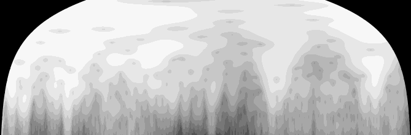{}
:::
:::


::: {#cell-65 .cell}
``` {.python .cell-code}
num_colors = len(image2tensor(im_p).unique())
print(f"Number of unique colors: {num_colors}")
```

::: {.cell-output .cell-output-stdout}
```
Number of unique colors: 16
```
:::
:::


::: {#cell-66 .cell}
``` {.python .cell-code}
np.unique(np.array(im_p.getpalette()))
```

::: {.cell-output .cell-output-display}
```
array([  0,  23,  38,  55,  72,  83, 105, 119, 136, 152, 167, 183, 199,
       216, 231, 247])
```
:::
:::


::: {#cell-67 .cell}
``` {.python .cell-code}
image2tensor(im_p).unique()
```

::: {.cell-output .cell-output-display}
```
tensor([ 0,  1,  2,  3,  4,  5,  6,  7,  8,  9, 10, 11, 12, 13, 14, 15],
       dtype=torch.uint8)
```
:::
:::


::: {#cell-68 .cell}
``` {.python .cell-code}

im_p.putpalette(im_p.getpalette())
im_p.show()
# P: Palette mode = indexed color images
```
:::


::: {#cell-69 .cell}
``` {.python .cell-code}
# P: Palette mode = indexed color images
# Example:

from PIL import Image

# Create a new image with "P" mode
image = Image.new("P", (100, 100))  # Creates a 100x100 pixel image

# Get the palette
palette = image.getpalette()
```
:::


::: {#cell-70 .cell}
``` {.python .cell-code}
palette
```

::: {.cell-output .cell-output-display}
```
[]
```
:::
:::


::: {#cell-71 .cell}
``` {.python .cell-code}

# Modify the palette (optional)
new_palette = [0, 0, 0, 255, 255, 255]  # Black and white palette
image.putpalette(new_palette)

# Set some pixels
image.putpixel((10, 10), 1)  # Set the pixel at (10, 10) to white
image.putpixel((20, 20), 0)  # Set the pixel at (20, 20) to black

# Save the image
# image.save("example.png")

```
:::


::: {#cell-73 .cell}
``` {.python .cell-code}
# Define a custom color palette (example with 6 colors)
palette = [
    0, 0, 0,      # Black
    255, 0, 0,    # Red
    255, 255, 0,  # Yellow
    0, 255, 0,    # Green
    0, 0, 255,    # Blue
    255, 0, 255   # Magenta
]

# Create a new image with the palette
palette_im = Image.new('P', (1, 1))
palette_im.putpalette(palette)

# Quantize the image and apply the palette
quantized_im = im.quantize(colors=6, palette=palette_im, dither=Image.FLOYDSTEINBERG)

# Display the result
quantized_im.show()
```

::: {.cell-output .cell-output-error}
```
ValueError: only RGB or L mode images can be quantized to a palette
```
:::
:::


::: {#cell-74 .cell}
``` {.python .cell-code}
# how to get the cmap of maplotlip
```

::: {.cell-output .cell-output-error}
```
SyntaxError: incomplete input (785122778.py, line 1)
```
:::
:::


::: {#cell-75 .cell}
``` {.python .cell-code}
from PIL import Image
import numpy as np

# Open the grey image
im = Image.open('../../_data/all-grey-255.png')

# Convert to numpy array
im_array = np.array(im)

# Define color mapping function
def map_grey_to_color(grey_value):
    if grey_value < 50:
        return [0, 0, 0]  # Black for very dark greys
    elif grey_value < 100:
        return [255, 0, 0]  # Red for dark greys
    elif grey_value < 150:
        return [255, 255, 0]  # Yellow for medium greys
    elif grey_value < 200:
        return [0, 255, 0]  # Green for light greys
    else:
        return [0, 0, 255]  # Blue for very light greys

# Apply the color mapping
colored_array = np.apply_along_axis(map_grey_to_color, 2, im_array)

# Convert back to PIL Image
colored_im = Image.fromarray(colored_array.astype('uint8'), 'RGB')

# Display the result
colored_im.show()

# If you want to save the result
# colored_im.save('custom_colored_image.png')
```

::: {.cell-output .cell-output-error}
```
ValueError: The truth value of an array with more than one element is ambiguous. Use a.any() or a.all()
```
:::
:::


::: {#cell-76 .cell}
``` {.python .cell-code}
def map_grey_to_color(pixel):
    grey_value = pixel[0]  # Assuming R, G, and B are the same in a grey image
    if grey_value < 50:
        return [0, 0, 0, pixel[3]]  # Black for very dark greys
    elif grey_value < 100:
        return [255, 0, 0, pixel[3]]  # Red for dark greys
    elif grey_value < 150:
        return [255, 255, 0, pixel[3]]  # Yellow for medium greys
    elif grey_value < 200:
        return [0, 255, 0, pixel[3]]  # Green for light greys
    else:
        return [0, 0, 255, pixel[3]]  # Blue for very light greys

# Make sure to use 'RGBA' mode when creating the final image
colored_im = Image.fromarray(colored_array.astype('uint8'), 'RGBA')
```
:::


::: {#cell-77 .cell}
``` {.python .cell-code}
import matplotlib.pyplot as plt
import matplotlib.cm as cm
import numpy as np

# Specify the colormap and the number of levels
cmap_name = 'jet'
num_levels = 10

# Create a colormap object
cmap = cm.get_cmap(cmap_name)

# Generate evenly spaced values between 0 and 1
values = np.linspace(0, 1, num_levels)

# Get the colors for each level
colors = cmap(values)

# Print the RGB values (excluding alpha)
for i, color in enumerate(colors):
    print(f"Level {i}: RGB = {color[:3]}")

# Optionally, visualize the colors
fig, ax = plt.subplots(figsize=(12, 0.4))
for i, color in enumerate(colors):
    ax.add_patch(plt.Rectangle((i, 0), 1, 1, color=color))
ax.set_xlim(0, num_levels)
ax.set_ylim(0, 1)
ax.axis('off')
plt.show()
```

::: {.cell-output .cell-output-stdout}
```
Level 0: RGB = [0.  0.  0.5]
Level 1: RGB = [0.         0.         0.99910873]
Level 2: RGB = [0.         0.37843137 1.        ]
Level 3: RGB = [0.         0.83333333 1.        ]
Level 4: RGB = [0.30044276 1.         0.66729918]
Level 5: RGB = [0.66729918 1.         0.30044276]
Level 6: RGB = [1.         0.90123457 0.        ]
Level 7: RGB = [1.         0.48002905 0.        ]
Level 8: RGB = [0.99910873 0.07334786 0.        ]
Level 9: RGB = [0.5 0.  0. ]
```
:::

::: {.cell-output .cell-output-display}
{}
:::
:::


::: {#cell-78 .cell}
``` {.python .cell-code}
im = Image.open('../../_data/ossl-tfm/img/0a0a0c647671fd3030cc13ba5432eb88.png')
im
```

::: {.cell-output .cell-output-display}
{}
:::
:::


::: {#cell-79 .cell}
``` {.python .cell-code}
im_simple = im.convert('P', palette=Image.ADAPTIVE, colors=10)
im_simple_tensor = image2tensor(im_simple)
print(im_simple_tensor.unique())
```

::: {.cell-output .cell-output-stdout}
```
tensor([0, 1, 2, 3, 4, 5, 6, 7, 8, 9], dtype=torch.uint8)
```
:::
:::


::: {#cell-80 .cell}
``` {.python .cell-code}
im_simple
```

::: {.cell-output .cell-output-display}
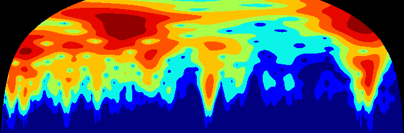{}
:::
:::


::: {#cell-81 .cell}
``` {.python .cell-code}
?im.quantize
```

::: {.cell-output .cell-output-stdout}
``````````````````
Signature:
im.quantize(
    colors: 'int' = 256,
    method: 'int | None' = None,
    kmeans: 'int' = 0,
    palette=None,
    dither: 'Dither' = <Dither.FLOYDSTEINBERG: 3>,
) -> 'Image'
Docstring:
Convert the image to 'P' mode with the specified number
of colors.

:param colors: The desired number of colors, <= 256
:param method: :data:`Quantize.MEDIANCUT` (median cut),
               :data:`Quantize.MAXCOVERAGE` (maximum coverage),
               :data:`Quantize.FASTOCTREE` (fast octree),
               :data:`Quantize.LIBIMAGEQUANT` (libimagequant; check support
               using :py:func:`PIL.features.check_feature` with
               ``feature="libimagequant"``).

               By default, :data:`Quantize.MEDIANCUT` will be used.

               The exception to this is RGBA images. :data:`Quantize.MEDIANCUT`
               and :data:`Quantize.MAXCOVERAGE` do not support RGBA images, so
               :data:`Quantize.FASTOCTREE` is used by default instead.
:param kmeans: Integer greater than or equal to zero.
:param palette: Quantize to the palette of given
                :py:class:`PIL.Image.Image`.
:param dither: Dithering method, used when converting from
   mode "RGB" to "P" or from "RGB" or "L" to "1".
   Available methods are :data:`Dither.NONE` or :data:`Dither.FLOYDSTEINBERG`
   (default).
:returns: A new image
File:      ~/mambaforge/envs/uhina/lib/python3.12/site-packages/PIL/Image.py
Type:      method
``````````````````
:::
:::


::: {#cell-82 .cell}
``` {.python .cell-code}
im_quantized = im.quantize(colors=10)
im_quantized_tensor = image2tensor(im_quantized)
print(im_quantized_tensor.unique())
```

::: {.cell-output .cell-output-stdout}
```
tensor([0, 1, 2, 3, 4, 5, 6, 7, 8, 9], dtype=torch.uint8)
```
:::
:::


::: {#cell-83 .cell}
``` {.python .cell-code}
im.to_thumb(400)
```

::: {.cell-output .cell-output-display}
{}
:::
:::


::: {#cell-84 .cell}
``` {.python .cell-code}
im_tensor = image2tensor(im); im_tensor.shape
```

::: {.cell-output .cell-output-display}
```
torch.Size([4, 221, 669])
```
:::
:::


::: {#cell-85 .cell}
``` {.python .cell-code}
im_tensor.max(), im_tensor.min()
```

::: {.cell-output .cell-output-display}
```
(tensor(255, dtype=torch.uint8), tensor(0, dtype=torch.uint8))
```
:::
:::


::: {#cell-86 .cell}
``` {.python .cell-code}
im_tensor[0,300:310, 100:110]
```

::: {.cell-output .cell-output-display}
```
tensor([], size=(0, 10), dtype=torch.uint8)
```
:::
:::


::: {#cell-87 .cell}
``` {.python .cell-code}
image2tensor(im.convert('L')).unique()


```

::: {.cell-output .cell-output-display}
```
tensor([  0,   1,   2,   3,   4,   5,   6,   7,   8,   9,  10,  11,  12,  13,
         14,  15,  16,  17,  18,  19,  20,  21,  22,  23,  24,  25,  26,  27,
         28,  29,  30,  31,  32,  33,  34,  35,  36,  37,  38,  39,  41,  42,
         43,  44,  45,  46,  47,  48,  49,  50,  51,  52,  53,  54,  56,  57,
         58,  59,  61,  62,  63,  64,  65,  66,  67,  68,  69,  70,  71,  72,
         73,  74,  75,  76,  77,  78,  79,  80,  81,  82,  83,  84,  85,  88,
         89,  90,  92,  93,  94,  95,  96,  97,  98,  99, 100, 101, 102, 103,
        104, 105, 106, 107, 108, 109, 111, 112, 113, 115, 116, 117, 119, 121,
        122, 123, 124, 125, 126, 129, 130, 131, 132, 133, 139, 141, 143, 146,
        148, 150, 154, 155, 156, 157, 158, 159, 160, 162, 164, 165, 168, 169,
        170, 172, 174, 175, 178, 179, 180, 181, 182, 184, 187, 189, 190, 191,
        199, 200, 207, 209], dtype=torch.uint8)
```
:::
:::


::: {#cell-88 .cell}
``` {.python .cell-code}
im.getpalette()
```
:::


::: {#cell-89 .cell}
``` {.python .cell-code}
c = 0
im_tensor[c,:,:].min(), im_tensor[c,:,:].max(), im_tensor[c,:,:].unique()
```

::: {.cell-output .cell-output-display}
```
(tensor(0, dtype=torch.uint8),
 tensor(255, dtype=torch.uint8),
 tensor([  0,   1,   2,   3,   4,   5,   6,   7,   8,   9,  10,  11,  12,  13,
          14,  15,  16,  17,  18,  20,  21,  22,  23,  24,  25,  26,  28,  29,
          30,  32,  33,  34,  35,  36,  37,  38,  39,  40,  41,  42,  43,  44,
          45,  46,  47,  48,  49,  50,  51,  52,  53,  54,  55,  56,  57,  58,
          59,  60,  61,  63,  64,  65,  66,  67,  69,  71,  73,  74,  75,  76,
          78,  79,  81,  82,  83,  85,  86,  89,  90,  92,  93,  94,  95,  98,
          99, 100, 101, 103, 104, 105, 106, 107, 108, 110, 112, 114, 115, 116,
         119, 120, 121, 123, 124, 125, 126, 127, 128, 129, 130, 131, 132, 133,
         134, 137, 138, 139, 140, 142, 144, 145, 146, 148, 149, 150, 151, 153,
         154, 155, 156, 157, 159, 161, 162, 163, 164, 166, 167, 168, 169, 170,
         172, 173, 175, 176, 177, 179, 181, 187, 188, 189, 190, 191, 192, 193,
         194, 195, 196, 197, 198, 199, 200, 201, 202, 203, 205, 206, 208, 210,
         212, 214, 217, 219, 220, 221, 224, 225, 226, 227, 228, 229, 230, 232,
         233, 234, 235, 236, 237, 238, 239, 240, 241, 242, 243, 244, 245, 246,
         247, 248, 249, 250, 251, 252, 253, 254, 255], dtype=torch.uint8))
```
:::
:::


::: {#cell-90 .cell}
``` {.python .cell-code}
im_tensor[3,100:105,100:105]
```

::: {.cell-output .cell-output-display}
```
tensor([[255, 255, 255, 255, 255],
        [255, 255, 255, 255, 255],
        [255, 255, 255, 255, 255],
        [255, 255, 255, 255, 255],
        [255, 255, 255, 255, 255]], dtype=torch.uint8)
```
:::
:::


::: {#cell-91 .cell}
``` {.python .cell-code}
to_image(torch.randn((3, 100, 100)))
```

::: {.cell-output .cell-output-display}
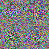{}
:::
:::


::: {#cell-92 .cell}
``` {.python .cell-code}
# ossl_source = '../../_data/ossl-tfm/ossl-tfm.csv'
# df = pd.read_csv(ossl_source); df.head()

# ossl = DataBlock(blocks=(ImageBlock, RegressionBlock),
#                 get_x=ColReader(0, pref='../../_data/ossl-tfm/img/'),
#                 get_y=ColReader(1),
#                 batch_tfms=Normalize.from_stats(*imagenet_stats),
#                 item_tfms=RatioResize(224),
#                 splitter=RandomSplitter(valid_pct=0.1, seed=41)
                
# dls = ossl.dataloaders(df)

# learn = vision_learner(dls, resnet18, pretrained=False, metrics=R2Score())
# learn.fit_one_cycle(20, 2e-3)
```
:::


::: {#cell-93 .cell}
``` {.python .cell-code}
ossl = DataBlock(blocks=(ImageBlock, RegressionBlock),
                get_x=ColReader(0, pref='../../_data/ossl-tfm/img/'),
                get_y=ColReader(1),
                batch_tfms=Normalize.from_stats(*imagenet_stats),
                item_tfms=RatioResize(224),
                splitter=RandomSplitter(valid_pct=0.1, seed=41)
#    batch_tfms=aug_transforms()
)
```
:::


::: {#cell-94 .cell}
``` {.python .cell-code}
dls = ossl.dataloaders(df)
```
:::


::: {#cell-95 .cell}
``` {.python .cell-code}
dls.show_batch(nrows=5, ncols=1, figsize=(10, 15))
```

::: {.cell-output .cell-output-display}
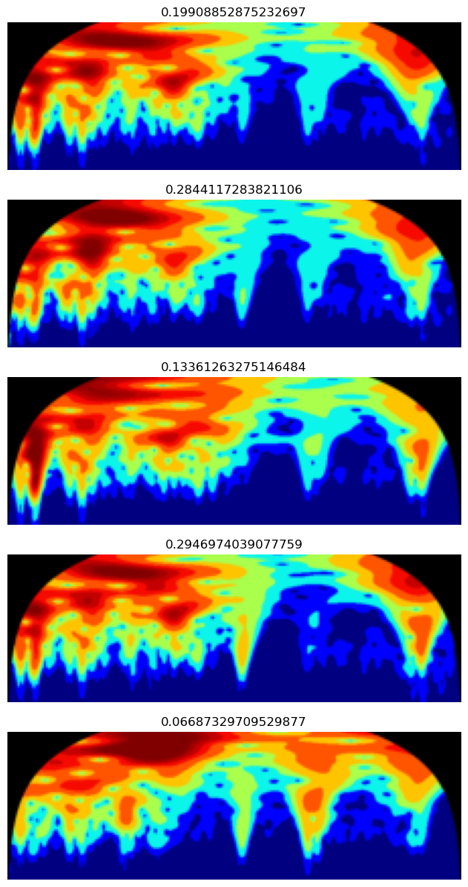{}
:::
:::


::: {#cell-96 .cell}
``` {.python .cell-code}
learn = vision_learner(dls, resnet18, pretrained=False, metrics=R2Score())
```
:::


::: {#cell-97 .cell}
``` {.python .cell-code}
learn.lr_find()
```

::: {.cell-output .cell-output-display}

```{=html}

<style>
    /* Turns off some styling */
    progress {
        /* gets rid of default border in Firefox and Opera. */
        border: none;
        /* Needs to be in here for Safari polyfill so background images work as expected. */
        background-size: auto;
    }
    progress:not([value]), progress:not([value])::-webkit-progress-bar {
        background: repeating-linear-gradient(45deg, #7e7e7e, #7e7e7e 10px, #5c5c5c 10px, #5c5c5c 20px);
    }
    .progress-bar-interrupted, .progress-bar-interrupted::-webkit-progress-bar {
        background: #F44336;
    }
</style>
```

:::

::: {.cell-output .cell-output-display}

```{=html}

```

:::

::: {.cell-output .cell-output-display}
```
SuggestedLRs(valley=0.00363078061491251)
```
:::

::: {.cell-output .cell-output-display}
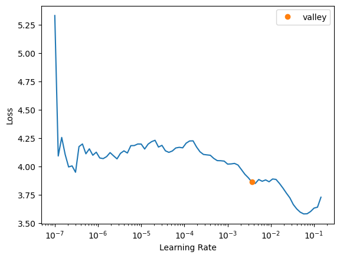{}
:::
:::


::: {#cell-98 .cell}
``` {.python .cell-code}
learn.fit_one_cycle(20, 2e-3)
```

::: {.cell-output .cell-output-display}

```{=html}

<style>
    /* Turns off some styling */
    progress {
        /* gets rid of default border in Firefox and Opera. */
        border: none;
        /* Needs to be in here for Safari polyfill so background images work as expected. */
        background-size: auto;
    }
    progress:not([value]), progress:not([value])::-webkit-progress-bar {
        background: repeating-linear-gradient(45deg, #7e7e7e, #7e7e7e 10px, #5c5c5c 10px, #5c5c5c 20px);
    }
    .progress-bar-interrupted, .progress-bar-interrupted::-webkit-progress-bar {
        background: #F44336;
    }
</style>
```

:::

::: {.cell-output .cell-output-display}

```{=html}
<table border="1" class="dataframe">
  <thead>
    <tr style="text-align: left;">
      <th>epoch</th>
      <th>train_loss</th>
      <th>valid_loss</th>
      <th>r2_score</th>
      <th>time</th>
    </tr>
  </thead>
  <tbody>
    <tr>
      <td>0</td>
      <td>1.010429</td>
      <td>0.160208</td>
      <td>-0.149856</td>
      <td>07:33</td>
    </tr>
    <tr>
      <td>1</td>
      <td>0.101805</td>
      <td>0.105252</td>
      <td>0.244579</td>
      <td>07:37</td>
    </tr>
    <tr>
      <td>2</td>
      <td>0.080996</td>
      <td>0.092230</td>
      <td>0.338037</td>
      <td>07:45</td>
    </tr>
    <tr>
      <td>3</td>
      <td>0.061543</td>
      <td>0.068272</td>
      <td>0.509990</td>
      <td>07:48</td>
    </tr>
    <tr>
      <td>4</td>
      <td>0.061344</td>
      <td>0.045711</td>
      <td>0.671919</td>
      <td>07:57</td>
    </tr>
    <tr>
      <td>5</td>
      <td>0.055588</td>
      <td>0.044312</td>
      <td>0.681960</td>
      <td>08:00</td>
    </tr>
    <tr>
      <td>6</td>
      <td>0.047412</td>
      <td>0.038732</td>
      <td>0.722007</td>
      <td>08:06</td>
    </tr>
    <tr>
      <td>7</td>
      <td>0.042374</td>
      <td>0.045522</td>
      <td>0.673274</td>
      <td>08:08</td>
    </tr>
    <tr>
      <td>8</td>
      <td>0.037796</td>
      <td>0.034118</td>
      <td>0.755128</td>
      <td>08:07</td>
    </tr>
    <tr>
      <td>9</td>
      <td>0.030448</td>
      <td>0.033509</td>
      <td>0.759500</td>
      <td>08:13</td>
    </tr>
    <tr>
      <td>10</td>
      <td>0.030273</td>
      <td>0.034164</td>
      <td>0.754792</td>
      <td>08:07</td>
    </tr>
    <tr>
      <td>11</td>
      <td>0.025239</td>
      <td>0.029398</td>
      <td>0.788999</td>
      <td>08:04</td>
    </tr>
    <tr>
      <td>12</td>
      <td>0.025301</td>
      <td>0.028097</td>
      <td>0.798343</td>
      <td>08:02</td>
    </tr>
    <tr>
      <td>13</td>
      <td>0.022484</td>
      <td>0.027496</td>
      <td>0.802653</td>
      <td>08:06</td>
    </tr>
    <tr>
      <td>14</td>
      <td>0.019801</td>
      <td>0.025249</td>
      <td>0.818778</td>
      <td>08:07</td>
    </tr>
    <tr>
      <td>15</td>
      <td>0.016716</td>
      <td>0.025171</td>
      <td>0.819340</td>
      <td>08:12</td>
    </tr>
    <tr>
      <td>16</td>
      <td>0.015120</td>
      <td>0.024136</td>
      <td>0.826770</td>
      <td>08:10</td>
    </tr>
    <tr>
      <td>17</td>
      <td>0.012950</td>
      <td>0.023746</td>
      <td>0.829572</td>
      <td>07:56</td>
    </tr>
    <tr>
      <td>18</td>
      <td>0.012212</td>
      <td>0.024173</td>
      <td>0.826501</td>
      <td>07:47</td>
    </tr>
    <tr>
      <td>19</td>
      <td>0.012440</td>
      <td>0.024042</td>
      <td>0.827447</td>
      <td>07:50</td>
    </tr>
  </tbody>
</table>
```

:::
:::


## Experiments:


Color scale: `viridis` | Discretization: `percentiles = [i for i in range(60, 100)]`

| Model     | Image Size | Learning Rate | Epochs | R2 Score | Time per Epoch | Finetuning | with axis ticks |
|-----------|------------|----------------|--------|----------|----------------|------------|----------------|
| ResNet-18 | 100        | 1e-3           | 10     | 0.648    | 05:12          | No        | Yes             |
| ResNet-18 | 224        | 2e-3           | 10     | 0.69     | 07:30          | No        | Yes             |
| ResNet-18 | 750 (original size)        |    1e-3        | 10     | 0.71          | 36:00          | No         | Yes             |
| ResNet-18 | 224        | 2e-3           | 20     |   0.704   | 07:30          | No        | Yes             |
| ResNet-18 | 224        | 2e-3           | 10     |   0.71   | 07:00          | No        | No             |
    

Discretization: `percentiles = [i for i in range(20, 100)]`

| Model     | Image Size | Learning Rate | Epochs | R2 Score | Time per Epoch | Finetuning | with axis ticks | colour scale |
|-----------|------------|---------------|--------|----------|----------------|------------|-----------------|--------------|
| ResNet-18 | 224        | 2e-3          | 10     | 0.7      | 05:12          | No         | No              | `viridis`    |
| ResNet-18 | 224        | 3e-3          | 10     | 0.71      | 05:12          | No         | No              | `jet`        |

From now on `with axis ticks` is always `No`.

Discretization: esimated on `10000` cwt power percentiles `[20, 30, 40, 50, 60, 70, 80, 90, 95, 97, 99]`

| Model     | Image Size | Learning Rate | Epochs | R2 Score | Time per Epoch | Finetuning | remark | colour scale |
|-----------|------------|---------------|--------|----------|----------------|------------|-----------------|--------------|
| ResNet-18 | 224        | 2e-3          | 10     | 0.71      | 05:12          | No         | None              | `jet`    |
| ResNet-18 | 224        | 2e-3         | 10     | 0.685      | 05:12          | No         | y range added              | `jet`    |

From now on random splitter with `10%` validation and random seed `41`.

Discretization: esimated on `10000` cwt power percentiles `[20, 30, 40, 50, 60, 70, 80, 90, 95, 97, 99]`

| Model     | Image Size | Learning Rate | Epochs | R2 Score | Time per Epoch | Finetuning | remark | colour scale |
|-----------|------------|---------------|--------|----------|----------------|------------|-----------------|--------------|
| ResNet-18 | 224        | 2e-3          | 10     | 0.7      | 05:12          | No         | Pre-train & normalize: True              | `jet`    |
| ResNet-18 | 224        | 2e-3          | 10     | 0.796     | 08:12          | No         | No Pre-train              | `jet`    |
| ResNet-18 | 224        | 3e-3          | 10     | 0.7     | 05:12          | No         | Pre-train & normalize: False            | `jet`    |
| ResNet-18 | 224        | 2e-3          | 20     | **0.829**     | 08:12          | No         | No Pre-train (try 18 epochs)              | `jet`    |


