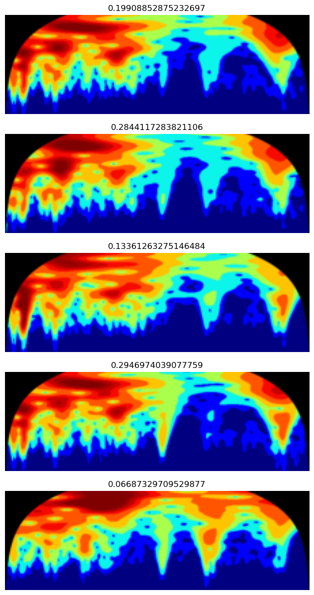
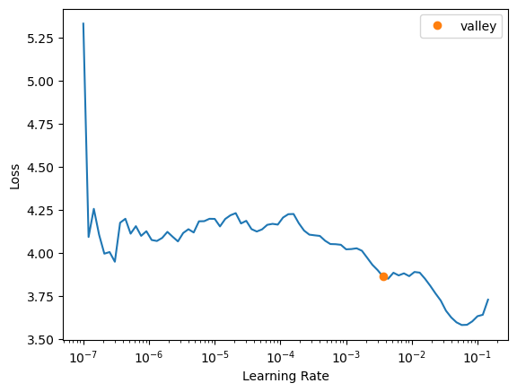
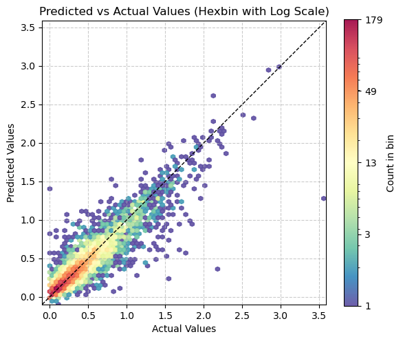

> Showing how to use fastai with a simple example.


::: {#cell-2 .cell}
``` {.python .cell-code}
import pandas as pd
from pathlib import Path
import fastcore.all as fc

from fastai.data.all import *
from fastai.vision.all import *

import warnings
warnings.filterwarnings('ignore')
```
:::


::: {#cell-3 .cell}
``` {.python .cell-code}
ossl_source = '../../_data/ossl-tfm/ossl-tfm.csv'
df = pd.read_csv(ossl_source); df.head()
```

::: {.cell-output .cell-output-display}

```{=html}
<div>
<style scoped>
    .dataframe tbody tr th:only-of-type {
        vertical-align: middle;
    }

    .dataframe tbody tr th {
        vertical-align: top;
    }

    .dataframe thead th {
        text-align: right;
    }
</style>
<table border="1" class="dataframe">
  <thead>
    <tr style="text-align: right;">
      <th></th>
      <th>fname</th>
      <th>kex</th>
    </tr>
  </thead>
  <tbody>
    <tr>
      <th>0</th>
      <td>3998362dd2659e2252cd7f38b43c9b1f.png</td>
      <td>0.182895</td>
    </tr>
    <tr>
      <th>1</th>
      <td>2bab4dbbac073b8648475ad50d40eb95.png</td>
      <td>0.082741</td>
    </tr>
    <tr>
      <th>2</th>
      <td>29213d2193232be8867d85dec463ec00.png</td>
      <td>0.089915</td>
    </tr>
    <tr>
      <th>3</th>
      <td>8b1ee9146c026faee20a40df86736864.png</td>
      <td>0.135030</td>
    </tr>
    <tr>
      <th>4</th>
      <td>6e8e9d1105e7da7055555cb5d310df5f.png</td>
      <td>0.270421</td>
    </tr>
  </tbody>
</table>
</div>
```

:::
:::


::: {#cell-4 .cell}
``` {.python .cell-code}
df['kex'].min(), df['kex'].max() 
```

::: {.cell-output .cell-output-display}
```
(0.0, 3.6521352871126975)
```
:::
:::


::: {#cell-5 .cell}
``` {.python .cell-code}
df.shape
```

::: {.cell-output .cell-output-display}
```
(57674, 2)
```
:::
:::


::: {#cell-6 .cell}
``` {.python .cell-code}
# image size is 750x281
```
:::


::: {#cell-7 .cell}
``` {.python .cell-code}
# ossl_source = '../../_data/ossl-tfm/ossl-tfm.csv'
# df = pd.read_csv(ossl_source); df.head()

# ossl = DataBlock(blocks=(ImageBlock, RegressionBlock),
#                 get_x=ColReader(0, pref='../../_data/ossl-tfm/img/'),
#                 get_y=ColReader(1),
#                 batch_tfms=Normalize.from_stats(*imagenet_stats),
#                 item_tfms=RatioResize(224),
#                 splitter=RandomSplitter(valid_pct=0.1, seed=41)
                
# dls = ossl.dataloaders(df)

# learn = vision_learner(dls, resnet18, pretrained=False, metrics=R2Score())
# learn.fit_one_cycle(20, 2e-3)
```
:::


::: {#cell-8 .cell}
``` {.python .cell-code}
ossl = DataBlock(blocks=(ImageBlock, RegressionBlock),
                get_x=ColReader(0, pref='../../_data/ossl-tfm/img/'),
                get_y=ColReader(1),
                batch_tfms=Normalize.from_stats(*imagenet_stats),
                item_tfms=RatioResize(224),
                splitter=RandomSplitter(valid_pct=0.1, seed=41)
#    batch_tfms=aug_transforms()
)
```
:::


::: {#cell-9 .cell}
``` {.python .cell-code}
ossl.summary(df)
```

::: {.cell-output .cell-output-stdout}
```
Setting-up type transforms pipelines
Collecting items from                                       fname       kex
0      3998362dd2659e2252cd7f38b43c9b1f.png  0.182895
1      2bab4dbbac073b8648475ad50d40eb95.png  0.082741
2      29213d2193232be8867d85dec463ec00.png  0.089915
3      8b1ee9146c026faee20a40df86736864.png  0.135030
4      6e8e9d1105e7da7055555cb5d310df5f.png  0.270421
...                                     ...       ...
57669  8d1089ede5cae335779364ab6d97e0dd.png  0.366362
57670  3700237aa002dee08e991b451003b3d7.png  0.485567
57671  b790da349d49885c5727a2b5fd67b13d.png  1.243033
57672  a057a7ead9eebce24d4039de7fd5e01b.png  0.381496
57673  80bf4a0dc30f60552a38193d5c09b9cd.png  0.960841

[57674 rows x 2 columns]
Found 57674 items
2 datasets of sizes 51907,5767
Setting up Pipeline: ColReader -- {'cols': 0, 'pref': '../../_data/ossl-tfm/img/', 'suff': '', 'label_delim': None} -> PILBase.create
Setting up Pipeline: ColReader -- {'cols': 1, 'pref': '', 'suff': '', 'label_delim': None} -> RegressionSetup -- {'c': None}

Building one sample
  Pipeline: ColReader -- {'cols': 0, 'pref': '../../_data/ossl-tfm/img/', 'suff': '', 'label_delim': None} -> PILBase.create
    starting from
      fname    80b7bb4bb5d1e17262df3a12aafbbea8.png
kex                                  0.391434
Name: 22759, dtype: object
    applying ColReader -- {'cols': 0, 'pref': '../../_data/ossl-tfm/img/', 'suff': '', 'label_delim': None} gives
      ../../_data/ossl-tfm/img/80b7bb4bb5d1e17262df3a12aafbbea8.png
    applying PILBase.create gives
      PILImage mode=RGB size=669x221
  Pipeline: ColReader -- {'cols': 1, 'pref': '', 'suff': '', 'label_delim': None} -> RegressionSetup -- {'c': None}
    starting from
      fname    80b7bb4bb5d1e17262df3a12aafbbea8.png
kex                                  0.391434
Name: 22759, dtype: object
    applying ColReader -- {'cols': 1, 'pref': '', 'suff': '', 'label_delim': None} gives
      0.3914337946951873
    applying RegressionSetup -- {'c': None} gives
      tensor(0.3914)

Final sample: (PILImage mode=RGB size=669x221, tensor(0.3914))


Collecting items from                                       fname       kex
0      3998362dd2659e2252cd7f38b43c9b1f.png  0.182895
1      2bab4dbbac073b8648475ad50d40eb95.png  0.082741
2      29213d2193232be8867d85dec463ec00.png  0.089915
3      8b1ee9146c026faee20a40df86736864.png  0.135030
4      6e8e9d1105e7da7055555cb5d310df5f.png  0.270421
...                                     ...       ...
57669  8d1089ede5cae335779364ab6d97e0dd.png  0.366362
57670  3700237aa002dee08e991b451003b3d7.png  0.485567
57671  b790da349d49885c5727a2b5fd67b13d.png  1.243033
57672  a057a7ead9eebce24d4039de7fd5e01b.png  0.381496
57673  80bf4a0dc30f60552a38193d5c09b9cd.png  0.960841

[57674 rows x 2 columns]
Found 57674 items
2 datasets of sizes 51907,5767
Setting up Pipeline: ColReader -- {'cols': 0, 'pref': '../../_data/ossl-tfm/img/', 'suff': '', 'label_delim': None} -> PILBase.create
Setting up Pipeline: ColReader -- {'cols': 1, 'pref': '', 'suff': '', 'label_delim': None} -> RegressionSetup -- {'c': None}
Setting up after_item: Pipeline: RatioResize -- {'max_sz': 224, 'resamples': (<Resampling.BILINEAR: 2>, <Resampling.NEAREST: 0>)} -> ToTensor
Setting up before_batch: Pipeline: 
Setting up after_batch: Pipeline: IntToFloatTensor -- {'div': 255.0, 'div_mask': 1} -> Normalize -- {'mean': tensor([[[[0.4850]],

         [[0.4560]],

         [[0.4060]]]], device='mps:0'), 'std': tensor([[[[0.2290]],

         [[0.2240]],

         [[0.2250]]]], device='mps:0'), 'axes': (0, 2, 3)}

Building one batch
Applying item_tfms to the first sample:
  Pipeline: RatioResize -- {'max_sz': 224, 'resamples': (<Resampling.BILINEAR: 2>, <Resampling.NEAREST: 0>)} -> ToTensor
    starting from
      (PILImage mode=RGB size=669x221, tensor(0.3914))
    applying RatioResize -- {'max_sz': 224, 'resamples': (<Resampling.BILINEAR: 2>, <Resampling.NEAREST: 0>)} gives
      (PILImage mode=RGB size=224x73, tensor(0.3914))
    applying ToTensor gives
      (TensorImage of size 3x73x224, tensor(0.3914))

Adding the next 3 samples

No before_batch transform to apply

Collating items in a batch

Applying batch_tfms to the batch built
  Pipeline: IntToFloatTensor -- {'div': 255.0, 'div_mask': 1} -> Normalize -- {'mean': tensor([[[[0.4850]],

         [[0.4560]],

         [[0.4060]]]], device='mps:0'), 'std': tensor([[[[0.2290]],

         [[0.2240]],

         [[0.2250]]]], device='mps:0'), 'axes': (0, 2, 3)}
    starting from
      (TensorImage of size 4x3x73x224, tensor([0.3914, 0.1328, 0.3051, 1.0116], device='mps:0'))
    applying IntToFloatTensor -- {'div': 255.0, 'div_mask': 1} gives
      (TensorImage of size 4x3x73x224, tensor([0.3914, 0.1328, 0.3051, 1.0116], device='mps:0'))
    applying Normalize -- {'mean': tensor([[[[0.4850]],

         [[0.4560]],

         [[0.4060]]]], device='mps:0'), 'std': tensor([[[[0.2290]],

         [[0.2240]],

         [[0.2250]]]], device='mps:0'), 'axes': (0, 2, 3)} gives
      (TensorImage of size 4x3x73x224, tensor([0.3914, 0.1328, 0.3051, 1.0116], device='mps:0'))
```
:::
:::


::: {#cell-10 .cell}
``` {.python .cell-code}
dls = ossl.dataloaders(df)
```
:::


::: {#cell-11 .cell}
``` {.python .cell-code}
dls.show_batch(nrows=5, ncols=1, figsize=(10, 15))
```

::: {.cell-output .cell-output-display}
{}
:::
:::


::: {#cell-12 .cell}
``` {.python .cell-code}
learn = vision_learner(dls, resnet18, pretrained=False, metrics=R2Score())
```
:::


::: {#cell-13 .cell}
``` {.python .cell-code}
learn.lr_find()
```

::: {.cell-output .cell-output-display}

```{=html}

<style>
    /* Turns off some styling */
    progress {
        /* gets rid of default border in Firefox and Opera. */
        border: none;
        /* Needs to be in here for Safari polyfill so background images work as expected. */
        background-size: auto;
    }
    progress:not([value]), progress:not([value])::-webkit-progress-bar {
        background: repeating-linear-gradient(45deg, #7e7e7e, #7e7e7e 10px, #5c5c5c 10px, #5c5c5c 20px);
    }
    .progress-bar-interrupted, .progress-bar-interrupted::-webkit-progress-bar {
        background: #F44336;
    }
</style>
```

:::

::: {.cell-output .cell-output-display}

```{=html}

```

:::

::: {.cell-output .cell-output-display}
```
SuggestedLRs(valley=0.00363078061491251)
```
:::

::: {.cell-output .cell-output-display}
{}
:::
:::


::: {#cell-14 .cell}
``` {.python .cell-code}
learn.fit_one_cycle(20, 2e-3)
```

::: {.cell-output .cell-output-display}

```{=html}

<style>
    /* Turns off some styling */
    progress {
        /* gets rid of default border in Firefox and Opera. */
        border: none;
        /* Needs to be in here for Safari polyfill so background images work as expected. */
        background-size: auto;
    }
    progress:not([value]), progress:not([value])::-webkit-progress-bar {
        background: repeating-linear-gradient(45deg, #7e7e7e, #7e7e7e 10px, #5c5c5c 10px, #5c5c5c 20px);
    }
    .progress-bar-interrupted, .progress-bar-interrupted::-webkit-progress-bar {
        background: #F44336;
    }
</style>
```

:::

::: {.cell-output .cell-output-display}

```{=html}
<table border="1" class="dataframe">
  <thead>
    <tr style="text-align: left;">
      <th>epoch</th>
      <th>train_loss</th>
      <th>valid_loss</th>
      <th>r2_score</th>
      <th>time</th>
    </tr>
  </thead>
  <tbody>
    <tr>
      <td>0</td>
      <td>1.010429</td>
      <td>0.160208</td>
      <td>-0.149856</td>
      <td>07:33</td>
    </tr>
    <tr>
      <td>1</td>
      <td>0.101805</td>
      <td>0.105252</td>
      <td>0.244579</td>
      <td>07:37</td>
    </tr>
    <tr>
      <td>2</td>
      <td>0.080996</td>
      <td>0.092230</td>
      <td>0.338037</td>
      <td>07:45</td>
    </tr>
    <tr>
      <td>3</td>
      <td>0.061543</td>
      <td>0.068272</td>
      <td>0.509990</td>
      <td>07:48</td>
    </tr>
    <tr>
      <td>4</td>
      <td>0.061344</td>
      <td>0.045711</td>
      <td>0.671919</td>
      <td>07:57</td>
    </tr>
    <tr>
      <td>5</td>
      <td>0.055588</td>
      <td>0.044312</td>
      <td>0.681960</td>
      <td>08:00</td>
    </tr>
    <tr>
      <td>6</td>
      <td>0.047412</td>
      <td>0.038732</td>
      <td>0.722007</td>
      <td>08:06</td>
    </tr>
    <tr>
      <td>7</td>
      <td>0.042374</td>
      <td>0.045522</td>
      <td>0.673274</td>
      <td>08:08</td>
    </tr>
    <tr>
      <td>8</td>
      <td>0.037796</td>
      <td>0.034118</td>
      <td>0.755128</td>
      <td>08:07</td>
    </tr>
    <tr>
      <td>9</td>
      <td>0.030448</td>
      <td>0.033509</td>
      <td>0.759500</td>
      <td>08:13</td>
    </tr>
    <tr>
      <td>10</td>
      <td>0.030273</td>
      <td>0.034164</td>
      <td>0.754792</td>
      <td>08:07</td>
    </tr>
    <tr>
      <td>11</td>
      <td>0.025239</td>
      <td>0.029398</td>
      <td>0.788999</td>
      <td>08:04</td>
    </tr>
    <tr>
      <td>12</td>
      <td>0.025301</td>
      <td>0.028097</td>
      <td>0.798343</td>
      <td>08:02</td>
    </tr>
    <tr>
      <td>13</td>
      <td>0.022484</td>
      <td>0.027496</td>
      <td>0.802653</td>
      <td>08:06</td>
    </tr>
    <tr>
      <td>14</td>
      <td>0.019801</td>
      <td>0.025249</td>
      <td>0.818778</td>
      <td>08:07</td>
    </tr>
    <tr>
      <td>15</td>
      <td>0.016716</td>
      <td>0.025171</td>
      <td>0.819340</td>
      <td>08:12</td>
    </tr>
    <tr>
      <td>16</td>
      <td>0.015120</td>
      <td>0.024136</td>
      <td>0.826770</td>
      <td>08:10</td>
    </tr>
    <tr>
      <td>17</td>
      <td>0.012950</td>
      <td>0.023746</td>
      <td>0.829572</td>
      <td>07:56</td>
    </tr>
    <tr>
      <td>18</td>
      <td>0.012212</td>
      <td>0.024173</td>
      <td>0.826501</td>
      <td>07:47</td>
    </tr>
    <tr>
      <td>19</td>
      <td>0.012440</td>
      <td>0.024042</td>
      <td>0.827447</td>
      <td>07:50</td>
    </tr>
  </tbody>
</table>
```

:::
:::


## Evaluation

::: {#cell-16 .cell}
``` {.python .cell-code}
val_preds, val_targets = learn.get_preds(dl=dls.valid)

```

::: {.cell-output .cell-output-display}

```{=html}

<style>
    /* Turns off some styling */
    progress {
        /* gets rid of default border in Firefox and Opera. */
        border: none;
        /* Needs to be in here for Safari polyfill so background images work as expected. */
        background-size: auto;
    }
    progress:not([value]), progress:not([value])::-webkit-progress-bar {
        background: repeating-linear-gradient(45deg, #7e7e7e, #7e7e7e 10px, #5c5c5c 10px, #5c5c5c 20px);
    }
    .progress-bar-interrupted, .progress-bar-interrupted::-webkit-progress-bar {
        background: #F44336;
    }
</style>
```

:::

::: {.cell-output .cell-output-display}

```{=html}

```

:::
:::


::: {#cell-17 .cell}
``` {.python .cell-code}
# Assuming you have a new CSV file for your test data
# test_source = '../../_data/ossl-tfm/ossl-tfm-test.csv'
# test_df = pd.read_csv(test_source)

# # Create a new DataLoader for the test data
# test_dl = learn.dls.test_dl(test_df)

# # Get predictions on the test set
# test_preds, test_targets = learn.get_preds(dl=test_dl)

# # Now you can use test_preds and test_targets for further analysis
```
:::


::: {#cell-18 .cell}
``` {.python .cell-code}
# Convert predictions and targets to numpy arrays
# val_preds = val_preds.numpy().flatten()
# val_targets = val_targets.numpy()

# Create a DataFrame with the results
results_df = pd.DataFrame({
    'Predicted': val_preds,
    'Actual': val_targets
})

# Display the first few rows of the results
print(results_df.head())

# Calculate and print the R2 score
from sklearn.metrics import r2_score
r2 = r2_score(val_targets, val_preds)
print(f"R2 Score on validation set: {r2:.4f}")
```

::: {.cell-output .cell-output-stdout}
```
   Predicted    Actual
0   0.153120  0.000000
1   0.189220  0.184960
2   0.325809  0.194201
3   0.442900  0.262364
4   0.335543  0.355799
R2 Score on validation set: 0.8270
```
:::
:::


::: {#cell-19 .cell}
``` {.python .cell-code}
val_preds_np = val_preds
val_targets_np = val_targets

# Apply the transformation: exp(y) - 1
val_preds_transformed = np.exp(val_preds_np) - 1
val_targets_transformed = np.exp(val_targets_np) - 1

# Create a DataFrame with the results
results_df = pd.DataFrame({
    'Predicted': val_preds_transformed,
    'Actual': val_targets_transformed
})

# Display the first few rows of the results
print(results_df.head())

# Calculate and print the R2 score
from sklearn.metrics import r2_score
r2 = r2_score(val_targets_transformed, val_preds_transformed)
print(f"R2 Score on validation set (after transformation): {r2:.4f}")

# Calculate and print the MAPE, handling zero values
def mean_absolute_percentage_error(y_true, y_pred):
    non_zero = (y_true != 0)
    return np.mean(np.abs((y_true[non_zero] - y_pred[non_zero]) / y_true[non_zero])) * 100

mape = mean_absolute_percentage_error(val_targets_transformed, val_preds_transformed)
print(f"Mean Absolute Percentage Error (MAPE) on validation set: {mape:.2f}%")

# Calculate and print the MAE as an alternative metric
from sklearn.metrics import mean_absolute_error
mae = mean_absolute_error(val_targets_transformed, val_preds_transformed)
print(f"Mean Absolute Error (MAE) on validation set: {mae:.4f}")
```

::: {.cell-output .cell-output-stdout}
```
   Predicted   Actual
0   0.165464  0.00000
1   0.208306  0.20317
2   0.385151  0.21434
3   0.557217  0.30000
4   0.398699  0.42732
R2 Score on validation set (after transformation): 0.6978
Mean Absolute Percentage Error (MAPE) on validation set: 47.85%
Mean Absolute Error (MAE) on validation set: 0.1948
```
:::
:::


::: {#cell-20 .cell}
``` {.python .cell-code}
plt.figure(figsize=(6, 6))

# Use logarithmic bins for the colormap
h = plt.hexbin(val_targets, val_preds, gridsize=65, 
               bins='log', cmap='Spectral_r', mincnt=1,
               alpha=0.9)

# Get the actual min and max counts from the hexbin data
counts = h.get_array()
min_count = counts[counts > 0].min()  # Minimum non-zero count
max_count = counts.max()

# Create a logarithmic colorbar
cb = plt.colorbar(h, label='Count in bin', shrink=0.73)
tick_locations = np.logspace(np.log10(min_count), np.log10(max_count), 5)
cb.set_ticks(tick_locations)
cb.set_ticklabels([f'{int(x)}' for x in tick_locations])

# Add the diagonal line
min_val = min(val_targets.min(), val_preds.min())
max_val = max(val_targets.max(), val_preds.max())
plt.plot([min_val, max_val], [min_val, max_val], 'k--', lw=1)

# Set labels and title
plt.xlabel('Actual Values')
plt.ylabel('Predicted Values')
plt.title('Predicted vs Actual Values (Hexbin with Log Scale)')

# Add grid lines
plt.grid(True, linestyle='--', alpha=0.65)

# Set the same limits for both axes
plt.xlim(min_val, max_val)
plt.ylim(min_val, max_val)

# Make the plot square
plt.gca().set_aspect('equal', adjustable='box')

plt.tight_layout()
plt.show()

# Print the range of counts in the hexbins
print(f"Min non-zero count in hexbins: {min_count}")
print(f"Max count in hexbins: {max_count}")
```

::: {.cell-output .cell-output-display}
{}
:::

::: {.cell-output .cell-output-stdout}
```
Min non-zero count in hexbins: 1.0
Max count in hexbins: 180.0
```
:::
:::


::: {#cell-21 .cell}
``` {.python .cell-code}
path_model = Path('./models')
learn.export(path_model / '0.pkl')
```
:::


## Inference

::: {#cell-23 .cell}
``` {.python .cell-code}
ossl_source = Path('../../_data/ossl-tfm/img')
learn.predict(ossl_source / '0a0a0c647671fd3030cc13ba5432eb88.png')
```

::: {.cell-output .cell-output-display}

```{=html}

<style>
    /* Turns off some styling */
    progress {
        /* gets rid of default border in Firefox and Opera. */
        border: none;
        /* Needs to be in here for Safari polyfill so background images work as expected. */
        background-size: auto;
    }
    progress:not([value]), progress:not([value])::-webkit-progress-bar {
        background: repeating-linear-gradient(45deg, #7e7e7e, #7e7e7e 10px, #5c5c5c 10px, #5c5c5c 20px);
    }
    .progress-bar-interrupted, .progress-bar-interrupted::-webkit-progress-bar {
        background: #F44336;
    }
</style>
```

:::

::: {.cell-output .cell-output-display}

```{=html}

```

:::

::: {.cell-output .cell-output-display}
```
((0.5229991674423218,), tensor([0.5230]), tensor([0.5230]))
```
:::
:::


::: {#cell-24 .cell}
``` {.python .cell-code}
df[df['fname'] == '0a0a0c647671fd3030cc13ba5432eb88.png']
```

::: {.cell-output .cell-output-display}

```{=html}
<div>
<style scoped>
    .dataframe tbody tr th:only-of-type {
        vertical-align: middle;
    }

    .dataframe tbody tr th {
        vertical-align: top;
    }

    .dataframe thead th {
        text-align: right;
    }
</style>
<table border="1" class="dataframe">
  <thead>
    <tr style="text-align: right;">
      <th></th>
      <th>fname</th>
      <th>kex</th>
    </tr>
  </thead>
  <tbody>
    <tr>
      <th>28867</th>
      <td>0a0a0c647671fd3030cc13ba5432eb88.png</td>
      <td>0.525379</td>
    </tr>
  </tbody>
</table>
</div>
```

:::
:::


::: {#cell-25 .cell}
``` {.python .cell-code}
np.exp(3) - 1
```

::: {.cell-output .cell-output-display}
```
19.085536923187668
```
:::
:::


## Experiments:


Color scale: `viridis` | Discretization: `percentiles = [i for i in range(60, 100)]`

| Model     | Image Size | Learning Rate | Epochs | R2 Score | Time per Epoch | Finetuning | with axis ticks |
|-----------|------------|----------------|--------|----------|----------------|------------|----------------|
| ResNet-18 | 100        | 1e-3           | 10     | 0.648    | 05:12          | No        | Yes             |
| ResNet-18 | 224        | 2e-3           | 10     | 0.69     | 07:30          | No        | Yes             |
| ResNet-18 | 750 (original size)        |    1e-3        | 10     | 0.71          | 36:00          | No         | Yes             |
| ResNet-18 | 224        | 2e-3           | 20     |   0.704   | 07:30          | No        | Yes             |
| ResNet-18 | 224        | 2e-3           | 10     |   0.71   | 07:00          | No        | No             |
    

Discretization: `percentiles = [i for i in range(20, 100)]`

| Model     | Image Size | Learning Rate | Epochs | R2 Score | Time per Epoch | Finetuning | with axis ticks | colour scale |
|-----------|------------|---------------|--------|----------|----------------|------------|-----------------|--------------|
| ResNet-18 | 224        | 2e-3          | 10     | 0.7      | 05:12          | No         | No              | `viridis`    |
| ResNet-18 | 224        | 3e-3          | 10     | 0.71      | 05:12          | No         | No              | `jet`        |

From now on `with axis ticks` is always `No`.

Discretization: esimated on `10000` cwt power percentiles `[20, 30, 40, 50, 60, 70, 80, 90, 95, 97, 99]`

| Model     | Image Size | Learning Rate | Epochs | R2 Score | Time per Epoch | Finetuning | remark | colour scale |
|-----------|------------|---------------|--------|----------|----------------|------------|-----------------|--------------|
| ResNet-18 | 224        | 2e-3          | 10     | 0.71      | 05:12          | No         | None              | `jet`    |
| ResNet-18 | 224        | 2e-3         | 10     | 0.685      | 05:12          | No         | y range added              | `jet`    |

From now on random splitter with `10%` validation and random seed `41`.

Discretization: esimated on `10000` cwt power percentiles `[20, 30, 40, 50, 60, 70, 80, 90, 95, 97, 99]`

| Model     | Image Size | Learning Rate | Epochs | R2 Score | Time per Epoch | Finetuning | remark | colour scale |
|-----------|------------|---------------|--------|----------|----------------|------------|-----------------|--------------|
| ResNet-18 | 224        | 2e-3          | 10     | 0.7      | 05:12          | No         | Pre-train & normalize: True              | `jet`    |
| ResNet-18 | 224        | 2e-3          | 10     | 0.796     | 08:12          | No         | No Pre-train              | `jet`    |
| ResNet-18 | 224        | 3e-3          | 10     | 0.7     | 05:12          | No         | Pre-train & normalize: False            | `jet`    |
| ResNet-18 (id=0)| 224        | 2e-3          | 20     | **0.829**     | 08:12          | No         | No Pre-train (try 18 epochs)              | `jet`    |


