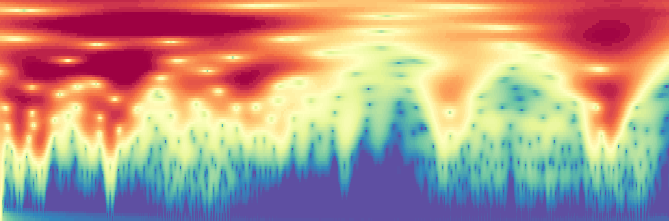
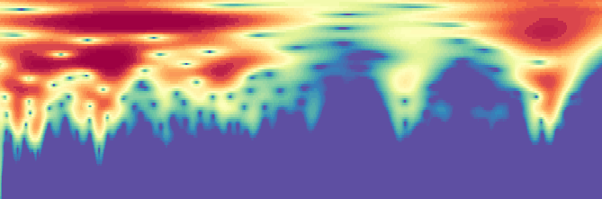
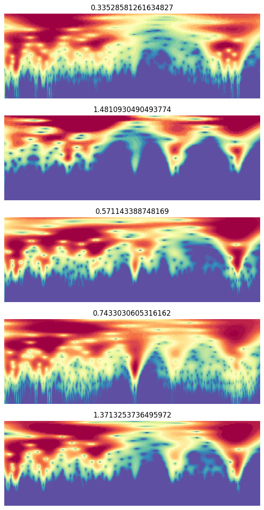
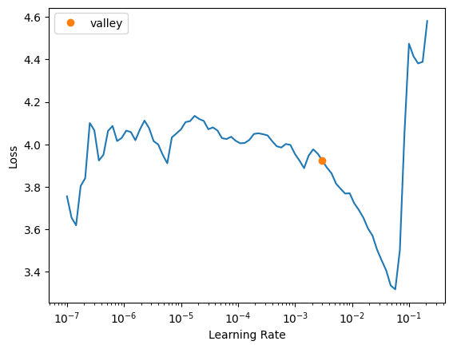

> Experimenting with Fastai and BW data augmentation.


::: {#cell-2 .cell}
``` {.python .cell-code}
# Todo:
#   - generate transformed OSSL dataset from 650-4000
#   - retrained model on OSSL dataset using this wavenumber range
#   - generate transformed ringtrial dataset
#   - generate transformed Fukushima dataset
```
:::


## Runpod setup

::: {#cell-4 .cell}
``` {.python .cell-code}
# setting up pod and pip install uhina
# accessing a pod terminal

# 1. To get access to the pod ip adress: runpodctl get pod -a
# 2. ssh into the pod: ssh root@<ip-address> -p 58871 -i ~/.ssh/id_ed25519

# git clone https://github.com/franckalbinet/uhina.git
# pip install uhina
# runpodctl send im-bw 
# runpodctl send ossl-tfm.csv

```
:::


## Loading data

::: {#cell-6 .cell}
``` {.python .cell-code}
import pandas as pd
from pathlib import Path
import fastcore.all as fc

from fastai.data.all import *
from fastai.vision.all import *
from multiprocessing import cpu_count

import warnings
warnings.filterwarnings('ignore')
```
:::


::: {#cell-7 .cell}
``` {.python .cell-code}
ossl_source = '../../_data/ossl-tfm/ossl-tfm.csv'
df = pd.read_csv(ossl_source); df.head()
```

::: {.cell-output .cell-output-display}

```{=html}
<div>
<style scoped>
    .dataframe tbody tr th:only-of-type {
        vertical-align: middle;
    }

    .dataframe tbody tr th {
        vertical-align: top;
    }

    .dataframe thead th {
        text-align: right;
    }
</style>
<table border="1" class="dataframe">
  <thead>
    <tr style="text-align: right;">
      <th></th>
      <th>fname</th>
      <th>kex</th>
    </tr>
  </thead>
  <tbody>
    <tr>
      <th>0</th>
      <td>3998362dd2659e2252cd7f38b43c9b1f.png</td>
      <td>0.182895</td>
    </tr>
    <tr>
      <th>1</th>
      <td>2bab4dbbac073b8648475ad50d40eb95.png</td>
      <td>0.082741</td>
    </tr>
    <tr>
      <th>2</th>
      <td>29213d2193232be8867d85dec463ec00.png</td>
      <td>0.089915</td>
    </tr>
    <tr>
      <th>3</th>
      <td>8b1ee9146c026faee20a40df86736864.png</td>
      <td>0.135030</td>
    </tr>
    <tr>
      <th>4</th>
      <td>6e8e9d1105e7da7055555cb5d310df5f.png</td>
      <td>0.270421</td>
    </tr>
  </tbody>
</table>
</div>
```

:::
:::


::: {#cell-8 .cell}
``` {.python .cell-code}
df['kex'].min(), df['kex'].max() 
```

::: {.cell-output .cell-output-display}
```
(0.0, 3.6521352871126975)
```
:::
:::


::: {#cell-9 .cell}
``` {.python .cell-code}
# image size is 750x281
```
:::


::: {#cell-10 .cell}
``` {.python .cell-code}
# start = np.random.uniform(1, 50); print(start)
# end = np.random.uniform(90.1, 99.5); print(end)
# steps = np.random.randint(5, 100); print(steps)
# percentiles = torch.linspace(start=start, end=end, steps=steps)
# percentiles
```
:::


::: {#cell-11 .cell}
``` {.python .cell-code}
@delegates()
class Quantize(RandTransform):
    # split_idx,mode,mode_mask,order = None,BILINEAR,NEAREST,1
    "Quantize B&W image into `num_colors` colors."
    split_idx = None
    def __init__(self, 
        num_colors:int=10,
        verbose:bool=False,
        n_percentiles_valid:int=100, # how many different quantization to generate for valid set
        seed:int|None=41, # Seed for random number generator used to generate fixed augmentation for validation set
        **kwargs
    ):
        store_attr()
        super().__init__(**kwargs)
        self.counter_valid = 0
        self.percentiles = None
        self.percentiles_valid = self.generate_percentiles_valid(n=n_percentiles_valid, seed=self.seed)

    def before_call(self, 
        b, 
        split_idx:int # Index of the train/valid dataset (0: train, 1: valid)
    ):
        self.idx = split_idx
        
    def get_random_percentiles(self, seed:int|None=None):
        if seed is not None:
            np.random.seed(seed)
        start = np.random.uniform(1, 50)
        
        end = np.random.uniform(90.1, 99.5)
        steps = np.random.randint(5, 100)
        return torch.linspace(start=start, end=end, steps=steps)

    def generate_percentiles_valid(self, n:int=100, seed:int|None=None):
        return [self.get_random_percentiles(seed=self.seed) for i in range(n)]
    
    def get_percentiles(self):
        if self.idx == 1:
            return self.percentiles_valid[self.counter_valid%len(self.percentiles_valid)]
        else:
            return self.get_random_percentiles()
    
    def encodes(self, x:Image.Image):
        im_tensor = image2tensor(x)[0, :, :]
        
        percentiles = self.get_percentiles()
        levels = torch.quantile(im_tensor.float(), percentiles / 100)
        im_quant = torch.bucketize(im_tensor.float(), levels)
        
        cmap = plt.get_cmap('Spectral_r')
        im_color = tensor(cmap(im_quant.float() / im_quant.max())[:,:,:3])
        im_color = im_color.permute(2, 0, 1)
        return to_image(im_color)
```
:::


::: {#cell-12 .cell}
``` {.python .cell-code}
      
# Image.Image
im_path = '../../_data/all-grey-255.png'
im = PILImage.create(im_path)
# type(im)
# im = Image.open(im_path)
# PILImageBW
# fastai_im = PILImageBW(im_path) # fastai.vision.core.PILImage
# fastai_im.show(figsize=(10,10))

im = Quantize(verbose=False)(im)
im

```

::: {.cell-output .cell-output-display}
{}
:::
:::


::: {#cell-13 .cell}
``` {.python .cell-code}
im_path = '../../_data/all-grey-255.png'
im = PILImage.create(im_path)
print(f'original shape: {im.shape}')

im_tensor = image2tensor(im)
print(f'tensor shape: {im_tensor.shape} which is simply each pixel value replicated 3 times (R, G, B)')

im_tensor = im_tensor[0, :, :]
print(f'tensor shape: {im_tensor.shape}')

percentiles = torch.arange(40, 99, 1, dtype=torch.float32)
print(f'percentiles: {percentiles}')

levels = torch.quantile(im_tensor.float(), percentiles / 100)
print(f'levels: {levels}')

im_quant = torch.bucketize(im_tensor.float(), levels)
print(f'im_quant: {im_quant}, # unique values: {im_quant.unique()}')

# Color map: takes values between 0 and 1 and returns a color (RGBA)
cmap = plt.get_cmap('Spectral_r')

im_color = tensor(cmap(im_quant.float() / im_quant.max())[:,:,:3])
print(f'im_color shape: {im_color.shape}')
im_color = im_color.permute(2, 0, 1)
print(f'im_color permuted to (C, H, W): {im_color.shape}')
im_color_fastai = to_image(im_color)
print(f'im_color_fastai: {im_color_fastai}')
im_color_fastai
```

::: {.cell-output .cell-output-stdout}
```
original shape: (221, 669)
tensor shape: torch.Size([3, 221, 669]) which is simply each pixel value replicated 3 times (R, G, B)
tensor shape: torch.Size([221, 669])
percentiles: tensor([40., 41., 42., 43., 44., 45., 46., 47., 48., 49., 50., 51., 52., 53.,
        54., 55., 56., 57., 58., 59., 60., 61., 62., 63., 64., 65., 66., 67.,
        68., 69., 70., 71., 72., 73., 74., 75., 76., 77., 78., 79., 80., 81.,
        82., 83., 84., 85., 86., 87., 88., 89., 90., 91., 92., 93., 94., 95.,
        96., 97., 98.])
levels: tensor([182., 183., 185., 187., 189., 191., 192., 194., 195., 198., 200., 202.,
        204., 206., 207., 209., 210., 211., 213., 214., 215., 216., 217., 218.,
        219., 220., 220., 221., 222., 223., 224., 225., 226., 227., 229., 230.,
        231., 232., 232., 233., 234., 235., 236., 237., 238., 238., 239., 240.,
        240., 241., 241., 242., 243., 243., 243., 245., 246., 248., 250.])
im_quant: tensor([[41, 41, 41,  ..., 46, 46, 46],
        [41, 41, 41,  ..., 46, 46, 46],
        [35, 36, 36,  ..., 44, 44, 44],
        ...,
        [10,  7,  0,  ...,  0,  0,  0],
        [10,  7,  0,  ...,  0,  0,  0],
        [10,  7,  0,  ...,  0,  0,  0]]), # unique values: tensor([ 0,  1,  2,  3,  4,  5,  6,  7,  8,  9, 10, 11, 12, 13, 14, 15, 16, 17,
        18, 19, 20, 21, 22, 23, 24, 25, 27, 28, 29, 30, 31, 32, 33, 34, 35, 36,
        37, 39, 40, 41, 42, 43, 44, 46, 47, 49, 51, 52, 55, 56, 57, 58, 59])
im_color shape: torch.Size([221, 669, 3])
im_color permuted to (C, H, W): torch.Size([3, 221, 669])
im_color_fastai: <PIL.Image.Image image mode=RGB size=669x221>
```
:::

::: {.cell-output .cell-output-display}
{}
:::
:::


::: {#cell-14 .cell}
``` {.python .cell-code}
ossl = DataBlock(blocks=(ImageBlock, RegressionBlock),
                get_x=ColReader(0, pref='../../_data/ossl-tfm/im/'),
                get_y=ColReader(1),
                # batch_tfms=Normalize.from_stats(*imagenet_stats),
                batch_tfms=[RatioResize(224)],
                item_tfms=[Quantize()],
                splitter=RandomSplitter(valid_pct=0.1, seed=41)
#    batch_tfms=aug_transforms()
)
```
:::


::: {#cell-15 .cell}
``` {.python .cell-code}
# ossl.summary(df)
```
:::


::: {#cell-16 .cell}
``` {.python .cell-code}
#cpu_count()
```
:::


::: {#cell-17 .cell}
``` {.python .cell-code}
# dls = ossl.dataloaders(df, num_workers=cpu_count())
dls = ossl.dataloaders(df)
```
:::


::: {#cell-18 .cell}
``` {.python .cell-code}
dls.show_batch(nrows=5, ncols=1, figsize=(10, 15))
```

::: {.cell-output .cell-output-display}
{}
:::
:::


::: {#cell-19 .cell}
``` {.python .cell-code}
#learn = vision_learner(dls, resnet18, pretrained=False, metrics=R2Score()).to_fp16()
learn = vision_learner(dls, resnet18, pretrained=False, metrics=R2Score())
```
:::


::: {#cell-20 .cell}
``` {.python .cell-code}
#learn = load_learner('./models/bw-data-augment-0.pkl', cpu=True)
```
:::


::: {#cell-21 .cell}
``` {.python .cell-code}
learn.lr_find()
```

::: {.cell-output .cell-output-display}

```{=html}

<style>
    /* Turns off some styling */
    progress {
        /* gets rid of default border in Firefox and Opera. */
        border: none;
        /* Needs to be in here for Safari polyfill so background images work as expected. */
        background-size: auto;
    }
    progress:not([value]), progress:not([value])::-webkit-progress-bar {
        background: repeating-linear-gradient(45deg, #7e7e7e, #7e7e7e 10px, #5c5c5c 10px, #5c5c5c 20px);
    }
    .progress-bar-interrupted, .progress-bar-interrupted::-webkit-progress-bar {
        background: #F44336;
    }
</style>
```

:::

::: {.cell-output .cell-output-display}

```{=html}

```

:::

::: {.cell-output .cell-output-display}
```
SuggestedLRs(valley=0.0030199517495930195)
```
:::

::: {.cell-output .cell-output-display}
{}
:::
:::


::: {#cell-22 .cell}
``` {.python .cell-code}
learn.fit_one_cycle(25, 3e-3)
```

::: {.cell-output .cell-output-display}

```{=html}

<style>
    /* Turns off some styling */
    progress {
        /* gets rid of default border in Firefox and Opera. */
        border: none;
        /* Needs to be in here for Safari polyfill so background images work as expected. */
        background-size: auto;
    }
    progress:not([value]), progress:not([value])::-webkit-progress-bar {
        background: repeating-linear-gradient(45deg, #7e7e7e, #7e7e7e 10px, #5c5c5c 10px, #5c5c5c 20px);
    }
    .progress-bar-interrupted, .progress-bar-interrupted::-webkit-progress-bar {
        background: #F44336;
    }
</style>
```

:::

::: {.cell-output .cell-output-display}

```{=html}
<table border="1" class="dataframe">
  <thead>
    <tr style="text-align: left;">
      <th>epoch</th>
      <th>train_loss</th>
      <th>valid_loss</th>
      <th>r2_score</th>
      <th>time</th>
    </tr>
  </thead>
  <tbody>
    <tr>
      <td>0</td>
      <td>0.965983</td>
      <td>0.168971</td>
      <td>-0.212750</td>
      <td>03:28</td>
    </tr>
    <tr>
      <td>1</td>
      <td>0.126813</td>
      <td>1.278555</td>
      <td>-8.176533</td>
      <td>03:28</td>
    </tr>
    <tr>
      <td>2</td>
      <td>0.092299</td>
      <td>0.075169</td>
      <td>0.460494</td>
      <td>03:33</td>
    </tr>
    <tr>
      <td>3</td>
      <td>0.079262</td>
      <td>0.058242</td>
      <td>0.581981</td>
      <td>03:41</td>
    </tr>
    <tr>
      <td>4</td>
      <td>0.073574</td>
      <td>0.072033</td>
      <td>0.482998</td>
      <td>03:48</td>
    </tr>
    <tr>
      <td>5</td>
      <td>0.063900</td>
      <td>0.046245</td>
      <td>0.668084</td>
      <td>03:37</td>
    </tr>
    <tr>
      <td>6</td>
      <td>0.051317</td>
      <td>0.041811</td>
      <td>0.699914</td>
      <td>03:46</td>
    </tr>
    <tr>
      <td>7</td>
      <td>0.042400</td>
      <td>0.035283</td>
      <td>0.746765</td>
      <td>03:34</td>
    </tr>
    <tr>
      <td>8</td>
      <td>0.041587</td>
      <td>0.035850</td>
      <td>0.742691</td>
      <td>04:01</td>
    </tr>
    <tr>
      <td>9</td>
      <td>0.039711</td>
      <td>0.034675</td>
      <td>0.751131</td>
      <td>04:08</td>
    </tr>
    <tr>
      <td>10</td>
      <td>0.036430</td>
      <td>0.032221</td>
      <td>0.768739</td>
      <td>04:04</td>
    </tr>
    <tr>
      <td>11</td>
      <td>0.034432</td>
      <td>0.031230</td>
      <td>0.775856</td>
      <td>03:49</td>
    </tr>
    <tr>
      <td>12</td>
      <td>0.029793</td>
      <td>0.029620</td>
      <td>0.787409</td>
      <td>03:40</td>
    </tr>
    <tr>
      <td>13</td>
      <td>0.029803</td>
      <td>0.028552</td>
      <td>0.795076</td>
      <td>03:47</td>
    </tr>
    <tr>
      <td>14</td>
      <td>0.027022</td>
      <td>0.029088</td>
      <td>0.791229</td>
      <td>03:51</td>
    </tr>
    <tr>
      <td>15</td>
      <td>0.025353</td>
      <td>0.030500</td>
      <td>0.781095</td>
      <td>03:53</td>
    </tr>
    <tr>
      <td>16</td>
      <td>0.023718</td>
      <td>0.026129</td>
      <td>0.812462</td>
      <td>03:33</td>
    </tr>
    <tr>
      <td>17</td>
      <td>0.021063</td>
      <td>0.024969</td>
      <td>0.820793</td>
      <td>03:33</td>
    </tr>
    <tr>
      <td>18</td>
      <td>0.019587</td>
      <td>0.024076</td>
      <td>0.827199</td>
      <td>03:30</td>
    </tr>
    <tr>
      <td>19</td>
      <td>0.017989</td>
      <td>0.023424</td>
      <td>0.831881</td>
      <td>03:33</td>
    </tr>
    <tr>
      <td>20</td>
      <td>0.016224</td>
      <td>0.023345</td>
      <td>0.832445</td>
      <td>03:30</td>
    </tr>
    <tr>
      <td>21</td>
      <td>0.015382</td>
      <td>0.022867</td>
      <td>0.835880</td>
      <td>03:28</td>
    </tr>
    <tr>
      <td>22</td>
      <td>0.015437</td>
      <td>0.023114</td>
      <td>0.834103</td>
      <td>03:34</td>
    </tr>
    <tr>
      <td>23</td>
      <td>0.015099</td>
      <td>0.022699</td>
      <td>0.837085</td>
      <td>03:31</td>
    </tr>
    <tr>
      <td>24</td>
      <td>0.013830</td>
      <td>0.022753</td>
      <td>0.836699</td>
      <td>03:35</td>
    </tr>
  </tbody>
</table>
```

:::
:::


::: {#cell-23 .cell}
``` {.python .cell-code}
path_model = Path('./models')
learn.export(path_model / '650-4000-epoch-25-lr-3e-3.pkl')
```
:::


## Evaluation

::: {#cell-25 .cell}
``` {.python .cell-code}
val_preds, val_targets = learn.get_preds(dl=dls.valid)
assess_model(val_preds, val_targets)

```

::: {.cell-output .cell-output-display}

```{=html}

<style>
    /* Turns off some styling */
    progress {
        /* gets rid of default border in Firefox and Opera. */
        border: none;
        /* Needs to be in here for Safari polyfill so background images work as expected. */
        background-size: auto;
    }
    progress:not([value]), progress:not([value])::-webkit-progress-bar {
        background: repeating-linear-gradient(45deg, #7e7e7e, #7e7e7e 10px, #5c5c5c 10px, #5c5c5c 20px);
    }
    .progress-bar-interrupted, .progress-bar-interrupted::-webkit-progress-bar {
        background: #F44336;
    }
</style>
```

:::

::: {.cell-output .cell-output-display}

```{=html}

```

:::

::: {.cell-output .cell-output-stdout}
```
   Predicted    Actual
0   0.277349  0.000000
1   0.207959  0.184960
2   0.495959  0.194201
3   0.266406  0.262364
4   0.373048  0.355799
R2 Score on validation set: 0.8367
```
:::
:::


::: {#cell-26 .cell}
``` {.python .cell-code}
val_preds_tta, val_targets_tta = learn.tta(dl=dls.valid, n=20)
assess_model(val_preds_tta, val_targets_tta)
```

::: {.cell-output .cell-output-display}

```{=html}

<style>
    /* Turns off some styling */
    progress {
        /* gets rid of default border in Firefox and Opera. */
        border: none;
        /* Needs to be in here for Safari polyfill so background images work as expected. */
        background-size: auto;
    }
    progress:not([value]), progress:not([value])::-webkit-progress-bar {
        background: repeating-linear-gradient(45deg, #7e7e7e, #7e7e7e 10px, #5c5c5c 10px, #5c5c5c 20px);
    }
    .progress-bar-interrupted, .progress-bar-interrupted::-webkit-progress-bar {
        background: #F44336;
    }
</style>
```

:::

::: {.cell-output .cell-output-display}

```{=html}

    <div>
      <progress value='0' class='' max='25' style='width:300px; height:20px; vertical-align: middle;'></progress>
      
    </div>
    
```

:::

::: {.cell-output .cell-output-display}

```{=html}

<style>
    /* Turns off some styling */
    progress {
        /* gets rid of default border in Firefox and Opera. */
        border: none;
        /* Needs to be in here for Safari polyfill so background images work as expected. */
        background-size: auto;
    }
    progress:not([value]), progress:not([value])::-webkit-progress-bar {
        background: repeating-linear-gradient(45deg, #7e7e7e, #7e7e7e 10px, #5c5c5c 10px, #5c5c5c 20px);
    }
    .progress-bar-interrupted, .progress-bar-interrupted::-webkit-progress-bar {
        background: #F44336;
    }
</style>
```

:::

::: {.cell-output .cell-output-display}

```{=html}

```

:::

::: {.cell-output .cell-output-stdout}
```
   Predicted    Actual
0   0.231803  0.000000
1   0.205699  0.184960
2   0.468034  0.194201
3   0.263332  0.262364
4   0.381026  0.355799
R2 Score on validation set: 0.8418
```
:::
:::


::: {#cell-27 .cell}
``` {.python .cell-code}
# EXAMPLE of TTA on single item
# from fastai.vision.all import *

# # Define your TTA transforms
# tta_tfms = [
#     RandomResizedCrop(224, min_scale=0.5),
#     Flip(),
#     Rotate(degrees=(-15, 15)),
#     Brightness(max_lighting=0.2),
#     Contrast(max_lighting=0.2)
# ]

# # Create a pipeline of TTA transformations
# tta_pipeline = Pipeline(tta_tfms)

# # Load your model
# learn = load_learner('path/to/your/model.pkl')

# # Define the input data (e.g., an image)
# input_data = PILImage.create('path/to/your/image.jpg')

# # Apply TTA transforms to the input data and make predictions
# predictions = []
# for _ in range(5):  # Apply 5 different augmentations
#     augmented_data = tta_pipeline(input_data)
#     prediction = learn.predict(augmented_data)
#     predictions.append(prediction)

# # Average the predictions
# average_prediction = sum(predictions) / len(predictions)

# print(average_prediction)
```
:::


::: {#cell-28 .cell}
``` {.python .cell-code}
# Assuming you have a new CSV file for your test data
# test_source = '../../_data/ossl-tfm/ossl-tfm-test.csv'
# test_df = pd.read_csv(test_source)

# # Create a new DataLoader for the test data
# test_dl = learn.dls.test_dl(test_df)

# # Get predictions on the test set
# test_preds, test_targets = learn.get_preds(dl=test_dl)

# # Now you can use test_preds and test_targets for further analysis
```
:::


::: {#cell-29 .cell}
``` {.python .cell-code}
# Convert predictions and targets to numpy arrays
def assess_model(val_preds, val_targets):
    val_preds = val_preds.numpy().flatten()
    val_targets = val_targets.numpy()

    # Create a DataFrame with the results
    results_df = pd.DataFrame({
        'Predicted': val_preds,
        'Actual': val_targets
    })

    # Display the first few rows of the results
    print(results_df.head())

    # Calculate and print the R2 score
    from sklearn.metrics import r2_score
    r2 = r2_score(val_targets, val_preds)
    print(f"R2 Score on validation set: {r2:.4f}")
```
:::


::: {#cell-30 .cell}
``` {.python .cell-code}
assess_model(val_preds, val_targets)
```

::: {.cell-output .cell-output-stdout}
```
   Predicted    Actual
0   0.312483  0.000000
1   0.126990  0.184960
2   0.365726  0.194201
3   0.239089  0.262364
4   0.402980  0.355799
R2 Score on validation set: 0.8325
```
:::
:::


::: {#cell-31 .cell}
``` {.python .cell-code}
assess_model(val_preds_tta, val_targets_tta)
```

::: {.cell-output .cell-output-stdout}
```
   Predicted    Actual
0   0.246857  0.000000
1   0.148590  0.184960
2   0.371643  0.194201
3   0.226535  0.262364
4   0.407333  0.355799
R2 Score on validation set: 0.8378
```
:::
:::


::: {#cell-32 .cell}
``` {.python .cell-code}
val_preds_np = val_preds
val_targets_np = val_targets

# Apply the transformation: exp(y) - 1
val_preds_transformed = np.exp(val_preds_np) - 1
val_targets_transformed = np.exp(val_targets_np) - 1

# Create a DataFrame with the results
results_df = pd.DataFrame({
    'Predicted': val_preds_transformed,
    'Actual': val_targets_transformed
})

# Display the first few rows of the results
print(results_df.head())

# Calculate and print the R2 score
from sklearn.metrics import r2_score
r2 = r2_score(val_targets_transformed, val_preds_transformed)
print(f"R2 Score on validation set (after transformation): {r2:.4f}")

# Calculate and print the MAPE, handling zero values
def mean_absolute_percentage_error(y_true, y_pred):
    non_zero = (y_true != 0)
    return np.mean(np.abs((y_true[non_zero] - y_pred[non_zero]) / y_true[non_zero])) * 100

mape = mean_absolute_percentage_error(val_targets_transformed, val_preds_transformed)
print(f"Mean Absolute Percentage Error (MAPE) on validation set: {mape:.2f}%")

# Calculate and print the MAE as an alternative metric
from sklearn.metrics import mean_absolute_error
mae = mean_absolute_error(val_targets_transformed, val_preds_transformed)
print(f"Mean Absolute Error (MAE) on validation set: {mae:.4f}")
```

::: {.cell-output .cell-output-stdout}
```
   Predicted   Actual
0   0.366814  0.00000
1   0.135405  0.20317
2   0.441560  0.21434
3   0.270092  0.30000
4   0.496277  0.42732
R2 Score on validation set (after transformation): 0.6936
Mean Absolute Percentage Error (MAPE) on validation set: 50.72%
Mean Absolute Error (MAE) on validation set: 0.1956
```
:::
:::


::: {#cell-33 .cell}
``` {.python .cell-code}
plt.figure(figsize=(6, 6))

# Use logarithmic bins for the colormap
h = plt.hexbin(val_targets, val_preds, gridsize=65, 
               bins='log', cmap='Spectral_r', mincnt=1,
               alpha=0.9)

# Get the actual min and max counts from the hexbin data
counts = h.get_array()
min_count = counts[counts > 0].min()  # Minimum non-zero count
max_count = counts.max()

# Create a logarithmic colorbar
cb = plt.colorbar(h, label='Count in bin', shrink=0.73)
tick_locations = np.logspace(np.log10(min_count), np.log10(max_count), 5)
cb.set_ticks(tick_locations)
cb.set_ticklabels([f'{int(x)}' for x in tick_locations])

# Add the diagonal line
min_val = min(val_targets.min(), val_preds.min())
max_val = max(val_targets.max(), val_preds.max())
plt.plot([min_val, max_val], [min_val, max_val], 'k--', lw=1)

# Set labels and title
plt.xlabel('Actual Values')
plt.ylabel('Predicted Values')
plt.title('Predicted vs Actual Values (Hexbin with Log Scale)')

# Add grid lines
plt.grid(True, linestyle='--', alpha=0.65)

# Set the same limits for both axes
plt.xlim(min_val, max_val)
plt.ylim(min_val, max_val)

# Make the plot square
plt.gca().set_aspect('equal', adjustable='box')

plt.tight_layout()
plt.show()

# Print the range of counts in the hexbins
print(f"Min non-zero count in hexbins: {min_count}")
print(f"Max count in hexbins: {max_count}")
```

::: {.cell-output .cell-output-display}
{}
:::

::: {.cell-output .cell-output-stdout}
```
Min non-zero count in hexbins: 1.0
Max count in hexbins: 157.0
```
:::
:::


::: {#cell-34 .cell}
``` {.python .cell-code}
path_model = Path('./models')
learn.export(path_model / '0.pkl')
```
:::


## Inference

::: {#cell-36 .cell}
``` {.python .cell-code}
ossl_source = Path('../../_data/ossl-tfm/img')
learn.predict(ossl_source / '0a0a0c647671fd3030cc13ba5432eb88.png')
```

::: {.cell-output .cell-output-display}

```{=html}

<style>
    /* Turns off some styling */
    progress {
        /* gets rid of default border in Firefox and Opera. */
        border: none;
        /* Needs to be in here for Safari polyfill so background images work as expected. */
        background-size: auto;
    }
    progress:not([value]), progress:not([value])::-webkit-progress-bar {
        background: repeating-linear-gradient(45deg, #7e7e7e, #7e7e7e 10px, #5c5c5c 10px, #5c5c5c 20px);
    }
    .progress-bar-interrupted, .progress-bar-interrupted::-webkit-progress-bar {
        background: #F44336;
    }
</style>
```

:::

::: {.cell-output .cell-output-display}

```{=html}

```

:::

::: {.cell-output .cell-output-display}
```
((0.5229991674423218,), tensor([0.5230]), tensor([0.5230]))
```
:::
:::


::: {#cell-37 .cell}
``` {.python .cell-code}
df[df['fname'] == '0a0a0c647671fd3030cc13ba5432eb88.png']
```

::: {.cell-output .cell-output-display}

```{=html}
<div>
<style scoped>
    .dataframe tbody tr th:only-of-type {
        vertical-align: middle;
    }

    .dataframe tbody tr th {
        vertical-align: top;
    }

    .dataframe thead th {
        text-align: right;
    }
</style>
<table border="1" class="dataframe">
  <thead>
    <tr style="text-align: right;">
      <th></th>
      <th>fname</th>
      <th>kex</th>
    </tr>
  </thead>
  <tbody>
    <tr>
      <th>28867</th>
      <td>0a0a0c647671fd3030cc13ba5432eb88.png</td>
      <td>0.525379</td>
    </tr>
  </tbody>
</table>
</div>
```

:::
:::


::: {#cell-38 .cell}
``` {.python .cell-code}
np.exp(3) - 1
```

::: {.cell-output .cell-output-display}
```
19.085536923187668
```
:::
:::


## Experiments:


Color scale: `viridis` | Discretization: `percentiles = [i for i in range(60, 100)]`

| Model     | Image Size | Learning Rate | Epochs | R2 Score | Time per Epoch | Finetuning | with axis ticks |
|-----------|------------|----------------|--------|----------|----------------|------------|----------------|
| ResNet-18 | 100        | 1e-3           | 10     | 0.648    | 05:12          | No        | Yes             |
| ResNet-18 | 224        | 2e-3           | 10     | 0.69     | 07:30          | No        | Yes             |
| ResNet-18 | 750 (original size)        |    1e-3        | 10     | 0.71          | 36:00          | No         | Yes             |
| ResNet-18 | 224        | 2e-3           | 20     |   0.704   | 07:30          | No        | Yes             |
| ResNet-18 | 224        | 2e-3           | 10     |   0.71   | 07:00          | No        | No             |
    

Discretization: `percentiles = [i for i in range(20, 100)]`

| Model     | Image Size | Learning Rate | Epochs | R2 Score | Time per Epoch | Finetuning | with axis ticks | colour scale |
|-----------|------------|---------------|--------|----------|----------------|------------|-----------------|--------------|
| ResNet-18 | 224        | 2e-3          | 10     | 0.7      | 05:12          | No         | No              | `viridis`    |
| ResNet-18 | 224        | 3e-3          | 10     | 0.71      | 05:12          | No         | No              | `jet`        |

From now on `with axis ticks` is always `No`.

Discretization: esimated on `10000` cwt power percentiles `[20, 30, 40, 50, 60, 70, 80, 90, 95, 97, 99]`

| Model     | Image Size | Learning Rate | Epochs | R2 Score | Time per Epoch | Finetuning | remark | colour scale |
|-----------|------------|---------------|--------|----------|----------------|------------|-----------------|--------------|
| ResNet-18 | 224        | 2e-3          | 10     | 0.71      | 05:12          | No         | None              | `jet`    |
| ResNet-18 | 224        | 2e-3         | 10     | 0.685      | 05:12          | No         | y range added              | `jet`    |

From now on random splitter with `10%` validation and random seed `41`.

Discretization: esimated on `10000` cwt power percentiles `[20, 30, 40, 50, 60, 70, 80, 90, 95, 97, 99]`

| Model     | Image Size | Learning Rate | Epochs | R2 Score | Time per Epoch | Finetuning | remark | colour scale |
|-----------|------------|---------------|--------|----------|----------------|------------|-----------------|--------------|
| ResNet-18 | 224        | 2e-3          | 10     | 0.7      | 05:12          | No         | Pre-train & normalize: True              | `jet`    |
| ResNet-18 | 224        | 2e-3          | 10     | 0.796     | 08:12          | No         | No Pre-train              | `jet`    |
| ResNet-18 | 224        | 3e-3          | 10     | 0.7     | 05:12          | No         | Pre-train & normalize: False            | `jet`    |
| ResNet-18 (id=0)| 224        | 2e-3          | 20     | **0.829**     | 08:12          | No         | No Pre-train (try 18 epochs)              | `jet`    |


