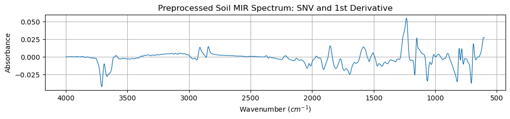

# Preprocessing


<!-- WARNING: THIS FILE WAS AUTOGENERATED! DO NOT EDIT! -->

``` python
from uhina.loading import OSSLLoader
from sklearn.pipeline import Pipeline
from matplotlib import pyplot as plt
import fastcore.all as fc
```

------------------------------------------------------------------------

<a
href="https://github.com/franckalbinet/uhina/blob/main/uhina/preprocessing.py#L14"
target="_blank" style="float:right; font-size:smaller">source</a>

### SNV

>      SNV ()

*Creates scikit-learn SNV custom transformer*

------------------------------------------------------------------------

<a
href="https://github.com/franckalbinet/uhina/blob/main/uhina/preprocessing.py#L22"
target="_blank" style="float:right; font-size:smaller">source</a>

### TakeDerivative

>      TakeDerivative (window_length=11, polyorder=1, deriv=1)

\*Creates scikit-learn derivation custom transformer

Args: window_length: int, optional Specify savgol filter smoothing
window length

    polyorder: int, optional
        Specify order of the polynom used to interpolate derived signal

    deriv: int, optional
        Specify derivation degree

Returns: scikit-learn custom transformer\*

Usage example:

``` python
X, y, wavenumbers, smp_idx, ds_name, ds_label = fc.load_pickle('./files/spectrum-and-all.pkl')

#| eval: false
pipe = Pipeline([
    ('SNV', SNV()),
    ('Derivative', TakeDerivative())
])

# Preprocess spectra
X_trans = pipe.fit_transform(X)

# Plot first preprocessed spectrum
fig, ax = plt.subplots(figsize=(12, 2))
ax.plot(wavenumbers, X_trans[0, :], lw=1)
ax.set_xlabel('Wavenumber ($cm^{-1}$)')
ax.set_ylabel('Absorbance')
ax.set_title('Preprocessed Soil MIR Spectrum: SNV and 1st Derivative')
ax.grid(True)
ax.invert_xaxis()
```


