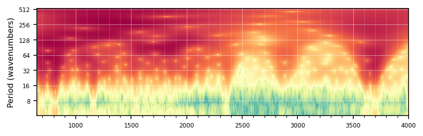

# Continuous Wavelet Transform


<!-- WARNING: THIS FILE WAS AUTOGENERATED! DO NOT EDIT! -->

``` python
TEST_DATASET = 'fk-jumpei'

if TEST_DATASET == 'ringtrial':
    src = Path.home() / 'pro/data/woodwell-ringtrial/drive-download-20231013T123706Z-001'
    loader = LoaderFactory.get_loader(src, 'ringtrial')
    data = loader.load_data(analytes='potassium_cmolkg')
    
elif TEST_DATASET == 'ossl':
    src = Path.home() / '.lssm/data/ossl/ossl_all_L0_v1.2.csv.gz'
    loader = LoaderFactory.get_loader(src, 'ossl', 
                                      spectra_type='mir', 
                                      cfgs={'mir': {'ref_col': 'scan_mir.1500_abs', 'range': [650, 4000]}})
    data = loader.load_data(analytes='k.ext_usda.a725_cmolc.kg')

elif TEST_DATASET == 'fk-jumpei':
    src = Path.home() / 'pro/data/fk-jumpei'
    loader = LoaderFactory.get_loader(src, 'fk-jumpei')
    data = loader.load_data()
else: 
    raise ValueError(f"Dataset {TEST_DATASET} not found.")

print(f'X shape: {data.X.shape}')
print(f'y shape: {data.y.shape}')
print(f'smp_idx shape: {data.sample_indices.shape}')
print(f'y_names: {data.y_names}')
print(f'X_names: {data.X_names}')
```

    X shape: (635, 1675)
    y shape: (635, 21)
    smp_idx shape: (635,)
    y_names: ['soil_total_Cs134' 'soil_total_Cs137' 'soil_ex_Cs137'
     'exCs137_totalCs137' 'soil_water_soluble_K2O' 'soil_ex_K2O'
     'TF_plant_totalCs137' 'TF_plant_exCs137' 'soil_pH' 'soil_C' 'soil_N'
     'soil_CN_ratio' 'soil_CEC' 'soil_MgO' 'soil_CaO'
     'soil_P_absorption_coefficient' 'avaiable_Pi' 'course_sand' 'fine_sand'
     'silt' 'clay']
    X_names: [ 650  652  654 ... 3996 3998 4000]

------------------------------------------------------------------------

<a
href="https://github.com/franckalbinet/uhina/blob/main/uhina/wavelets.py#L28"
target="_blank" style="float:right; font-size:smaller">source</a>

### CWT

>      CWT (data, dt=2, mother=<pycwt.mothers.Morlet object at 0x7ff573abad40>)

*Initialize self. See help(type(self)) for accurate signature.*

<details open class="code-fold">
<summary>Exported source</summary>

``` python
class CWT: 
    def __init__(self, data, dt=2, mother=pycwt.Morlet(6)):
        fc.store_attr()
        self.normalize()
        self.init_params()
        
    def init_params(self):
        self.N = self.data.size
        self.s0 = 2 * self.dt  # Starting scale, in this case 2 * 0.25 years = 6 months  
        self.dj = 1 / 12  # Twelve sub-octaves per octaves
        self.J = 7 / self.dj  # Seven powers of two with dj sub-octaves
            
    def normalize(self):
        self.std = self.data.std()  # Standard deviation
        self.var = self.std ** 2  # Variance
        self.data /= self.std  # Normalized dataset
    
    def get_wavelet(self):
        cwt_results = cwt(self.data, self.dt, self.dj, self.s0, self.J, self.mother)
        (self.wave, self.scales, self.freqs, self.coi, self.fft, self.fftfreqs) = cwt_results
    
    def get_powers(self):    
        self.power = (np.abs(self.wave)) ** 2
    
    def get_period(self): 
        self.period = 1 / self.freqs
    
    def __call__(self):
        self.get_wavelet()
        self.get_powers()
        self.get_period()
        return self
```

</details>

------------------------------------------------------------------------

<a
href="https://github.com/franckalbinet/uhina/blob/main/uhina/wavelets.py#L62"
target="_blank" style="float:right; font-size:smaller">source</a>

### plot_cwt

>      plot_cwt (cwt, wavenumbers, dt=2, figprops={'figsize': (6, 2), 'dpi':
>                144}, tight=True, fontsize=8, title='',
>                cmap=<matplotlib.colors.LinearSegmentedColormap object at
>                0x7ff579760d30>, save_path=None, show_plot=True,
>                show_coi:bool=False)

*Plot the continuous wavelet transform.*

<details open class="code-fold">
<summary>Exported source</summary>

``` python
def plot_cwt(cwt, wavenumbers,
             dt=2, 
             figprops=dict(figsize=(6, 2), dpi=144), tight=True, 
             fontsize=8, title='', cmap=plt.cm.grey, save_path=None, 
             show_plot=True, show_coi:bool=False):
    "Plot the continuous wavelet transform."
    fig, ax = plt.subplots(**figprops)
    # if levels is None:
    #     levels = [np.percentile(cwt.power, p) for p in [10, 20, 30, 40, 50, 75, 90, 95, 99, 99.5]]
        
    # log2_levels = np.log2(levels)
    # contourf = ax.contourf(wavenumbers, np.log2(cwt.period), np.log2(cwt.power), 
    #                        log2_levels, extend='both', cmap=cmap)
    # extent = [wavenumbers.min(), wavenumbers.max(), 0, max(cwt.period)]

    im = ax.imshow(np.log2(cwt.power), aspect='auto', cmap=cmap,
                   extent=[wavenumbers.min(), wavenumbers.max(), 
                           np.log2(cwt.period.max()), np.log2(cwt.period.min())],
                   interpolation='nearest')
    
    # if show_coi:
    #     ax.fill(np.concatenate([wavenumbers, wavenumbers[-1:] + dt, wavenumbers[-1:] + dt,
    #                            wavenumbers[:1] - dt, wavenumbers[:1] - dt]),
    #             np.concatenate([np.log2(cwt.coi), [1e-9], np.log2(cwt.period[-1:]),
    #                            np.log2(cwt.period[-1:]), [1e-9]]),
    #             'black', alpha=0.5 if not save_path else 1, 
    #             hatch='x'
    #         )

    ax.set_xlim(wavenumbers.min(), wavenumbers.max())
    ax.set_ylim(np.log2(cwt.period.min()), np.log2(cwt.period.max()))
    # ax.set_ylim(8, np.log2(cwt.period.max()))

    if not save_path: 
        ax.set_title(title, fontsize=fontsize)
        ax.set_ylabel('Period (wavenumbers)', fontsize=fontsize)
        if not tight: ax.set_xlabel('Wavenumber', fontsize=fontsize)  # Added x-axis label

    Yticks = 2 ** np.arange(np.ceil(np.log2(cwt.period.min())),
                               np.ceil(np.log2(cwt.period.max())))
    Yticks = Yticks.astype(int)

    ax.set_yticks(np.log2(Yticks))
    ax.set_yticklabels(Yticks, fontsize=fontsize-2)
    
    # Set major and minor ticks for x-axis
    ax.xaxis.set_major_locator(plt.MultipleLocator(500))
    ax.xaxis.set_minor_locator(plt.MultipleLocator(100))
    
    # Customize tick parameters
    ax.tick_params(axis='x', which='major', labelsize=fontsize-2)
    ax.tick_params(axis='x', which='minor', bottom=True)
    
    if not save_path:
        # Add grid for both major and minor ticks
        ax.grid(which='major', linestyle='-', linewidth='0.5', color='white', alpha=0.5)
        ax.grid(which='minor', linestyle=':', linewidth='0.5', color='white', alpha=0.5)
    
        # Create a new colorbar with correct logarithmic scaling
        # cbar = plt.colorbar(contourf, ax=ax, ticks=log2_levels)
        # cbar = plt.colorbar(im, ax=ax, ticks=log2_levels)
        # cbar.ax.set_yticklabels([f'{2**x:.1e}' for x in log2_levels])
        # cbar.ax.tick_params(labelsize=fontsize-2)
        # cbar.set_label('Power', fontsize=fontsize)
    
    if save_path:
        ax.axis('off')
        
        # plt.savefig(save_path, bbox_inches='tight', pad_inches=0)
        buf = io.BytesIO()
        fig.savefig(buf, format='png', dpi=figprops['dpi'], bbox_inches='tight', pad_inches=0)
        buf.seek(0)
        img = Image.open(buf).convert('L')  # Convert to black and white
        img.save(save_path)
        buf.close()
    
    if show_plot:
        plt.tight_layout()
        plt.show()
    else:
        plt.close(fig)  # Close the figure without displaying it
```

</details>

``` python
from dataclasses import astuple
X, X_names, y, y_names, smp_idx, ds_name, ds_label = astuple(data)
```

``` python
pipe = Pipeline([
    ('SNV', SNV()),
    ('Derivative', TakeDerivative())
])

X_trans = pipe.fit_transform(data.X)
```

------------------------------------------------------------------------

<a
href="https://github.com/franckalbinet/uhina/blob/main/uhina/wavelets.py#L162"
target="_blank" style="float:right; font-size:smaller">source</a>

### OnlinePercentileEstimator

>      OnlinePercentileEstimator (percentiles)

*Initialize self. See help(type(self)) for accurate signature.*

<details open class="code-fold">
<summary>Exported source</summary>

``` python
# Outdated
import numpy as np

class OnlinePercentileEstimator:
    def __init__(self, percentiles):
        self.percentiles = percentiles
        self.values = []

    def update(self, array):
        self.values.extend(array.flatten())

    def calculate_percentiles(self):
        self.values = np.array(self.values)
        return np.percentile(self.values, self.percentiles)
```

</details>

Example usage:

``` python
array_list = [np.random.rand(85, 1700) for _ in range(10)]  # Replace with your actual arrays
percentiles = [10, 50, 90]

estimator = OnlinePercentileEstimator(percentiles)

for array in array_list:
    estimator.update(array)

results = estimator.calculate_percentiles()
print(results)
```

    [0.10028646 0.50010463 0.8998105 ]

------------------------------------------------------------------------

<a
href="https://github.com/franckalbinet/uhina/blob/main/uhina/wavelets.py#L162"
target="_blank" style="float:right; font-size:smaller">source</a>

### OnlinePercentileEstimator

>      OnlinePercentileEstimator (percentiles, n_samples=1000)

*Estimate the percentiles of the power of the wavelet transform of the
spectra.*

<details open class="code-fold">
<summary>Exported source</summary>

``` python
# Outdated
class OnlinePercentileEstimator:
    "Estimate the percentiles of the power of the wavelet transform of the spectra."
    def __init__(self, percentiles, n_samples=1000):
        self.percentiles = percentiles
        self.n_samples = n_samples
        self.values = np.empty((n_samples, len(percentiles)))
        self.current_index = 0
        self.is_full = False

    def update(self, array):
        array_flat = array.flatten()
        percentiles_values = np.percentile(array_flat, self.percentiles)
        n = len(percentiles_values)
        if self.current_index + 1 > self.n_samples:
            self.is_full = True
            self.current_index = 0  # Overwrite from the beginning if buffer is full
        self.values[self.current_index, :] = percentiles_values
        self.current_index += 1

    def calculate_percentiles(self):
        if self.is_full:
            combined_values = self.values
        else:
            combined_values = self.values[:self.current_index, :]
        return np.percentile(combined_values.flatten(), self.percentiles, axis=0)
```

</details>

------------------------------------------------------------------------

<a
href="https://github.com/franckalbinet/uhina/blob/main/uhina/wavelets.py#L190"
target="_blank" style="float:right; font-size:smaller">source</a>

### estimate_percentiles

>      estimate_percentiles (X_trans, n_samples=100, percentiles=[10, 20, 30,
>                            40, 50, 60, 70, 80, 90, 95, 99])

*Estimate the percentiles of the power of the wavelet transform of the
spectra.*

<details open class="code-fold">
<summary>Exported source</summary>

``` python
# Outdated
def estimate_percentiles(X_trans, 
                         n_samples=100, 
                         percentiles=[10, 20, 30, 40, 50, 60, 70, 80, 90, 95, 99]):
    "Estimate the percentiles of the power of the wavelet transform of the spectra."
    random_indices = np.random.choice(X_trans.shape[0], n_samples, replace=False)
    estimator = OnlinePercentileEstimator(percentiles)
    for i in tqdm(random_indices):
        estimator.update(CWT(X_trans[i, :])().power)
        
    return estimator.calculate_percentiles()
```

</details>

``` python
# Outdated
percentiles_result = estimate_percentiles(X_trans, 
                                          n_samples=100,
                                          percentiles=[20, 30, 40, 50, 60, 70, 80, 90, 95, 97, 99])
percentiles_result
```

    100%|██████████| 100/100 [00:00<00:00, 181.47it/s]

    array([5.14356882e-03, 5.09074173e-02, 3.50768754e-01, 2.04215562e+00,
           8.17666232e+00, 2.48272509e+01, 4.12440530e+01, 5.88435369e+01,
           7.26961617e+01, 7.69870270e+01, 8.88923508e+01])

``` python
plot_cwt(CWT(X_trans[1, :])(), wavenumbers=data.X_names, 
         cmap=plt.cm.grey, save_path='../_data/test-1.png')
```


``` python
plot_cwt(CWT(X_trans[0, :])(), wavenumbers=data.X_names, cmap=plt.cm.Spectral_r)
```



------------------------------------------------------------------------

<a
href="https://github.com/franckalbinet/uhina/blob/main/uhina/wavelets.py#L203"
target="_blank" style="float:right; font-size:smaller">source</a>

### estimate_conversion_time

>      estimate_conversion_time (seconds=1000, samples=1000)

*Estimate the time to convert all spectra to images.*

<details open class="code-fold">
<summary>Exported source</summary>

``` python
def estimate_conversion_time(seconds=1000, samples=1000):
    "Estimate the time to convert all spectra to images."
    return seconds * (samples / 1000) / 60
```

</details>

------------------------------------------------------------------------

<a
href="https://github.com/franckalbinet/uhina/blob/main/uhina/wavelets.py#L208"
target="_blank" style="float:right; font-size:smaller">source</a>

### create_image_target_csv

>      create_image_target_csv (data:uhina.loading.SpectralData,
>                               n_samples:int=None,
>                               output_dir:str='../_data/ossl-tfm/',
>                               fname:str='im-targets-lut.csv')

*Create a CSV file with the image names and the target values.*

<table>
<thead>
<tr class="header">
<th></th>
<th><strong>Type</strong></th>
<th><strong>Default</strong></th>
<th><strong>Details</strong></th>
</tr>
</thead>
<tbody>
<tr class="odd">
<td>data</td>
<td>SpectralData</td>
<td></td>
<td>Spectra dataclass</td>
</tr>
<tr class="even">
<td>n_samples</td>
<td>int</td>
<td>None</td>
<td>number of samples to process</td>
</tr>
<tr class="odd">
<td>output_dir</td>
<td>str</td>
<td>../_data/ossl-tfm/</td>
<td>path to save the CSV file</td>
</tr>
<tr class="even">
<td>fname</td>
<td>str</td>
<td>im-targets-lut.csv</td>
<td></td>
</tr>
<tr class="odd">
<td><strong>Returns</strong></td>
<td><strong>None</strong></td>
<td></td>
<td></td>
</tr>
</tbody>
</table>

<details open class="code-fold">
<summary>Exported source</summary>

``` python
def create_image_target_csv(data: SpectralData, # Spectra dataclass
                            n_samples: int = None, # number of samples to process
                            output_dir: str = '../_data/ossl-tfm/', # path to save the CSV file
                            fname: str = 'im-targets-lut.csv'
                            ) -> None: 
    "Create a CSV file with the image names and the target values."
    n_samples = len(data.sample_indices) if n_samples is None else n_samples
    items = {
        'fname': [f'{id}.png' for id in data.sample_indices[:n_samples]],
    }
    
    for i, y_name in enumerate(data.y_names):
        items[y_name] = [data.y[j, i].item() for j in range(n_samples)]
    
    df = pd.DataFrame(items)
    df.to_csv(Path(output_dir) / fname, index=False)
```

</details>

``` python
dst_dir = Path('../_data/fk-jumpei-tfm')
create_image_target_csv(data, n_samples=None, output_dir=dst_dir)  
pd.read_csv(dst_dir / 'im-targets-lut.csv').head()
```

    635

<div>
<style scoped>
    .dataframe tbody tr th:only-of-type {
        vertical-align: middle;
    }
&#10;    .dataframe tbody tr th {
        vertical-align: top;
    }
&#10;    .dataframe thead th {
        text-align: right;
    }
</style>

<table class="dataframe" data-quarto-postprocess="true" data-border="1">
<thead>
<tr class="header" style="text-align: right;">
<th data-quarto-table-cell-role="th"></th>
<th data-quarto-table-cell-role="th">fname</th>
<th data-quarto-table-cell-role="th">soil_total_Cs134</th>
<th data-quarto-table-cell-role="th">soil_total_Cs137</th>
<th data-quarto-table-cell-role="th">soil_ex_Cs137</th>
<th data-quarto-table-cell-role="th">exCs137_totalCs137</th>
<th data-quarto-table-cell-role="th">soil_water_soluble_K2O</th>
<th data-quarto-table-cell-role="th">soil_ex_K2O</th>
<th data-quarto-table-cell-role="th">TF_plant_totalCs137</th>
<th data-quarto-table-cell-role="th">TF_plant_exCs137</th>
<th data-quarto-table-cell-role="th">soil_pH</th>
<th data-quarto-table-cell-role="th">...</th>
<th data-quarto-table-cell-role="th">soil_CN_ratio</th>
<th data-quarto-table-cell-role="th">soil_CEC</th>
<th data-quarto-table-cell-role="th">soil_MgO</th>
<th data-quarto-table-cell-role="th">soil_CaO</th>
<th data-quarto-table-cell-role="th">soil_P_absorption_coefficient</th>
<th data-quarto-table-cell-role="th">avaiable_Pi</th>
<th data-quarto-table-cell-role="th">course_sand</th>
<th data-quarto-table-cell-role="th">fine_sand</th>
<th data-quarto-table-cell-role="th">silt</th>
<th data-quarto-table-cell-role="th">clay</th>
</tr>
</thead>
<tbody>
<tr class="odd">
<td data-quarto-table-cell-role="th">0</td>
<td>20-2013-paddy_rice.png</td>
<td>NaN</td>
<td>610.0</td>
<td>70.6</td>
<td>0.116</td>
<td>NaN</td>
<td>17.6</td>
<td>NaN</td>
<td>NaN</td>
<td>6.0</td>
<td>...</td>
<td>12.0</td>
<td>29.5</td>
<td>64.1</td>
<td>339.0</td>
<td>1700.0</td>
<td>NaN</td>
<td>17.1</td>
<td>34.1</td>
<td>25.6</td>
<td>23.2</td>
</tr>
<tr class="even">
<td data-quarto-table-cell-role="th">1</td>
<td>28-2014-paddy_rice.png</td>
<td>NaN</td>
<td>273.5</td>
<td>27.8</td>
<td>0.102</td>
<td>NaN</td>
<td>62.1</td>
<td>NaN</td>
<td>NaN</td>
<td>5.0</td>
<td>...</td>
<td>12.0</td>
<td>19.6</td>
<td>30.3</td>
<td>217.0</td>
<td>660.0</td>
<td>12.2</td>
<td>NaN</td>
<td>NaN</td>
<td>NaN</td>
<td>NaN</td>
</tr>
<tr class="odd">
<td data-quarto-table-cell-role="th">2</td>
<td>33-2014-paddy_rice.png</td>
<td>NaN</td>
<td>28.1</td>
<td>3.6</td>
<td>0.127</td>
<td>NaN</td>
<td>22.3</td>
<td>NaN</td>
<td>NaN</td>
<td>6.0</td>
<td>...</td>
<td>12.0</td>
<td>13.8</td>
<td>38.1</td>
<td>96.1</td>
<td>640.0</td>
<td>6.8</td>
<td>NaN</td>
<td>NaN</td>
<td>NaN</td>
<td>NaN</td>
</tr>
<tr class="even">
<td data-quarto-table-cell-role="th">3</td>
<td>35-2014-paddy_rice.png</td>
<td>NaN</td>
<td>897.8</td>
<td>71.4</td>
<td>0.080</td>
<td>NaN</td>
<td>33.6</td>
<td>NaN</td>
<td>NaN</td>
<td>5.0</td>
<td>...</td>
<td>12.0</td>
<td>15.4</td>
<td>16.2</td>
<td>119.0</td>
<td>640.0</td>
<td>34.2</td>
<td>NaN</td>
<td>NaN</td>
<td>NaN</td>
<td>NaN</td>
</tr>
<tr class="odd">
<td data-quarto-table-cell-role="th">4</td>
<td>36-2014-paddy_rice.png</td>
<td>NaN</td>
<td>964.3</td>
<td>90.6</td>
<td>0.094</td>
<td>NaN</td>
<td>57.0</td>
<td>NaN</td>
<td>NaN</td>
<td>5.0</td>
<td>...</td>
<td>12.0</td>
<td>17.7</td>
<td>19.9</td>
<td>151.0</td>
<td>610.0</td>
<td>40.0</td>
<td>NaN</td>
<td>NaN</td>
<td>NaN</td>
<td>NaN</td>
</tr>
</tbody>
</table>

<p>5 rows × 22 columns</p>
</div>

------------------------------------------------------------------------

<a
href="https://github.com/franckalbinet/uhina/blob/main/uhina/wavelets.py#L226"
target="_blank" style="float:right; font-size:smaller">source</a>

### create_output_directory

>      create_output_directory (output_dir)

*Create the output directory if it does not exist.*

<details open class="code-fold">
<summary>Exported source</summary>

``` python
def create_output_directory(output_dir):
    "Create the output directory if it does not exist."
    os.makedirs(output_dir, exist_ok=True)
```

</details>

------------------------------------------------------------------------

<a
href="https://github.com/franckalbinet/uhina/blob/main/uhina/wavelets.py#L231"
target="_blank" style="float:right; font-size:smaller">source</a>

### process_single_sample

>      process_single_sample (args)

*Process a single sample and save the wavelet image to the output
directory.*

<details open class="code-fold">
<summary>Exported source</summary>

``` python
def process_single_sample(args):
    "Process a single sample and save the wavelet image to the output directory."
    i, id, X_trans_i, wavenumbers, output_dir, cwt_kwargs, plot_kwargs = args
    fname_img = f'{output_dir}/{id}.png'
    cwt_result = CWT(X_trans_i, **cwt_kwargs)()
    plot_cwt(cwt_result, wavenumbers=wavenumbers, 
             save_path=fname_img, show_plot=False, **plot_kwargs)
```

</details>

------------------------------------------------------------------------

<a
href="https://github.com/franckalbinet/uhina/blob/main/uhina/wavelets.py#L240"
target="_blank" style="float:right; font-size:smaller">source</a>

### batch_indices

>      batch_indices (n_samples:int, batch_size:int)

*Generate batch indices for processing.*

<details open class="code-fold">
<summary>Exported source</summary>

``` python
def batch_indices(n_samples: int, batch_size: int) -> range:
    "Generate batch indices for processing."
    for start in range(0, n_samples, batch_size):
        end = min(start + batch_size, n_samples)
        yield range(start, end)
```

</details>

------------------------------------------------------------------------

<a
href="https://github.com/franckalbinet/uhina/blob/main/uhina/wavelets.py#L252"
target="_blank" style="float:right; font-size:smaller">source</a>

### convert_to_wavelet_images

>      convert_to_wavelet_images (data:uhina.loading.SpectralData,
>                                 pipeline:sklearn.pipeline.Pipeline=Pipeline(st
>                                 eps=[('SNV', SNV()), ('Derivative',
>                                 TakeDerivative())]),
>                                 output_dir:str='../_data/im',
>                                 cwt_kwargs:dict=None, plot_kwargs:dict=None,
>                                 n_samples:int=None, batch_size:int=100,
>                                 n_workers:int=None)

*Process samples in parallel batches and save wavelet images to output
directory.*

<table>
<colgroup>
<col style="width: 6%" />
<col style="width: 25%" />
<col style="width: 34%" />
<col style="width: 34%" />
</colgroup>
<thead>
<tr class="header">
<th></th>
<th><strong>Type</strong></th>
<th><strong>Default</strong></th>
<th><strong>Details</strong></th>
</tr>
</thead>
<tbody>
<tr class="odd">
<td>data</td>
<td>SpectralData</td>
<td></td>
<td></td>
</tr>
<tr class="even">
<td>pipeline</td>
<td>Pipeline</td>
<td>Pipeline(steps=[(‘SNV’, SNV()), (‘Derivative’,
TakeDerivative())])</td>
<td>Scikit-learn pipeline</td>
</tr>
<tr class="odd">
<td>output_dir</td>
<td>str</td>
<td>../_data/im</td>
<td></td>
</tr>
<tr class="even">
<td>cwt_kwargs</td>
<td>dict</td>
<td>None</td>
<td></td>
</tr>
<tr class="odd">
<td>plot_kwargs</td>
<td>dict</td>
<td>None</td>
<td></td>
</tr>
<tr class="even">
<td>n_samples</td>
<td>int</td>
<td>None</td>
<td></td>
</tr>
<tr class="odd">
<td>batch_size</td>
<td>int</td>
<td>100</td>
<td></td>
</tr>
<tr class="even">
<td>n_workers</td>
<td>int</td>
<td>None</td>
<td></td>
</tr>
<tr class="odd">
<td><strong>Returns</strong></td>
<td><strong>None</strong></td>
<td></td>
<td></td>
</tr>
</tbody>
</table>

<details open class="code-fold">
<summary>Exported source</summary>

``` python
default_pipe = Pipeline([
    ('SNV', SNV()),
    ('Derivative', TakeDerivative())])
```

</details>
<details open class="code-fold">
<summary>Exported source</summary>

``` python
def convert_to_wavelet_images(data: SpectralData,
                              pipeline: Pipeline = default_pipe, # Scikit-learn pipeline
                              output_dir: str = '../_data/im',
                              cwt_kwargs: dict = None,
                              plot_kwargs: dict = None,
                              n_samples: int = None,
                              batch_size: int = 100,
                              n_workers: int = None,
                              ) -> None:
    "Process samples in parallel batches and save wavelet images to output directory."
    create_output_directory(output_dir)
    
    cwt_kwargs = cwt_kwargs or {}
    plot_kwargs = plot_kwargs or {}

    n_samples = len(data.sample_indices) if n_samples is None else min(n_samples, len(data.sample_indices))
    n_workers = n_workers or max(1, cpu_count() - 1)  # Use all cores except one by default
    
    X_trans = pipeline.fit_transform(data.X)
    
    with tqdm(total=n_samples, desc="Processing samples") as pbar:
        for batch in batch_indices(n_samples, batch_size):
            args = [(i, data.sample_indices[i], X_trans[i, :], data.X_names, output_dir, cwt_kwargs, plot_kwargs) for i in batch]
            with Pool(n_workers) as pool:
                pool.map(process_single_sample, args)
            
            pbar.update(len(batch))
    
    return None
```

</details>

``` python
convert_to_wavelet_images(data, 
                          output_dir='../_data/fk-jumpei-tfm/im', 
                          n_samples=200, 
                          batch_size=10)
```

    Processing samples:   0%|          | 0/200 [00:00<?, ?it/s]Processing samples: 100%|██████████| 200/200 [00:10<00:00, 18.49it/s]
